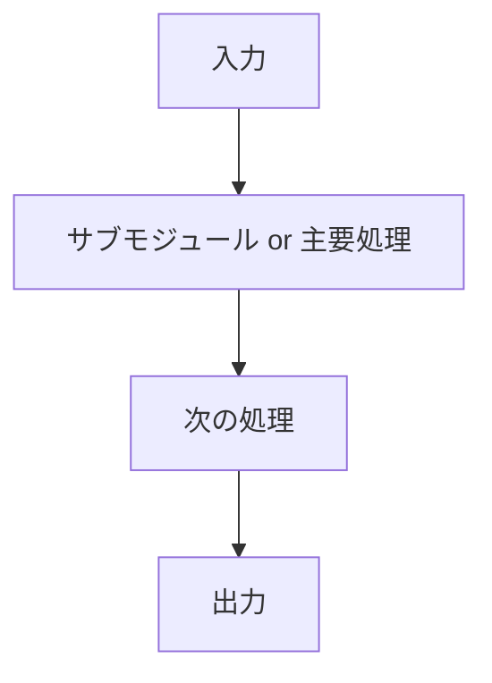

# Explain Code

## 目的
既存実装を読み解き、後続の要件整理、リファクタリング、レビューに使える粒度でモジュールの理解を文書化する。

このスキルは新規仕様を決めるものではない。実装から読み取れる事実と、事実から妥当に推定できる要件を分けて整理する。

## 使う場面
- 既存モジュールのコード解説を依頼されたとき
- `BEFORE_REFACTOR.md` を作成または更新するとき
- リファクタリング前に現行挙動を把握するとき

## 先に読むもの
- `CLAUDE.md`
- `.codex/docs/MASTER.md`
- `.codex/docs/BEFORE_REFACTOR.md`
- 対象モジュールの実装
- 関連するヘッダ、インターフェース、設定ファイル
- 関連する既存テスト

関連資料が不足している場合は、推測で補完しすぎず、不明点として明示する。

## 調査手順
1. 対象モジュールの公開インターフェースを確認する。
2. 入力信号、出力信号、外部依存、設定値を列挙する。
3. メイン処理の入口から出口までを追い、処理順序と分岐条件を整理する。
4. サブモジュール、主要関数、主要クラス単位で責務を分解する。
5. 実装上の前提条件、例外系、エラー処理、状態遷移を抽出する。
6. 実装から読み取れるモジュール要件を逆起こしする。

## 整理ルール

### 1. 事実と推定を分ける
- コードに明示されている内容は事実として書く。
- コメントなしで意図を推定した箇所は、推定であることを明記する。

### 2. 入出力は信号の意味まで書く
- 信号名だけでなく、値の意味、単位、取りうる状態、未入力時の扱いを書く。
- 関数引数、戻り値、publish/subscribe、topic、イベント、設定値も対象に含める。

### 3. 振る舞いは条件付きで書く
- 正常系だけでなく、異常系、境界条件、何もしない条件も書く。
- 条件分岐がある場合は、「どの条件でどう動くか」を明示する。

### 4. 構成は責務単位で分ける
- サブモジュール、主要クラス、主要関数を単位に整理する。
- 単なるファイル分割ではなく、実際の責務の流れを優先する。

### 5. 要件は実装から逆起こしする
- 「このモジュールは何を満たす必要があるか」を、観測できる振る舞いから記述する。
- 実装詳細そのものではなく、外部から見た期待動作になるように書く。

## 出力フォーマット
必ず以下の 3 部構成で出力する。

````md
## 1. 入出力、振る舞い
### 入力信号
- `<信号名>`: <意味>

### 出力信号
- `<信号名>`: <意味>

### モジュール内の処理概要
- <処理の全体像>

## 2. モジュール内の構成


- `<サブモジュール名>`: <責務>

## 3. モジュールの要件
- <実装から逆起こしした要件>
````

## 出力時の補足ルール
- フローチャートは `mermaid` の `flowchart TD` を使う。
- サブモジュールがない場合でも、主要関数または主要処理単位で流れを分解する。
- 要件は、可能な限り「〜できること」「〜しないこと」「〜時に〜すること」の形で書く。
- 不明点がある場合は、各セクション末尾に `不明点` として列挙する。

## レビュアーとしての振る舞い
- 説明より先に、対象コードの実際の挙動を確認する。
- 用語はコードに寄せつつ、必要なら読み手向けに言い換える。
- 実装の意図が曖昧な場合は、断定しない。
- リファクタリング上の重要点になりそうな密結合、隠れた前提、副作用は見落とさず書く。
