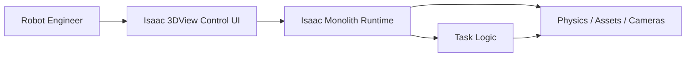
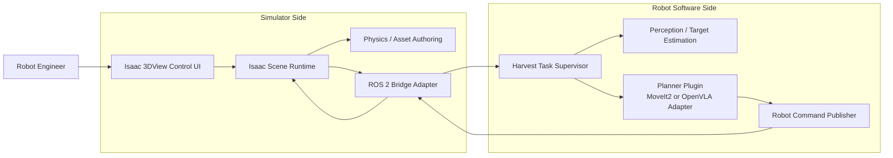
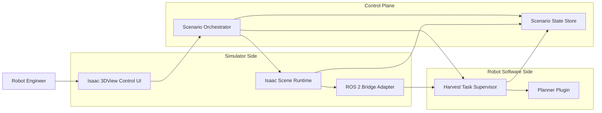

# ADR-0001: トマト収穫シミュレータ本番アーキテクチャ方針

## Status
draft

## Context
このプロジェクトの目的は次の 2 つである。

1. トマト収穫シミュレータを構築する
2. そのシミュレータを使って、トマト収穫ロジックを完成させる

最新の `USERS_GUIDE.md` では、シミュレータの利用者をロボット開発エンジニアと定義している。利用者は、このシミュレータを使って `MoveIt2` ベースのルールロジックや `OpenVLA` のような学習ベースロジックを試し、収穫ロジックを改善していく。

このシミュレータは、単なる可視化ではなく、少なくとも次を再現する必要がある。

- トマト 1 個が枝についた初期状態
- ロボットがカメラでトマト位置を認識する流れ
- ロボットハンドで把持する流れ
- 一定の把持条件を満たしたときだけ枝から外れる挙動
- 正しく把持できないときに重力で落下する挙動
- 把持後にトレーへ搬送して配置する流れ

また、`USERS_GUIDE.md` では次の責務分離を要求している。

- シミュレータ環境は `Isaac Sim`
- ロボットソフトは `ROS 2`
- シミュレータ環境とロボットソフトは完全に分離する
- それぞれ独立してアップデート可能にする

PoC の学びも重要である。

- 旧 PoC 実装は `poc_code/` に退避し、新実装では直接流用しない
- PoC では `fruit-stem fixed joint break` をそのまま簡易 scene に載せると不安定だった
- PoC では `kinematic hold` によって把持前の安定性を確保したが、これは本番の最終物理モデルではない
- 手書き IK と固定オフセットで把持精度を詰め続けるのは効率が悪く、最終的な接近、把持姿勢、経路計画は `MoveIt2` などへ移すべきと分かった

`REQUIREMENTS.md` は未作成であるため、この ADR は `USERS_GUIDE.md` と `POC.md` を正本とした暫定の本番アーキテクチャ判断として記録する。

## Decision Drivers
- `Isaac Sim` と `ROS 2` の責務を分離したい
- シミュレータ環境とロボットソフトを独立に更新可能にしたい
- 3DView 上の `Start / Stop / Reset / Camera Switch` だけで実行、停止、初期化できる必要がある
- `MoveIt2`、`OpenVLA`、将来の別ロジックを差し替え可能にしたい
- 物理シミュレーション、asset authoring、reset をシミュレータ側責務として閉じたい
- 認識、grasp pose 生成、経路計画、収穫タスク制御をロボットソフト側責務として閉じたい
- PoC の暫定実装をそのまま本番へ持ち込まず、拡張しやすい境界を作りたい
- クリーンアーキテクチャ上、安定した方針層が Isaac Sim API や UI 実装詳細へ直接依存しない構成にしたい

## Assumptions And Limits
- `REQUIREMENTS.md` 未作成のため、要件 ID は `UG-*` の暫定 ID を用いる
- 物理モデルの細かな閾値、asset 最終選定、把持成功率の最終チューニングは本 ADR の決定対象外とする
- 旧 PoC は参照用に `poc_code/` へ隔離済みであり、本番実装は新規に組み立てる

## Options Considered
### Option 1: Isaac Sim 内部一体型モノリス
- Overview:
  - Isaac Sim の extension / standalone runtime の中に、3DView UI、scene 制御、物理管理、ロボットタスク制御、ロジック切替までをまとめて持つ
- Architecture Diagram:

- Responsibilities:
  - `Isaac 3DView Control UI`
    - Start / Stop / Reset / Camera Switch
  - `Isaac Monolith Runtime`
    - scene 読込、物理管理、カメラ、状態管理、タスク制御
  - `Task Logic`
    - 認識、把持、搬送、失敗判定
- Dependency direction:
  - タスクロジックが Isaac Sim API と 3DView UI に直接依存しやすい
- Merits:
  - 実装開始が最も速い
  - プロセス内で完結するので通信境界が少ない
  - 小規模デモなら作りやすい
- Demerits:
  - `Isaac Sim` と `ROS 2` を完全分離する要求に反する
  - `MoveIt2` や `OpenVLA` を独立に差し替えにくい
  - 物理モデル変更とロボットロジック変更が同じ変更理由で結びつく
- Major risks:
  - 旧 PoC の延長になりやすく、本番で再び密結合を抱える
- Clean Architecture notes:
  - 単一責務:
    - 弱い。UI、シミュレーション、ロジック、物理判断が混ざりやすい
  - 依存関係ルール:
    - 弱い。安定したロジックがフレームワーク詳細に引きずられる

### Option 2: Simulator Runtime と ROS 2 Robot Runtime の分離型
- Overview:
  - `Isaac Sim` 側と `ROS 2` 側を明確に分離し、両者の契約を ROS 2 interface に限定する
  - 3DView UI は Isaac Sim 側に置き、ロボットソフトの開始、停止、環境初期化を control interface 経由で行う
- Architecture Diagram:

- Responsibilities:
  - `Isaac 3DView Control UI`
    - Start / Stop / Reset / Camera Switch
    - 現在状態の表示
  - `Isaac Scene Runtime`
    - scene 読込
    - robot / tomato / branch / tray の生成
    - camera 管理
    - reset 実行
    - シミュレータ側状態の公開
  - `Physics / Asset Authoring`
    - fruit / stem / branch の物理構成
    - collision
    - detach モデル
    - grasp failure 時の落下挙動
  - `ROS 2 Bridge Adapter`
    - image
    - joint_states
    - tf
    - command interface の橋渡し
  - `Harvest Task Supervisor`
    - 認識から配置までの状態遷移
    - success / fail 判定の業務ルール
  - `Perception / Target Estimation`
    - カメラ情報からトマト位置を推定
  - `Planner Plugin`
    - `MoveIt2` または `OpenVLA` などの差し替え可能な計画器
  - `Robot Command Publisher`
    - 計画結果を ROS 2 command として送る
- Dependency direction:
  - UI は simulator control contract に依存する
  - robot logic は ROS 2 interface 契約に依存し、Isaac Sim API を直接知らない
  - simulator 側はロボットロジックの内部を知らず、ROS 2 interface 契約だけを知る
- Main flow:
  - 利用者が 3DView の `Start` を押す
  - simulator 側 control UI が robot side の task supervisor 起動を要求する
  - robot side が perception と planner を用いて接近、把持、搬送を進める
  - simulator 側は physics と scene の真実を保持し、結果を ROS 2 経由で返す
  - `Reset` では simulator 側が環境初期化を行い、robot side はタスク状態を初期化する
- Merits:
  - `USERS_GUIDE.md` の分離方針に最も整合する
  - `MoveIt2` と `OpenVLA` を planner plugin として差し替えやすい
  - PoC で問題になった物理モデルの不安定さを simulator 側責務として閉じ込められる
  - ロボットロジックをシミュレータから独立に更新しやすい
  - クリーンアーキテクチャ上、変化しやすい外部技術を外側へ押し出せる
- Demerits:
  - option 1 より初期設計コストが高い
  - `Start / Stop / Reset` の control contract を別途整備する必要がある
  - simulator 側と robot 側で状態の責務分担を明確にしないと境界が曖昧になる
- Major risks:
  - ROS 2 interface 設計が粗いと、差し替え性が下がる
  - reset と失敗時の整合性を設計しないと、両側で状態がズレる
- Clean Architecture notes:
  - 単一責務:
    - 強い。scene / physics と task logic / planner を分離できる
  - 依存関係ルール:
    - 強い。ロジックは ROS 2 契約に依存し、Isaac Sim 詳細に依存しない

### Option 3: 分離型 + 専用 Orchestrator Service
- Overview:
  - option 2 をさらに分割し、simulator と robot software の間に専用 orchestrator service を置く
  - 3DView UI は orchestrator へ命令し、orchestrator が simulator side と robot side の両方を制御する
- Architecture Diagram:

- Responsibilities:
  - `Scenario Orchestrator`
    - Start / Stop / Reset の統括
    - simulator 側と robot 側の同期
  - `Scenario State Store`
    - 実行状態、エラー、結果の一元保持
  - simulator 側、robot 側は option 2 と同様
- Dependency direction:
  - UI は orchestrator に依存する
  - orchestrator は simulator / robot の抽象契約に依存する
- Merits:
  - 状態遷移と制御の責務が明確になる
  - 将来的に遠隔制御や複数シナリオ対応へ拡張しやすい
  - ログと監査をまとめやすい
- Demerits:
  - 現時点では複雑すぎる
  - まだ `REQUIREMENTS.md` が無い段階では過剰設計になりやすい
  - simulator 1 つ、task 1 本の規模に対してコンポーネント数が多い
- Major risks:
  - オーケストレータ自体が新たな密結合点になる
  - 実装開始が遅れる
- Clean Architecture notes:
  - 単一責務:
    - 中程度。整理しやすいが、規模に対して責務の切り出し過多になりうる
  - 依存関係ルール:
    - 強い。契約ベースで整理しやすい

## Option Comparison
| 観点 | Option 1 | Option 2 | Option 3 |
| --- | --- | --- | --- |
| `Isaac Sim` と `ROS 2` の分離 | 弱い | 強い | 強い |
| 独立アップデート | 弱い | 強い | 強い |
| `MoveIt2` / `OpenVLA` 差し替え | 弱い | 強い | 強い |
| PoC からの移行容易性 | 強い | 中 | 弱い |
| 実装コスト | 低い | 中 | 高い |
| 物理モデル問題の局所化 | 弱い | 強い | 強い |
| 過剰設計リスク | 低い | 中 | 高い |
| 推奨度 | 低い | 高い | 中 |

## Decision
`Option 2: Simulator Runtime と ROS 2 Robot Runtime の分離型` を推奨する。

## Temporary Requirement To Module Mapping
`REQUIREMENTS.md` 未作成のため、`USERS_GUIDE.md` から暫定要件 ID を定義する。

| 要件番号 | 要件概要 | 主担当モジュール | 備考 |
| --- | --- | --- | --- |
| `UG-01` | トマト収穫シミュレータを構築する | `Isaac Scene Runtime` | scene、camera、physics を保持 |
| `UG-02` | シミュレータで収穫ロジックを完成させる | `Harvest Task Supervisor` | ロボットソフト側の中心 |
| `UG-03` | 一定把持条件でのみ枝から外れる | `Physics / Asset Authoring` | 本番では breakable joint を厳密化 |
| `UG-04` | 把持失敗時は重力で落下する | `Physics / Asset Authoring` | simulator 側の真実 |
| `UG-05` | `Start` で開始、`Reset` で初期化 | `Isaac 3DView Control UI` + `Isaac Scene Runtime` | control contract が必要 |
| `UG-06` | シミュレータ環境とロボットロジックを完全分離 | `ROS 2 Bridge Adapter` + `Harvest Task Supervisor` | 本 ADR の中心判断 |
| `UG-07` | 利用者はロボット開発エンジニア | `Isaac 3DView Control UI` | 3DView 中心で十分 |
| `UG-08` | `MoveIt2` や `OpenVLA` を試せる | `Planner Plugin` | 差し替え点として扱う |
| `UG-09` | 3DView 上で起動、停止、リセットできる | `Isaac 3DView Control UI` | browser は不要 |
| `UG-10` | トマト 1 個が枝についた初期状態 | `Isaac Scene Runtime` | 初期シーン責務 |
| `UG-11` | カメラ認識後に把持してトレーへ運ぶ | `Perception / Target Estimation` + `Planner Plugin` + `Harvest Task Supervisor` | ロボットソフト側の主責務 |
| `UG-12` | `Isaac Sim` と `ROS 2` を採用する | `Isaac Scene Runtime` + `ROS 2 Bridge Adapter` | 技術境界の前提 |
| `UG-13` | 環境とロボットソフトを独立更新可能にする | `Isaac Scene Runtime` + `Harvest Task Supervisor` | 独立配布単位を前提 |

## Rationale
option 2 を選ぶ理由は明確である。

- 最新の `USERS_GUIDE.md` が要求しているのは、PoC のような `Isaac Sim 内部で全部を持つ試験コード` ではなく、`シミュレータ環境` と `ロボットソフト` を分離した開発基盤である
- PoC の学びから、物理シミュレーションの問題とロボット把持ロジックの問題を同じコードベースで混ぜると、原因切り分けが悪くなると分かった
- 収穫前の fruit 保持、reset、asset 物理設定は simulator 側責務として閉じるべきである
- 認識、grasp pose 生成、経路計画、収穫戦略は robot software 側責務として閉じるべきである
- `MoveIt2` と `OpenVLA` を同じ土台の上で差し替えたいなら、planner plugin を robot software 側の交換点として持つのが自然である
- option 3 ほど大きな control plane を今すぐ入れる必要はなく、option 2 で十分に責務分離と独立更新性を確保できる

## Consequences
### Positive
- simulator 側と robot software 側を独立に進化させやすい
- `MoveIt2`、`OpenVLA`、将来の別ロジックを同じ simulator 上で比較しやすい
- PoC の暫定物理実装を本番側で置き換えやすい
- reset、落下、detach といった simulator 固有責務を局所化できる
- `poc_code/` の密結合実装を新実装へ持ち込まずに済む

### Negative
- 開始時点で interface 設計が必要になる
- `Start / Stop / Reset` の control contract を丁寧に決めないと、両 runtime の状態がズレる
- 開発初期は option 1 よりコード量が増える

## Follow-up
- `REQUIREMENTS.md` を作成し、`UG-*` 暫定要件を正式要件 ID へ置き換える
- `ARCHITECTURE.md` で option 2 の詳細モジュール構成、ROS 2 interface、状態遷移を定義する
- simulator 側で本番用 fruit / stem / branch asset と breakable joint authoring 方針を整理する
- robot software 側で `MoveIt2 planner plugin` と `OpenVLA planner plugin` の差し替え方針を定義する
- `Start / Stop / Reset` の control contract を ROS 2 service / action / lifecycle のどれで表現するか決める
