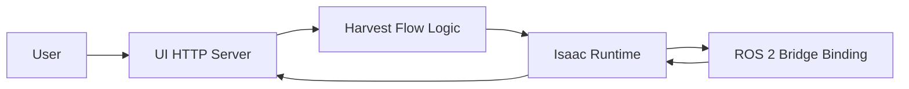
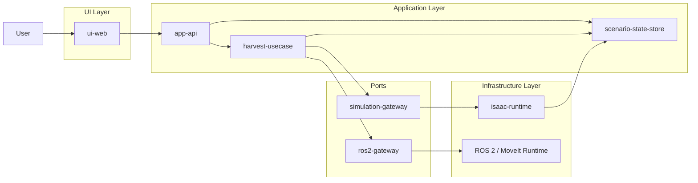
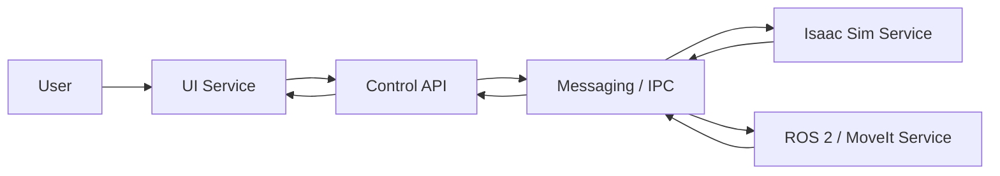

# ADR-0001: トマト収穫シミュレータ本番アーキテクチャ方針

## Status
draft

## Context
本リポジトリでは、Isaac Sim 上で Franka Panda を使い、eye-to-hand camera を見ながらトマトを `把持して引く` 動作で収穫するシミュレータを構築する。

現時点で根拠にできる文書は次である。

- `RESEARCH.md`
  - 技術前提、Docker 方針、Isaac Sim / ROS 2 Jazzy / Franka / fixed joint break / asset 条件
- `USERS_GUIDE.md`
  - 起動、対象確認、`Harvest Start`、結果確認、`Reset Scene` の利用者体験
- `POC.md`
  - 5 スプリントの実装順と、PoC で確認すべき操作体験

一方で、`REQUIREMENTS.md` は未作成である。したがって、この ADR は本番用の暫定設計判断であり、正式要件確定後に更新する前提とする。

今回固定されている前提は次である。

- `Isaac Sim + ROS 2 Jazzy` を 1 コンテナ化する
- 起動は `build.sh` / `run.sh` で包む
- camera は固定 `eye-to-hand`
- 収穫は `把持して引く`
- detach は `fixed joint break`
- 植物 asset は `fruit / stem / branch が別階層`

PoC の結果から、少なくとも次の体験は本番でも維持する必要がある。

- 1 コマンド起動
- scene、camera image、状態表示の同時提示
- `Harvest Start` の明確な反応
- 成功 / 失敗理由の短文表示
- `Reset Scene` による再試行

## Decision Drivers
- 利用者は Isaac Sim 初心者でも扱える必要がある
- 1 コンテナ運用を維持しつつ、内部責務は分離したい
- 収穫ドメインロジックを Isaac Sim 固有 API へ直接埋め込みすぎたくない
- `fixed joint break`、camera、joint state、tf などの実世界相当信号を扱う必要がある
- 将来的に deterministic sequence から MoveIt 2 へ置き換える余地を残したい
- asset 差し替えや camera 調整が起きても、UI やドメイン判断が壊れにくい構成にしたい

## 前提と限界
- `REQUIREMENTS.md` 未作成のため、本 ADR の要件 ID は `USERS_GUIDE.md` と `POC.md` から引いた暫定 ID である
- greenhouse 全体の高忠実度構成、perception 本実装、商用 asset 最終確定は本 ADR の決定対象外とする
- 本 ADR は `本番向けの責務分離方針` を決めるものであり、細かい API 仕様やクラス図は `ARCHITECTURE.md` へ委譲する

## Options Considered
### Option 1: Isaac Sim 内部一体型モノリス
- Overview:
  - Isaac Sim の standalone / extension プロセスの中に、scene 制御、収穫ロジック、UI 配信、状態管理をまとめて持つ
- Architecture Diagram:

- 主要コンポーネント:
  - Isaac Runtime
  - Harvest Flow Logic
  - UI HTTP Server
  - ROS 2 Bridge Binding
- Responsibilities:
  - Isaac Runtime:
    - scene 読込、物理実行、camera、joint、tf、detach
  - Harvest Flow Logic:
    - `Harvest Start` から結果確定までの状態遷移
  - UI HTTP Server:
    - camera image と状態表示の配信
  - ROS 2 Bridge Binding:
    - ROS 2 topic / tf 連携
- Dependency direction:
  - Harvest Flow Logic が Isaac Runtime 詳細へ直接依存しやすい
  - UI も同一プロセスで Isaac 詳細に近づきやすい
- Main flow:
  - UI request → Isaac Runtime 内ロジック → scene / physics 操作 → 状態更新 → UI 返却
- Merits:
  - 実装開始が最も速い
  - プロセス間連携を考えなくてよい
  - PoC からの移行が容易
- Demerits:
  - ドメイン判断が Isaac API に強く結びつく
  - UI、収穫ロジック、scene 制御が 1 箇所に寄りやすい
  - MoveIt / deterministic sequence / perception 差し替えの影響が広い
- 主要リスク:
  - 収穫ロジック変更のたびに Isaac 実装まで波及する
  - テスト容易性が低い
- Clean Architecture notes:
  - 単一責務:
    - 弱い。1 モジュールに scene 制御、ロジック、UI 都合が混ざりやすい
  - 依存関係ルール:
    - 弱い。安定したドメインがフレームワーク詳細に引っ張られやすい

### Option 2: 1 コンテナ内レイヤ分離型
- Overview:
  - 配布単位は 1 コンテナのまま維持し、内部を `UI / Application / Domain / Infrastructure` に分ける
  - Isaac Sim 実行層は adapter として閉じ込め、収穫フローはアプリケーション層で持つ
- Architecture Diagram:

- 主要コンポーネント:
  - `ui-web`
  - `app-api`
  - `harvest-usecase`
  - `simulation-gateway`
  - `ros2-gateway`
  - `isaac-runtime`
  - `scenario-state-store`
- Responsibilities:
  - `ui-web`
    - `Harvest Start`、`Reset Scene`、camera image、状態表示、失敗理由表示
  - `app-api`
    - UI からの request を受け、use case を呼ぶ
  - `harvest-usecase`
    - `Ready` / `Approaching` / `Grasping` / `Pulling` / `Detached` / `Failed` の状態遷移
    - success / fail 判定ルール
  - `simulation-gateway`
    - Isaac Sim scene、camera、robot、fixed joint break を操作する抽象境界
  - `ros2-gateway`
    - image topic、joint_state、tf、MoveIt 2 / rule-based node との接続
  - `isaac-runtime`
    - 実際の Isaac Sim 実行、USD asset 読込、physics、camera helper、ROS 2 bridge
  - `scenario-state-store`
    - 現在状態、対象トマト、試行回数、結果メッセージ保持
- `isaac-runtime` の具体像:
  - 入力:
    - `load_scene(scene_id)`
    - `set_target_tomato(tomato_id)`
    - `run_pregrasp_pose()`
    - `close_gripper()`
    - `run_pull_motion()`
    - `reset_scene()`
  - 出力:
    - camera image
    - joint state
    - tf
    - target visibility
    - detach occurred / not occurred
    - collision or motion limit reached
  - 内部で持つ責務:
    - Franka Panda の spawn と初期姿勢設定
    - eye-to-hand camera の spawn と pose 設定
    - fruit / stem / branch 別階層 asset の読込
    - fixed joint break の設定
    - Isaac Sim 上の physics step 実行
    - ROS 2 bridge の publish / subscribe 接続
  - やらないこと:
    - `Harvest Start` 押下後の業務判断
    - success / fail の最終判定ルール
    - UI 文言の組み立て
- `scenario-state-store` の具体像:
  - 保持するデータ例:
    - `status`
      - `Idle`
      - `Loading`
      - `Ready`
      - `Approaching`
      - `Grasping`
      - `Pulling`
      - `Detached`
      - `Failed`
    - `target_tomato_id`
    - `target_label`
    - `attempt_count`
    - `last_result_message`
    - `last_failure_reason`
    - `ui_hint`
      - 例: `1. Confirm target 2. Press Harvest Start 3. Check result`
    - `latest_camera_frame_ref`
    - `scene_ready`
  - 更新されるタイミング:
    - container 起動直後に `Loading`
    - scene 読込完了で `Ready`
    - `Harvest Start` 受理で `Approaching`
    - グリッパ閉で `Grasping`
    - 引き動作開始で `Pulling`
    - detach 成功で `Detached`
    - grasp 失敗や detach 未達で `Failed`
    - `Reset Scene` 後に `Ready`
  - 使い道:
    - UI が現在状態と結果を描画する
    - `app-api` が今 `Harvest Start` を受け付けてよいか判定する
    - テストで期待状態遷移を検証する
  - やらないこと:
    - physics 実行
    - robot 制御
    - ROS 2 topic publish
- Dependency direction:
  - `ui-web` → `app-api` → `harvest-usecase`
  - `harvest-usecase` → `simulation-gateway` / `ros2-gateway` の抽象契約
  - `isaac-runtime` と `ros2-gateway` 実装が契約へ依存する
  - ドメインは Isaac / ROS 2 実装詳細へ依存しない
- Main flow:
  - UI request → app-api → harvest-usecase
  - harvest-usecase → simulation-gateway へ scene 操作要求
  - isaac-runtime が Panda、camera、detach を実行
  - 状態更新 → UI 返却
  - 必要に応じて ros2-gateway が MoveIt 2 / rule node を呼ぶ
- Example flow:
  - `ui-web` が `POST /harvest` を送る
  - `app-api` が `scenario-state-store.status == Ready` を確認する
  - `harvest-usecase` が store を `Approaching` へ更新する
  - `harvest-usecase` が `simulation-gateway.run_pregrasp_pose()` を呼ぶ
  - `isaac-runtime` が Isaac Sim 上で Panda を動かす
  - `isaac-runtime` が `target_visible=true`, `detach=false` などの観測結果を返す
  - `harvest-usecase` が次に `close_gripper()`, `run_pull_motion()` を呼ぶ
  - detach 成功なら store を `Detached` にし、`Harvest Succeeded` を保存する
  - UI は store の内容だけを読んで描画する
- Merits:
  - 1 コンテナ運用を維持しながら責務分離できる
  - deterministic sequence から MoveIt 2 への移行を adapter 交換で吸収しやすい
  - UI 変更、収穫ルール変更、Isaac 実装変更の影響範囲を分けやすい
  - mock / lightweight test がしやすい
- Demerits:
  - Option 1 より初期設計コストが高い
  - プロセス内でも境界設計を守らないと形骸化する
- 主要リスク:
  - 抽象境界を作りすぎると PoC 段階では過剰設計になる
  - 1 コンテナ内で複数責務を抱えるため、運用ログ設計が必要
- Clean Architecture notes:
  - 単一責務:
    - 強い。UI、use case、Isaac adapter、ROS adapter を分けやすい
  - 依存関係ルール:
    - 強い。変化しやすい Isaac / ROS 2 を外側へ押し出せる

### Option 3: 分散マルチサービス型
- Overview:
  - `Isaac Sim Runtime`、`Control Service`、`UI Service`、`ROS 2 Service` を別サービスとして分離し、コンテナも分ける
- Architecture Diagram:

- 主要コンポーネント:
  - Isaac Sim Service
  - Control API
  - UI Service
  - ROS 2 / MoveIt Service
  - Messaging / IPC layer
- Responsibilities:
  - 各責務を別サービスへ明確分離する
- Dependency direction:
  - UI → Control API → Messaging → Isaac / ROS
  - ドメインは比較的独立しやすい
- Main flow:
  - UI request → Control API → メッセージ経由で Isaac / ROS 実行 → 状態返却
- Merits:
  - スケールしやすい
  - 実行責務を最も明確に分けられる
  - 将来的な遠隔実行や分散運用に向く
- Demerits:
  - 今回の `1 コンテナ化` 方針と矛盾する
  - 開発、デバッグ、配布、起動が最も複雑
  - 初心者向けシミュレータとしては運用コストが高い
- 主要リスク:
  - 現フェーズでは過剰設計
  - PoC からの移行コストが大きい
- Clean Architecture notes:
  - 単一責務:
    - 強い
  - 依存関係ルール:
    - 強い
  - ただし今回の制約とコスト条件に対しては過剰

## Options Comparison
| 観点 | Option 1: 一体型モノリス | Option 2: 1コンテナ内レイヤ分離 | Option 3: 分散マルチサービス |
| --- | --- | --- | --- |
| 1 コンテナ運用との整合 | 高い | 高い | 低い |
| 実装速度 | 最速 | 中 | 低い |
| 保守性 | 低い | 高い | 高い |
| MoveIt / perception 差し替えやすさ | 低い | 高い | 高い |
| テスト容易性 | 低い | 高い | 中 |
| UI と scene 制御の責務分離 | 弱い | 強い | 強い |
| 現フェーズ適合性 | 中 | 最適 | 低い |

## Decision
Option 2: `1 コンテナ内レイヤ分離型` を採用する。

## 暫定 Requirement to Module Mapping
`REQUIREMENTS.md` 未作成のため、以下は `USERS_GUIDE.md` と `POC.md` から引いた暫定 ID である。正式な要件定義後に `REQ-*` へ置き換える。

| 暫定要件ID | 要件概要 | 主担当モジュール | 備考 |
| --- | --- | --- | --- |
| UG-01 | 1 コマンド起動で利用開始できる | `container-entrypoint`, `isaac-runtime`, `app-api` | `build.sh` / `run.sh` を含む |
| UG-02 | scene、camera、状態表示を同時に見られる | `ui-web`, `isaac-runtime`, `scenario-state-store` | 起動直後の `Ready` を含む |
| UG-03 | 対象トマトを迷わず認識できる | `isaac-runtime`, `ui-web`, `harvest-usecase` | target highlight |
| UG-04 | `Harvest Start` 押下後の段階が分かる | `ui-web`, `app-api`, `harvest-usecase` | `Approaching` など |
| UG-05 | 成功 / 失敗と理由が理解できる | `harvest-usecase`, `scenario-state-store`, `ui-web` | `Detached` / `Failed` |
| UG-06 | `Reset Scene` で再試行できる | `app-api`, `simulation-gateway`, `isaac-runtime` | 連続試行前提 |
| POC-01 | deterministic sequence から本番制御へ移行できる | `harvest-usecase`, `ros2-gateway`, `simulation-gateway` | rule-based / MoveIt 差し替え |
| POC-02 | fixed joint break による detach を扱える | `isaac-runtime`, `simulation-gateway` | asset 階層前提 |

## Rationale
Option 2 を選ぶ理由は次の通りである。

- 今回は `1 コンテナ化` が固定条件であり、Option 3 はその時点で外れる
- 一方で Option 1 では、PoC のまま Isaac 実装と収穫ルールが密結合になり、将来の MoveIt 2 移行や UI 改善、asset 差し替えのたびに修正範囲が広がる
- Option 2 なら、運用制約は Option 1 と同程度に保ちつつ、変更理由ごとに境界を分けられる
- 特に `Harvest Start`、状態遷移、success / fail 判定、reset などの利用者体験に近い部分を `harvest-usecase` と `scenario-state-store` に集約できるため、PoC で得た使い勝手知見を本番へ反映しやすい
- また、Isaac Sim 側の scene / physics / camera / ROS 2 bridge は `isaac-runtime` と `simulation-gateway` に寄せられるため、domain/application 層を比較的安定に保てる

## Consequences
- Positive:
  - 1 コンテナ方針を維持しながら本番品質へ寄せやすい
  - UI、収穫フロー、Isaac 実装、ROS 2 実装の変更影響を分離できる
  - mock 実行系と Isaac 実行系を同じ契約で持ちやすい
  - MoveIt 2 や perception の導入余地を残せる
- Negative:
  - PoC より初期設計とモジュール分割の作業が増える
  - 小規模フェーズでは構造を守る discipline が必要
  - 単一プロセス実装よりログと状態管理の設計が増える

## Follow-up
- `REQUIREMENTS.md` を作成し、暫定要件 ID を正式な `REQ-*` に置換する
- `ARCHITECTURE.md` で次を具体化する
  - `ui-web`, `app-api`, `harvest-usecase`, `simulation-gateway`, `ros2-gateway`, `isaac-runtime`, `scenario-state-store` の詳細責務
  - プロセス境界と同期方法
  - 主要 API とデータモデル
- `TESTING.md` で mock / Isaac 実機 / Docker build-run / reset / fail case の試験方針を定義する
- `isaac-runtime` の中で、deterministic sequence と MoveIt 2 を切り替える方式を決める
- `fruit / stem / branch` 別階層 asset の調達または再構築方針を固める
- fixed joint break の閾値調整戦略を定義する
