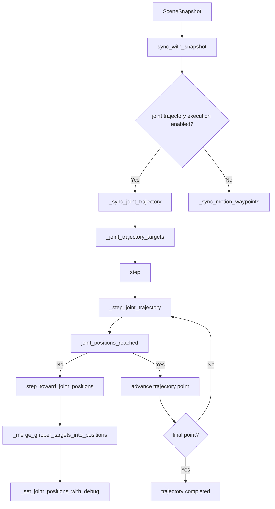

codex_relative_path: ./.codex

---
title: IMPLEMENTATION_FRANKA_MOTION.md
version: 0.1.0
status: draft
owner: atsushi
created: 2026-06-26
updated: 2026-06-26
---

# 目的
`src/tomato_harvest_sim/simulator/franka_motion.py` における Franka の `joint trajectory` 実行部分を、入力と出力を明確にして解説する。  
対象は主に `IsaacFrankaMotionExecutor` の `sync_with_snapshot()` と `_step_joint_trajectory()`、およびその補助関数である。

# 1. 入出力、振る舞い
## 入力信号
- `SceneSnapshot.motion_joint_trajectory`
  - MoveIt など上位 planner が生成した関節軌道。
  - 型は `JointTrajectory` で、`joint_names` と `points` を持つ。
- `SceneSnapshot.target_tool_pose`
  - 実行中フェーズの目標手先姿勢。
  - joint trajectory の進行監視とログ出力時の参照に使う。
- `SceneSnapshot.gripper_closed`
  - 指先の開閉目標。
  - 軌道実行中も、指の目標はアームの関節指令に毎ステップ合成される。
- `SceneSnapshot.cycle_id`, `SceneSnapshot.phase`
  - scene reset や stop 時に home 復帰へ切り替える条件に使う。
- articulation の現在状態
  - `self._articulation.get_joint_positions()` で取得する現関節角。
- end effector の現在姿勢
  - `self._articulation_kinematics_solver.compute_end_effector_pose()` から取得する手先位置。
- 環境変数
  - `TOMATO_HARVEST_USE_JOINT_TRAJECTORY_EXECUTION`
    - 空文字、`0`、`false`、`False` 以外なら joint trajectory 実行を有効にする。
  - `TOMATO_HARVEST_DEBUG_TRAJECTORY`
    - debug log を有効にする。

## 出力信号
- articulation への関節位置指令
  - `apply_action(ArticulationAction(...))` または `set_joint_positions(...)`。
- executor 内部状態
  - `_joint_trajectory_targets`
  - `_active_trajectory_point_index`
  - `_target_pose`
  - `_reached_announced`
- ログ文字列
  - 例:
    - `Executing MoveIt2 joint trajectory (...)`
    - `Franka trajectory completed (...)`
    - `TrajectoryDebug ...`
- 補助的な観測値
  - `current_joint_state_snapshot()`
  - `progress()`

## モジュール内の処理概要
- `sync_with_snapshot()` が `SceneSnapshot` を受け取り、joint trajectory を使うか waypoint IK を使うかを切り替える。
- joint trajectory 実行が有効で、かつ `motion_joint_trajectory` に点列があれば `_sync_joint_trajectory()` で軌道点を内部バッファへ取り込む。
- `step()` は `_joint_trajectory_targets` があれば `_step_joint_trajectory()` を優先して呼ぶ。
- `_step_joint_trajectory()` は現在の関節角と現在の軌道点目標を比較し、未到達なら 1 ステップ分だけ関節角を近づける。
- 関節到達判定は手先座標ではなく、7 軸アームの関節誤差 `<= _joint_tolerance_rad` で行う。
- 最終軌道点に到達したら、その場で gripper 目標だけ維持しつつ `Franka trajectory completed` を返す。

重要な事実:
- `JointTrajectoryPoint.time_from_start_sec` は joint trajectory 実行ロジックでは使っていない。
- したがって、この実装は時間補間制御ではなく、「軌道点列を順に追う位置ステップ制御」である。

# 2. モジュール内の構成


## 主要な要素
- `step_toward_joint_positions(current, target, max_step_rad)`
  - 各関節の差分を `[-max_step_rad, +max_step_rad]` にクリップして 1 ステップ分だけ進める。
- `joint_positions_reached(current, target, tolerance_rad)`
  - `max(abs(target - current)) <= tolerance_rad` なら到達とみなす。
- `_sync_joint_trajectory(snapshot)`
  - `JointTrajectory.points` を NumPy 配列へ展開し、`_joint_trajectory_targets` に保存する。
- `_expand_joint_targets(joint_positions)`
  - 7 軸軌道しか無い場合でも、現在の 9 軸配列へ finger 位置を残した形で拡張する。
- `_merge_gripper_targets_into_positions(positions, current_positions)`
  - arm 用目標に対して finger の開閉目標を毎回上書きして合成する。
- `_set_joint_positions_with_debug(positions, context=...)`
  - articulation に位置指令を送る。
  - `apply_action` があればそちらを優先し、無ければ `set_joint_positions` を使う。

# 3. Joint Trajectory 実行ロジック
## 3.1 入力の取り込み
`sync_with_snapshot()` は `snapshot.target_tool_pose` が存在するときだけ motion 実行モードに入る。  
その上で `TOMATO_HARVEST_USE_JOINT_TRAJECTORY_EXECUTION` が有効なら `_sync_joint_trajectory()` を呼び、`snapshot.motion_joint_trajectory` を内部の `_joint_trajectory_targets` に同期する。

同期時の処理:
1. `motion_joint_trajectory` が空なら、trajectory 実行状態をクリアする。
2. 同一 trajectory を既に保持しているなら再同期しない。
3. 各 `JointTrajectoryPoint.positions_rad` を `np.ndarray` 化する。
4. 必要なら `_expand_joint_targets()` で 7 軸から 9 軸へ拡張する。
5. `_active_trajectory_point_index = 0` に戻す。

この時点で executor は「次に何番目の軌道点へ向かうか」を内部状態として持つ。

## 3.2 実行ループ
`step()` は毎フレーム呼ばれ、`_joint_trajectory_targets` が存在する場合は `_step_joint_trajectory()` を実行する。

`_step_joint_trajectory()` の基本手順は次の通りである。

1. 現在関節角 `current_positions` を読む。
2. 現在手先姿勢 `current_pose` を読む。
3. 現在の目標軌道点 `active_joint_target` を `self._joint_trajectory_targets[self._active_trajectory_point_index]` から取り出す。
4. まず 7 軸アーム部分だけで到達判定する。
5. 到達していなければ、1 ステップ分だけ目標へ近づけた関節位置を作る。
6. その関節位置に finger 目標を合成する。
7. articulation へ送る。

制御則そのものは次の形である。

```text
delta_i = clip(target_i - current_i, -max_joint_step_rad, +max_joint_step_rad)
next_i  = current_i + delta_i
```

ただし、差分が `max_joint_step_rad` 以下の関節は、その場で目標値へスナップする。

つまりこの制御は:
- 速度指令制御ではない
- トルク制御でもない
- 時間軸に沿った補間でもない
- 各フレームで「最大 0.05 rad ずつ近づける」単純な位置ステップ制御

である。

## 3.3 軌道点の進め方
現在の軌道点に到達したと判定されたら、次の分岐に入る。

- まだ後続点がある場合
  - `_active_trajectory_point_index += 1`
  - 次の軌道点へ進む
- 最終点だった場合
  - gripper だけ保持するため `_hold_arm_pose_and_apply_gripper()` を呼ぶ
  - `Franka trajectory completed` を返す

到達判定条件は:

```text
max(abs(active_joint_target[:7] - current_positions[:7])) <= _joint_tolerance_rad
```

である。  
既定値では `_joint_tolerance_rad = 0.03` なので、各関節がおおむね 0.03 rad 以内に入ればその軌道点を通過済みとみなす。

## 3.4 手先姿勢の扱い
joint trajectory 実行中でも、`_target_pose` は保持されている。  
ただし `_step_joint_trajectory()` の進行判定は関節角ベースであり、手先誤差 `ee_error` は debug と completion log で使うだけで、最終完了条件には使っていない。

これは重要で、実装上は:
- 「関節軌道の最終点に到達した」
- 「手先が上位ランタイムの `target_tool_pose` に十分近い」

が必ずしも同じではない。

## 3.5 gripper の扱い
gripper は joint trajectory の中に含めて計画していない。  
その代わり、毎ステップ `_merge_gripper_targets_into_positions()` で finger 目標を arm 指令へ合成する。

ルール:
- `gripper_closed=True` なら finger 目標は `0.0`
- `gripper_closed=False` なら finger 目標は `0.04`
- finger も `max_gripper_step_rad` を上限に少しずつ近づける

したがって、joint trajectory 実行中でも gripper は独立に閉じ続ける、または開き続ける。

# 4. 入力と出力の整理
## 入力
- 外部入力
  - `SceneSnapshot.motion_joint_trajectory`
  - `SceneSnapshot.target_tool_pose`
  - `SceneSnapshot.gripper_closed`
  - `SceneSnapshot.phase`
  - `SceneSnapshot.cycle_id`
- 内部観測
  - `articulation.get_joint_positions()`
  - `compute_end_effector_pose()`
- 設定値
  - `_max_joint_step_rad`
  - `_joint_tolerance_rad`
  - `_max_gripper_step_rad`

## 出力
- 実ロボット相当の出力
  - articulation への joint position command
- 内部状態出力
  - `_active_trajectory_point_index`
  - `_joint_trajectory_targets`
  - `_reached_announced`
- 観測可能な補助出力
  - `Franka trajectory completed`
  - `Executing MoveIt2 joint trajectory`
  - `TrajectoryDebug` 系ログ

# 5. 実装から読み取れる制約
- `time_from_start_sec` を無視するため、MoveIt の時間パラメータは実行に反映されない。
- 軌道点ごとの timeout が無い。
- trajectory 実行中に関節が動かなくなると、その軌道点で待ち続ける。
- 最終完了条件が関節角ベースで、手先 pose ベースではない。
- `apply_action` の readback が期待通り変化しない場合、同じ点へ同じ command を出し続ける可能性がある。

# 6. 実装から逆起こしした要件
- Franka は上位 planner が出した joint trajectory を点列として順に実行できること。
- 実行中はアーム軌道と gripper 開閉目標を同時に扱えること。
- articulation が `apply_action` を持つ場合はそれを優先して使えること。
- 各軌道点は関節誤差が所定許容値以内に入った時点で通過済みとみなせること。
- joint trajectory が使えない場合は waypoint IK 実行へ切り替えられること。

# 不明点
- `apply_action` と `set_joint_positions` のどちらが Isaac Sim 6.0 上でより安定して追従するかは、このファイル単体からは断定できない。
- joint trajectory 実行が実際の physics step とどう同期するかは、`isaac_viewer.py` 側の update ループも合わせて見ないと全体像は確定しない。
