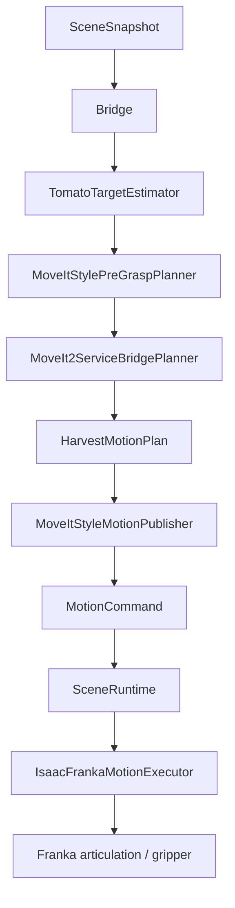
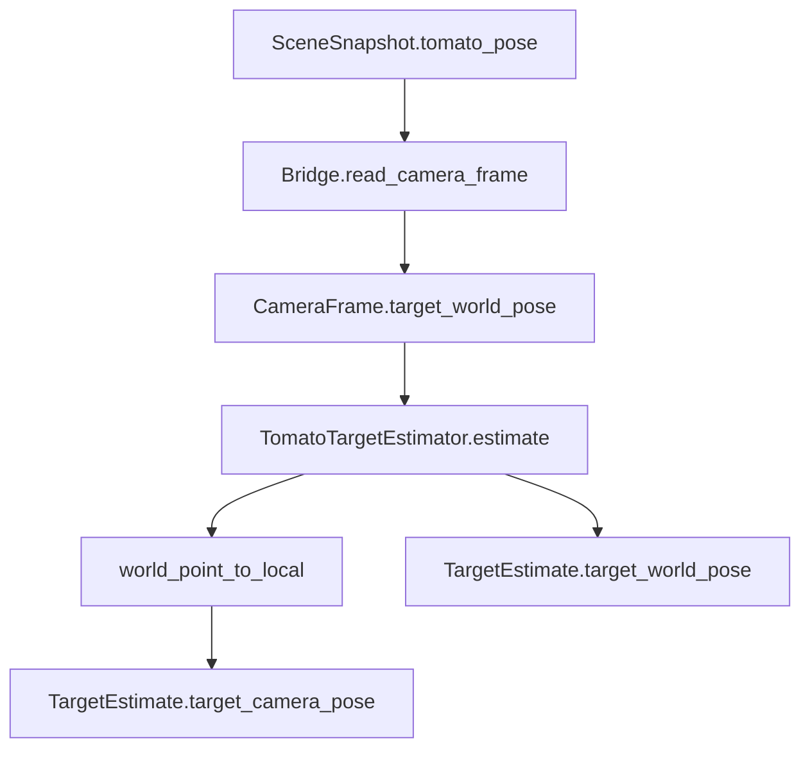
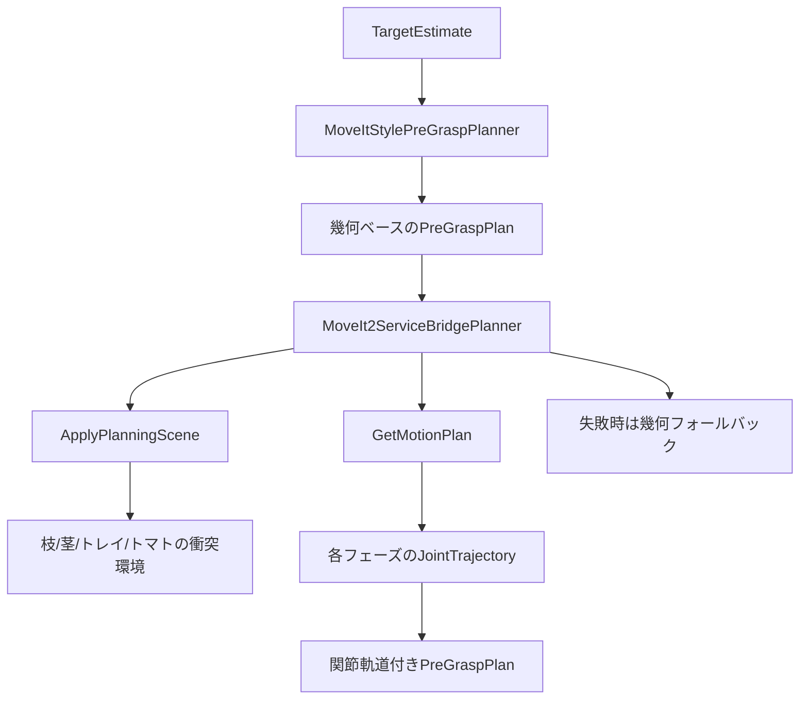
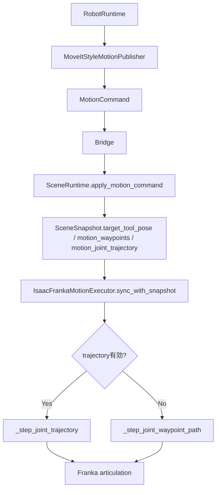

codex_relative_path: ./.codex

---
title: IMPLEMENTATION_ROBOT_CONTROL.md
version: 0.1.0
status: draft
owner: atsushi
created: 2026-06-26
updated: 2026-06-26
---

# 目的
既存実装にもとづいて、このリポジトリのロボット制御を `perception` / `planning` / `motion_control` に分けて解説する。  
対象は主に `src/tomato_harvest_sim/robot/`、`src/tomato_harvest_sim/api/bridge.py`、`src/tomato_harvest_sim/simulator/` 配下の実装である。

# 対象実装
- `src/tomato_harvest_sim/robot/perception.py`
- `src/tomato_harvest_sim/robot/geometry.py`
- `src/tomato_harvest_sim/robot/planner.py`
- `src/tomato_harvest_sim/robot/planner_backend.py`
- `src/tomato_harvest_sim/robot/motion.py`
- `src/tomato_harvest_sim/robot/runtime.py`
- `src/tomato_harvest_sim/robot/moveit_service.py`
- `src/tomato_harvest_sim/api/bridge.py`
- `src/tomato_harvest_sim/simulator/scene_runtime.py`
- `src/tomato_harvest_sim/simulator/franka_motion.py`

# 全体像
この実装は、画像認識で対象を見つけ、把持前後の目標姿勢を計画し、その結果を `MotionCommand` としてシミュレータ側へ渡して実行する構成になっている。  
ただし現状の `perception` は本格的な画像認識ではなく、シーン状態から既知のトマト位置を読み出して座標変換している。`planning` は幾何ベースの姿勢列を常に作り、その上に MoveIt で関節軌道を上書きできる設計である。`motion_control` は `RobotRuntime` の状態機械と、Isaac Sim 側の Franka 実行器が分担する。

## 1. Perception
### 1. 入出力、振る舞い
#### 入力信号
- `CameraFrame`: カメラ名、topic 名、frame ID、カメラ姿勢、対象トマトのワールド姿勢を持つ。
- `TfTreeSnapshot`: ロボット基準座標、カメラ座標、対象座標を持つ。

#### 出力信号
- `TargetEstimate`: 対象トマトのワールド座標、カメラ座標、信頼度を持つ。

#### モジュール内の処理概要
- `TomatoTargetEstimator.estimate()` は `camera_frame.target_world_pose` をそのまま対象位置として使う。
- `world_point_to_local()` で、ワールド座標のトマト位置をカメラローカル座標へ変換する。
- `confidence` は固定で `0.99` を返す。
- 現状の実装では `tf_tree` は受け取るが未使用である。
- `Bridge.read_camera_frame()` は画像から対象を検出していない。`SceneSnapshot.tomato_pose` を `CameraFrame.target_world_pose` にそのまま入れている。

このため、現状の `perception` は「画像認識モジュール」ではなく、「シミュレータ既知の真値を perception I/F に載せ替えるアダプタ」と見るのが正確である。

### 2. モジュール内の構成

- `InMemoryRos2Bridge.read_camera_frame` / `Ros2LoopbackBridge.read_camera_frame`: シーン状態から `CameraFrame` を組み立てる。
- `world_point_to_local`: カメラ姿勢の回転行列を作り、ワールド座標差分をローカル座標へ変換する。
- `TomatoTargetEstimator`: perception の公開入口で、`TargetEstimate` を作る。

不明点
- 実画像からの segmentation、depth 利用、3D 復元はまだ実装されていない。

### 3. モジュールの要件
- シーン上で既知のトマト位置を、後段の planner が扱える `TargetEstimate` に変換できること。
- ワールド座標とカメラ座標の両方を保持できること。
- perception 実装が差し替わっても、後段は `TargetEstimate` にだけ依存できること。

## 2. Planning
### 1. 入出力、振る舞い
#### 入力信号
- `TargetEstimate`: トマトの推定位置。
- `JointStateSnapshot`: 現在のアーム関節角。
- `TfTreeSnapshot`: ロボットとカメラのフレーム情報。
- `SceneSnapshot`: トレイ、枝、茎、現在のツール位置などのシーン状態。

#### 出力信号
- `HarvestMotionPlan`: `pregrasp` / `grasp` / `pull` / `place` の各目標姿勢、ウェイポイント列、必要なら関節軌道を持つ。

#### モジュール内の処理概要
- `MoveItStylePreGraspPlanner` は、対象トマトとトレイ位置から幾何ベースの目標姿勢列を決める。
- 生成する主な姿勢は `pregrasp_pose`、`grasp_pose`、`pull_pose`、`place_pose` である。
- 把持動作は 1 点ではなく、`grasp_hover -> grasp_entry -> grasp` の 3 段階ウェイポイントで表現される。
- 引き抜き動作も `pull_lift -> pull` の 2 段階になっている。
- `build_planner()` は環境変数と ROS/MoveIt Python 利用可否を見て、MoveIt バックエンドか幾何フォールバックを選ぶ。
- `MoveIt2ServiceBridgePlanner` はまず幾何ベースの `HarvestMotionPlan` を作り、その後 MoveIt が使える場合だけ各フェーズの `JointTrajectory` を追加する。
- MoveIt が使えない、サービス未起動、計画失敗、または no-op 軌道なら、姿勢列はそのまま残し、関節軌道なしでフォールバックする。

### 2. モジュール内の構成

- `MoveItStylePreGraspPlanner`: 幾何学ルールで姿勢列を作る基本 planner。
- `MoveIt2ServiceBridgePlanner`: MoveIt を使う façade。幾何 planner を内包し、結果へ関節軌道を注入する。
- `Ros2MoveIt2PlannerBridge`: `ApplyPlanningScene` と `GetMotionPlan` を直接叩く ROS 2 クライアント層。
- `_build_planning_scene_request`: MoveIt の衝突世界に `tomato_branch`、`tomato_stem`、トレイ壁、対象トマトを反映する。
- `_tomato_planning_scene_ops`: 把持前は world object、把持後は attached object としてトマトを切り替える。
- `_moveit_link_target_pose_from_runtime_tool_pose`: ランタイムが持つ把持中心座標を、MoveIt の `panda_hand` リンク目標へ 58.4 mm オフセット変換する。

### 3. モジュールの要件
- トマト収穫を `pregrasp -> grasp -> pull -> place` の段階に分解して計画できること。
- MoveIt が無効でも、最低限ウェイポイントベースで同じタスクを継続できること。
- 把持前後でトマトの衝突表現を world object と attached object に切り替えられること。
- ロボット実行系が関節軌道を使える場合はそれを使い、使えない場合は目標姿勢列だけで実行できること。

## 3. Motion Control
### 1. 入出力、振る舞い
#### 入力信号
- `ControlCommand`: `start` / `stop` / `reset`。
- `SceneSnapshot`: シーン状態、ツール位置、トマト状態、現在の motion target。
- `HarvestMotionPlan`: planner が生成した姿勢列と関節軌道。
- `MotionCommand`: 実行対象の単一動作。

#### 出力信号
- `MotionCommand`: シミュレータ側へ送る行動命令。
- `SceneSnapshot`: motion command を反映した更新済みシーン状態。
- Franka articulation への関節指令。

#### モジュール内の処理概要
- `RobotRuntime.step()` が上位の状態機械を持つ。
- 状態は `DETECTING -> TARGET_FOUND -> PLANNING -> MOVING_TO_PREGRASP -> ... -> COMPLETE` の順に進む。
- `MoveItStyleMotionPublisher` は `HarvestMotionPlan` を `MotionCommand` に変換するだけで、実行はしない。
- `TomatoHarvestApplication.step()` は、robot 側が出した `MotionCommand` を simulator 側へ渡し、`SceneRuntime.apply_motion_command()` に反映する。
- `SceneRuntime` は target pose、waypoints、joint trajectory、gripper 状態、トマト状態を scene state として保持する。
- `IsaacFrankaMotionExecutor` は scene snapshot を見て、Isaac Sim 上の Franka articulation を実際に動かす。
- 実行方式は 2 系統ある。
- 1 つ目は waypoint 実行で、各 waypoint に対して IK を解いて少しずつ関節を進める。
- 2 つ目は joint trajectory 実行で、MoveIt の各軌道点へ順に追従する。
- joint trajectory 実行は `TOMATO_HARVEST_USE_JOINT_TRAJECTORY_EXECUTION` が有効なときだけ使う。
- どちらの方式でも gripper 指令は腕指令へマージされる。

### 2. モジュール内の構成

- `RobotRuntime`: タスク状態機械。認識、計画、把持評価、detach、place、home 復帰までを管理する。
- `MoveItStyleMotionPublisher`: `HarvestMotionPlan` を `move_to_pregrasp` などのコマンド名へ変換する。
- `Bridge`: robot 側と simulator 側の境界。`in_memory` と `ros2` の 2 実装がある。
- `SceneRuntime`: motion command を scene state に展開する。実体ロボットの代わりにシミュレーション状態遷移を持つ。
- `IsaacFrankaMotionExecutor`: Isaac Sim の articulation と Lula IK solver を使って関節指令を出す低レベル実行器。

補足
- `Ros2LoopbackBridge.publish_motion_command()` は、関節軌道がある場合 `FollowJointTrajectory` action を優先する。
- action server が利用できない場合は JSON topic へフォールバックする。
- `create_tomato_harvest_application()` は `Ros2LoopbackBridge` を使うときだけ `MoveItServiceManager.start_if_needed()` で `move_group` を自動起動する。

### 3. モジュールの要件
- タスク全体を段階的な状態機械として進められること。
- motion command を simulator 境界で明示的に受け渡しできること。
- waypoint ベースと joint trajectory ベースの両方を同じ executor で扱えること。
- 把持判定、detach、place、home 復帰を scene state と整合して進められること。

## 4. MoveIt をどう使っているか
### 実装上の位置づけ
この実装で MoveIt は「実行器」ではなく、主に「経路計画サービス」として使われている。  
`move_group` は `src/tomato_harvest_sim/robot/moveit_service.py` で起動されるが、パラメータ `allow_trajectory_execution` は `False` であり、MoveIt 自身がコントローラへ送出して実機を動かす構成にはなっていない。

### 具体的な使い方
- `MoveItServiceManager` が `move_group` プロセスを起動する。
- 設定には Isaac Sim 同梱の Panda URDF、リポジトリ内の `panda.srdf`、`kinematics.yaml`、`joint_limits.yaml` を使う。
- planner は OMPL の `RRTConnect` を使う。
- `Ros2MoveIt2PlannerBridge` が `ApplyPlanningScene` と `GetMotionPlan` の 2 サービスを使う。
- `ApplyPlanningScene` では、枝、茎、トレイ壁、対象トマトを衝突物として投入する。
- 把持後フェーズでは、対象トマトを world object ではなく `panda_hand` へ attached object として扱う。
- `GetMotionPlan` では、現在関節角を start state にし、目標位置を球領域、姿勢を orientation constraint として与える。
- 返ってきた `joint_trajectory` は `HarvestMotionPlan.pregrasp_joint_trajectory` などへ格納される。
- その後の実行は、ROS 2 action か Isaac Sim 内 executor が担当する。

### MoveIt を使う理由
- 幾何ベース姿勢列だけでは、枝やトレイを避けた関節経路までは表現できない。
- MoveIt を挟むことで、各フェーズの target pose は維持したまま、関節空間の軌道へ落とし込める。
- ただし MoveIt が失敗しても PoC が止まらないよう、必ず幾何フォールバックを残している。

### MoveIt 利用時の重要な実装ポイント
- ランタイムの target pose は把持中心基準だが、MoveIt の目標リンクは `panda_hand` なので Z 方向 `58.4 mm` の補正が必要である。
- no-op 軌道は `_trajectory_is_noop()` で弾く。開始関節とほぼ同じ軌道を採用すると、見かけ上 plan 成功でもロボットが動かないためである。
- orientation constraint はデフォルトで有効であり、ハンド姿勢を保ったまま接近させる意図がある。
- MoveIt の計画結果をそのまま使うか、IK waypoint 実行へ落とすかは実行環境変数で切り替わる。

## 5. 実装から見える設計上の特徴
- `perception` はまだ真値注入であり、差し替え前提の薄い層として保たれている。
- `planning` は「姿勢生成」と「MoveIt 軌道付与」を分けているため、MoveIt 依存を局所化できている。
- `motion_control` は `RobotRuntime` の論理状態機械と `IsaacFrankaMotionExecutor` の物理実行器を分離している。
- `Bridge` により、同一プロセスの in-memory 実行と ROS 2 loopback 実行の両方を同じ契約で扱える。

## 6. 実装から逆起こしした全体要件
- ロボットは固定カメラから対象トマトを観測し、収穫タスクを段階的に進められること。
- 収穫タスクは pre-grasp、grasp、pull、place、home の順で実行できること。
- MoveIt が利用可能なら衝突物を含む関節軌道を計画できること。
- MoveIt が使えなくても、幾何ベースのウェイポイントでタスク継続できること。
- 把持後はトマトを手先に追従させ、detach 後は place 判定まで扱えること。
- 実行系は topic/action/scene state を通じて simulator と疎結合に保たれること。
