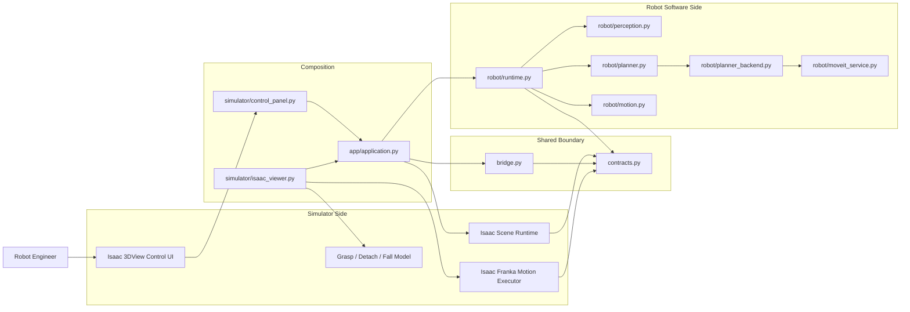
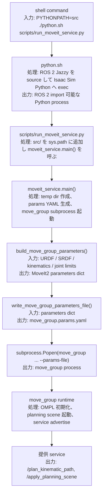
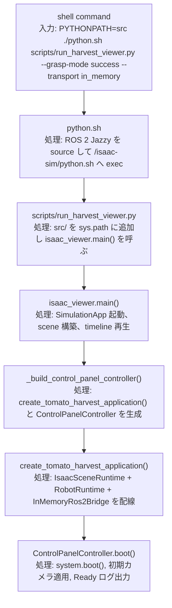
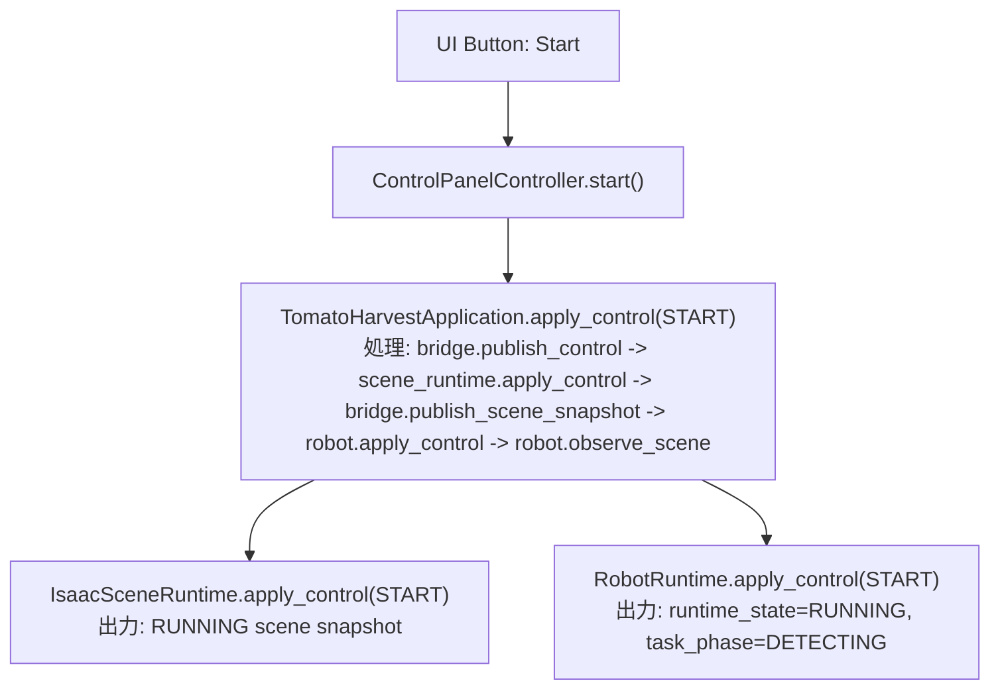
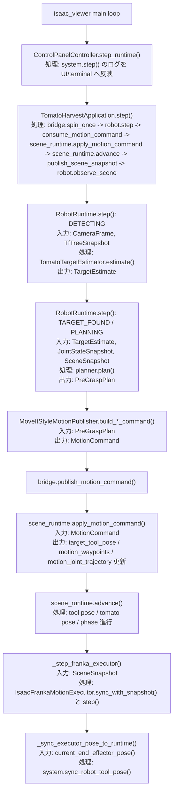
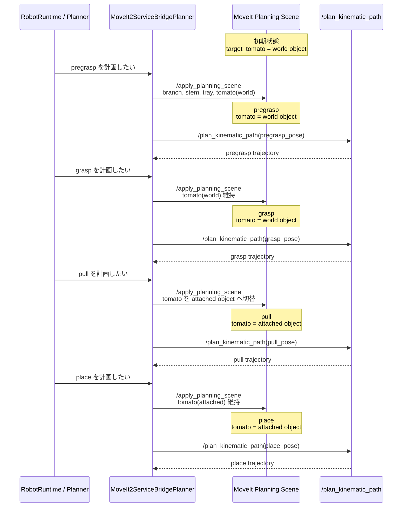

# 目的
この文書は、`.codex/docs/ADR.md` の `Option 2: Simulator Runtime と ROS 2 Robot Runtime の分離型` に対して、現状実装がどのモジュールで責務を実現しているかを示す実装仕様書である。  
Sprint 名ベースの PoC 構成は整理し、現在は `Isaac Scene Runtime` を中心とした最終命名へ統一している。

# 対象 ADR
- 対象文書:
  - `.codex/docs/ADR.md`
- 対象案:
  - `Option 2: Simulator Runtime と ROS 2 Robot Runtime の分離型`

# 最終の正規モジュール名
- `src/tomato_harvest_sim/app/application.py`
  - `TomatoHarvestApplication`
  - simulator / robot / bridge の composition root
- `src/tomato_harvest_sim/simulator/scene_runtime.py`
  - `IsaacSceneRuntime`
  - scene 状態、制御反映、advance、reset の正本
- `src/tomato_harvest_sim/simulator/franka_motion.py`
  - `IsaacFrankaMotionExecutor`
  - Franka articulation への joint trajectory / IK 反映
- `scripts/run_harvest_viewer.py`
  - 3DView レビュー用の正規 viewer 起動入口
- `scripts/run_harvest_pipeline_demo.py`
  - robot software side の terminal デモ入口
- `scripts/run_scene_runtime_demo.py`
  - simulator side 単独デモ入口
- `scripts/run_control_demo.py`
  - Start / Stop / Reset 制御デモ入口

# 互換レイヤ
- `src/tomato_harvest_sim/app/bootstrap.py`
  - `TomatoHarvestApplication` を再 export する薄い互換ラッパー
- `src/tomato_harvest_sim/simulator/runtime.py`
  - `IsaacSceneRuntime` を再 export する薄い互換ラッパー
- `scripts/run_sprint*.py`
  - 旧レビュー手順を壊さないための薄いラッパー

# ADR Option 2 と現状実装の対応
## 対応図


## 対応表
| ADR の責務 | 対応ファイル | 実装状態 | 補足 |
| --- | --- | --- | --- |
| Isaac 3DView Control UI | `src/tomato_harvest_sim/simulator/control_panel.py` | 実装済み | Start / Stop / Reset / Camera Switch / 状態表示 |
| Isaac Scene Runtime | `src/tomato_harvest_sim/simulator/scene_runtime.py` | 実装済み | scene snapshot の正本、motion command の反映、advance、reset |
| Physics / Asset Runtime | `src/tomato_harvest_sim/simulator/physics_harvest.py`, `src/tomato_harvest_sim/simulator/isaac_viewer.py` | 実装済み | stem-break、把持接触、落下、Reset 復元 |
| ROS 2 Bridge Adapter | `src/tomato_harvest_sim/api/bridge.py` | 実装済み | in-memory / ROS 2 transport を切替可能 |
| Harvest Task Supervisor | `src/tomato_harvest_sim/robot/runtime.py` | 実装済み | detecting から place / home までの状態遷移 |
| Perception / Target Estimation | `src/tomato_harvest_sim/robot/perception.py` | 最小実装済み | 現在は scene 由来情報ベース。将来は画像認識器へ置換予定 |
| Planner Plugin | `src/tomato_harvest_sim/robot/planner.py`, `src/tomato_harvest_sim/robot/planner_backend.py` | 実装済み | geometric fallback と MoveIt2 service bridge を両立 |
| Robot Command Publisher | `src/tomato_harvest_sim/robot/motion.py` | 実装済み | phase ごとの waypoint / trajectory を command 化 |
| Isaac Franka Motion Executor | `src/tomato_harvest_sim/simulator/franka_motion.py` | 実装済み | joint trajectory 優先、IK fallback |
| Composition / 起動配線 | `src/tomato_harvest_sim/app/application.py` | 実装済み | simulator / robot / bridge / MoveIt 自動起動条件を統合 |

# 現在のフォルダ構成
```text
.codex/
  docs/
    IMPLEMENTATION_SPEC.md
scripts/
  run_control_demo.py
  run_harvest_pipeline_demo.py
  run_harvest_viewer.py
  run_moveit_service.py
  run_scene_runtime_demo.py
  run_sprint1_demo.py
  run_sprint2_isaac_viewer.py
  run_sprint2_simulator_demo.py
  run_sprint3_pregrasp_viewer.py
  run_sprint3_robot_pipeline_demo.py
src/
  tomato_harvest_sim/
    api/
      bridge.py
      contracts.py
    app/
      application.py
      bootstrap.py
      control_demo.py
      demo.py
      harvest_pipeline_demo.py
      robot_pipeline_demo.py
      scene_runtime_demo.py
      simulator_demo.py
    robot/
      geometry.py
      motion.py
      moveit_config/
        joint_limits.yaml
        kinematics.yaml
        panda.srdf
      moveit_service.py
      perception.py
      planner.py
      planner_backend.py
      ros_python.py
      runtime.py
    simulator/
      control_panel.layout.json
      control_panel.py
      franka_motion.py
      isaac_viewer.py
      physics_harvest.py
      runtime.py
      scene_plan.py
      scene_runtime.py
      scene_runtime_view.py
tests/
  test_control_contract.py
  test_control_panel.py
  test_franka_motion.py
  test_franka_motion_executor.py
  test_harvest_execution_state.py
  test_isaac_viewer.py
  test_moveit_planner_backend.py
  test_physics_grasp_runtime.py
  test_place_and_home.py
  test_robot_pipeline_planning.py
  test_ros2_transport_contract.py
  test_ros_python.py
  test_scene_runtime.py
```

# ディレクトリ責務
## `src/tomato_harvest_sim/api/`
- simulator side と robot side の共有契約
- transport 境界の抽象化

## `src/tomato_harvest_sim/simulator/`
- Isaac Sim 側の scene、viewport、physics、Franka motion 実行

## `src/tomato_harvest_sim/robot/`
- 認識、計画、MoveIt 連携、motion command 発行、状態遷移

## `src/tomato_harvest_sim/app/`
- composition root と実行モード別 entrypoint

# 主要ファイル責務
## `api/contracts.py`
- 共有データ構造を定義する
- 主な型:
  - `ControlCommand`
  - `ScenePhase`
  - `RobotRuntimeState`
  - `HarvestTaskPhase`
  - `TomatoStatus`
  - `Pose3D`
  - `SceneSnapshot`
  - `CameraFrame`
  - `JointStateSnapshot`
  - `TfTreeSnapshot`
  - `TargetEstimate`
  - `PreGraspPlan`
  - `JointTrajectory`
  - `JointTrajectoryPoint`
  - `MotionCommand`
  - `ControlResult`

## `api/bridge.py`
- `BridgeProtocol`
  - app / robot runtime が依存する境界
- `InMemoryRos2Bridge`
  - host unit test と軽量 demo 用
- `Ros2LoopbackBridge`
  - scene snapshot / control / target estimate / motion command / `FollowJointTrajectory` action を ROS 2 transport へ接続

## `robot/moveit_service.py`
- `move_group` をこの repo 付属の Panda 設定で起動する
- `/plan_kinematic_path` と `/apply_planning_scene` を待ち受ける

## `robot/planner_backend.py`
- geometric fallback planner と MoveIt2 service bridge の切替
- planning scene に `branch / stem / tray / tomato` を world object または attached object として同期

## `robot/runtime.py`
- 状態機械:
  - `DETECTING`
  - `TARGET_FOUND`
  - `PLANNING`
  - `MOVING_TO_PREGRASP`
  - `PREGRASP_REACHED`
  - `MOVING_TO_GRASP`
  - `AT_GRASP`
  - `GRASP_EVALUATION`
  - `DETACHING`
  - `DETACHED`
  - `MOVING_TO_PLACE`
  - `PLACED`
  - `RETURNING_HOME`
  - `COMPLETE`
  - `FAILED`

## `simulator/scene_runtime.py`
- scene の正本状態を保持する
- 主な責務:
  - `apply_control()`
  - `apply_motion_command()`
  - `advance()`
  - `reset_scene()`
  - `set_active_camera()`
  - `sync_robot_tool_pose()`
  - `sync_tomato_physics()`

## `simulator/franka_motion.py`
- `motion_joint_trajectory` があればそれを優先再生
- trajectory が無い場合のみ IK で `target_tool_pose` へ近づける
- grasp center と `panda_hand` のオフセットを補正して実 articulation を駆動する

## `app/application.py`
- `TomatoHarvestApplication`
  - simulator / robot / bridge の依存配線
  - `boot()`, `apply_control()`, `step()`, `close()`

## `simulator/isaac_viewer.py`
- SimulationApp 起動
- scene 構築
- control panel の生成
- runtime snapshot と 3DView の同期
- Franka executor / physics bridge の毎フレーム駆動

# 正規の起動入口
## `scripts/run_moveit_service.py`
- MoveIt2 service 起動

## `scripts/run_harvest_viewer.py`
- Isaac Sim 3DView で simulator と robot runtime を統合起動

## `scripts/run_harvest_pipeline_demo.py`
- terminal で認識から place までのログを確認

## `scripts/run_scene_runtime_demo.py`
- simulator side 単独の deterministic scene 挙動を確認

## `scripts/run_control_demo.py`
- Start / Stop / Reset の最小制御契約を確認

# テスト責務
## `tests/test_control_contract.py`
- Start / Stop / Reset 契約

## `tests/test_scene_runtime.py`
- 初期レイアウト、camera 切替、reset 復元

## `tests/test_control_panel.py`
- 3DView 操作パネルの制御

## `tests/test_robot_pipeline_planning.py`
- perception / planner / motion publisher / pre-grasp 到達までの縦スライス

## `tests/test_franka_motion_executor.py`
- Franka executor の waypoint / trajectory / 到達判定

## `tests/test_physics_grasp_runtime.py`
- grasp / detach / fall の simulator runtime 挙動

## `tests/test_harvest_execution_state.py`
- success / failure シナリオの状態遷移

## `tests/test_moveit_planner_backend.py`
- planning scene と MoveIt2 backend の整合

## `tests/test_place_and_home.py`
- place 後停止と home 復帰

# 関数レベルの処理フロー
## 1. `PYTHONPATH=src ./python.sh scripts/run_moveit_service.py`
### 目的
- `move_group` を foreground で起動する
- Panda 用の `URDF / SRDF / kinematics / joint limits` を読み込み、MoveIt2 service を提供する



### 何ができるようになるか
- `robot/planner_backend.py` から MoveIt2 の軌道計画 service を呼べる
- planning scene に tomato / branch / tray を反映した上で各 phase の joint trajectory を取得できる
- 把持後は tomato を attached object に切り替えた状態で `pull` と `place` を計画できる

## 2. `PYTHONPATH=src ./python.sh scripts/run_harvest_viewer.py --grasp-mode success --transport in_memory` 実行後に Start を押したあとの処理
### 2-1. viewer 起動


### 2-2. Start 押下


### 2-3. Start 後の毎フレーム


### 2-4. 主な入出力
| 関数 | 入力 | 処理 | 出力 |
| --- | --- | --- | --- |
| `TomatoHarvestApplication.boot()` | なし | scene boot、robot boot、初期 snapshot publish | 初期状態 |
| `TomatoHarvestApplication.apply_control()` | `ControlCommand` | simulator / robot の phase を同期切替 | `ControlResult` |
| `TomatoHarvestApplication.step()` | bridge / robot / scene 現状態 | robot step、motion consume、scene advance、snapshot 再配布 | ログ列 |
| `TomatoTargetEstimator.estimate()` | `CameraFrame`, `TfTreeSnapshot` | target pose 推定 | `TargetEstimate` |
| `MoveIt2ServiceBridgePlanner.plan()` | target / joint / tf / scene | waypoint と joint trajectory 生成 | `PreGraspPlan` |
| `IsaacSceneRuntime.apply_motion_command()` | `MotionCommand` | target pose、waypoint、trajectory、gripper 状態を更新 | `SceneSnapshot` |
| `IsaacSceneRuntime.advance()` | runtime state | 1 step 分 scene を進める | 更新後 `SceneSnapshot` |
| `IsaacFrankaMotionExecutor.step()` | 直近 snapshot | trajectory or IK を 1 step 実行 | 実行ログ |

# MoveIt planning scene におけるトマト状態


| フェーズ | MoveIt 内のトマト状態 | 意図 |
| --- | --- | --- |
| `pregrasp` | `world object` | まだ枝側の対象として扱う |
| `grasp` | `world object` | 把持直前までは環境物体として扱う |
| `pull` | `attached object` | 把持後は hand と一体の搬送物として扱う |
| `place` | `attached object` | トレーまで運ぶ対象として扱う |

# 現時点の残課題
- perception を実画像ベースへ差し替えるインターフェース実装
- tray 内での最終配置判定の厳密化
- 実 ROS 2 ノード分離時の launch / packaging 整備

# Sprint 5 完了時点のレビュー観点
- `run_harvest_viewer.py` が正規 entrypoint であること
- `TomatoHarvestApplication` と `IsaacSceneRuntime` が正本であること
- 旧 `Sprint*` 命名は互換ラッパーに閉じ込められていること
- test ファイル名が役割ベースへ整理されていること
