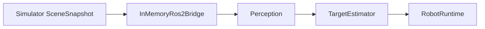
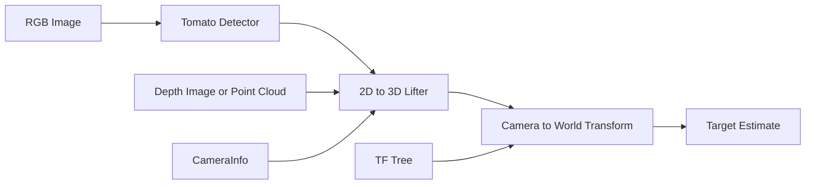
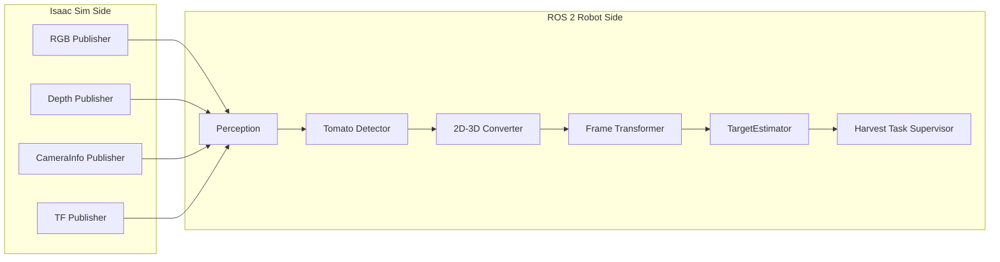

# 目的
この文書は、トマト認識器のアーキテクチャを整理するための設計メモである。  
特に、現状の Sprint 3 実装がどこまで本物の認識器で、どこからが simulator の真値ショートカットなのかを明確にする。

# 結論
現状の Sprint 3 実装は、まだ「カメラ画像からトマトを認識する認識器」ではない。  
現在は simulator 側が持っている `TargetTomato` の真値 world 座標を bridge 経由で robot side へ渡し、それを `Perception` モジュールが実質 pass-through して `TargetEstimator` へ渡している。

そのため、現在の `Target is Found!` は次を意味する。

- 画像認識で target を見つけた
- hand camera にトマトが写っている

ではなく、実際には次を意味する。

- simulator が知っているトマト真値 world 座標を受け取った
- その真値を Fixed Camera 前提の経路で受け取れた

# 現状実装の整理
## 現状のコード経路
現状の Sprint 3 実装では、認識処理は以下の流れで動いている。



## 現状の重要な事実
1. `RobotRuntime.step()` は当面 `Fixed Camera` を固定で読んでいる  
2. `InMemoryRos2Bridge.read_camera_frame()` は、画像そのものではなく `snapshot.tomato_pose` を `target_world_pose` として返している  
3. `Perception` は現段階では実質 pass-through であり、真値 world 座標をそのまま下流へ流している  
4. `TomatoTargetEstimator.estimate()` は画像処理を行っていない  
5. `TomatoTargetEstimator.estimate()` は `tf_tree` を実質使っていない  
6. camera 座標は「見えた結果」ではなく「既知の world 座標を camera 座標へ変換した結果」である

## 現状コードの責務
### `src/tomato_harvest_sim/robot/runtime.py`
- `bridge.read_camera_frame("fixed_camera")` を固定で呼ぶ
- 初期段階では認識対象カメラを `Fixed Camera` に限定している
- 認識対象カメラは active viewport や hand camera と連動していない

### `src/tomato_harvest_sim/robot/perception.py`
- 現段階では `Perception` の最小実装である
- simulator から来た target world 座標を `TargetEstimator` が使える形へ受け渡す
- 将来的にはここを画像認識器へ置き換える

### `src/tomato_harvest_sim/api/bridge.py`
- `read_camera_frame()` で `target_world_pose=snapshot.tomato_pose` を返す
- つまり bridge の時点で simulator 真値を robot side へ渡している

### `src/tomato_harvest_sim/robot/target_estimator.py` 相当の責務
- 現在は `TomatoTargetEstimator` がこの責務を持つ
- `camera_frame.target_world_pose` を `world_point_to_local()` で camera 座標へ変換する
- 画像からの検出、bbox、mask、depth 取得、2D-3D 変換はまだ存在しない

# なぜトマトが画面に写っていなくても座標が出るのか
理由は 2 つある。

## 1. 現状の認識器は Fixed Camera 前提である
Sprint 3 の `RobotRuntime.step()` は `fixed_camera` を固定で読む。  
そのため、利用者が 3DView 上で別視点を表示していても、robot side の認識経路はその表示視点を参照していない。

## 2. 現状の bridge は画像ではなく真値座標を渡している
`InMemoryRos2Bridge.read_camera_frame()` は、camera image から target を推定していない。  
代わりに、scene snapshot に入っている `tomato_pose` をそのまま `target_world_pose` として返している。

そのため、現在の認識器は次の処理をしているだけである。

```text
simulator が知っている world 座標
  -> fixed camera 座標へ変換
  -> target found と表示
```

これは「認識器」というより、Sprint 3 のための `ground-truth pose adapter` である。

# 採用したいモジュール構成
利用者が求める構成は、最終的に次の形である。

```text
RGBImage -> Perception -> TargetEstimator
```

ここでの責務は次の通りである。

- `RGBImage`
  - camera から得られる画像入力
- `Perception`
  - 画像を受け取り、target の world 座標候補を出す
  - 将来的には画像認識器へ置き換わる
- `TargetEstimator`
  - downstream の task supervisor が使う `TargetEstimate` へ整形する

## 初期段階の暫定構成
ただし、初期段階では本物の画像認識を入れなくてもよい。  
その場合は、同じモジュール境界を保ったまま、内部だけ次のように簡略化する。

```text
Simulator SceneSnapshot
  -> Perception
     実態: simulator 真値 world 座標の pass-through
  -> TargetEstimator
```

この構成なら、後で `Perception` の中身だけを本物の画像認識器へ置き換えられる。

## 現段階での設計意図
- 初期段階では `Fixed Camera` のみを認識入力として使う
- `HandCamera` は今の段階では認識入力に含めなくてよい
- ただし `Perception` モジュール自体は将来の画像認識器差し替え点として先に置いておく
- `TargetEstimator` は `Perception` の出力形式が変わっても、task supervisor へ渡す契約を安定化する役割を持つ

# 本来あるべき認識器の流れ
将来的な本物の認識器は、少なくとも次の流れを踏む必要がある。



## 正常系の処理ステップ
1. camera image を受け取る
2. detector が画像中のトマト領域を検出する
3. 検出領域の代表画素を選ぶ
4. depth image または point cloud から、その画素の 3D 値を得る
5. `CameraInfo` を使って camera 座標系の 3D 点へ変換する
6. `tf` を使って camera 座標系から world 座標系へ変換する
7. 信頼度付きの target pose を `TargetEstimate` として task supervisor へ渡す

# 推奨アーキテクチャ
## システム構成


## モジュール詳細
### 1. Perception
- 責務:
  - ROS 2 topic から `image / depth / camera_info / tf` を受け取る
  - target 候補の world 座標を downstream へ渡す
  - 初期段階では simulator 真値 world 座標の pass-through として実装してよい
  - 将来的には画像認識器へ置き換える
- 入力:
  - `/camera/fixed/image_raw`
  - `/camera/*/depth`
  - `/camera/*/camera_info`
  - `/tf`
- 出力:
  - detector / estimator 用の perception result

### 2. Tomato Detector
- 責務:
  - RGB image からトマト候補の 2D 領域を検出する
- 入力:
  - RGB image
- 出力:
  - bbox または mask
  - confidence
- 候補:
  - ルールベース色抽出
  - 学習済み segmentation model

### 3. 2D-3D Converter
- 責務:
  - 2D 検出結果を camera 座標系の 3D 点へ持ち上げる
- 入力:
  - bbox または mask
  - depth image または point cloud
  - camera intrinsics
- 出力:
  - camera 座標系の `Pose3D`

### 4. Frame Transformer
- 責務:
  - camera 座標系の 3D 点を world 座標系へ変換する
- 入力:
  - camera 座標系の `Pose3D`
  - `tf`
- 出力:
  - world 座標系の `Pose3D`

### 5. TargetEstimator
- 責務:
  - Perception の出力を task supervisor が使う `TargetEstimate` に整形する
  - 初期段階では camera/world 座標の整形を主に担う
- 入力:
  - Perception の出力
  - camera 3D pose
  - world 3D pose
  - confidence
- 出力:
  - `TargetEstimate`

# 推奨インターフェース
## 将来の perception input 契約
認識器の入力は、最終的に少なくとも以下を持つべきである。

```text
PerceptionFrame
  - camera_name
  - rgb_image
  - depth_image or point_cloud
  - camera_info
  - frame_id
  - timestamp
```

## 将来の target estimate 契約
```text
TargetEstimate
  - camera_name
  - target_camera_pose
  - target_world_pose
  - confidence
  - detection_source
  - image_region
```

# 異常系で必要な扱い
## 1. 画像にトマトが写っていない
- detector は `no detection` を返す
- task supervisor は `Target is Found!` を出してはいけない
- scan pose を継続する

## 2. RGB には写っているが depth が取れない
- 2D detection は成功
- 3D lift は失敗
- task supervisor は `2D detected / 3D unresolved` として再観測する

## 3. tf が取れない
- camera 座標までは成功
- world 座標への変換は失敗
- task supervisor は motion planning へ進めない

## 4. 複数候補がある
- detector は複数候補を返す
- estimator は選定ルールを持つ
  - 例:
    - confidence 最大
    - 既知高さに最も近い
    - workspace に最も近い

# 現状実装と目標実装の差分
| 項目 | 現状 Sprint 3 | 目標 |
| --- | --- | --- |
| 入力画像 | なし | RGB image |
| depth | なし | depth image または point cloud |
| `CameraInfo` | なし | 必須 |
| `tf` 利用 | 形式上あり、実質未使用 | camera->world 変換に必須 |
| detector | なし | bbox または mask を返す |
| 2D->3D 変換 | なし | 必須 |
| world 座標 | simulator 真値から直取得 | camera 3D から変換 |
| camera 選択 | `fixed_camera` 固定 | 当面 `fixed_camera` 固定、将来 policy 化 |
| Target is Found | 真値があるので常に成立 | 画像検出成功時のみ成立 |

# 次の実装方針
## 将来の実装で最低限やるべきこと
1. `Perception` を robot side の明示モジュールとして独立維持する
2. 初期段階では `SceneSnapshot -> world 座標 pass-through` としてよい
3. 後で `RGBImage -> detection -> world 座標推定` へ差し替えられるようにする
4. `TargetEstimator` は `Perception` の出力形式を吸収する安定層として残す
5. `Target is Found!` は将来的には detector 成功時だけ出す

## 将来実装でもまだ簡略化してよい点
- detector は学習器でなくてもよい
- depth は simulator 真値から擬似生成でもよい
- 当面は `Fixed Camera` だけを認識入力にしてよい
- `HandCamera` の認識利用はもっと後の段階でもよい

# この文書の設計判断
- 現状 Sprint 3 は「認識器」ではなく「ground-truth pose adapter」であると明記する
- 利用者が「なぜ画面に写っていなくても認識できるのか」を説明できることを優先する
- 初期段階では `Fixed Camera` のみを使う前提を明記する
- `Perception` モジュールは将来の画像認識器への差し替え点として先に置く
- 今後の本物の perception 実装は
  - `image detection`
  - `2D-3D lift`
  - `camera->world transform`
  の 3 段に分ける
