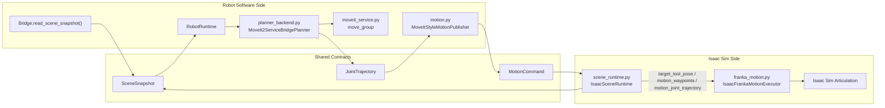
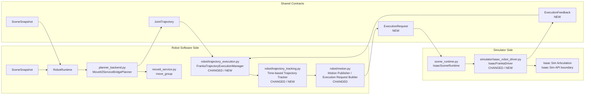

# Franka MoveIt Joint Trajectory 改善プラン

## Summary
- 前提を修正する。`Execution` は simulator 側ではなく robot 制御アルゴリズム側の責務として扱う。
- simulator 側の責務は `Isaac Sim API`、`articulation state readback`、`articulation command apply` までに限定する。
- 一次情報を踏まえると、MoveIt に対する最も一般的な joint trajectory 実行方式は `FollowJointTrajectory` action と `ros2_control` の `joint_trajectory_controller` を組み合わせる構成である。
- よって今回の改善は 2 段階に分ける。
  - 先にアーキ変更を行い、trajectory execution を robot 側へ移す
  - その後で、execution の制御則を `joint_trajectory_controller` に近い時間基準 + velocity PID 型へ変更する

## Current Architecture

## Problem With Current Architecture
- `JointTrajectory` の execution semantics が `simulator/franka_motion.py` に入っており、robot 制御アルゴリズムと simulator adapter が混ざっている。
- timeout、stall、fallback、trajectory interpolation、tracking law は本来 robot 側の制御責務であり、Isaac Sim 固有 API の責務ではない。
- この構造だと execution policy を変えるたびに simulator 実装を直接触ることになり、`MoveIt` と `Isaac Sim` の境界が曖昧になる。

## Target Architecture

## Architecture Delta
- `planner_backend.py` までは従来どおり MoveIt による `JointTrajectory` 生成責務を持つ。
- `Execution` は robot 側へ移し、次の責務を `robot/trajectory_execution.py` へ集約する。
  - trajectory 受理
  - active goal 管理
  - segment / time interpolation
  - tolerance 判定
  - timeout / stall / fallback
  - execution result 判定
- `制御則` は `robot/trajectory_tracking.py` へ分離し、`q_ref(t)` / `qd_ref(t)` から low-level command を作る。
- simulator 側は `IsaacFrankaDriver` のような adapter に絞り、次だけを責務にする。
  - articulation から joint state を読む
  - arm / gripper command を Isaac Sim API へ適用する
  - readback を robot 側へ返す

## Change Surface
- 先に変えるもの:
  - `src/tomato_harvest_sim/robot/` 配下に execution/tracking の責務を新設または移設する
  - `src/tomato_harvest_sim/simulator/` 側は Isaac Sim driver 層へ縮退させる
- その後に変えるもの:
  - robot 側 execution の制御則を時間基準 + velocity PID 型へ変更する
- 変更対象候補:
  - `src/tomato_harvest_sim/robot/motion.py`
  - `src/tomato_harvest_sim/robot/runtime.py`
  - `src/tomato_harvest_sim/simulator/franka_motion.py`
  - `src/tomato_harvest_sim/simulator/scene_runtime.py`
  - `tests/test_franka_motion_executor.py` 相当の再配置または改名
  - robot 側 execution 用の新規テスト
- 変更対象外:
  - `src/tomato_harvest_sim/robot/planner_backend.py` の MoveIt trajectory 生成責務
  - `src/tomato_harvest_sim/robot/moveit_service.py` の `move_group` 起動責務
  - `JointTrajectory` 自体の planner 側 public meaning

## Research-Backed Conclusion
- MoveIt 公式 docs では、MoveIt は通常 `JointTrajectoryController` に対して motion command を送る。
- MoveIt 公式 docs では、controller interface は `FollowJointTrajectory` を使い、実行側は `ros2_control` の action interface に接続する前提が示されている。
- `ros2_control` 公式 docs では、`joint_trajectory_controller` は trajectory point 間を時間補間する。
- `velocity` command interface の場合、position + velocity の追従誤差を PID で velocity command に変換する。
- MoveIt 公式 docs では、path は time parameterization され、推奨は `TOTG`、制約は `joint_limits.yaml` 由来である。

## Current Gap
- 現在の `IsaacFrankaMotionExecutor` は `JointTrajectoryPoint` を segment 列へ変換しているが、この責務自体が robot 側にあるべきである。
- `remaining_time_sec` は使っているものの、参照軌道上の `q_ref(t), qd_ref(t)` を評価していない。
- 現在の速度指令は `qdot_cmd = clip((q_target - q_now) / remaining_time, joint_limit)` に近く、`joint_trajectory_controller` の一般形より単純である。
- fallback 後に同じ trajectory を先頭から再同期するため、`time_from_start=0` の first point と synthetic start が衝突し、短時間 timeout を繰り返しやすい。
- さらに、execution policy を変えるたびに simulator 側のコードを変更する必要があり、責務分離が崩れている。

## Target Behavior
- executor は MoveIt が出した `JointTrajectory` を「時間付き参照軌道」として扱う。
- 各制御周期で active segment を補間し、`q_ref(t)` と `qd_ref(t)` を計算する。
- arm の velocity command は、少なくとも `qd_ref + Kp * (q_ref - q) + Kd * (qd_ref - qd)` の形へ変更する。
- `q_ref` 到達だけでなく、path tolerance / goal tolerance / allowed duration に近い概念で execution state を判定する。
- stalled 判定は「次 waypoint に乗れない」ではなく、「軌道参照に対する追従誤差が許容範囲を超えて継続する」へ置き換える。

## Recommended Scope
- 今回の対象は `Execution responsibility の robot 側移設` を先に行い、その上で制御則変更へ進む 2 段階計画とする。
- `robot/planner_backend.py`、`moveit_service.py`、`JointTrajectory` の planner 側 public contract は変更しない。
- gripper は今回は従来どおり位置指令のまま維持し、arm の execution semantics を主対象にする。
- full `ros2_control` node を Isaac Sim 内へ統合する作業は別フェーズに分離する。

## Implementation Plan
### Phase 1: Architecture First
- `simulator/franka_motion.py` から、trajectory execution policy を robot 側へ移す。
- robot 側に execution manager を新設し、次の責務を集約する。
  - trajectory lifecycle 管理
  - active execution state
  - tolerance / timeout / fallback
  - completion / abort 判定
- simulator 側には Isaac Sim driver 層を残し、次だけを許可する。
  - joint state readback
  - joint position / velocity command apply
  - gripper command apply
- `SceneRuntime` は execution policy を持たず、robot 側から渡された execution request を simulator driver へ配線するだけに寄せる。

### Phase 2: Tracking Layer Separation
- robot 側 execution manager の下に tracking module を分離する。
- tracking module は `JointTrajectory` と readback joint state から low-level arm command を計算する pure logic に近づける。
- `_TrajectorySegment` 相当の内部構造は robot 側へ移す。
- trajectory point interpolation、synthetic start、stale trajectory rejection も robot 側に置く。

### Phase 3: 時間基準の参照軌道評価へ変更
- `time_from_start_sec` を絶対時刻基準として扱う。
- `_TrajectorySegment` に `start_time_from_traj_sec` と `end_time_from_traj_sec` を保持する。
- `JointTrajectoryPoint.positions_rad` だけでなく、可能なら `velocities_rad_s` も内部へ保持する。
- 各周期で active segment の補間係数を計算し、`q_ref(t)` を求める。
- trajectory point に velocity が入っていれば `qd_ref(t)` も補間し、無ければ隣接点差分から推定する。

### Phase 4: velocity PID 型の追従器へ変更
- tracking module の制御則を `joint_trajectory_controller` に近い形へ置き換える。
- 最低限の制御則は次とする。
  - `position_error = q_ref - q`
  - `velocity_error = qd_ref - qd`
  - `qdot_cmd = qd_ref + Kp * position_error + Kd * velocity_error`
- `qdot_cmd` は `joint_limits.yaml` の速度上限で clip する。
- 実 joint velocity が取得できない場合は、readback 差分から private helper で推定する。
- I 項は初期段階では入れず、P/D で収束性を確認してから拡張する。

### Phase 5: MoveIt 標準の execution semantics に寄せる
- current state と trajectory first point の差が大きい場合は、synthetic start を無理に 1 点差し込まない。
- 代わりに次のどちらかを採る。
  - trajectory を current state から再時間化して再構築する
  - その trajectory は stale と見なし、waypoint IK にだけフォールバックする
- timeout 判定は segment 単位から action 単位へ寄せる。
- path tolerance / goal tolerance を private parameter として導入する。
- fallback は「同一 snapshot の同一 trajectory を再実行しない」ガードを持たせる。

## Code Changes
- `src/tomato_harvest_sim/robot/`
  - execution manager の新設または既存責務の移設
  - trajectory tracking module の新設
  - execution request / feedback の定義追加
- `src/tomato_harvest_sim/simulator/`
  - `franka_motion.py` を縮退または分割し、Isaac Sim driver 層へ寄せる
  - simulator 側から timeout / stall / fallback policy を除去する
- `tests/`
  - robot 側 execution manager の単体テストを追加する
  - tracking module の時間補間と PID 制御則のテストを追加する
  - simulator driver は API adapter として最小限のテストへ寄せる

## Logging
- robot 側 execution log と simulator driver log を分離する。
- robot 側で新たに出す値:
  - `traj_time_sec`
  - `segment_time_sec`
  - `q_ref`
  - `qd_ref`
  - `q_now`
  - `qd_now`
  - `position_error_max`
  - `velocity_error_max`
  - `qdot_cmd`
  - `path_tolerance_violation`
  - `goal_tolerance_violation`
  - `trajectory_rejected_same_cycle`
- simulator 側では Isaac API adapter として次に限定する。
  - `command_q`
  - `command_qdot`
  - `readback_q`
  - `readback_qdot`

## Test Plan
- アーキ変更後、execution policy の主要テストが robot 側だけで成立すること。
- `q_ref(t)` が `time_from_start_sec` に従って単調に進むこと。
- point 間補間が 1 点直狙いではなく、時間基準で評価されること。
- `velocity` interface 相当の制御則で `qdot_cmd` が `joint_limits.yaml` を超えないこと。
- current velocity が得られる場合、`velocity_error` が command に反映されること。
- current velocity が得られない場合、差分推定で制御が継続できること。
- fallback 後に同一 trajectory を同一 cycle で再同期しないこと。
- final goal 到達時に zero velocity を保持し、gripper state は維持されること。
- simulator 側 driver が、robot 側 execution manager の要求した low-level command を Isaac API に正しく反映すること。

## Risks
- architecture 移設の過程で `SceneRuntime` と `RobotRuntime` の責務境界が一時的に複雑になる。
- Isaac Sim articulation の velocity readback 品質が低い場合、D 項がノイズに敏感になる。
- trajectory point に velocity が含まれない場合、`qd_ref` 推定品質は point 間隔に依存する。
- `joint_trajectory_controller` 完全互換までは持っていかないため、ros2_control 実機系との差は残る。

## Non-Goals
- 今回は MoveIt planner の切替や time parameterization アルゴリズムの変更は行わない。
- 今回は gripper を velocity control 化しない。
- 今回は full `ros2_control` + `FollowJointTrajectory` action server を simulator 内へ新設しない。

## Next Step
- 次工程では、まず `Execution responsibility` を robot 側へ移すための詳細アーキ変更を行う。
- その後で、robot 側 tracking module を `時間補間 + velocity PID 追従` へ改修し、`hoge.log` で確認した timeout ループが消えるかを検証する。

## Sources
- MoveIt Documentation: Low Level Controllers
  - https://moveit.picknik.ai/main/doc/examples/controller_configuration/controller_configuration_tutorial.html
- MoveIt Documentation: Trajectory Processing
  - https://moveit.picknik.ai/main/doc/concepts/trajectory_processing.html
- ROS 2 Control Documentation: joint_trajectory_controller
  - https://control.ros.org/master/doc/ros2_controllers/joint_trajectory_controller/doc/userdoc.html
