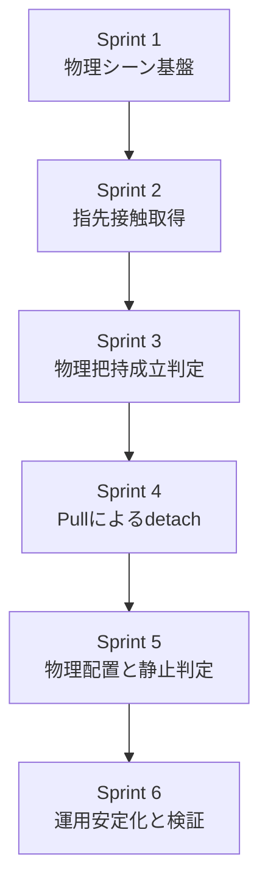

# 目的
現在のトマト収穫 PoC は、Franka の運動自体は Isaac Sim 上で動いているが、トマト把持と搬送はスクリプトによる追従制御で簡略化している。

この計画書では、現状の簡略モデルを以下の物理把持版へ段階的に更新する計画を定義する。

- グリッパとトマトの接触で把持成立を判定できる
- 把持後のトマト移動が手動追従ではなく物理挙動で決まる
- stem / branch / fruit を分離し、pull 動作で breakable joint が破断する
- トレーへの配置も座標テレポートではなく、release 後の落下、接触、静止で完了判定する

# 現状整理
## 現在の実装
- トマトは `UsdGeom.Sphere` と `TranslateOp` で配置している
- 把持判定は接触ではなく、グリッパ閉動作完了後に `attached` 状態へ遷移させている
- `attached` 状態では、毎フレーム hand 座標からトマト座標を再計算して追従させている
- 配置時も、release 後に姿勢安定や接触監視はしていない

## 現在の問題
- 把持力、摩擦、接触点、指先形状の影響を評価できない
- stem を `引いて破断した` のか、単に `移動させた` のかを区別できない
- トレー配置の安定性を物理で検証できない
- 今後の force 閾値設計や失敗ケース評価に繋がらない

# 到達目標
## 必須
1. トマトに collider と rigid body が入り、重力下で落下する
2. Franka 指先に collider が入り、接触が取得できる
3. 把持成立は `接触 + 指開度 + 物体相対運動` から判定できる
4. stem と fruit の間に breakable fixed joint を設定できる
5. pull 動作で joint が破断し、fruit が分離する
6. トレーに release した後、静止判定で完了できる

## 今回の計画の非対象
- 視覚認識アルゴリズムの高度化
- MoveIt2 による本格軌道最適化
- 複数果実、複数枝、葉干渉の本格モデル
- 弾性体や FEM ベースの果実変形

# 基本方針
## 1. いきなり全部を物理化しない
- 最初は `fruit 単体の物理把持`
- 次に `stem break`
- 最後に `tray placement`
の順で進める。

## 2. 接触成立と成功判定を分ける
- `接触した` だけでは把持成功にしない
- `持ち上げても落ちない`
- `pull 動作で branch 側から分離できる`
- `release 後に tray 上で静止する`
までを段階ごとに判定する。

## 3. reset の決定性を維持する
- 物理化すると再現性が崩れやすい
- 各スプリントで `Reset` 後に初期状態へ確実に戻ることを完了条件へ入れる

# 実装対象
## Scene / Asset
- fruit rigid body
- fruit collider
- stem collider
- branch collider
- tray collider
- physics material
- breakable fixed joint

## Runtime / Control
- contact monitor
- grasp state machine
- gripper close policy
- pull motion policy
- release and settle monitor
- deterministic reset

## Debug / Verification
- contact 可視化
- joint break 可視化
- grasp success / failure reason のログ
- settle 完了条件のログ

# スプリント計画
## Sprint 1: 物理シーン基盤
- 目的:
  - トマト、トレー、枝を物理計算可能な scene に更新する
- 実装対象:
  - fruit に rigid body, mass, collider を追加
  - tray に collider を追加
  - branch / stem に collider を追加
  - physics material の初期値を定義
  - reset 時に pose と速度を初期化する
- 完了条件:
  - シミュレーション開始時に fruit が重力下で落下する
  - tray 上に fruit を置くと接触して止まる
  - `Reset` で位置と速度が毎回同じ初期値へ戻る
- 備考:
  - この段階ではまだ Franka で把持しない

## Sprint 2: 指先接触の取得
- 目的:
  - Franka 指先とトマトの接触を観測できるようにする
- 実装対象:
  - finger collider の明示設定
  - contact sensor または PhysX contact report の導入
  - left finger / right finger / fruit の接触ログ
  - debug 表示または terminal ログの追加
- 完了条件:
  - 指先が fruit に当たると接触ログが出る
  - 左右指のどちらが接触したか区別できる
  - 接触しない閉動作では false positive を出さない

## Sprint 3: 物理把持成立判定
- 目的:
  - `閉じたから把持` ではなく、接触にもとづいて把持成功を判定する
- 実装対象:
  - grasp state machine の追加
  - 把持成立条件の定義
  - 候補条件:
    - 左右指の両接触
    - 指開度が閾値以下
    - 把持後の相対変位が小さい
  - friction, restitution, mass の一次調整
- 完了条件:
  - 成功時は fruit を持ち上げても落ちない
  - 失敗時は fruit が落下または滑る
  - `grasped / slipped / not_contacted` を terminal で区別できる
- 備考:
  - この段階でも fruit を hand へ手動 attach しない

## Sprint 4: Pull による detach
- 目的:
  - stem / fruit 間の breakable joint を使って、`引いて収穫` を成立させる
- 実装対象:
  - fruit / stem / branch の別階層化
  - fruit-stem 間の fixed joint 追加
  - break force / torque 閾値の設定
  - 上方または手前方向への pull motion
  - break 検出ログ
- 完了条件:
  - 把持前の fruit は stem に固定されている
  - pull 動作で break 条件を超えると fruit が分離する
  - 分離前に勝手に fruit が外れない

## Sprint 5: 物理配置と静止判定
- 目的:
  - トレーへの配置を release 後の物理挙動で完了判定できるようにする
- 実装対象:
  - tray 内 release pose の見直し
  - release 後の速度監視
  - settle 判定
  - 候補条件:
    - 一定時間、線形速度と角速度が閾値以下
    - fruit が tray collider 内にある
  - release 後の手先退避
- 完了条件:
  - release 後に fruit が tray 上で静止する
  - `Complete` は静止判定後にのみ出る
  - tray 外へ落下した場合は failure 扱いにできる

## Sprint 6: 運用安定化と検証
- 目的:
  - 物理把持版を PoC として継続検証できる品質にする
- 実装対象:
  - headless テストシナリオの追加
  - grasp 成功率確認用の複数初期条件
  - parameter table の文書化
  - POC.md, REQUIREMENTS.md, TESTING.md への反映
- 完了条件:
  - headless で少なくとも 1 本の物理把持シナリオが完走する
  - 主要パラメータが文書化される
  - failure case の再現手順が残る

# スプリント間の依存


# 各スプリントの確認コマンド案
## Sprint 1
```bash
/isaac-sim/python.sh scripts/run_poc.py --mode isaac
```
- fruit を初期位置から free fall させる単体確認モードを追加する

## Sprint 2-3
```bash
/isaac-sim/python.sh scripts/run_poc.py --mode isaac --physics-grasp-debug
```
- contact 状態と grasp 判定理由を terminal に出す

## Sprint 4-5
```bash
/isaac-sim/python.sh scripts/run_poc.py --mode isaac --physics-harvest
```
- detach と tray placement まで通す

## Sprint 6
```bash
/isaac-sim/python.sh scripts/run_poc.py --mode isaac --headless --test --physics-harvest
```

# 主な設計論点
## 1. 接触検出の実装方式
- 候補 A:
  - contact sensor を prim に付ける
- 候補 B:
  - PhysX contact report API を使う
- 現時点の推奨:
  - PoC ではログ取得が容易な方式を優先する
  - 精度より、左右指と fruit の接触を追えることを優先する

## 2. 把持成功判定
- 単純な接触だけでは把持成功とみなさない
- 必要な判定軸:
  - 両指接触
  - 指開度
  - 持ち上げ時の相対変位
  - 一定時間の保持継続

## 3. break 閾値の初期値
- 閾値は asset の mass, collider shape, friction に大きく依存する
- したがって固定値を先に決め打ちせず、
  - `break しない`
  - `簡単に break しすぎる`
  - `把持前に外れる`
の 3 状態を切り分けられるようログを入れて調整する

# リスク
- finger collider が実メッシュと合わず、見た目と接触位置がずれる
- fruit の質量や摩擦が不適切で、把持より先に滑落する
- break 閾値調整に時間がかかる
- reset 時に速度や joint state が残留して再現性が落ちる
- headless と GUI で物理安定性が変わる

# 先に決めるべきパラメータ
- fruit mass
- fruit collider shape
- finger friction
- tray friction
- break force
- break torque
- settle 速度閾値
- settle 継続時間

# この計画の出口
この計画の完了時点では、PoC は次の状態になる。

1. トマトは接触なしでは持ち上がらない
2. 把持に失敗すると落下する
3. 成功した場合だけ pull により収穫できる
4. 配置後は tray 上で物理的に静止する
5. 成功と失敗を terminal ログで切り分けられる
