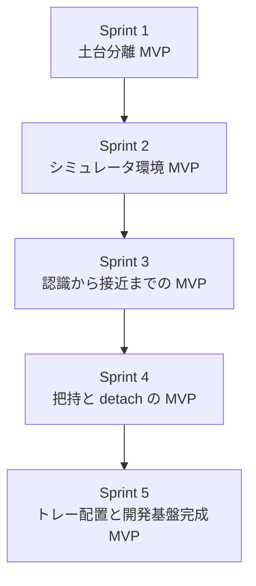

# 目的
この計画書は、`ADR.md` の `Option 2: Simulator Runtime と ROS 2 Robot Runtime の分離型` を実装するための、最終実装計画を定義するものである。

今回はウォーターフォールではなく、アジャイルに進める。  
5 スプリントに分け、各スプリントの終わりにレビューを行い、その結果を受けて次スプリントの方針を微修正する。

また、各スプリントでは `MVP として何を見せるか` を明確にし、毎回「使って判断できる成果物」を残す。

# 前提
- 正本は `USERS_GUIDE.md` と `ADR.md`
- 新規実装は `poc_code/` を直接流用しない
- 旧 PoC は参照用アーカイブとしてのみ扱う
- 物理シミュレータは `Isaac Sim`
- ロボットソフトは `ROS 2`
- シミュレータ環境とロボットソフトは完全に分離する
- それぞれ独立してアップデート可能にする

# 実装対象の全体像
## シミュレータ側
- Isaac 3DView Control UI
- Isaac Scene Runtime
- Physics / Asset Authoring
- ROS 2 Bridge Adapter

## ロボットソフト側
- Harvest Task Supervisor
- Perception / Target Estimation
- Planner Plugin
  - MoveIt2
  - OpenVLA などを差し替え可能にする
- Robot Command Publisher

# 開発方針
## 1. 毎スプリントで動くものを見せる
- 設計だけで終わらせない
- 毎回 `起動して見せられるもの` を成果物にする

## 2. 先に責務分離を確定する
- PoC のような密結合を避ける
- 初期から `simulator side` と `robot software side` を分ける

## 3. 最初の MVP は「分離構造で Start / Stop / Reset が回ること」
- 最初から本格把持成功率を追わない
- まずは `分離された構造でシナリオを回せる` ことを優先する

## 4. スプリントレビューで調整する項目を固定する
- 物理モデル
- ROS 2 interface
- planner 差し替え方式
- reset と状態同期

## 5. 各スプリントで実装仕様書を更新する
- 実装だけでなく、現時点のソフトウェア構造を説明できる状態を毎スプリントで残す
- 実装仕様書は、スプリントレビューの正式成果物の 1 つとする
- 実装仕様書はスプリントごとに更新し、最新のコード構造と整合させる

# 実装仕様書の扱い
## 作成対象
- `docs/` 配下に、実装仕様書を 1 つ作成して継続更新する
- 想定ファイル名:
  - `IMPLEMENTATION_SPEC.md`

## 実装仕様書に必ず記載する内容
1. フォルダ構成
2. 各コードの役割
3. 関数レベルの処理フロー

## フォルダ構成に書くこと
- simulator side と robot software side のトップレベル構成
- 各ディレクトリの責務
- テスト、スクリプト、設定ファイルの位置づけ

## 各コードの役割に書くこと
- 各ファイルの責務
- 主なクラス、モジュール、ノードの責務
- 他モジュールとの依存関係

## 関数レベルの処理フローに書くこと
- 主要ユースケースの入口関数
- 入口から終了までの呼び出し順
- 分岐条件
- simulator side と robot side のやり取り点
- ROS 2 topic / service / action の利用箇所

## スプリントレビュー時に確認すること
- 実装仕様書が最新コードと一致しているか
- 新しく追加したモジュールの責務が曖昧でないか
- 関数レベルのフローが複雑化しすぎていないか
- 次スプリントで分割すべき責務が見えているか

# 5 スプリント計画
## Sprint 1: 土台分離 MVP
- 目的:
  - `Isaac Sim 側` と `ROS 2 側` を分離した最小構成を新規に立ち上げる
- 実装対象:
  - 新規ディレクトリ構成
  - simulator runtime の最小起動
  - robot software runtime の最小起動
  - 両者の最小 ROS 2 interface
  - `Start / Stop / Reset` の最小 control contract
- MVP:
  - 3DView 上の `Start / Stop / Reset` が、新しい分離構成で動く
  - robot software 側が simulator 側と通信できる
- スプリント成果物として見せるもの:
  - 新規コードベースでの起動デモ
  - `Start` で robot runtime が開始される様子
  - `Stop` と `Reset` が simulator / robot の両方へ反映される様子
  - 初版の実装仕様書
- 完了条件:
  - `poc_code/` を使わずに新規 runtime が起動する
  - simulator side と robot side が別責務として見える
  - reset 後に初期状態へ戻れる
  - 実装仕様書に初期フォルダ構成と主要ファイル責務が書かれている
- レビューで確認すること:
  - 分離境界は理解しやすいか
  - control contract はこのままでよいか
  - 状態同期に不足がないか
- レビュー後に微修正しうる項目:
  - 起動方法
  - control interface の粒度
  - runtime の責務分担

## Sprint 2: シミュレータ環境 MVP
- 目的:
  - simulator side 単体で、利用者が見たい環境を成立させる
- 実装対象:
  - Franka Panda
  - camera
  - tomato / branch / tray scene
  - fixed camera / hand camera の切替
  - トマト 1 個が枝についた初期状態
  - simulator side 単独の reset
- MVP:
  - robot software を高度化しなくても、3DView 上で `Start 前の初期環境` が安定して見える
- スプリント成果物として見せるもの:
  - 3DView での scene デモ
  - トマトが開始前に落下しないこと
  - `Reset` で毎回初期状態へ戻ること
  - fixed / hand camera の切替
  - 更新された実装仕様書
- 完了条件:
  - simulator side だけで scene の再現責務を果たせる
  - ロボットソフトなしでも環境デバッグができる
  - reset の決定性がある
  - 実装仕様書に simulator side のフォルダ構成、ファイル責務、主要関数フローが追記されている
- レビューで確認すること:
  - 利用者が見たい scene として十分か
  - camera 配置は妥当か
  - reset と初期姿勢の理解しやすさは十分か
- レビュー後に微修正しうる項目:
  - scene レイアウト
  - camera pose
  - 物理初期パラメータ

## Sprint 3: 認識から接近までの MVP
- 目的:
  - robot software side が camera 情報を使って target を認識し、接近まで進める
- 実装対象:
  - image / joint_states / tf の ROS 2 bridge
  - target estimation
  - Harvest Task Supervisor の状態遷移
  - planner plugin の最初の実装
    - まずは MoveIt2 ベースを優先
  - pre-grasp までの command publish
- MVP:
  - `Start` を押すと、robot software side が target を認識し、pre-grasp 位置まで到達する
- スプリント成果物として見せるもの:
  - terminal に target 認識結果が出ること
  - robot software side の状態遷移ログ
  - MoveIt2 を使った pre-grasp 到達デモ
  - 更新された実装仕様書
- 完了条件:
  - simulator side の image / tf を robot side が利用できる
  - robot side が target pose を持てる
  - pre-grasp までの計画と移動が成立する
  - 実装仕様書に robot software side の責務と、認識から接近までの関数フローが記載されている
- レビューで確認すること:
  - ROS 2 interface の項目は足りているか
  - perception と planning の境界は妥当か
  - MoveIt2 plugin の責務分離は維持できているか
- レビュー後に微修正しうる項目:
  - topic / service / action の設計
  - target pose の表現
  - planner plugin interface

## Sprint 4: 把持と detach の MVP
- 目的:
  - 一定把持条件でのみ枝から外れる本番寄りの収穫動作を成立させる
- 実装対象:
  - grasp 実行
  - finger contact 判定
  - fruit / stem / branch の物理モデル改善
  - detach 判定
  - 把持失敗時の重力落下
- MVP:
  - 正しく把持したときだけ、トマトが枝から外れる
  - 正しく把持できないときは落下する
- スプリント成果物として見せるもの:
  - 成功ケースの収穫デモ
  - 失敗ケースの落下デモ
  - 把持成功 / 失敗理由のログ
  - 更新された実装仕様書
- 完了条件:
  - 把持成功と失敗が見分けられる
  - `fruit-stem` の挙動が simulator side の責務として整理されている
  - robot side は把持戦略と planner に集中できる
  - 実装仕様書に把持、detach、失敗時落下の処理フローが追記されている
- レビューで確認すること:
  - 物理モデルは十分に本番へ近づいているか
  - MoveIt2 ベースで把持位置調整を続けるべきか
  - 学習ベースロジックの差し込み点は自然か
- レビュー後に微修正しうる項目:
  - 物理パラメータ
  - grasp 条件
  - planner 側の approach / grasp pose interface

## Sprint 5: トレー配置と開発基盤完成 MVP
- 目的:
  - 収穫シナリオ全体を end-to-end で回し、今後のロジック開発基盤として完成させる
- 実装対象:
  - 搬送とトレー配置
  - 静止判定
  - `Reset` 後の完全再試行
  - planner plugin 差し替え点の明文化
  - 運用ドキュメントと開発手順の整理
- MVP:
  - `Start` で認識、接近、把持、detach、搬送、配置まで 1 シナリオが完走する
  - `Reset` で繰り返し試行できる
  - 今後 `MoveIt2` と `OpenVLA` を差し替えて検証できる開発基盤になる
- スプリント成果物として見せるもの:
  - end-to-end デモ
  - `Reset` を挟んだ連続試行デモ
  - planner plugin 差し替え前提の構造説明
  - 最終更新された実装仕様書
- 完了条件:
  - 最新 `USERS_GUIDE.md` の利用者体験を満たす
  - simulator side と robot side の独立更新が可能な構成になる
  - 次フェーズで収穫ロジック改善を進められる
  - 実装仕様書に end-to-end 全体フローと主要モジュールの責務が整理されている
- レビューで確認すること:
  - MVP として十分か
  - 次に作るべき `REQUIREMENTS.md` と `ARCHITECTURE.md` の論点は何か
  - OpenVLA 連携をどのスコープで入れるか
- レビュー後に微修正しうる項目:
  - plugin interface の追加
  - デバッグログ
  - 運用手順

# スプリント間の依存

# 各スプリントのレビュー観点
## 共通
- 今回の成果物は、利用者が実際に触って価値判断できるか
- simulator side と robot side の責務は崩れていないか
- 次スプリントへ進む前に、設計変更が必要な論点は何か

## スプリントごとに必ず残すもの
- デモ手順
- 確認コマンド
- 成功条件
- 失敗時に観測した課題
- 次スプリントへ持ち越す論点
- 更新済みの実装仕様書

# スプリントレビューで方針を微修正するルール
## 修正してよいもの
- interface の細部
- topic / service / action の選択
- planner plugin の内部構造
- 物理パラメータ
- scene 構成の細部

## 修正してはいけないもの
- `Isaac Sim` と `ROS 2` を分離する方針
- simulator side と robot side を独立更新可能にする方針
- `poc_code/` を直接流用しない方針
- 3DView 上で `Start / Stop / Reset` を行う方針

# この計画の出口
この 5 スプリントが完了した時点で、少なくとも次が成立している状態を出口とする。

1. `USERS_GUIDE.md` に記載した利用者体験を、新規実装で再現できる
2. simulator side と robot side が明確に分離されている
3. `MoveIt2` ベースの収穫ロジックを試せる
4. 将来 `OpenVLA` などを差し替える拡張点が残っている
5. 次に `REQUIREMENTS.md` と `ARCHITECTURE.md` を正式化できるだけの実装知見が揃っている
