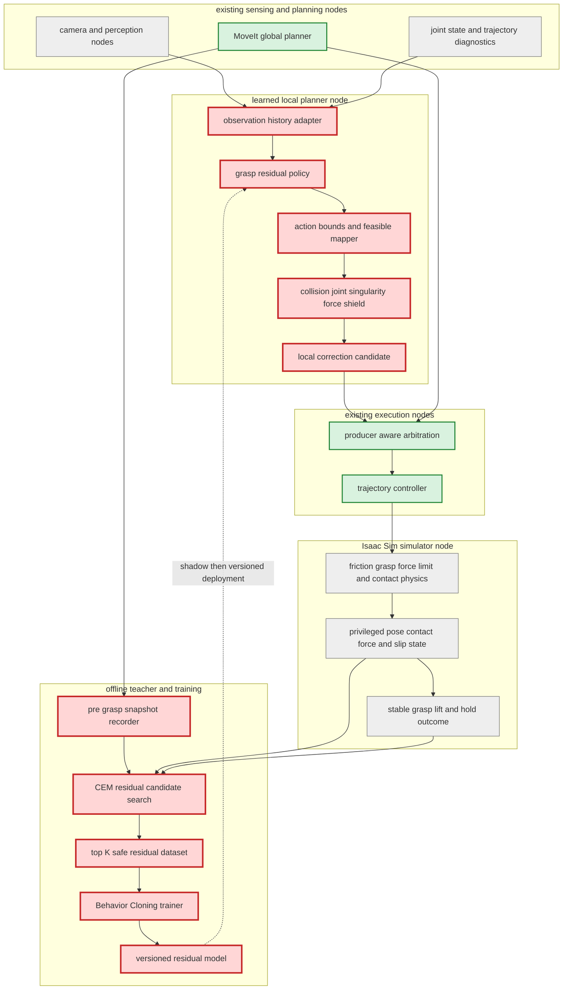
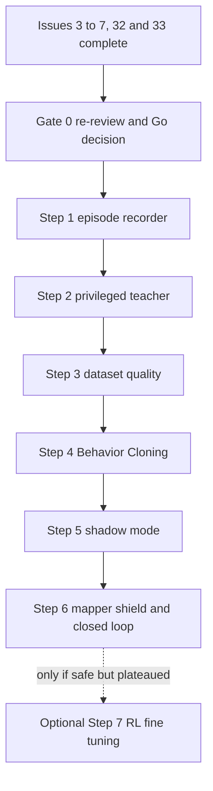

# ADR: 物理把持向けLearned Grasp Residual Policy PoC

## Status

Proposed — **Issue #3〜#7、#32、#33の完了後に再レビューし、Acceptedへ変更するまで着手しない。**

## 1. 背景

現在のMoveIt経路は、計画上のgrasp trajectoryを完了しても、物理的な両指接触・摩擦保持が成立しない場合がある。Issue #3〜#7では把持力上限、摩擦保持、茎の物理破断、設置判定、physics mode統合を進めるため、人工的なgrasp jointや距離判定に頼らない把持は現在より難しくなる。

Issue #32は軌道abort診断とreturning home復旧、Issue #33はtool-target 6D誤差とfinger contactの診断を追加する。これらが揃うと、「計画は完了したが物理把持できない」状態を観測し、学習データとして説明できる。

本ADRは広範なend-to-end RLやplanner選択学習を対象にしない。最初のPoCを、MoveItが作るnominal graspに小さな補正を加える`learned grasp residual policy`へ限定する。

Nature論文Aceから採用するのは、学習actionを直接モータへ流さず、実行可能領域への写像とhard safety constraintで保護する原則である。卓球固有のevent camera、31.25 Hz、1 kHz trajectory、custom hardwareは採用根拠にしない。

## 2. 目的

`MOVING_TO_GRASP`終盤から`AT_GRASP`までを対象に、観測履歴から次の小さな手先補正を推定し、physics modeの安定把持率を改善できるか検証する。

```text
action = [delta_x, delta_y, delta_z, delta_yaw]
```

PoCで答える問いは一つである。

> 物理化されたIsaac Simから自動生成したteacher dataで学習した局所残差は、MoveIt nominal grasp単独より、未知条件でのstable grasp成功率を安全性非劣化のまま改善するか。

## 3. 非対象

- MoveIt global plannerの置換
- imageからjoint commandまでのend-to-end学習
- `DETACHING`、`MOVING_TO_PLACE`、`RETURNING_HOME`のlearned policy
- policy bank、skill selector、online learning
- 実機deployment
- 最初からSACなどのRLを使うこと
- learned actionを安全検査なしでcontrollerへ送ること

## 4. 着手前提

以下をすべて満たすまで、dataset生成とpolicy実装へ着手しない。

| Issue | 完了によって得る前提 |
|---|---|
| #32 | abort reason、最大joint error、律速joint、returning home復旧が観測可能 |
| #33 | `AT_GRASP`とgrasp evaluation中のtool-target 6D誤差、左右finger contactが観測可能 |
| #3 | finger maxForce、stiffness、dampingが確定し、過大把持力を正解にしない |
| #4 | grasp joint・幾何fallback・teleportなしの摩擦保持が成立 |
| #5 | pullによる物理破断と破断後保持が成立 |
| #6 | release後のPLACED/FALLENが物理観測で判定可能 |
| #7 | physics modeのE2E基準値、最終physics parameter、失敗内訳が確定 |

特に#4はteacher labelの意味を変えるため必須である。人工grasp jointで成功したepisodeを、最終policyの正解データとして使用しない。

## 5. 着手時の再レビューゲート

Issue #3〜#7、#32、#33完了後、実装開始前に本ADRを必ず再レビューする。過去の判断をそのまま実装許可とみなさない。

### 再レビュー入力

1. physics modeで初期姿勢10ケースを各3回以上実行した最新baseline
2. grasp成功／失敗時の6D誤差、左右contact、接触力、滑り、abort診断
3. 確定した摩擦、把持力、破断力、settle閾値
4. 人工メカニズム発動回数が全て0である証拠
5. 学習用に利用可能なGPU時間、storage、Isaac Sim並列数
6. 依存ライブラリ、Isaac Sim、MoveItの対象version

### 再レビュー判断

| 判断 | 条件 |
|---|---|
| Go | 同一観測から補正可能なgrasp missが複数あり、物理成功判定が安定している |
| Redesign | 失敗原因が主にperception欠損、force制御、physics flakeで、残差policyの入力・出力では解けない |
| Stop | heuristicまたはMoveIt調整だけで目標成功率を満たし、学習追加の費用対効果がない |

Goの場合でも、action次元、探索範囲、成功条件、dataset規模は最新結果から再確定し、本ADRのStatusを`Accepted`へ更新する。

## 6. 設計判断ドライバー

- 最も直接的な改善対象を物理把持不成立に限定する。
- 人手ラベルではなく、Isaac Simのprivileged stateと短時間探索で正解候補を自動生成する。
- actorは実行時に取得可能な観測だけを使い、teacherはsimulation真値を使える。
- 多峰な把持解を一つの平均actionへ潰さず、上位K候補とscoreを保存する。
- collision、joint limit、velocity limit、singularity、force limitはrewardでなくhard constraintにする。
- 既存MoveIt、Hybrid Event Router、arbitration、controllerを維持する。
- 最初はBehavior Cloningで因果とデータ品質を確認し、RLは必要な場合だけ追加する。

## 7. 検討した選択肢

### Option A: 手作業でgrasp offsetをチューニング

- 構成: 初期姿勢や誤差範囲ごとに固定offset／ruleを設定する。
- メリット: 実装が最小、説明しやすい、学習基盤不要。
- デメリット: 摩擦、形状、姿勢、contactの組合せが増えるとruleが破綻する。未知条件へ一般化しにくい。
- 主要リスク: test caseへの過学習。
- 単一責務: rule engineを分離すれば良好。
- 依存方向: domain ruleがIsaac APIへ依存しなければ良好。
- 判断: teacherやbaselineとして利用するが、PoCの主案にはしない。

### Option B: Privileged teacher探索 + Behavior Cloning residual policy

- 構成: MoveIt nominal grasp周辺をCEM等で短時間探索し、物理結果から上位Kの安全残差を作る。actorは実行時観測から残差を学習する。
- メリット: 人手ラベル不要。成功条件が物理結果と一致する。学習対象が4次元の小さな補正で、失敗分析しやすい。
- デメリット: teacher探索コストがかかる。simulator biasを学習する。多峰な正解の扱いが必要。
- 主要リスク: 成功判定のflake、dataset leakage、平均化による不正action。
- 単一責務: recorder、teacher、dataset、actor、safety mapperを分離でき良好。
- 依存方向: actorとteacherが共通domain schemaへ依存し、schemaがPyTorch/Isaacへ依存しなければ良好。
- 判断: **推奨案。**

### Option C: Simulation RLを最初から学習

- 構成: SAC等でgrasp residualを探索し、stable grasp rewardを直接最大化する。
- メリット: teacher actionを定義せず、長期結果を最適化できる。Behavior Cloningの上限を超える可能性がある。
- デメリット: reward hacking、学習不安定、計算量、原因切り分けが難しい。物理判定のflakeをpolicyが利用する危険がある。
- 主要リスク: 過大な把持力やsimulation exploitで見かけの成功率を上げる。
- 単一責務: environment/reward/policyを分離すれば成立するが、初期PoCとして複雑。
- 依存方向: reward domainをframework非依存にすれば維持可能。
- 判断: BCが有効だが頭打ちの場合の任意fine-tuningに限定する。

## 8. 選択肢比較

| 観点 | A: 手動rule | B: teacher + BC | C: RL from scratch |
|---|---|---|---|
| 初期実装量 | 小 | 中 | 大 |
| 人手ラベル | 必要 | 不要 | 不要 |
| 物理結果との整合 | 中 | 高 | 高 |
| 未知条件への一般化 | 低 | 中～高 | 中～高 |
| 説明・デバッグ | 高 | 中～高 | 低 |
| reward hacking | なし | 低 | 高 |
| PoCの費用対効果 | 中 | **高** | 低 |

## 9. Decision

Option Bを採用候補とする。Option Aはbaselineとteacher探索の初期中心値に利用する。Option CはPoCの必須工程から外し、BC policyがshadow／closed-loopで安全だが成功率改善が不足する場合のみ、BC weightを初期値としたsimulation fine-tuningとして再検討する。

## 10. 改善対象を示す全体アーキテクチャ

凡例: 赤は本PoCの新規対象、緑は維持する既存経路、灰は前提Issueで整備され本PoCでは変更しない箇所。



## 11. モジュール責務と依存方向

| モジュール | 単一責務 | 依存先 |
|---|---|---|
| `grasp_episode_recorder` | 同期済み観測と結果をepisode化 | domain dataset schema |
| `privileged_teacher` | snapshotから候補を試行しscoreを返す | simulator port、safety constraint |
| `residual_dataset_builder` | 上位K候補、失敗、split、lineageを固定 | domain dataset schema |
| `residual_policy_trainer` | datasetからmodel artifactを生成 | trainer port。ROSに依存しない |
| `learning_state_adapter_node` | 実行時観測の同期、履歴、mask、正規化 | observation contract |
| `learned_local_planner_node` | model inferenceで残差候補を生成 | policy port、local plan contract |
| `feasible_action_mapper` | 残差範囲・速度・連続性を制約 | safety domain policy |
| `safety_shield` | collision、limit、singularity、forceで採否判定 | MoveIt/Isaac adapterは外側 |

dataset schemaとsafety ruleを内側のdomain contractとし、Isaac Sim、ROS 2、PyTorch等はadapter側からcontractへ依存する。arbitrationはmodel形式を知らず、従来のPlanProducer契約だけを見る。

## 12. 正解データ生成

### 12.1 Actor入力とteacher専用情報を分ける

Actorへ渡せる情報:

- joint position／velocityとtracking error履歴
- perceptionが推定したtarget poseとconfidence
- tool-target 6D誤差
- 左右finger contactの観測履歴
- MoveIt nominal grasp／global reference
- phase、timestamp、欠損mask

Teacherだけが使える情報:

- トマトとtoolの真の6D pose
- 正確なcontact point、normal、force
- hand-tomato相対速度と滑り量
- 摩擦、質量、stem force等のphysics parameter
- collision distanceと特異点指標

### 12.2 1サンプルの生成

1. `MOVING_TO_GRASP`終盤の状態をsnapshotする。
2. MoveIt nominal graspを中心に`[delta_x, delta_y, delta_z, delta_yaw]`候補を生成する。
3. 各候補を独立simulation branchで実行する。
4. finger close、0.1 m lift、5秒holdまで短時間rolloutする。
5. hard constraint違反候補をscore計算前に棄却する。
6. stable grasp、滑り、接触力、左右force balance、pose errorからscoreを計算する。
7. 最良1件ではなく上位K件、score、失敗理由、最終状態を保存する。

初期探索はgridよりCEMを推奨するが、着手時レビューで計算量と再現性を比較して決める。

### 12.3 Hard constraint

- self/world collisionなし
- joint position／velocity／acceleration limit内
- singularity hard-stop領域外
- finger force上限内
- observationとsnapshotがstaleでない
- action絶対値と前回action差分が設定範囲内
- grasp joint、幾何fallback、teleport発動0

これらはreward penaltyにせず、違反候補を正解集合へ入れない。

### 12.4 Teacher score

```text
score =
  stable_grasp_success
  + lift_success
  + hold_success
  - tool_target_error
  - left_right_force_imbalance
  - slip_distance
  - excessive_force_margin
```

重みは着手時に最新physics modeで再決定する。最終的なstable grasp／lift／holdを主要項とし、単にpose errorを小さくする候補を正解にしない。

### 12.5 使用禁止データ

- grasp jointで固定した成功
- 幾何fallbackやteleportで復元した成功
- 距離だけでHELD／DETACHED／PLACEDとした結果
- Issue #3〜#7完了前のsuccess modeを最終teacher labelとして使用すること
- 同一episodeの連続frameをtrainとtestへ分割すること

## 13. PoC Step-by-Step計画

### Gate 0: 前提Issue完了後の再レビュー

- Section 4と5を確認する。
- physics mode 10初期姿勢×3反復以上を再計測する。
- grasp missが残差actionで解ける問題かを判定する。
- action範囲、K、score、baseline、合格値を更新する。
- 成果物: 更新済みADR、Go／Redesign／Stop判断。

### Step 1: Episode recorder

- Issue #33診断をactor観測とprivileged真値へ分離して記録する。
- pre-grasp snapshotを同じphysics stateから再開できる形式で保存する。
- model/data version、random seed、physics parameterを記録する。
- 合格条件: 同じsnapshotとseedでteacher評価を再現できる。

### Step 2: Privileged teacher探索

- まず失敗が再現する固定ケースで候補残差を探索する。
- success、片指接触、滑落、過大力、collisionを全て保存する。
- 上位K候補が独立再実行でもstable graspを維持するか確認する。
- 合格条件: nominal grasp失敗snapshotの一部で、安全な成功残差を発見できる。発見できなければ学習へ進まない。

### Step 3: Dataset構築と品質検査

- 初期姿勢だけでなくtarget pose、摩擦、質量、camera noise、controller delayを変化させる。
- train／validation／testをepisodeとphysics condition単位で分割する。
- test setとIssue #28固定ケースはteacher探索の調整へ使わない。
- 合格条件: leakageなし、成功／失敗／hard negativeが含まれ、dataset lineageを再生成できる。

### Step 4: Behavior Cloningとoffline評価

- actorは4D residualとconfidenceを出す。
- 多峰性が強ければ単純MSEを避け、候補分布または上位K rankingを検討する。
- unseen conditionでteacher成功候補との距離、action違反、calibration、inference p99を測る。
- 合格条件: heuristic residualを上回り、hard bound違反0、latency budget内。

### Step 5: Shadow mode

- 既存MoveItだけを実行し、policyは同じ観測から候補を出すがcontrollerへ送らない。
- teacher counterfactualまたはepisode後再生で、policy候補とnominalを比較する。
- OOD、低confidence、欠損観測では明示的にno-opを出す。
- 合格条件: nominalより予測stable grasp率が改善し、安全棄却率とno-op理由を説明できる。

### Step 6: Feasible mapper／safety shield付きclosed-loop

- action rangeをGate 0で決めた小範囲へ固定する。
- shield通過候補だけをlocal PlanProducerとしてarbitrationへ送る。
- 最初は失敗再現ケース限定、次に10初期姿勢、最後にdomain randomizationへ広げる。
- 合格条件: MoveIt-only baselineよりstable grasp率が改善し、collision、過大力、abortを悪化させない。改善しなければrollbackする。

### Optional Step 7: BC初期値からsimulation RL fine-tuning

- Step 6で安全だが成功率が頭打ちの場合だけ実施する。
- criticはprivileged state、actorはnoisy observation historyを使う。
- hard constraintとshieldは学習中・評価中とも外さない。
- stable grasp／lift／holdをterminal rewardにし、contact forceや滑りを補助項にする。
- RL from scratchとは比較するが、既定案にしない。

## 14. Step接続



## 15. 評価設計

### Primary metric

- physics modeのstable grasp成功率

### Secondary metrics

- 0.1 m lift成功率
- 5秒hold成功率と最大相対変位
- 左右contact成立率とforce imbalance
- tool-target position／orientation error
- collision、joint limit、singularity、force shield違反
- trajectory abort、replan、cancel
- inference／mapper／shield latency p50、p95、p99
- no-op、rejected action、fallback理由

### 比較群

1. MoveIt nominal graspのみ
2. 手動rule offset
3. learned residual shadow／closed-loop
4. Optional RL fine-tuned residual

固定caseだけでなくhold-out physics conditionと未使用初期姿勢で比較する。平均だけでなくworst case、seed間分散、95% confidence intervalを残す。

## 16. PoC成功・中止条件

### 成功

- teacherがnominal失敗snapshotに安全な成功残差を生成できる。
- learned residualがhold-outで手動ruleとnominalを上回る。
- closed-loopでstable grasp成功率がGate 0で定めた最小改善幅を超える。
- collision、過大力、limit違反が増えない。
- OOD／欠損時にno-opまたは既存MoveItへ戻れる。

### 中止または再設計

- teacher探索でも安全な成功残差が見つからない。
- 失敗の主因がperception欠損、finger hardware、physics instabilityである。
- trainでは改善するがhold-out physics conditionで改善しない。
- safety shieldが大半のactionを棄却し、実効的な補正ができない。
- MoveIt／heuristic調整だけで同等以上の改善を達成する。

## 17. Consequences

### Positive

- 改善対象とaction空間が小さく、Issue #33の診断から直接datasetへ接続できる。
- 人手ラベルを必要とせず、物理結果をteacherにできる。
- MoveIt global planと既存arbitrationを維持できる。
- BCから始めるため、RL固有の不安定性をPoC初期から背負わない。
- 各Stepで価値がなければ早期中止できる。

### Negative

- snapshot分岐と多数の短時間physics rolloutが必要になる。
- simulatorのcontact fidelityやflakeがteacher labelへ混入する。
- 4D residualで解けない失敗には効果がない。
- physics parameter変更時にdataset再生成が必要になる可能性がある。

## 18. Follow-up

現時点では新しい実装Issueを作らない。Issue #3〜#7、#32、#33の完了後にGate 0レビューを実施し、Goの場合だけ次をIssue化する。

1. Episode recorderとsnapshot再開
2. Privileged teacher/CEM探索
3. Dataset builderとsplit検証
4. Behavior Cloningとshadow evaluation
5. Feasible mapper／safety shield付きclosed-loop PoC

## 19. 参照

- Nature, `Outplaying elite table tennis players with an autonomous robot`: https://www.nature.com/articles/s41586-026-10338-5
- MoveIt Hybrid Planning: https://moveit.picknik.ai/main/doc/concepts/hybrid_planning/hybrid_planning.html
- MoveIt Servo: https://moveit.picknik.ai/main/doc/examples/realtime_servo/realtime_servo_tutorial.html
- Issue #3〜#7: physics grasp、friction hold、stem break、settle、integration
- Issue #32: returning home recoveryとabort diagnostics
- Issue #33: grasp 6D errorとfinger contact diagnostics
