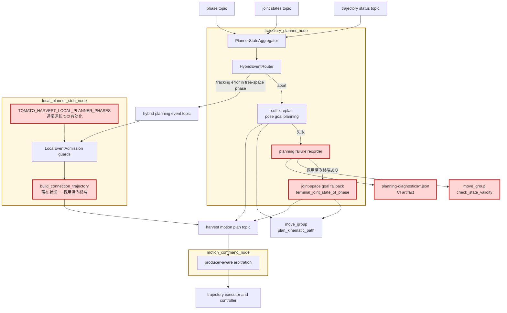

# Issue #28 初期姿勢10ケースE2E CIレポート

## 目的

初期関節姿勢による把持成否のばらつきを、同じ10姿勢で継続測定する。プラン生成だけでなく、Isaac Sim上で把持・detach・placeを経て`complete`へ到達した場合だけ成功とする。

## 初期姿勢

関節順はpanda_joint1からpanda_joint7、単位はradである。

| ID | 関節角 | 狙い |
|---|---|---|
| default | 0,-0.4,0,-2.1,0,1.7,0.8 | 標準 |
| elbow_left | 0.35,-0.55,-0.25,-2.0,0.20,1.55,0.55 | 左肘 |
| elbow_right | -0.35,-0.55,0.25,-2.0,-0.20,1.55,1.05 | 右肘 |
| shoulder_high | 0.10,0.15,-0.15,-1.65,0.10,1.85,0.70 | 高い肩 |
| shoulder_low | -0.10,-0.85,0.15,-2.35,-0.10,1.45,0.90 | 低い肩 |
| wrist_left | 0.15,-0.45,-0.10,-2.05,0.65,1.65,0.25 | 左手首 |
| wrist_right | -0.15,-0.45,0.10,-2.05,-0.65,1.65,1.35 | 右手首 |
| folded_near | 0,-0.15,0,-2.65,0,2.45,0.8 | 折畳み |
| extended_far | 0.20,-0.25,-0.15,-1.05,0.10,0.75,0.50 | 伸展 |
| near_singularity_extended | 0,-0.05,0,-0.10,0,0.15,0 | **伸展特異姿勢近傍** |

全ケースは固定値で、7軸・有限値・Panda関節制限内をunit testで検証する。自己衝突と実到達性はMoveIt/Isaac E2Eの結果として記録する。特異姿勢ケースは成功を前提に除外せず、同じ成功率の分母へ含める。

## 成功判定と許容誤差

MoveItのgrasp pose constraintは位置`0.01 m`、各軸姿勢`0.10 rad`を用いる。API成功だけでは合格にせず、実行後に`AT_GRASP`を経てstable graspが成立し、最終的に`returning_home -> complete`となり、途中にfailed phaseがないことを要求する。suffix replanの有無は成功条件に含めない。

## CI設計と履歴

通常PR CIを10倍にしないため、専用workflowをmain push、週次、手動で実行する。10件はGPU競合を避けて直列実行し、1件失敗しても残りを続行する。各caseのrobot/controller/MoveIt/Isaacログ、JSON集計、Markdown集計をartifact `initial-pose-history-<sha>-<run-id>`として90日保存し、Job Summaryにも表示する。commit SHA付きJSONにより複数commitを比較できる。

初期閾値は成功率`70%`（7/10）とする。根拠は、標準を含む通常9姿勢の大半を守りながら、特異姿勢を含む最大3件の既知弱点をまず計測可能にするためである。ベースラインが3回蓄積した後、flakeを確認して閾値を引き上げる。

## 実行方法

全件:

```bash
CI_HEADLESS_STEPS=3600 bash scripts/ci/run_initial_pose_matrix.sh
```

単一ケース:

```bash
INITIAL_POSE_CASE_IDS=near_singularity_extended CI_HEADLESS_STEPS=3600 bash scripts/ci/run_initial_pose_matrix.sh
```

結果は`.artifacts/initial-pose-e2e/initial-pose-summary.md`とJSONに出力される。

## 10ケース実測結果

実行日: 2026-07-12。`CI_HEADLESS_STEPS=3600`、外乱注入なし、同一GPU runnerで10件を直列実行した。成功は`7/10`、成功率は`70%`で、暫定CI閾値をちょうど満たした。

| Case | 結果 | 初期planning [ms] | E2E [s] | 最終状態・注記 |
|---|---|---:|---:|---|
| default | PASS | 291.709 | 114 | complete |
| elbow_left | FAIL | 310.003 | 147 | moving_to_placeで停止、abort 6回 |
| elbow_right | PASS | 379.690 | 109 | complete |
| shoulder_high | FAIL | 319.735 | 81 | grasp_evaluation timeout |
| shoulder_low | PASS | 317.666 | 96 | complete |
| wrist_left | PASS | 309.442 | 99 | complete |
| wrist_right | PASS | 302.258 | 134 | full replan 1回後にcomplete |
| folded_near | PASS | 359.391 | 122 | complete |
| extended_far | FAIL | 1359.723 | 126 | moving_to_placeで停止、suffix replan失敗 |
| near_singularity_extended | PASS | 350.638 | 111 | complete |

初期planningは全ケースで最終的な`HarvestMotionPlan`生成に成功した。しかし3件は実行・把持・復旧の後段で失敗しており、「plan API成功率」と「E2E収穫成功率」が一致しないことを確認した。

## 失敗ケースの原因分析

### elbow_left: 追従abortと再計画の反復でplaceが完了しない

確認済みの事実:

- 初期planningは`310.003 ms`で成功した。
- `moving_to_pregrasp`で1回、`moving_to_grasp`で2回、`moving_to_place`で3回、合計6回trajectory abortが発生した。
- 6回のabortはいずれもglobal plannerへ配送された。suffix replan自体は全件成功し、新しいplan revisionも採用された。
- 把持とdetachは成功し、最終的には`moving_to_place`に留まったまま3600 stepsを消化した。
- place再計画の最大trajectory差分は順に`0.525`、`0.170`、`0.211 rad`で、同一目標に対して異なる軌道へ繰り返し置換されている。

分析:

planning不能が原因ではなく、左肘初期構成からの軌道をcontrollerが許容時間・追従誤差内で完了できず、abort→現在状態からsuffix replan→再abortを繰り返したことが直接原因である。再計画は毎回成立するため、問題の主座はOMPLの解探索よりも、選ばれた関節経路の実行可能性、time parameterization、またはabort後の開始状態とcontroller goalの整合にあると推定する。ログだけでは各abortの最大joint tracking errorが残っていないため、どの関節が律速かは未確定である。

### shoulder_high: grasp poseへ到達扱いになったが物理把持が成立しない

確認済みの事実:

- 初期planningは`319.735 ms`で成功し、abortなしで`moving_to_pregrasp → moving_to_grasp → at_grasp`へ進んだ。
- `AT_GRASP`後、約3.43秒で`GRASP_EVALUATION timeout`となり`failed`へ遷移した。
- trajectory abortやsuffix replanは発生していない。

分析:

planner/controller上はgrasp trajectory完了と判定された一方、Isaac Simのstable grasp条件は成立しなかった。したがって直接原因は「計画失敗」ではなく、最終手先pose・指とトマトの相対位置・接触状態のいずれかが物理把持許容範囲を外れたことである。現ログにはgrasp評価時のCartesian position/orientation errorとfinger contact点がないため、位置誤差と姿勢誤差のどちらが支配的かは断定できない。次の診断では`AT_GRASP`時のtool-target 6D誤差と左右finger contactをartifactへ追加する必要がある。

### extended_far: place軌道abort後に有効なgoal stateを再生成できない

確認済みの事実:

- 初期planningは10件中最長の`1359.723 ms`だった。内部では一部planning requestが`error_code=99999`となったが、最終planは生成された。
- pregrasp、grasp、stable grasp、detachまでは成功した。
- `moving_to_place`進入直後を含め2回abortし、2回目のabortからglobal suffix replanを起動した。
- place suffix replanは3回試行してすべて`error_code=99999`となり、`3052.123 ms`後に失敗した。
- MoveItログは`Unable to sample any valid states for goal tree`および`Unable to solve the planning problem`を記録した。

分析:

直接原因は、place実行中の現在関節状態からplace goal constraintを満たす有効状態をOMPLが生成できず、復旧planが得られなかったことである。伸展初期姿勢そのものからgraspまでは到達しているため、単純な初期姿勢の到達不能ではない。伸展構成から選ばれたIK枝とdetach後の現在状態の組合せが、collisionまたはgoal constraintの有効領域を狭めた可能性が高い。さらに全ケース共通でplanning scene monitorにhand camera frameのTF extrapolation warningがあり、scene更新の信頼性も副次要因になり得るが、このwarningは成功ケースにもあるため単独原因とは判断しない。

## 特異姿勢ケースの再現性

`near_singularity_extended`は今回の10件runでは`350.638 ms`でplanningし、全phaseを完走した。一方、直前の単独runではplanning`340.301 ms`、`AT_GRASP`到達後に`grasp_evaluation`で失敗した。固定関節角でも結果が一致しないため、このケースには物理接触またはplanner乱数に起因するflakeがある。特異姿勢対応を「成功」と結論付けず、週次履歴で複数回の成功率を蓄積する必要がある。

## 結論と次の診断項目

初回ベースラインは70%で閾値を満たしたが、余裕はない。失敗は、(1) trajectory追従abortの反復、(2) trajectory完了後の物理把持不成立、(3) abort後のOMPL goal sampling失敗、の3種類に分かれた。改善Issueでは次を優先する。

1. trajectory statusへ最大joint error、律速joint、abort reasonを追加する。
2. grasp evaluationへtool-target位置・姿勢誤差とfinger contactを追加する。
3. place suffix planning失敗時にstart state validity、goal sample failure、collision contactを保存する。
4. 各ケースを最低3回実行し、固定姿勢でも残るflakeと恒常失敗を分離する。

## 安定化改善の実装 (2026-07-12)

ベースライン計測で判明した失敗3種のうち、planningと復旧に起因する2種へ対策を実装した。物理把持不成立 (shoulder_high型) は接触評価の計測拡充が先であり、本改善のスコープ外とする。

| 改善 | 対象の失敗モード | 内容 |
|---|---|---|
| 改善1: planning失敗診断の保存 | extended_far型の原因確定 | 失敗時にstart state有効性・衝突ペア・error_code・goal種別をJSONで保存 |
| 改善2: 関節空間goal fallback | extended_far型 (goal sampling失敗) | pose goal失敗時、採用済みplan終端の既知構成へ関節空間goalで再計画 |
| 改善3: local planner実体化 | elbow_left型 (追従abort反復) | tracking errorイベントで現在状態から採用済みplan終端への接続軌道を生成 |

### 改善1: planning失敗時の証跡保存

suffix replanが`error_code=99999`で失敗しても、従来はerror_codeとMoveItの汎用ログしか残らず、「goal側のIKサンプル全滅」と「start state不正」を区別できなかった。新規モジュール`planning_diagnostics.py`が、失敗1回につき1つのJSONを保存する。

- 記録内容: 失敗phase、goal種別 (`pose`/`joint`)、失敗分類 (`motion_plan_error`/`service_timeout`/`noop_trajectory`等)、error_code、目標位置、start関節状態、そして`/check_state_validity` serviceへ問い合わせたstart stateの有効性と衝突bodyペア。
- 有効化は環境変数`TOMATO_HARVEST_PLANNING_DIAGNOSTIC_DIR`。CI E2Eではコンテナ内artifactディレクトリ`planning-diagnostics/`へ自動保存し、既存のartifact uploadに含まれる。
- 診断保存の失敗はplanner本体へ伝播させない。ディレクトリ未設定時はservice問い合わせ自体を行わず、レイテンシへ影響しない。

これによりベースラインの診断項目3が実装され、`Unable to sample any valid states for goal tree`発生時に「goal IK解が付随トマトとトレイの衝突で全滅していたのか」をartifactから直接確認できる。

### 改善2: 関節空間goal fallback

extended_farの直接原因は、place実行中のabort後にpose constraint (位置0.01 m球 + 各軸0.10 rad) を満たす有効goal状態をOMPLがサンプリングできなかったことである。しかしabortした時点で、実行していたtrajectoryの終端は一度planningと衝突チェックを通過した既知の有効構成として手元にある。

suffix replanのpose goal計画が失敗した場合、`terminal_joint_state_of_phase()`で採用済みplanの終端関節構成を取り出し、`JointConstraint` (許容0.01 rad) をgoalとする再計画を1回行う。goal構成が確定しているためgoal state sampling (IK) を経由せず、99999の主因であるgoal tree構築失敗を回避する。

- 対象は`moving_to_pregrasp`、`moving_to_grasp`、`moving_to_place`のsuffix replan。フルチェーン初期計画は事前trajectoryが無いため対象外。
- placeはpre_place waypoint経由の連鎖が失敗した場合、waypointを諦めて現在状態から終端構成へ直行する1区間だけを計画し、`reason="joint_goal_fallback"`として採用する。
- 終端構成を変えないため、把持直前のgoalが別IK解へ差し替わる副作用がない。
- fallback成否は`joint_goal_fallback succeeded/failed`としてログへ残り、失敗時は改善1の診断 (goal_kind=`joint`) も保存される。

### 改善3: local plannerの実体化

Step 5で置いたlocal planner stubは、global planの当該phase軌道をコピーして静止点を足すだけで、docstringに書かれた「現在状態から終端へ接続し直す」動作を実装していなかった。また起動も外乱注入E2E専用の環境変数に結合しており、通常のE2E計測では動いていなかった。

- `build_connection_trajectory()`が、現在関節状態から採用済みplan終端構成への線形補間joint-space軌道を生成する。所要時間は最大関節差分を制限速度0.5 rad/sで割った値 (下限0.5 s) とし、終端速度ゼロと1秒の静止点で締める。
- tracking errorイベント (閾値0.10 rad、abortより前に発火) を受けた時点で、経路から外れた腕を検証済み終端へ滑らかに戻す。elbow_left型の「追従誤差→abort→global replan→再abort」ループへ、abort前の低コストな復旧手段を挿入する。
- 有効化を外乱注入用`TOMATO_HARVEST_INJECT_LOCAL_PLAN_PHASES` (CIアサーション付き) から分離し、通常運転用`TOMATO_HARVEST_LOCAL_PLANNER_PHASES`を新設した。初期姿勢マトリクスCIは自由空間3 phaseで有効化して実行する (`INITIAL_POSE_LOCAL_PLANNER_PHASES=""`で従来条件の計測へ戻せる)。

### 変更後の全体アーキテクチャ

凡例: 赤は今回変更、緑は既存利用、灰は変更範囲外。

```mermaid
flowchart LR
  Camera[Camera nodes] --> Perception[perception node]
  Perception --> Behavior[behavior planner node]
  Simulator[Isaac Sim node] --> State[joint state / scene]
  Behavior --> Manager[trajectory planner node<br/>event manager]
  State --> Manager
  Manager --> Global[global planner<br/>MoveIt bridge<br/>+ joint-goal fallback]
  Global --> Diag[planning failure<br/>diagnostics JSON]
  Manager --> Event[hybrid planning event]
  Event --> Local[local planner node<br/>connection trajectory]
  Global --> Arbitration[motion command node<br/>arbitration]
  Local --> Arbitration
  Arbitration --> Executor[trajectory executor node]
  Executor --> Controller[joint trajectory controller]
  Controller --> Simulator
  classDef changed fill:#ffd6d6,stroke:#c62828,stroke-width:3px
  classDef existing fill:#d9f2df,stroke:#238636
  classDef outside fill:#eeeeee,stroke:#777777
  class Global,Diag,Local changed
  class Manager,Event,State,Arbitration,Executor,Controller existing
  class Camera,Perception,Behavior,Simulator outside
```



### 変更差分の詳細アーキテクチャ



黄色の大枠がROS 2 node、赤が今回追加・変更した処理を表す。イベントの配送 (abort→global、tracking error→local) と採用境界 (producer-aware arbitration) はStep 7の設計を変えていない。変更はglobal planner内の失敗処理 (`Recorder`→`JointGoal`) と、local planner内の補正軌道生成 (`Connection`) に閉じている。

### 変更ファイル

| ファイル | 変更 |
|---|---|
| `robot/motion_planner/planning_diagnostics.py` | 新規。診断のdataclass、JSON保存、環境変数解決 |
| `robot/motion_planner/moveit_service_bridge.py` | `plan_motion`がerror_code付きoutcomeを返却。`_plan_joint_goal`、`_record_planning_failure`、`check_state_validity`を追加 |
| `robot/motion_planner/phase_suffix_replan.py` | `terminal_joint_state_of_phase()`を追加 |
| `robot/motion_planner/local_planner_stub.py` | `build_connection_trajectory()`を追加し、コピー動作を接続軌道生成へ置換。新有効化envを追加 |
| `scripts/run_ros2_components.sh` | `TOMATO_HARVEST_LOCAL_PLANNER_PHASES`でもlocal plannerを起動 |
| `scripts/ci/run_e2e.sh` | 新envの伝搬と診断ディレクトリの設定 |
| `scripts/ci/run_initial_pose_matrix.sh` | マトリクス実行でlocal planner補正をデフォルト有効化 |

### 検証

- unit test: 201 passed, 2 skipped (`pytest tests src/tomato_harvest_sim/robot src/tomato_harvest_sim/simulator`)。追加テストは診断の保存・無効化・上書き防止 (9件)、終端構成抽出 (3件)、接続軌道の起点・終端・速度制限・非ゼロ長 (更新3件+新規2件)。
- E2E単発 (`INITIAL_POSE_CASE_IDS=extended_far`, 2026-07-12): **PASS**、E2E 113秒、初期planning 345.8 ms。local plannerは新env経由で3 phase有効の状態で起動し、base planを捕捉した。ただしこのrunではabortが1回も発生せず (初期planningも内部99999なしで成功)、**関節空間goal fallback経路は通過していない**。ベースラインでextended_farが記録した1359.7 msのplanningとplace abortは再現せず、このケースの失敗自体にflake性があることを裏付けた。
- E2E外乱注入 (`TOMATO_HARVEST_INJECT_SUFFIX_REPLAN_PHASES` + `INJECT_LOCAL_PLAN_PHASES`を3 phase指定, 2026-07-12): **PASS**。自由空間3 phase全てでtracking error注入→localルーティング→接続軌道publish→arbitration採用 (`plan_adopted`, producer_kind=`local_planner`) →実行→`returning_home → complete`を確認した。tracking errorがglobal suffix replanを起動していないこともコンテナ内アサーションで検証済み。実体化した接続軌道が実Isaac Sim上でexecutor契約を満たすことを確認した。
- fallback経路と診断保存の実機通過は、abort発生時にのみ観測できる。週次・main push CIの複数run蓄積で`joint_goal_fallback`ログと`planning-diagnostics/` artifactの有無を確認する。

## 改善後の10ケース再計測 (2026-07-12)

改善3件を適用した同一コード・同一条件 (`CI_HEADLESS_STEPS=3600`、外乱注入なし、local planner有効、同一GPU) で10ケースを直列再計測した。成功は`8/10`、成功率は`80%`で、ベースラインの`70%`から+10ポイント、CI閾値70%を上回った。

| Case | ベースライン | 再計測 | E2E [s] | 再計測での挙動 |
|---|---|---|---:|---|
| default | PASS | PASS | 101 | abortなしで完走 |
| elbow_left | **FAIL** | **PASS** | 100 | abort 0回。ベースラインの6回abortループは再現せず |
| elbow_right | PASS | PASS | 115 | abortなしで完走 |
| shoulder_high | FAIL | FAIL | 98 | ベースラインと同一のgrasp_evaluation失敗 (スコープ外) |
| shoulder_low | PASS | PASS | 92 | abortなしで完走 |
| wrist_left | PASS | PASS | 94 | abortなしで完走 |
| wrist_right | PASS | **FAIL** | 118 | placeまで成功後、returning_homeでabort 2回→step予算切れ |
| folded_near | PASS | PASS | 119 | abortなしで完走 |
| extended_far | **FAIL** | **PASS** | 102 | pregraspでabort 2回、いずれもsuffix replanで復旧し完走 |
| near_singularity_extended | PASS | PASS | 111 | abort 3回、いずれもsuffix replanで復旧し完走 |

### 補正機構の発動状況

各ケースのログを横断集計した。

| 指標 | 発動 | 内訳 |
|---|---|---|
| trajectory abort | 8回 / 4ケース | shoulder_high 1、wrist_right 2 (returning_home)、extended_far 2 (pregrasp)、near_singularity_extended 3 |
| global suffix replan (pose goal) | 5回、全て成功 | extended_far 2、near_singularity_extended 3。latency 13.9〜14.3 ms |
| 関節空間goal fallback (改善2) | **0回** | pose goal計画が今回1度も失敗しなかったため未発動 |
| local planner補正 (改善3) | **0回** | tracking errorが閾値0.10 radを一度も超えなかったため未発動 |
| planning失敗診断 (改善1) | **0件** | planning失敗自体が発生せず。未発動は正常動作 |

### 効果の評価

単一runの比較として正直に評価する。

1. **成功率+10ポイントを改善の直接効果とは断定できない。** FAIL→PASSとなったelbow_leftはabort自体が発生せず、extended_farはpose goalのsuffix replanだけで復旧しており、fallback・local補正・診断のいずれも経路を通っていない。ベースラインで観測した「place abortからのgoal sampling失敗 (99999)」と「6回abortループ」は今回runで再現しなかった。両ケースの失敗はflake性が支配的であり、改善の効果判定には複数run蓄積 (診断項目4) が必要である。
2. **abort→suffix replan復旧は5/5で機能した。** extended_farとnear_singularity_extendedは合計5回のabortを全てsuffix replanで復旧して完走した。fallbackが未発動なのは「pose goal計画が全て成功した」ためで、fallbackは設計どおり最後の防衛線に留まった。
3. **改善の副作用は観測されなかった。** local plannerを全ケースで常時有効にしても、誤発動・plan競合・実行悪化は発生していない。診断保存も偽陽性ゼロで、planner本体のレイテンシへ影響していない (初期planning 336〜407 ms、ベースラインと同水準)。
4. **新たな失敗面としてreturning_homeのabortループを特定した。** wrist_rightはplaceまで成功した後、returning_homeで2回abortし、full replanは成功するもstep予算内に`complete`へ到達しなかった。`RETURNING_HOME`はsuffix replan対象phase外のため、改善2・3のどちらも作用しない。これは以前から既知のflake (rerunで解消実績あり) だが、suffix replan / local補正の対象phaseへ`RETURNING_HOME`を追加することが次の具体的な改善候補になる。

### 残課題と次の計測

- **`RETURNING_HOME`を補正対象phaseへ追加する。** 今回の唯一の新規失敗 (wrist_right) はここで発生した。自由空間移動である点はpregrasp/placeと同質で、suffix replanと接続軌道補正をそのまま適用できる。
- shoulder_high型 (物理把持不成立) は本改善のスコープ外。ベースライン診断項目2 (grasp評価時のtool-target 6D誤差とfinger contactの記録) を次に実装する。
- 診断項目1 (trajectory statusへの最大joint error・律速joint・abort reason) も未実装。abort原因の特定に必要になる。
- flake支配の失敗と恒常失敗を分離するため、週次・main push CIで同条件の成功率を蓄積する (各ケース最低3回、診断項目4)。fallbackと診断はabort後のplanning失敗が発生したrunでのみ観測できるため、`joint_goal_fallback`ログと`planning-diagnostics/` artifactの有無を蓄積runで確認する。CI閾値70%は据え置き、3回蓄積後に80%への引き上げを判断する。従来条件 (local plannerなし) との比較が必要な場合は`INITIAL_POSE_LOCAL_PLANNER_PHASES=""`で切り替える。
