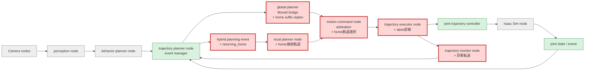
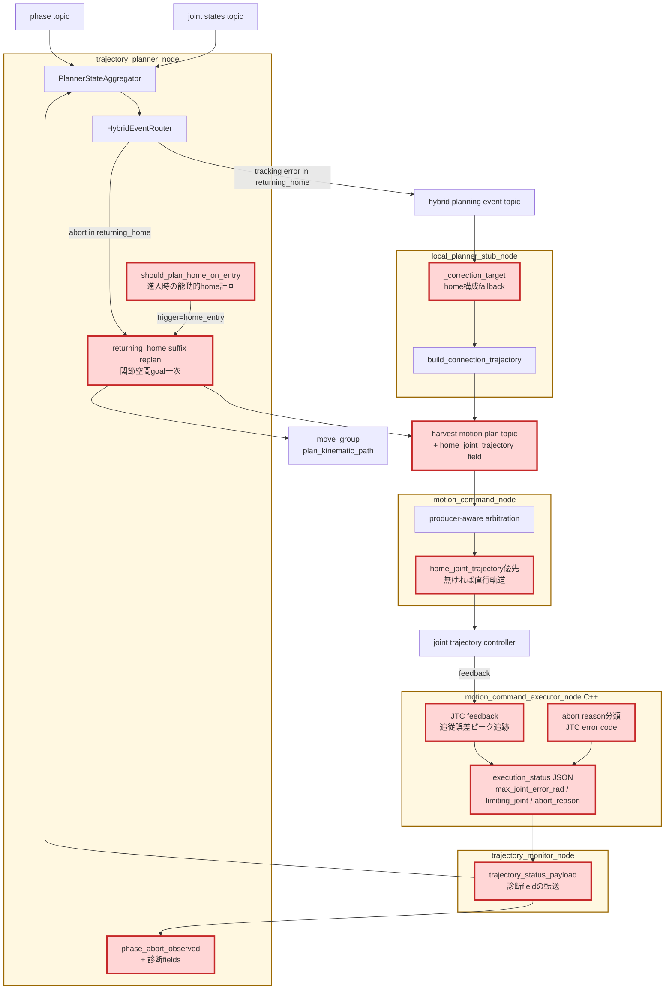

# Issue #32 RETURNING_HOME補正対象化とabort診断拡充レポート

## 目的と、この検証が次につながる点

Issue #28 の改善後10ケース再計測 (8/10) で唯一の新規失敗だったwrist_rightは、placeまで成功した後に`returning_home`でtrajectory abortを2回起こし、step予算内に`complete`へ到達できなかった。`RETURNING_HOME`はsuffix replan対象phase外だったため、Issue #28で実装した関節空間goal fallbackとlocal planner補正のどちらも作用せず、full-chain replanだけが復旧手段だった。

本Issueでは、(1) `RETURNING_HOME`をsuffix replanとlocal補正の対象へ追加し、(2) abort原因を後追い可能にする診断 (最大joint追従誤差・律速joint・abort reason) をexecutorからCI artifactまで通した。これにより「収穫成功後に復帰で失敗する」ケースの構造的な復旧経路ができ、abort診断は今後のtime parameterization改善やlocal planner高度化 (MoveIt Servo) の律速joint特定に直接つながる。

## 変更内容

### 1. RETURNING_HOMEのsuffix replan対象化とplan契約拡張

- `SUFFIX_REPLAN_PHASES`へ`RETURNING_HOME`を追加した。abort時はfull-chain replanではなくhome区間だけのsuffix replanが起動する。
- `HarvestMotionPlan`へ`home_joint_trajectory`フィールドを追加した。初期planではNoneで、復旧時に現在状態→home構成の軌道が刻まれる。旧契約JSONも読める (欠落時None)。
- home復帰のgoalは固定の関節構成 (`DEFAULT_JOINT_POSITIONS_RAD`) なので、suffix replanはpose goalのIKサンプリングを経由せず、**関節空間goalを一次手段**に使う。Issue #28でextended_farの原因だった`Unable to sample any valid states for goal tree`型の失敗がreturning_homeでは構造的に起きない。
- home構成の定義は`home_joint_state()` (msg/topics.py) に一本化し、motion_commandの直行軌道・suffix replan・local補正が同じ終端構成を共有する。

### 2. motion_commandのhome軌道選択

採用済みplanに`home_joint_trajectory`があれば (=abort復旧やlocal補正が生成した衝突考慮済み軌道)、従来の「現在位置→home定数の2点直行軌道 (10秒)」より優先して実行する。planが持たない通常サイクルでは従来動作のまま変わらない。

### 3. local planner補正のreturning_home適用

- tracking errorイベントのlocalルーティングは`SUFFIX_REPLAN_PHASES`ベースのため、対象化により`RETURNING_HOME`中の追従誤差も自動的にlocal plannerへ配送される。
- local plannerの接続軌道生成は、base planにhome区間trajectoryが無くても既知のhome関節構成を終端にできる (`_correction_target`)。
- 初期姿勢マトリクスCIの補正有効phaseへ`returning_home`を追加した (`INITIAL_POSE_LOCAL_PLANNER_PHASES`で従来条件へ戻せる)。

### 4. returning_home進入時の能動的home計画

実装検証の10ケース計測初回で、defaultケースが`returning_home`進入直後にabortし、**abort後の受動的復旧では救えない失敗モード**を新たに特定した。abort診断 (変更5) が記録した証跡は次のとおりである。

- 直行home軌道 (衝突非考慮の2点補間) の実行で`goal_tolerance_violated`、最大追従誤差`2.41 rad`、律速joint `panda_joint3`。
- abort後のsuffix replanは22 msで成功し採用されたが、再実行も同じ`panda_joint3`で`2.46 rad`となりabort。
- 2回のabort間で腕の開始構成の差はわずか`0.034 rad` — **計画軌道でも腕が物理的に動いていない**。place後のトレイ近傍から衝突非考慮の直行軌道で出発したことで、腕が障害物へ引っ掛かり固着したと結論した。

対策として、`RETURNING_HOME`進入時に`should_plan_home_on_entry()`が能動的にhome区間のsuffix計画 (`trigger=home_entry`) を起動し、**固着が起きる前に**衝突考慮済み軌道へ置き換えるようにした。直行軌道は計画が間に合わない・失敗した場合のfallbackに退く。abort診断が実装当日に新失敗モードの原因特定へ寄与した実例でもある。

### 5. abort診断の拡充 (Issue #28レポート診断項目1)

C++ executor (`motion_command_executor_node`) がJTC action feedbackから**goalごとの最大joint追従誤差と律速joint**を追跡し、abort時に**abort reason** (JTC error codeの安定分類: `goal_tolerance_violated`等、および`missing_trajectory`/`goal_rejected`/`action_server_unavailable`) とともにJSONの`execution_status`として報告する。

```
execution_status: {"status":"aborted","max_joint_error_rad":0.184,"limiting_joint":"panda_joint4","abort_reason":"goal_tolerance_violated"}
→ trajectory_monitor が trajectory_status JSONへ転送
→ trajectory_planner_node が MOVEIT_METRIC phase_abort_observed へ記録 (robot log = CI artifact)
```

status配信は全statusでJSON形式になり、旧plain文字列も両consumer (behavior_planner / trajectory_monitor) が引き続き受理する。診断は全phaseのabortに適用される。

## 変更後の全体アーキテクチャ

凡例: 赤は今回変更、緑は既存利用、灰は変更範囲外。



## 変更差分の詳細アーキテクチャ



黄色の大枠がROS 2 node、赤が今回追加・変更した処理またはtopic契約を表す。イベント配送 (abort→global、tracking error→local) と採用境界 (arbitration) の設計はStep 7から変えておらず、変更は「対象phaseの拡大」「plan契約のhome区間追加」「status契約への診断追加」に閉じている。

## 変更ファイル

| ファイル | 変更 |
|---|---|
| `msg/contracts.py` / `msg/serialization.py` | `home_joint_trajectory`フィールド追加 (旧JSON互換) |
| `msg/topics.py` | `home_joint_state()` — home構成の単一定義点 |
| `robot/motion_planner/phase_suffix_replan.py` | `SUFFIX_REPLAN_PHASES`と`SUFFIX_TRAJECTORY_FIELD_BY_PHASE`へ`RETURNING_HOME`追加、`should_plan_home_on_entry()` |
| `robot/motion_planner/moveit_service_bridge.py` | returning_home suffix replan (関節空間goal一次)、scene適用ヘルパー抽出 |
| `robot/motion_planner/local_planner_stub.py` | `_correction_target`でhome構成fallback、field mapを共有定数へ |
| `robot/execute_manager/motion_command.py` | `home_joint_trajectory`優先の実行軌道選択 |
| `robot/execute_manager/trajectory_monitor.py` | `trajectory_status_payload` — 診断field付きJSON転送 |
| `robot/behavior_planner/node.py` | `execution_status_value` — JSON/plain両対応のstatus解析 |
| `robot/motion_planner/node.py` | `phase_abort_observed`へ診断fields追加、returning_home進入時の`home_entry`計画起動 |
| `franka_ros2_control` (C++) | `TrackingErrorPeak`追跡、`abort_reason_from_jtc`、`execution_status_json` |
| `scripts/ci/run_initial_pose_matrix.sh` | 補正有効phaseへ`returning_home`追加 |

## 検証

- unit test (コンテナCI同等): pytest **220 passed**、gtest **12 tests passed** (abort診断の新規7件含む)。追加テストは、suffix対象set・home契約round-trip・motion_commandのhome軌道選択・local補正のhome構成fallback・event routing・status JSON転送・status解析・追従誤差ピーク追跡・abort分類・status JSON組み立て。
- E2E外乱注入 (全4 phase、後述) と初期姿勢10ケース再計測 (後述) で実機検証した。

### E2E外乱注入 (全4 phase)

`TOMATO_HARVEST_INJECT_SUFFIX_REPLAN_PHASES`と`INJECT_LOCAL_PLAN_PHASES`へ`returning_home`を含む4 phaseを指定して実行し、**PASS**した。`returning_home`でもtracking error注入→localルーティング→接続軌道publish→arbitration採用→実行→`complete`をコンテナ内アサーション込みで確認した。

またこのrunで実際のabortが1回発生し、abort診断がexecutor→trajectory_monitor→plannerメトリクスまで通ることを実機確認した。

```
execution_status {"status":"aborted","max_joint_error_rad":0.298044,"limiting_joint":"panda_joint4","abort_reason":"goal_tolerance_violated"}
MOVEIT_METRIC {"abort_reason":"goal_tolerance_violated","event":"phase_abort_observed","limiting_joint":"panda_joint4","max_joint_error_rad":0.298044,"phase":"moving_to_pregrasp"}
```

## 効果検証: 初期姿勢10ケースの変更前後比較 (2026-07-13)

変更前 (Issue #28改善後、2026-07-12計測) と変更後 (本Issue適用) の同条件比較。`CI_HEADLESS_STEPS=3600`、外乱注入なし、同一GPU runnerで10ケースを直列実行した。

| Case | 変更前 | 変更後 | 変更後の挙動 |
|---|---|---|---|
| default | PASS | **FAIL** | returning_homeでabort 3回。home_entry計画・abort復旧計画は全て成功・採用されたが、腕がpanda_joint3誤差2.4 radのまま物理的に動かず固着 |
| elbow_left | PASS | PASS | moving_to_placeでabort 1回→suffix replanで復旧し完走 |
| elbow_right | PASS | PASS | abortなしで完走 |
| shoulder_high | FAIL | FAIL | 今回はplace後にトマト落下 (`failed_phase:placed`)。従来のgrasp_evaluation失敗と同系の物理把持不安定 |
| shoulder_low | PASS | **FAIL** | moving_to_graspでabort 5回反復。panda_joint1誤差0.85 radで固着 |
| wrist_left | PASS | PASS | abortなしで完走 |
| wrist_right | **FAIL** | **PASS** | **前回の失敗ケース**。pregraspでabort 2回→復旧し、returning_homeはhome_entry計画で3.3秒で`complete` |
| folded_near | PASS | PASS | abortなしで完走 |
| extended_far | PASS | PASS | abortなしで完走 |
| near_singularity_extended | PASS | **FAIL** | moving_to_graspでabort 3回 (panda_joint1誤差0.98 rad) →復旧してat_grasp到達もgrasp_evaluationで失敗 |

成功率は`6/10 (60%)`で、変更前の`8/10 (80%)`から低下した。ただし後述のとおり、増えた失敗は本Issueの対象である「returning_homeのabort復旧」ではなく、**全run共通で存在する物理固着flake**が今回のrunで多く発現したものである。

### 補正機構の発動状況

| 指標 | 発動 | 内訳 |
|---|---|---|
| home_entry計画 (進入時の能動的home計画) | **7/7ケース** (returning_home到達全ケース) | 11〜43 msで計画・全て採用。PASSした6ケース全てが計画済みhome軌道で復帰完了 |
| abort→suffix replan復旧 | 13回、planning全成功 | default 3 (home)、elbow_left 1 (place)、shoulder_low 5 (grasp)、wrist_right 2 (pregrasp)、near_singularity_extended 3 (grasp) |
| 関節空間goal fallback (pose goal失敗時) | 0回 | pose goal計画は今回も1度も失敗せず |
| local planner補正 | 0回 | 実行中のtracking errorイベントが発火しないため (後述の構造ギャップ) |
| abort診断 (項目1) | **全13 abortで記録** | 律速joint・最大誤差・abort reasonが全abortでartifactに残った |

### 分析

**1. 本Issueの直接対象 (returning_home abort復旧) は機能した。** 前回唯一の失敗だったwrist_rightがPASSに転じ、returning_homeへ到達した7ケース全てでhome_entry計画が発火・採用された。E2E注入テストでも復旧経路の全段 (routing→補正→採用→実行→complete) を検証済みである。

**2. abort診断が、失敗の支配要因を「計画不能」から「物理固着」へ確定させた。** 全13回のabortで診断が記録され、失敗3ケースに共通するシグネチャが初めて定量化された: 計画・採用・再実行は毎回成功するのに、腕は同じ関節 (homeではpanda_joint3が2.4 rad、graspではpanda_joint1が0.85〜0.98 rad) で同じ誤差のまま動かない。連続abort間の開始構成差は0.034 radしかなく、**衝突考慮済みの軌道を与えても腕が物理的に動いていない**。これはOMPL・suffix replan・fallbackのどれを改善しても救えない失敗モードであり、Isaac Sim側の物理拘束 (接触wedge、把持joint残存、関節限界近傍でのソルバ挙動のいずれか) の調査が必要である。

**3. local planner補正の構造ギャップが明確になった。** 実runでlocal補正は一度も発火していない。tracking errorの実データはabort時 (`max_joint_error_rad`) にしか配信されず、**実行中の追従誤差を周期配信する経路が存在しない**。abort前にlocal補正を当てるには、executorのfeedback追跡 (今回実装済み) を実行中のtrajectory statusへ周期publishする拡張が次に必要である。

**4. 成功率のrun間分散が大きく、単一runでは効果を測れない。** 直近3runで70%→80%→60%と推移し、変動は物理固着flakeの発現数で説明できる。planner側改善の効果判定には、週次CIでの複数run蓄積 (ベースライン診断項目4) と、固着flake自体の解消が前提になる。

### 固着モードの再現試行

固着の物理原因を確定するため、`run_e2e.sh`へ`TOMATO_HARVEST_DEBUG_PHYSICS_GRASP`の伝搬を追加し、物理観測ログ (把持joint状態・finger接触インパルス) 付きでdefaultを2回単発実行した。結果は、1回目abortゼロでPASS、2回目は固着ではなく物理把持flake (`grip=1`かつ接触インパルスゼロ=指が空を掴みgrasp_evaluation失敗) と、**固着モード自体は再現しなかった**。発現は確率的であり、正常系では把持jointがgripper開で即時除去されること (`joint=0`) は確認できた。根本調査は複数回の自動再現とセットで後続Issueへ切り出す。

## 残課題と次のステップ

1. **物理固着flakeの根本調査 (最優先・新Issue候補)。** 今回の全失敗の直接原因。abort診断により「衝突考慮済み軌道を採用しても腕が特定関節で全く動かない」ことまで確定した。`TOMATO_HARVEST_DEBUG_PHYSICS_GRASP=1`の物理観測を固着発生runで取得できるよう、失敗時自動リトライ+デバッグ有効化のCI拡張を含めて切り分ける (接触wedge / 把持joint残存 / PhysXソルバ挙動 / 関節限界)。
2. **実行中tracking errorの周期配信。** executorのfeedback追跡 (実装済み) をabort時だけでなく実行中のtrajectory statusへ載せ、local planner補正を実駆動する。abort前の補正介入が可能になり、固着以外の追従遅れ起因abortを減らせる。
3. **成功率の複数run蓄積。** 70%→80%→60%とrun間分散が大きい。週次CIでの蓄積 (各ケース3回以上) で、物理固着flakeの発現率と、planner側改善の寄与を分離して評価する。
4. grasp評価の物理診断はIssue #33で並行して進める (shoulder_high型)。
