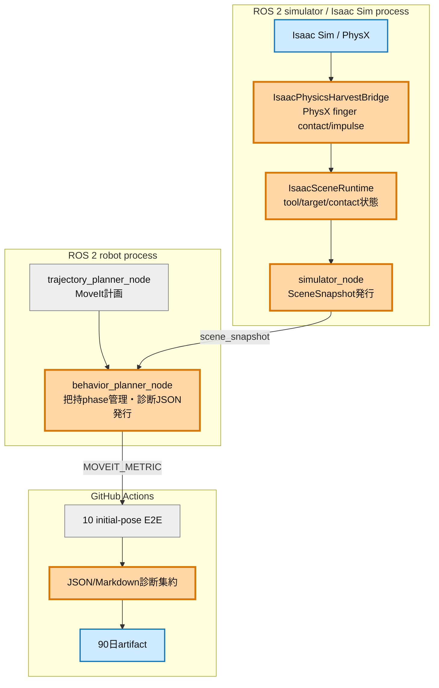
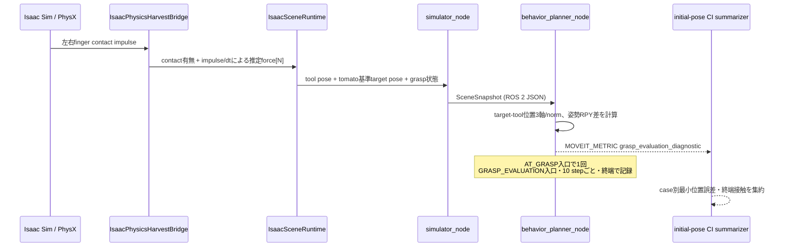

# Issue #33 grasp評価診断レポート

## 目的と次につながる判断

初期姿勢E2Eの成否だけでは、失敗が「grasp位置」「姿勢」「finger接触」のどこで生じたか判別できない。本検証は、`AT_GRASP`入口と`GRASP_EVALUATION`中の観測値を成功・失敗の双方で保存し、特に既知失敗の`shoulder_high`を分類できる状態にする。

結果は、Issue #3〜#7、#32、#33後に再検討するlearned local residual policyの入力・教師データ設計へつなげる。まず6D誤差が支配的なら軌道終端補正、6D誤差が小さく接触が片側/ゼロなら接触を目的とする局所方策、両接触後の失敗なら把持力・物理モデルを優先する。

## 改善対象を示す全体アーキテクチャ

橙が今回の変更、青が観測・保存対象、灰が既存である。変更は把持アルゴリズムやMoveIt計画器ではなく、観測経路だけに限定した。

## PR変更差分の詳細アーキテクチャ

接触力はPhysXの1 physics stepの接触impulseを`1/60 s`で割った推定平均力で、実機force sensor値ではない。現行contact callbackから安定して取得できる点・法線はないため、欠損を推測値で埋めず今回の契約には含めない。

## 記録項目と成功・失敗比較方法

- tool-target位置誤差: `x/y/z [m]`とnorm
- tool-target姿勢誤差: wrap済み`roll/pitch/yaw [rad]`
- 左右finger: contact真偽と推定force `[N]`
- grasp状態: `gripper_closed`、`tomato_status`、`grasp_result_reason`
- sampling: `entry`、`periodic`、`terminal`

10姿勢のsummary JSONには全ログに加え、case別sample数、最小位置誤差、終端sampleを保存する。Markdownには成功/失敗、最小位置誤差、終端左右接触を並べ、成功群と失敗群を同じ尺度で比較できる。

## 検証結果

unit/contract regressionは`79 passed, 2 skipped`。6D軸差・位置norm・±πをまたぐ姿勢差、runtimeからのtarget/contact公開、旧SceneSnapshot JSONとの後方互換を確認した。

Issue #28時点の先行ベースラインでは`near_singularity_extended`が`GRASP_EVALUATION -> FAILED`だったが、当時は本診断値を未収集である。このため過去ログから6D誤差や接触原因を推測しない。変更後10ケースの数値は専用initial-pose workflowのartifactを正本とし、取得後に本節へ追記する。

## タイミング影響

診断計算はPose3Dの定数回算術とJSONログのみで、制御判定やphase timeoutを変更しない。GRASP_EVALUATIONは毎stepではなく10 stepごとに記録し、ログI/Oを抑制した。把持成否条件、MoveIt constraint、trajectory実行順は変更していない。
