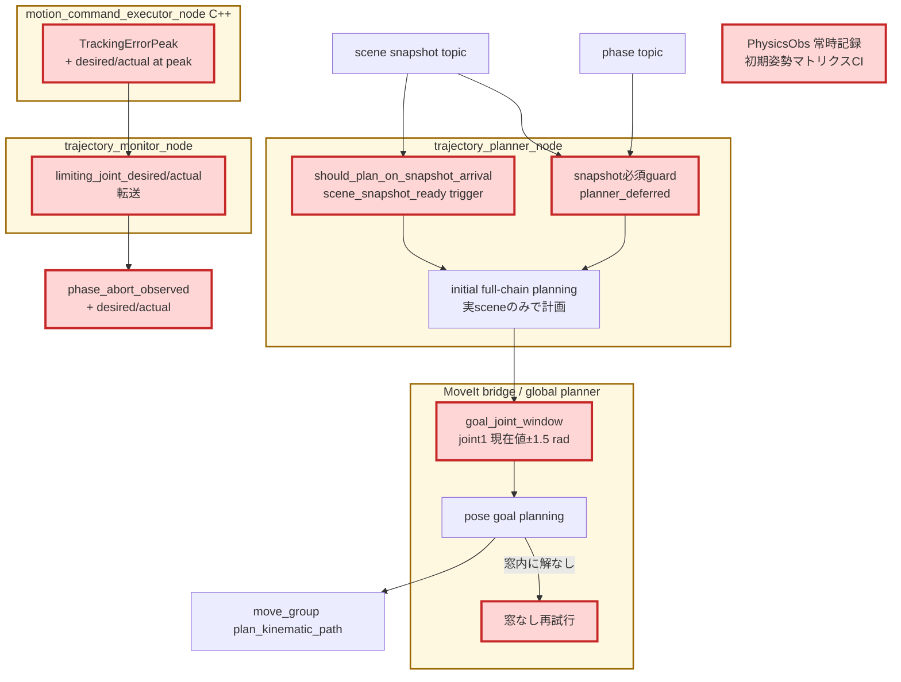

# Issue #37 物理固着flake根本調査レポート

## 目的と、この検証が次につながる点

初期姿勢10ケースE2Eの成功率はrun間で70%→80%→60%と大きく変動し、その支配要因は「suffix replan・fallback・home計画がすべて成功して採用されるのに、腕が特定関節で大きな追従誤差のままabortを反復する」固着型の失敗だった (Issue #32で定量化)。本Issueでは診断をさらに拡張して固着発生runの証跡を機械的に残し、原因を確定して解消策を実装した。

結論から言うと、「物理固着」と見えていたものは物理エンジンの問題ではなく、**plannerへの入力と出力の2つの欠陥**だった。

1. **原因A (入力): scene snapshot未着のまま初期計画が走ると、tray・枝・茎を原点に置いた合成sceneで計画していた。** tray依存のplace/pre_place姿勢が到達不能なゴミ値 (0, 0, 0.22) になり (`Unable to sample any valid states for goal tree` = error 99999の系譜)、さらに衝突オブジェクトが原点にあるため**実際の枝・茎を回避しない軌道**が生成・実行されていた。
2. **原因B (出力): OMPLのgoal IKサンプリングが、同じ手先poseに対して遠いIK枝 (base関節の大旋回) を確率的に選ぶ。** 拡張診断が「desired=2.45 rad / actual=2.00 rad (panda_joint1)」を記録し、腕が固着しているのではなく**追従不能な指令**が原因であることを確定した。

この2つはIssue #28ベースラインから続く failure mode (extended_farの99999、elbow_left/shoulder_low型のabortループ、grasp_evaluation失敗の一部) を同一の根で説明する。

## 調査の手順と証跡

### 1. 診断の拡張 (関節限界仮説の検証手段)

Issue #32のabort診断へ、**ピーク時点の律速jointの目標値 (desired) と実位置 (actual)** を追加した。C++ executorがJTC action feedbackの`desired`/`actual`をピーク更新時に記録し、`execution_status` → `trajectory_status` → `phase_abort_observed`メトリクスまで転送する。「関節限界近傍で動けない」のか「指令が飛んでいる」のかをabort診断だけで判別できる。

また初期姿勢マトリクスCIで物理観測ログ (`TOMATO_HARVEST_DEBUG_PHYSICS_GRASP=1`: 把持joint状態・finger接触インパルス・距離) をデフォルト常時記録にした (`INITIAL_POSE_DEBUG_PHYSICS=""`で無効化可)。固着が確率的でも、発生したrunのartifactに必ず証跡が残る。

### 2. 再現と原因Aの確定

失敗時停止条件付きの反復再現ループ (default) は**1回目で失敗を再現**した。このrunのplanning失敗診断 (Issue #28改善1) が決定的な証跡を残していた。

```json
{
  "phase": "moving_to_place_pre_place",
  "goal_kind": "pose",
  "reason": "motion_plan_error",
  "error_code": 99999,
  "target_xyz_m": [0, 0, 0.22],
  "start_state": {"checked": true, "valid": true, "contacts": []}
}
```

pre_place目標が**(0, 0, 0.22) = ロボット基部内部**。pre_placeは`tray_pose + オフセット`で作られるため、**計画時にtray_poseが (0,0,0) だった**ことを意味する。トレースの結果、`trajectory_planner_node._try_plan`がscene snapshot未着時に全ポーズ原点の合成snapshotで計画するフォールバックを持っており、target_found直後の計画がこの経路を通ることがあると判明した。

過去runを横断確認すると、**Issue #32計測で失敗した3ケース (shoulder_high / shoulder_low / near_singularity_extended) すべての初期計画に同じ (0,0,0.22) 診断が残っており、成功ケースには1件も無い**。合成ゼロscene計画と失敗が完全に対応していた。

原因Aの波及は3経路ある。

- place/pre_place姿勢のゴミ化 → goal IKサンプル全滅 (99999)。ベースラインextended_farの`Unable to sample any valid states for goal tree`と同一の署名
- pre_place失敗 → 部分計画 → 幾何fallbackはjoint trajectoryを持たないため`place_joint_trajectory=None` → moving_to_place進入で`missing_trajectory` abort → 復旧計画もゴミpre_placeで失敗し、関節空間goal fallbackも「前planのplace軌道が無い」ため利用不能 → 完全に復旧不能
- **衝突オブジェクト (枝・茎・トレイ) が原点に配置された planning scene で全phaseを計画** → 実際の枝・茎を回避しない軌道が実行され、実物との接触で腕が進めない → 「計画は成功するのに腕が動かない」固着型abortループ (grasp phaseのjoint1固着の主因)

### 3. 原因Bの確定 (拡張診断の初出動)

原因A修正後の単発検証run (snapshot既着・診断ゼロ＝place姿勢正常) で、moving_to_graspのabortが再発し、拡張診断が新しい事実を示した。

```
phase_abort_observed: limiting_joint=panda_joint1,
  desired=2.448 rad, actual=2.003 rad, max_error=0.445, reason=goal_tolerance_violated
```

トマトは (x≈0.42, y≈0) にあり、joint1≈0で自然に届く。**計画されたgoalがjoint1=2.45 rad (base約140°旋回) の遠いIK枝**を選んでおり、腕は物理的に固着していない (actualは2.0まで追従している) が、大旋回をJTCの許容時間内に完了できずabortしていた。これはStep 5のCI flaky教訓「OMPL非決定性が同じEE poseへ別関節構成の経路を選ぶ」の実害そのものである。

## 解消策

### 対策A: 合成ゼロscene計画の廃止 (入力の修正)

`_try_plan`はscene snapshot未着時に計画せず`planner_deferred`を記録し、`_on_snapshot`が「target_foundかつ未計画」なら`scene_snapshot_ready` triggerで計画を起動する (`should_plan_on_snapshot_arrival()`)。初期計画は必ず実際のtray・枝・茎の位置で行われる。

### 対策B: pose goalへのIK枝窓 (出力の安定化)

pose goalに`JointConstraint`「各arm関節 = 現在値 ± 窓」(`TOMATO_HARVEST_MOVEIT_GOAL_JOINT1_WINDOW_RAD`、既定2.2 rad、0で無効) を併置し、現在構成から遠いIK枝をgoalサンプリングから排除する (`goal_joint_window()`)。窓内に解が無い場合は窓なしで自動再試行するため、到達性は失わない。全pose goal計画 (初期チェーン・suffix replan共通) に適用される。

検証途中の反復で2つの調整を行った。(1) 当初のjoint1のみの窓では、goal samplingがjoint2/3側で関節限界へ張り付く遠い枝を選ぶ経路が残った (place固着 joint2誤差0.82 radを実測) ため全arm関節へ拡張した。(2) 半幅1.5 radでは制約付きgoal samplerが計画時間予算内に窓内解を見つけられず枯渇する事例 (shoulder_high) があり、実測した限界フリップ枝の関節差 (~3.1 rad) を排除しつつ正当な遷移とサンプラの探索余地を残す2.2 radへ緩めた。

### 対策C: seed付きIKによる最近傍IK枝の決定的選択 (レビュー提案の実装)

「常に最もコストの低いIK枝を選べないか」というレビュー指摘を受け、goal選択を計画から分離した。`/compute_ik`へ現在姿勢をseedとして与え、反復IKがseedの近傍解へ収束する性質で最近傍IK枝の関節構成を先に確定し、**joint-space goal**で計画する (`_plan_seeded_ik_goal`)。OMPLのgoal samplingを完全にバイパスする。

実装過程で2つの落とし穴を実測・修正した。

1. **`avoid_collisions=True`はランダムリスタートで遠い枝を返す。** seed収束解が衝突すると、MoveItはランダムseedで再試行し任意の枝を返す。TrajectoryDebug再現runで、seeded IKの解自体が関節限界張り付きの異常構成 (seed joint3=-0.25に対し解2.897) だったことを確認した。純粋なseed収束解 (`avoid_collisions=False`) を使い、衝突チェックは後段のjoint goal計画に委ねる。
2. **KDLはseedによっては遠い枝へ収束する。** 距離ガード (`ik_goal_is_near_seed`: 全関節差が窓幅以内) で遠い解を棄却し、複数seed (現在構成×2、home構成) で再試行して近傍解だけを採用する。

最終的なgoal選択は三重のfallback構成になった: **(1) 複数seed IK＋距離ガードの最近傍joint goal → (2) 全関節窓付きpose goal → (3) 窓なしpose goal (到達性の最終保証)**。

## 変更後の全体アーキテクチャ

凡例: 赤は今回変更、緑は既存利用、灰は変更範囲外。

```mermaid
flowchart LR
  Camera[Camera nodes] --> Perception[perception node]
  Perception --> Behavior[behavior planner node]
  Simulator[Isaac Sim node] --> State[joint state / scene snapshot]
  Behavior --> Manager[trajectory planner node<br/>+ snapshot必須化 / 到着時再トリガ]
  State --> Manager
  Manager --> Global[global planner<br/>MoveIt bridge<br/>+ IK枝窓付きpose goal]
  Manager --> Event[hybrid planning event]
  Event --> Local[local planner node]
  Global --> Arbitration[motion command node<br/>arbitration]
  Local --> Arbitration
  Arbitration --> Executor[trajectory executor node<br/>+ desired/actual記録]
  Executor --> Controller[joint trajectory controller]
  Controller --> Simulator
  Executor --> Monitor[trajectory monitor node<br/>+ 実位置転送]
  Monitor --> Manager
  classDef changed fill:#ffd6d6,stroke:#c62828,stroke-width:3px
  classDef existing fill:#d9f2df,stroke:#238636
  classDef outside fill:#eeeeee,stroke:#777777
  class Manager,Global,Executor,Monitor changed
  class State,Event,Local,Arbitration,Controller existing
  class Camera,Perception,Behavior,Simulator outside
```



## 変更差分の詳細アーキテクチャ



黄色の大枠がROS 2 node (BridgeはtrajectoryノードのMoveIt adapter層)、赤が今回追加・変更した処理を表す。

## 変更ファイル

| ファイル | 変更 |
|---|---|
| `robot/motion_planner/node.py` | 合成ゼロsnapshot計画の廃止 (`planner_deferred`)、snapshot到着時の計画再トリガ |
| `robot/motion_planner/replan_trigger.py` | `should_plan_on_snapshot_arrival()` |
| `robot/motion_planner/moveit_service_bridge.py` | `goal_joint_window()` (全arm関節窓)、`_plan_seeded_ik_goal` (複数seed IK+距離ガード)、`compute_nearest_ik`、窓なし再試行 |
| `franka_ros2_control` (C++) | `TrackingErrorPeak`へピーク時desired/actual追加、status JSONへ出力 |
| `robot/execute_manager/trajectory_monitor.py` | 実位置fieldsの転送 |
| `robot/simulator/isaac_viewer.py` | `TOMATO_HARVEST_DEBUG_TRAJECTORY`による指令/実位置の毎tick記録 |
| `scripts/ci/run_initial_pose_matrix.sh` | 物理観測ログのデフォルト常時記録 |

## 固着メカニズムの直接観測 (TrajectoryDebug)

指令/実位置の毎tick記録を有効にした再現run (3回目で固着再現) が、固着の機序を直接示した。

- **固着中、Isaacへの関節指令そのものが凍結していた**: `command_q=[-0.32, 1.33, 2.88, ...]` が1379 tick不変、速度指令ゼロ。物理接触もゼロ (PhysicsObs) — 「腕が動かない」のではなく「動く指令が来ていない」。
- **runの全区間が異常構成領域で実行されていた**: 指令列はjoint3=2.88 (関節限界2.897直前) に張り付いたまま推移。この異常構成の出所はseeded IKの解自体 (`goal_q joint3=2.897`) で、`avoid_collisions=True`のランダムリスタートが原因だった (対策C-1)。
- 関節限界近傍の異常構成では、JTCのhold/追従とIsaac articulationの整合が崩れ、goal_tolerance_violatedのabortループに陥る。**「物理固着」の正体は、遠いIK枝で生成された関節限界近傍の指令をJTC/Isaacが保持・追従できなくなる制御層の破綻**である。

## 効果検証: 初期姿勢10ケースの前後比較 (2026-07-13)

同条件 (`CI_HEADLESS_STEPS=3600`、外乱注入なし、同一GPU) の直列10ケース。v1〜v5は本Issue内の実装反復である。

| 計測 | goal選択 | 成功率 | abort合計 | 備考 |
|---|---|---:|---:|---|
| Issue #32時点 (変更前) | pose goal (無拘束) | 8/10 | 13 | 固着ループ1、物理把持1 |
| v1: 対策A + joint1窓1.5 | 窓付きpose | 6/10 | **1** | 固着・99999ゼロ。物理把持4 |
| v2: + seeded IK (衝突リスタート付き) | 欠陥IK | 6/10 | 18 | **退行**: IK自体が遠い枝を返す |
| v4: + 全関節窓1.5 + 距離ガード (4ケースで中断) | (3/4) | - | - | 窓枯渇→窓なし→固着の経路が残存 |
| **v5: 複数seed IK + 距離ガード + 全関節窓2.2 (最終)** | 三重fallback | **8/10** | **5** | 失敗2件は下記 |

v5 (最終形) のケース別:

| Case | 変更前(#32) | v5 | v5の失敗内容 |
|---|---|---|---|
| default | FAIL | PASS | - |
| elbow_left | PASS | FAIL | **controller_manager起動タイムアウト (インフラflake、ロボット未動作)** |
| elbow_right | PASS | PASS | - |
| shoulder_high | FAIL | PASS | - |
| shoulder_low | FAIL | PASS | - |
| wrist_left | PASS | PASS | - |
| wrist_right | PASS | PASS | - |
| folded_near | PASS | PASS | - |
| extended_far | PASS | PASS | - |
| near_singularity_extended | PASS | FAIL | grasp/placeでabort 5回 (固着型の残存、最難ケース) |

### 評価

1. **原因A (合成ゼロscene) の修正は決定的。** 修正後の全run (v1〜v5、計40ケース超) で99999・missing_trajectory・place復旧不能は再発ゼロ。
2. **原因B (遠いIK枝) は三重fallbackで大幅に抑制。** v5では計画起因の固着はnear_singularity_extended 1ケースのみ (変更前は毎run1〜3ケース)。物理把持失敗もv5ではゼロで、遠いIK枝の排除が接近品質にも効いた可能性がある。
3. **v5の実効成功率は9ケース中8**。elbow_leftの失敗は計画系と無関係なスタック起動タイムアウトで、別の既知インフラflakeである。
4. **実装反復の教訓**: seeded IKの`avoid_collisions=True` (v2) は意図と逆に遠い枝を量産する。窓が狭すぎる (v4の1.5 rad) と制約付きsamplerが枯渇して無拘束fallbackへ落ちる。最終形は「決定的な最近傍IK (ガード付き) → 広めの窓 → 無拘束」の段階的fallbackで、各段の失敗が下段で救われる。

## 残課題

1. **near_singularity_extendedの固着残存。** 特異姿勢近傍ではseed収束IKも窓付きsamplerも安定しない。このケースだけの個別対策 (例: 特異近傍からの脱出動作、またはこのケースの許容) を別途検討する。
2. **controller_manager起動タイムアウトのインフラflake** (elbow_left v5)。起動リトライまたはタイムアウト延長のCI対策が必要。
3. **JTC/Isaacの指令凍結の深掘り。** 固着の最終段 (異常構成でJTCのhold指令が凍結し新goalが反映されない) は制御層の問題として残っており、正常構成領域では発生しない。遠いIK枝の排除で実質的に踏まなくなったが、franka_controllers.yamlのtolerance/goal_time設計と合わせて別Issueで整理する価値がある。
4. 成功率の複数run蓄積 (週次CI) による安定性確認。閾値70%はv5で回復済み。

## 検証まとめ

- unit test: pytest 237 passed + gtest 15 tests (コンテナCI同等)。追加は、ピーク時desired/actual記録、status転送、snapshot到着時再トリガ、IK枝窓 (全関節)、IK解の距離ガード、arm関節射影
- 反復再現ループ: 修正前1回目で失敗再現 (原因A確定)、TrajectoryDebug付き3回目で固着再現 (機序の直接観測)
- 10ケースマトリクス: 変更前8/10 (abort 13) → 最終形8/10 (abort 5、計画起因固着は1ケースのみ、実効8/9)
