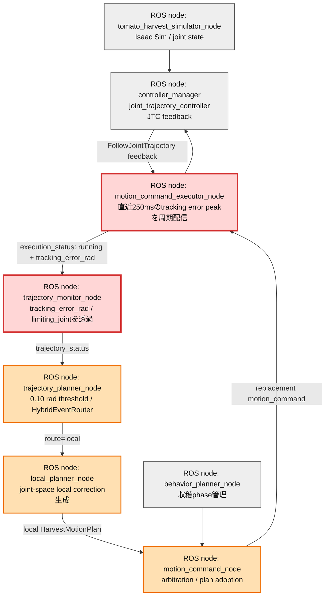
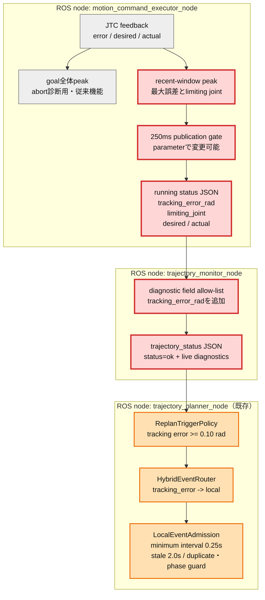

# Issue #38 実行中tracking errorによるlocal planner実駆動レポート

実施日: 2026-07-13  
対象ブランチ: `feature/issue38-live-tracking-error`（`main`へリベース済み）

## 目的と次につながること

従来のlocal plannerは、CI専用のtracking error注入では動作したが、実行中のJoint Trajectory Controller（JTC）feedbackがplannerへ届かなかった。そのため実運転では、追従誤差が大きくなってもJTCがabortするまで補正を開始できなかった。

本検証の目的は、実行中の追従誤差を周期観測し、`0.10 rad`超過をlocal plannerへ渡して、**JTC abortより前に短い補正軌道へ置換できること**を確認することである。これにより、次段では注入test doubleではなく実観測値を用いて、local plannerのsolverをMoveIt Servo等へ差し替えた場合の効果を同じE2E指標で比較できる。

## 改善対象を示す全体アーキテクチャ

縦長に配置し、今回変更した経路を赤、既存のlocal補正経路を橙、変更対象外を灰色で示す。

## PR変更差分の詳細アーキテクチャ

### 250ms windowの意味

goal開始からの最大値を毎回送ると、一度だけ発生した古い誤差が残り続け、同じ補正を繰り返す。そこでabort診断用のgoal全体peakは維持しつつ、実行中通知には直近250msで観測した最大値だけを使い、publish後にwindowをリセットする。これにより短い誤差パルスを取りこぼしにくく、古い値も残さない。

## 実装差分

| 対象 | 変更 |
|---|---|
| `motion_command_executor_core` | 周期判定pure function、running JSONの`tracking_error_rad`追加 |
| `motion_command_executor_node` | goalごとのrecent peak、既定250ms周期、実行中status配信・観測ログ |
| `trajectory_monitor_node` | 実行中tracking errorと律速joint診断をplannerへ透過 |
| initial-pose集計 | sample数、最大誤差、local plan publish/adopt数をJSON/Markdownへ蓄積 |
| 通常CI | 実feedback由来の周期statusが無い場合にfail |
| 注入CI | 既存3フェーズに`returning_home`を加えた4フェーズ検証 |

## 検証結果

### Unit / build

| 検証 | 結果 |
|---|---:|
| Python unit tests | 242 passed |
| C++ gtest | 16 passed |
| `franka_ros2_control` build | PASS |

### 外乱注入なしE2E（実tracking error）

- 周期status: 45件
- `returning_home`で観測した最大値: `2.94589 rad`
- 順序: live status → tracking error local route → local plan publish → adoption → trajectory replacement → complete
- local plan: publish 1 / adopt 1
- JTC abort: 0
- tracking error起因global suffix replan: 0

したがって、注入値を使わず、JTC feedbackの誤差がabort前のlocal補正を実駆動した。

### 4フェーズ注入E2E

`moving_to_pregrasp`、`moving_to_grasp`、`moving_to_place`、`returning_home`の全フェーズで、注入、local route、local plan publish・adoptを確認し、completeへ到達した。tracking error起因global suffix replanとJTC abortは0件だった。初回はauto-startがIsaac準備前に消失する既知の起動flakeでコード経路へ入らず、同条件の再試行でPASSした。

### 初期姿勢10ケース: Before / After

BeforeはIssue #39/#40の同日・外乱注入なし結果、Afterは本変更後の外乱注入なし結果。Afterの`default`初回はlive sample 0件の起動flakeだったため、同条件で当該ケースのみ再試行した。

| 計測 | 成功率 | JTC abort | live sample | local補正 publish/adopt |
|---|---:|---:|---:|---:|
| Before: Issue #39/#40 | 10/10 (100%) | 0 | 取得経路なし | 計測不可 |
| After: Issue #38 | **10/10 (100%)** | **0** | **428** | **12/12（9ケース）** |

| Case | Result | Live samples | Max error [rad] | Local publish/adopt |
|---|---|---:|---:|---:|
| default | PASS | 34 | 3.38948 | 2/2 |
| elbow_left | PASS | 32 | 2.99133 | 1/1 |
| elbow_right | PASS | 37 | 2.71750 | 2/2 |
| shoulder_high | PASS | 41 | 2.30351 | 1/1 |
| shoulder_low | PASS | 46 | 3.00842 | 1/1 |
| wrist_left | PASS | 47 | 3.01631 | 1/1 |
| wrist_right | PASS | 49 | 3.52080 | 1/1 |
| folded_near | PASS | 43 | 3.40097 | 0/0 |
| extended_far | PASS | 35 | 3.52175 | 2/2 |
| near_singularity_extended | PASS | 64 | 2.88175 | 1/1 |

matrixのホストwall timeは、物理デバッグログとIsaac起動時間を含み109〜159秒（再試行defaultを除く）で、Beforeの79〜105秒より長い。ただし収穫phase実行時間は約41〜52秒で全ケース完走し、補正によるabort待ち・復旧ループは0だった。wall time差には逐次10回起動時のIsaac/OmniHub待ちが含まれるため、local補正単体のlatency回帰とは断定しない。今後はphase開始からcompleteまでの時間をsummaryへ独立蓄積する。

## 結論

Issue #38の目的である「実行中tracking errorを注入なしで観測し、JTC abort前にlocal planner補正を実駆動する」は達成した。成功率10/10とabort 0を維持しながら、従来観測不能だった実誤差を428サンプル蓄積し、12回の補正を全件採用・実行できた。次はこの観測・routing契約を維持したままlocal solverを高度化し、成功率だけでなく補正回数、最大誤差、phase実行時間を継続比較する。
