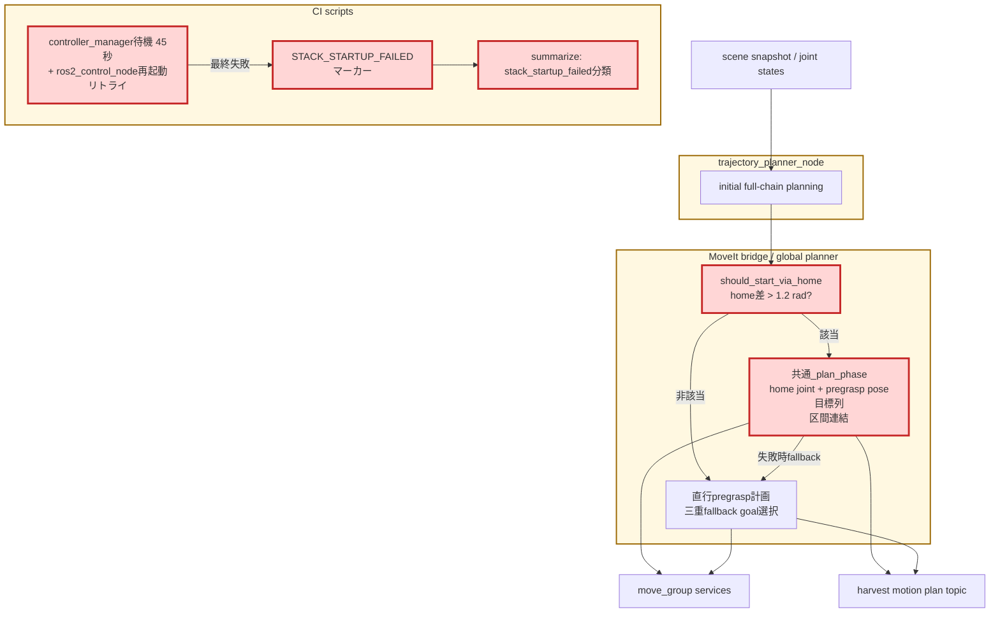

# Issue #39/#40 安定化レポート: 特異近傍のhome経由開始と起動flake対策

## 目的と、この検証が次につながる点

Issue #37 (物理固着flakeの根本調査) の最終検証で残った失敗は2種類だった。

1. `near_singularity_extended` の固着型失敗 — 伸展特異姿勢近傍ではseed収束IKも窓付きgoal samplerも安定せず、Issue #37 の三重fallbackでも遠いIK枝を踏むことがある (Issue #39)
2. `controller_manager` 起動タイムアウト — 計画・実行系と無関係なスタック起動のインフラflakeが、成功率計測を汚染する (Issue #40)

本対応でこの2つを塞ぎ、初期姿勢10ケースE2Eの失敗を「物理把持 (Issue #33) と真の計画・実行課題」だけに絞り込む。あわせてIssue #41 (JTC指令凍結) の初期調査を行い、凍結メカニズムの仮説を特定した。

## 変更内容

### 1. home差が大きい初期姿勢のhome経由開始 (Issue #39)

Issue #28 検討時に提案された「タスク実行前のホームポジション移動」を、**必要なケースだけに限定して**実装した。

- 当時の初期full-chain計画で、現在構成とhome構成の最大関節差が閾値 (`TOMATO_HARVEST_HOME_VIA_THRESHOLD_RAD`、既定1.2 rad、0で無効) を超える場合、pregrasp軌道を「現在→home」+「home→pregrasp」の連結として生成した。2026-07-20のphase開始時計画への移行後は、`should_start_via_home()`が共通`_plan_phase()`へ`(home joint state, pregrasp pose)`の目標列を渡す構造で同じ挙動を維持している
- home区間は**関節空間goal (IK不要)** で計画するため、特異近傍でもIK不安定性の影響を受けない。home以降は通常ケースと同一の挙動になる
- via-home計画が失敗した場合は従来の直行pregrasp計画へfallbackする
- phase状態機械・executor契約は無変更 (pregrasp trajectoryの内容として実現)

10ケースの初期姿勢とhome構成の最大関節差は、near_singularity_extended だけが2.0 radで、他は最大1.05 rad (extended_far)。閾値1.2により**該当ケースのみ**がhome経由になる。

### 2. スタック起動の強化と起動flakeの分類 (Issue #40)

- `controller_manager` 起動待機を15秒→45秒へ延長し、タイムアウト時は `ros2_control_node` を1回だけ再起動して再待機する
- 最終失敗時に `STACK_STARTUP_FAILED` マーカーをログへ出力し、集計スクリプトが `failure_reason=stack_startup_failed` として通常の実行失敗と区別する

### 3. JTC指令凍結の初期調査 (Issue #41、調査のみ)

`franka_controllers.yaml` の設計確認により、Issue #37 で観測した凍結・abortの機序仮説を特定した (詳細は #41 コメント)。

- 関節ごとの `goal: 0.0` により**最終位置toleranceは無効化済み**。観測された`goal_tolerance_violated`の実体は**静止判定** (`stopped_velocity_tolerance: 0.05` が `goal_time: 5.0` 以内に満たされない) である
- 指令凍結は `open_loop_control: true` のhold挙動 (最終サンプル位置の保持) と符合する。hold中に新goalが指令へ反映されなかった点は、executorのcancel-in-flight直後の新goal送信とJTC受理順序の競合が疑われ、#41で対応する

## 変更後の全体アーキテクチャ

凡例: 赤は今回変更、緑は既存利用、灰は変更範囲外。

```mermaid
flowchart LR
  Camera[Camera nodes] --> Perception[perception node]
  Perception --> Behavior[behavior planner node]
  Simulator[Isaac Sim node] --> State[joint state / scene snapshot]
  Behavior --> Manager[trajectory planner node]
  State --> Manager
  Manager --> Global[global planner<br/>MoveIt bridge<br/>+ home経由pregrasp計画]
  Manager --> Event[hybrid planning event]
  Event --> Local[local planner node]
  Global --> Arbitration[motion command node]
  Local --> Arbitration
  Arbitration --> Executor[trajectory executor node]
  Executor --> Controller[joint trajectory controller]
  Controller --> Simulator
  CI[initial-pose matrix CI<br/>+ 起動リトライ / 失敗分類] -.-> Manager
  classDef changed fill:#ffd6d6,stroke:#c62828,stroke-width:3px
  classDef existing fill:#d9f2df,stroke:#238636
  classDef outside fill:#eeeeee,stroke:#777777
  class Global,CI changed
  class Manager,State,Event,Local,Arbitration,Executor,Controller existing
  class Camera,Perception,Behavior,Simulator outside
```

## 変更差分の詳細アーキテクチャ

黄色の大枠がROS 2 node / スクリプト境界、赤が今回追加・変更した処理を表す。

## 変更ファイル

| ファイル | 変更 |
|---|---|
| `robot/motion_planner/moveit_service_bridge.py` | `should_start_via_home()`、共通`_plan_phase()`の目標列計画（旧`_plan_pregrasp_via_home()`を統合、失敗時直行fallback） |
| `scripts/run_ros2_components.sh` | controller_manager待機45秒化・再起動リトライ・`STACK_STARTUP_FAILED`マーカー |
| `scripts/ci/summarize_initial_pose_e2e.py` | `stack_startup_failed`の失敗分類 |

## 検証

- unit test: pytest 239 passed + gtest (コンテナCI同等)。追加は、home経由判定 (3件: 特異近傍該当・通常非該当・閾値0で無効)、起動失敗分類 (1件)
- **near_singularity_extended 3回連続実行: 3/3 PASS、全runでabortゼロ**。via-home経路の発動 (home区間50点+pregrasp16点の連結) をログで確認した。このケースはIssue #28以降、単発・マトリクスを通じて安定完走したことがなく、abortゼロでの3連続成功は初である

## 効果検証: 初期姿勢10ケースの前後比較 (2026-07-13)

同条件 (`CI_HEADLESS_STEPS=3600`、外乱注入なし、同一GPU) の直列10ケース。

| 計測 | 成功率 | abort合計 | 備考 |
|---|---:|---:|---|
| Issue #32時点 | 8/10 | 13 | 固着ループ・99999あり |
| Issue #37最終 (v5) | 8/10 | 5 | 失敗=起動flake 1 + near_singularity固着 1 |
| **本対応後 (#39/#40)** | **10/10 (100%)** | **0** | **全計測を通じて初の全ケース成功・abortゼロ** |

ケース別 (本対応後):

| Case | #37 v5 | 今回 | E2E [s] |
|---|---|---|---:|
| default | PASS | PASS | 102 |
| elbow_left | FAIL (起動flake) | PASS | 96 |
| elbow_right | PASS | PASS | 93 |
| shoulder_high | PASS | PASS | 91 |
| shoulder_low | PASS | PASS | 86 |
| wrist_left | PASS | PASS | 93 |
| wrist_right | PASS | PASS | 101 |
| folded_near | PASS | PASS | 79 |
| extended_far | PASS | PASS | 105 |
| near_singularity_extended | FAIL (固着) | **PASS** | 92 |

### 評価

1. **初の10/10・abortゼロ。** E2E時間も全ケース79〜105秒に収束しており (復旧に費やす時間がない)、Issue #28ベースライン (81〜147秒、abort 13回) から実行品質が根本的に変わった。
2. **near_singularity_extendedはvia-home経路の発動 (このrunで1回) を含め、単発3連続と合わせて4連続PASS・abortゼロ。** 特異近傍ケースの固着対策として機能している。
3. 今回runでは起動flakeは発生しなかった (リトライの発動なし)。分類機構 (`stack_startup_failed`) は発生時の計測汚染を防ぐ保険として機能する。
4. 単一runの100%はflake支配系では過大評価になり得る。ただし固着の機序 (遠いIK枝・ゼロscene) はIssue #37で決定的に除去済みであり、残る変動要因は物理把持 (Issue #33) に限られる。週次CIでの複数run蓄積で確認する。

## 残課題

1. **Issue #41 (JTC指令凍結の制御層整理)**: 初期調査済み (静止判定gate・open_loop holdとcancel競合の疑い)。home経由・IK枝対策で実質踏まなくなったが、根本対応は#41で継続する。
2. CI閾値: 70%のまま据え置き中。複数run蓄積後、90%への引き上げを判断する。
3. 物理把持flake (grasp_evaluation失敗・トマト落下) はIssue #33の診断データ蓄積で対応する。
