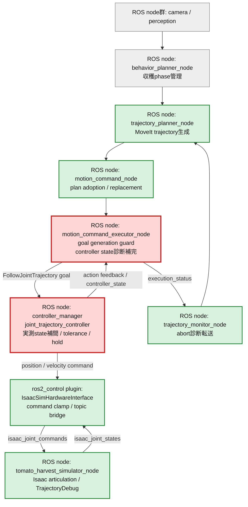
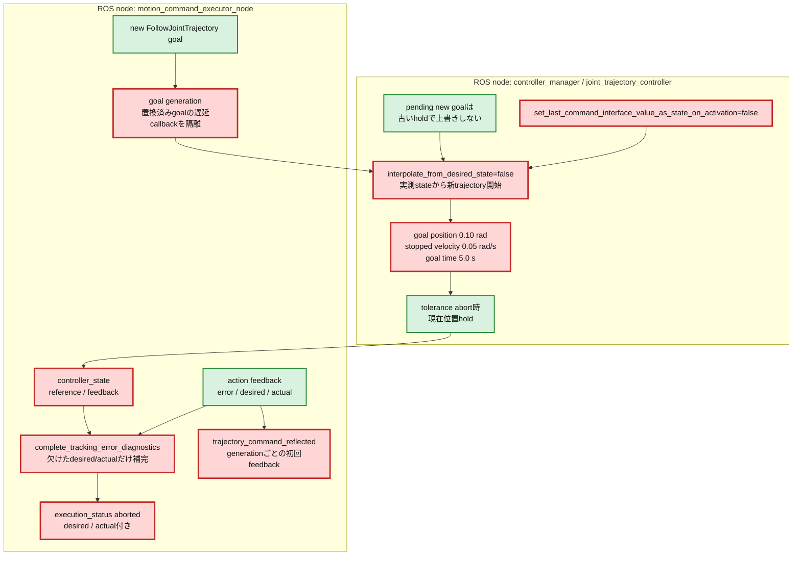

# Issue #41 JTC指令凍結の制御層整理レポート

実施日: 2026-07-14  
対象ブランチ: `feature/issue41-jtc-command-freeze`

## 目的と次につながること

Issue #37では、関節限界近傍でJTCからIsaac Simへの指令が1,379 tick同じ値に固定され、abort後の新goalでも動作が回復しない事例を観測した。また一部abortではaction feedback由来のdesired/actualが欠け、制御指令と実位置のどちらが原因か判別できなかった。

本検証の目的は、JTCの標準hold/new-goal挙動とローカル設定・executorの非同期callbackを切り分け、**abort後の新goalを実測位置から開始し、実行対象になったgoalが指令へ反映されたことを観測可能にする**ことである。これにより次段のlocal solver高度化では、solver性能と制御層の固着を別の指標で評価できる。

## 改善対象を示す全体アーキテクチャ

赤は変更箇所、緑は今回利用した既存経路、灰色は対象外である。図を縦長にし、変更モジュールが属するROS nodeを大枠で示す。

## PR変更差分の詳細アーキテクチャ

## 凍結条件と原因

### 観測済みの発生条件

Issue #37のTrajectoryDebugでは、遠いIK枝により`panda_joint3=2.88 rad`（上限2.8973 rad直前）へ入り、commandが1,379 tick不変、velocity commandが0、物理接触が0のままgoal tolerance abortを反復した。したがって物理拘束ではなく、制御層がhold相当の同一commandを出し続けた状態である。

今回の変更前再測定では`near_singularity_extended`が完走し、確率的な凍結は再現しなかった。このため、過去の再現ログを凍結条件の正本とし、公式JTC 4.40.1実装と現在コードを突き合わせた。

### 原因1: 新trajectoryの補間seedが実位置ではない

設定は`open_loop_control=true`で、Jazzyではdeprecatedである。関節限界近傍でdesiredとactualが乖離した後も古いcommand側を補間seedにすると、新goalが受理されても異常構成から開始する。一方、JTC標準実装はtolerance abort時に現在位置holdへ切り替え、pending new goalがあれば古いholdで上書きしない。したがってcontroller restartを常用する必要はなく、**新trajectoryをstate interfaceの実測位置から開始する設定**が先に必要である。

### 原因2: executorの置換済みgoal callbackが現行goal状態を破壊する

executorはgoal置換時に前goalを非同期cancelした直後、新goalを送る。置換済みgoalのresult callbackが遅れて到着すると、従来は共有`goal_handle_`を無条件にresetしたため、現行goal handleまで失った。これは過去互換用のdead codeではなく、ROS 2 action clientがcancel完了時に呼ぶ現役の非同期経路である。generation guardはcallback自体を削除するのではなく、callbackが自分のgoal以外の状態を変更しないよう隔離する。

### desired/actualがnullになる条件

abort診断はaction feedbackのpeakだけを保持していたため、goal受理直後のabort、callback順序競合、またはfeedbackのposition配列欠落時は位置を記録できなかった。JTCはactionとは別に`controller_state`へreference（desired）とfeedback（actual）を周期publishするため、action feedbackを正本としつつ不足時だけ同topicで補完する。

## tolerance設計

| Parameter | 変更前 | 変更後 | 根拠 |
|---|---:|---:|---|
| `open_loop_control` | true | **設定を削除** | Jazzyでdeprecated。後方互換値も残さない |
| `interpolate_from_desired_state` | 未指定 | false | abort後の古いdesiredを新goal seedにしない |
| `set_last_command_interface_value_as_state_on_activation` | 未指定（default true） | false | controller再activate時も実測stateから開始 |
| joint `goal` | 0.0（位置判定なし） | 0.10 rad | plannerのtracking error閾値と一致 |
| `stopped_velocity_tolerance` | 0.05 rad/s | 0.05 rad/s | 到着前successを防いだ既存実測値を維持 |
| `goal_time` | 5.0 s | 5.0 s | 0は無限待ち。有限時間で回復へ渡す既存値を維持 |

trajectory中のposition toleranceは0のままにし、瞬時tracking errorはplannerのlocal補正へ渡す。JTCで早期abortさせず、終端では位置と速度の両方を確認する分担である。

## 実装差分

| 対象 | 変更 |
|---|---|
| `franka_controllers.yaml` | 実測state補間、activate時state seed、終端位置toleranceを明示 |
| `motion_command_executor_node` | controller state購読、goal generation guard、指令反映metric |
| `motion_command_executor_core` | action feedback欠落時のabort診断補完pure function |
| C++ tests | controller stateから位置補完、feedbackなしpeak生成 |
| Python tests | JTC recovery/tolerance設定を契約test化 |

### dead code / legacy監査

- `open_loop_control`: **削除**。JTC 4.40.1でdeprecatedであり、`false`を残しても警告が出る。`interpolate_from_desired_state=false`が現在の正本parameterである。
- 置換済みgoalのresult/feedback callback: **削除しない**。ROS 2 actionの非同期cancel後にも呼ばれる現役経路であり、削除するとcancel完了処理を失う。generationで現行goalへの副作用だけを遮断する。
- `goal_generation_` / `feedback_seen_generation_`: 現行goalの識別と、generationごとの初回feedback観測に使用中でありdead stateではない。
- `allow_integration_in_goal_trajectories`: 現行JTCの有効parameterでdeprecatedではないため、本Issueでは削除しない。

legacy削除後のdefault E2Eは`complete`、JTC abort 0で、`open_loop_control` deprecated warningが0件になった。

## 検証結果

### Unit / build

| 検証 | 結果 |
|---|---:|
| Python unit tests | 247 passed |
| C++ gtest | 18 passed |
| `franka_ros2_control` build | PASS |

### 特異姿勢TrajectoryDebug

`near_singularity_extended`を変更前後で各1回、外乱注入なし・TrajectoryDebug有効で実行した。両runとも今回の試行では凍結せずcompleteしたため、変更後は「新goalが指令へ反映される観測」を重点確認した。

- goal送信: 10件
- 50 ms以内に次goalへ置換されたもの: 3件
- 実行対象として残りaction feedbackを返したgoal: 7件
- `trajectory_command_reflected`: 7件（7/7）
- IsaacへのTrajectoryDebug command: 1,361 tick
- JTC abort: 0
- terminal phase: `complete`

短命goalは次goalへ意図的に置換され、残った全goalでgeneration固有feedbackとIsaac command更新を確認した。controller restart fallbackは発火条件がなく、標準JTCのpending-goal保護を利用する最小構成で成立した。

### 初期姿勢10ケースの変更前後比較

変更前はIssue #45の同条件matrix、変更後は本ブランチの外乱注入なしmatrixを使用する。

| Case | Before: Issue #45 | After: Issue #41 | Live samples | Max error [rad] | Local publish/adopt | E2E sec |
|---|---:|---:|---:|---:|---:|---:|
| default | PASS | PASS | 170 | 3.15438 | 2/2 | 109 |
| elbow_left | PASS | PASS | 192 | 4.35156 | 1/1 | 92 |
| elbow_right | PASS | PASS | 247 | 4.46332 | 2/2 | 88 |
| shoulder_high | PASS | PASS | 198 | 3.10107 | 3/3 | 94 |
| shoulder_low | PASS | PASS | 260 | 3.14725 | 1/1 | 103 |
| wrist_left | PASS | PASS | 234 | 2.98927 | 0/0 | 103 |
| wrist_right | PASS | PASS | 234 | 2.59130 | 0/0 | 96 |
| folded_near | PASS | PASS | 243 | 3.08803 | 0/0 | 96 |
| extended_far | PASS | PASS | 183 | 3.55862 | 1/1 | 95 |
| near_singularity_extended | PASS | PASS | 262 | 2.75434 | 1/1 | 89 |

| 集計 | Before: Issue #45 | After: Issue #41 |
|---|---:|---:|
| 成功率 | 10/10（default初回startup flake後に再試行） | **10/10（再試行なし）** |
| JTC abort | 0 | **0** |
| live tracking samples | 2,361 | 2,223 |
| local publish/adopt | 15/15 | 11/11 |
| 最大local adoption latency | 3 ms | 2 ms |
| E2E wall time | 94〜208 s | **88〜109 s** |

変更後matrixでは101 goalを送信し、61回の意図的なtrajectory replacementを含んだ。action feedbackまで実行対象として残った61 goalで`trajectory_command_reflected`を61件記録し、置換済みcallbackによるactive handle喪失、JTC abort、指令凍結は観測されなかった。local補正回数とlive sample数の差は初期姿勢ごとの実軌道・追従誤差によるrun間変動で、publish/adopt不一致や成功率低下はない。

abortが発生しなかったため実E2Eの「abort診断全件」は0/0である。action feedbackが空でもcontroller stateからdesired/actual付きpeakを生成する経路と、peakのpositionだけ欠けた場合の補完経路はC++ unit testでそれぞれ固定した。

## 結論

指令凍結は「JTCが新goalを拒否する」単独障害ではなく、関節限界近傍でdesired/actualが乖離した後に古いcommandを補間seedとして再利用する設定と、executorの非同期callback世代競合が回復を不安定にする複合条件だった。新goalを実測stateから開始し、置換済みgoalの遅延callbackを隔離し、controller stateで診断を補完することで、制御責務を保ったまま新goal反映を観測可能にした。

## 一次情報

- [Joint Trajectory Controller user documentation](https://control.ros.org/jazzy/doc/ros2_controllers/joint_trajectory_controller/doc/userdoc.html)
- [Joint Trajectory Controller parameters](https://control.ros.org/jazzy/doc/ros2_controllers/joint_trajectory_controller/doc/parameters.html)
- [ros2_controllers JTC implementation](https://github.com/ros-controls/ros2_controllers/blob/master/joint_trajectory_controller/src/joint_trajectory_controller.cpp)
- [FollowJointTrajectory action definition](https://docs.ros.org/en/ros2_packages/jazzy/api/control_msgs/action/FollowJointTrajectory.html)
- [JointTrajectoryControllerState message](https://docs.ros.org/en/jazzy/p/control_msgs/msg/JointTrajectoryControllerState.html)
