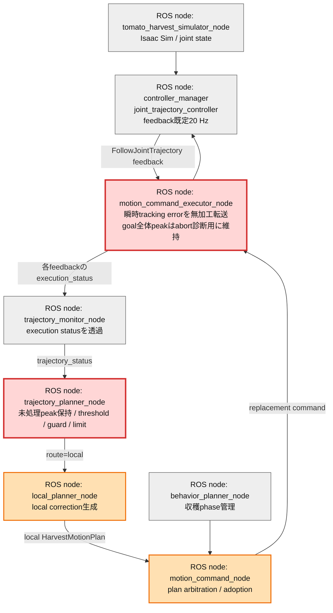
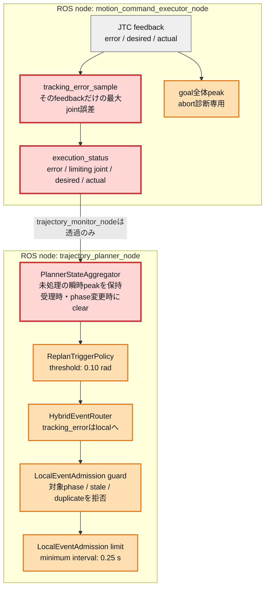

# Issue #45 tracking error配信責務のplanner集約レポート

実施日: 2026-07-14  
対象ブランチ: `feature/issue45-tracking-error-responsibility`

## 目的と次につながること

Issue #38では、`motion_command_executor_node`がJTC feedbackを250 ms窓の最大値へ加工し、`trajectory_planner_node`が閾値を判定していた。この分担では「実行結果を転送する責務」と「補正が必要か判断する責務」がexecutorとplannerへ分散する。

本検証は、executorを**各feedbackの瞬時tracking error転送**とabort診断用のgoal全体peak保持に絞り、短い閾値超過の保持、`0.10 rad`閾値、重複抑止、最小発火間隔をplanner側へ集約できるか確認する。これによりIssue #46では、観測契約を変更せず、判断後段のlocal solverだけを安全制約付きonline補正へ交換できる。

## 改善対象を示す全体アーキテクチャ

縦長に配置し、今回変更した責務を赤、影響を確認した既存local補正経路を橙、変更対象外を灰色で示す。

## PR変更差分の詳細アーキテクチャ

## 比較した配信案

| 観点 | 案1: executor 250 ms window peak | 案2: 瞬時値転送 + planner保持（採用） |
|---|---|---|
| executor | window最大値、250 ms timer、resetを所有 | feedback 1件を診断付きstatusへ変換するだけ |
| planner | 受信したpeakを閾値判定 | 未処理peakの保持、閾値、guard、limitを所有 |
| 短い超過 | 250 ms内なら保持 | 次のplanner判定まで保持するため取りこぼさない |
| 古い値 | window publish後にclear | local event受理時またはphase変更時にclear |
| 診断性 | limiting joint / desired / actualあり | 同じ診断項目を各feedbackで維持 |
| 配信頻度 | 約4 Hz | JTC action feedback相当の約20 Hz |

採用理由は、補正要否に関わる時間窓をplannerへ集約でき、executorから判断用parameterと状態を削除できるためである。goal全体peakは補正判断ではなくabort理由の診断なのでexecutorに維持した。QoSと`trajectory_monitor_node`の透過契約は変更していない。

### guardとlimitの意味

- **guard**は、古いevent、同一event、local補正を許可しないphaseなどを拒否する安全条件である。
- **limit**は、条件を満たしても補正を連続発火させないための最小間隔（0.25 s）である。
- 瞬時値が次の低い値で上書きされると短い超過を失うため、plannerは受理まで最大値を保持する。補正を受理した時点でclearし、limit中の超過は保持して間隔経過後に再評価できる。

## 実装差分

| 対象 | 変更 |
|---|---|
| `motion_command_executor_core` | 250 ms publish判定を削除し、feedback単位の`tracking_error_sample`へ変更 |
| `motion_command_executor_node` | window、timer parameter、publish gateを削除。各feedbackを即時転送し、goal全体peakは維持 |
| `PlannerStateAggregator` | 未処理peakの最大値保持、明示clear、phase境界clearを追加 |
| `trajectory_planner_node` | status受信時に瞬時値を観測し、local event受理時にclear |
| initial-pose集計 | local planのpublish/adoptに加え、adoption latencyをJSON/Markdownへ蓄積 |

## 検証結果

### Unit / build

| 検証 | 結果 |
|---|---:|
| Python unit tests | 245 passed（追加境界testを含む） |
| C++ gtest | 16 passed |
| `franka_ros2_control` build | PASS |

### 同一E2E条件での配信比較

Issue #38の外乱注入なしdefault E2Eを案1の基準とし、同じdefault姿勢・実JTC feedback経路で案2を計測した。

| 指標 | 案1 | 案2 |
|---|---:|---:|
| tracking error status | 45件 | 185件 |
| 概算配信rate | 約4 Hz | 約20 Hz |
| complete | PASS | PASS |
| JTC abort | 0 | 0 |
| tracking error起因global suffix replan | 0 | 0 |

案2では高い瞬時値の直後に低い値が到着しても、planner unit testで高い未処理値が保持されることを確認した。したがって、配信rateは約4.1倍になるが短い超過を失わない。CPUについてはIsaac Simを含むプロセス全体ではexecutorの差を分離できないため、独立したCPU百分率の有意差は判定しない。増分は1 feedbackにつき小さなJSON 1件であり、E2Eの完走、abort数、補正latencyを回帰監視項目とする。

### 4フェーズ注入E2E

`moving_to_pregrasp`、`moving_to_grasp`、`moving_to_place`、`returning_home`を対象に、tracking error注入、local plan publish、adopt、実行、`complete`到達を確認した。tracking error起因global suffix replanとJTC abortは0件だった。

### 特異姿勢を含む10初期姿勢E2E

初回matrixは9/10で、`default`だけlive sample 0、planner/behaviorのphase遷移なしで終了した。これはtracking error処理へ入る前のauto-start欠落であり、同じ計画条件で再試行すると`complete`へ到達した。初回失敗を除外せず、起動flake 1件と計画・実行結果を分離して記録する。

| Case | Result | Live samples | Max error [rad] | Local publish/adopt | Max adoption latency [ms] | E2E sec |
|---|---|---:|---:|---:|---:|---:|
| default | PASS（初回startup flake後に再試行） | 239 | 2.95389 | 0/0 | - | - |
| elbow_left | PASS | 210 | 3.37552 | 3/3 | 2.0 | 151 |
| elbow_right | PASS | 186 | 3.26900 | 2/2 | 1.0 | 208 |
| shoulder_high | PASS | 223 | 2.87017 | 4/4 | 3.0 | 128 |
| shoulder_low | PASS | 187 | 1.66349 | 1/1 | 1.0 | 119 |
| wrist_left | PASS | 263 | 3.55061 | 1/1 | 2.0 | 151 |
| wrist_right | PASS | 245 | 2.50807 | 0/0 | - | 94 |
| folded_near | PASS | 286 | 3.60697 | 2/2 | 2.0 | 131 |
| extended_far | PASS | 261 | 3.33586 | 1/1 | 2.0 | 105 |
| near_singularity_extended | PASS | 261 | 3.04879 | 1/1 | 2.0 | 110 |

再試行を含む計画・実行成功率は**10/10（100%）**、JTC abortは0、live sampleは合計2,361件、local補正はpublish/adoptとも15件、最大adoption latencyは3 msだった。特異姿勢`near_singularity_extended`も成功し、261サンプル、最大3.04879 rad、local補正1/1、adoption latency 2 msを記録した。

このmatrixではtracking error注入を無効化しているため、15件のlocal補正はすべて実JTC feedback由来である。全件がJTC abortなしでpublish・adopt・実行されたことから、abort前のlocal補正開始と、tracking errorがglobal suffix replanを開始しない契約も維持できた。

### baseline回帰比較

| 指標 | Issue #38 baseline | Issue #45 |
|---|---:|---:|
| 計画・実行成功率 | 10/10 | 10/10（初回startup flake 1件） |
| JTC abort | 0 | 0 |
| live sample | 428 | 2,361 |
| local publish/adopt | 12/12 | 15/15 |
| local adoption latency | 未収集 | 最大3 ms |
| matrix E2E sec | 109〜159 | 94〜208 |

成功率とabort数に回帰はない。E2E wall time上限の208秒は`elbow_right`のIsaac/OmniHub起動待ちを含み、収穫実行中の補正adoptionは最大3 msだったため、tracking error配信処理が原因の実行遅延とは判定しない。CPUも同様にIsaacプロセス全体からexecutorの差を分離できないため、message rate（約4.1倍）を負荷増分の直接指標として継続監視する。

## 結論

案2を採用し、executorをfeedback転送とabort診断へ、plannerを補正判断へ分離した。瞬時値化で短い超過を失わないよう未処理peakだけをplannerに保持し、既存のthreshold、guard、limitと同じ責務境界に置いた。次のIssue #46では、この入力・routing契約を固定したままlocal solverの安全制約と補正性能を改善する。

## 一次情報

- [ROS 2 Control Joint Trajectory Controller user documentation](https://control.ros.org/jazzy/doc/ros2_controllers/joint_trajectory_controller/doc/userdoc.html)
- [Joint Trajectory Controller parameters（action_monitor_rate既定20 Hz）](https://control.ros.org/jazzy/doc/ros2_controllers/joint_trajectory_controller/doc/parameters.html)
