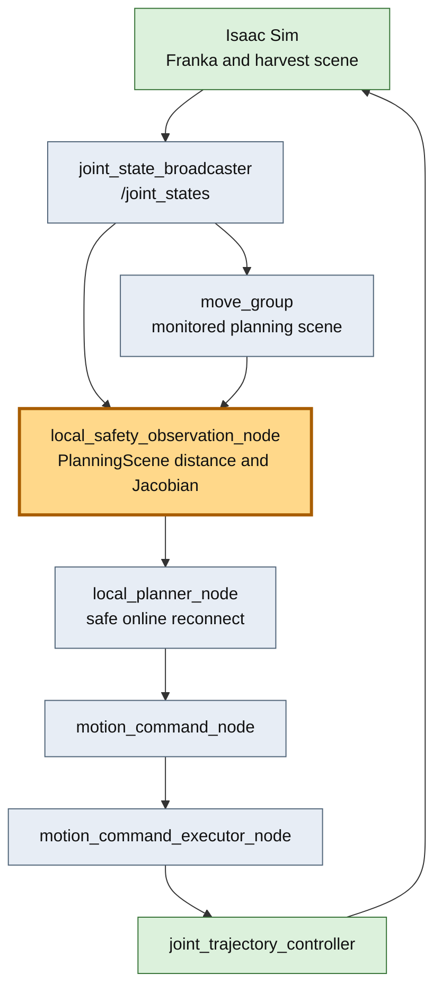
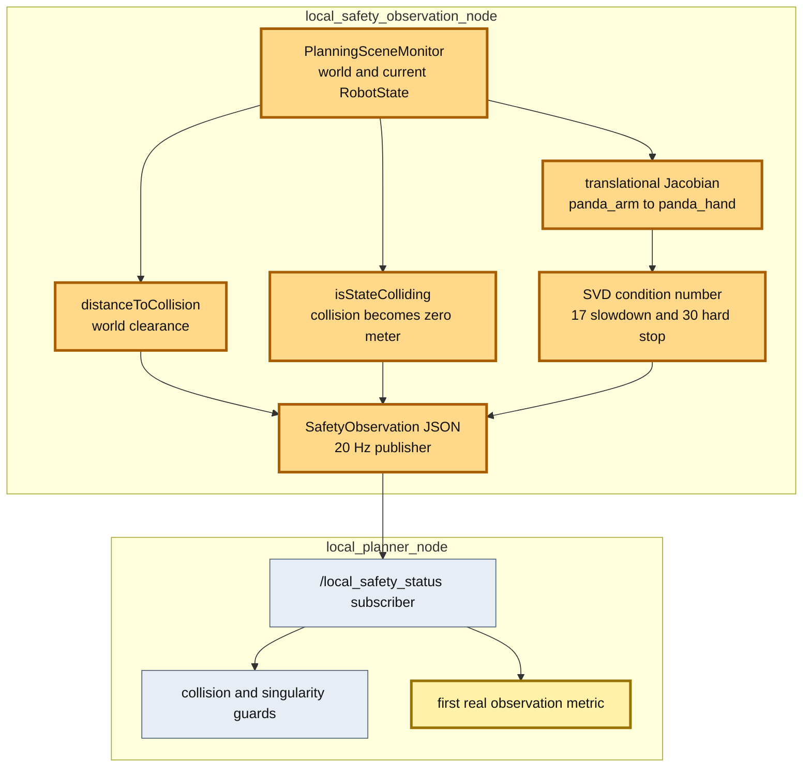

# Issue #46-2 PlanningScene・Jacobian安全観測adapter検証レポート

## 目的

Issue #46ではsafe online reconnect solverと`/tomato_harvest/local_safety_status`入力境界までを実装したが、実環境から`collision_clearance_m`と`singularity_measure`を生成するproducerがなかった。本検証の目的は、MoveIt PlanningSceneと現在RobotStateのJacobianから両値を周期生成し、local solverへ実入力できるようにすることである。

これにより次は、collision近接物体または特異姿勢を意図的に作り、local planがJTCへ渡る前に減速・停止することをE2Eで検証できる。

## 改善対象を示す全体アーキテクチャ

橙色がIssue #46-2の追加範囲である。新しいROS nodeを1つ追加し、Issue #46のlocal planner interfaceは変更していない。

## PR変更差分の詳細アーキテクチャ

## 計算方法

### Collision clearance

PlanningSceneのAllowed Collision Matrixを使ってrobotとworld objectの最小距離を計算する。world objectがまだない場合や距離backendが最大値を返す場合は`1.0 m`へ上限化する。`isStateColliding()`がtrueの場合はself/worldの区別にかかわらず`0.0 m`を送る。

global planner用URDFへcollision geometryを加えると、把持時の意図的なhand–tomato接触までplanning failureになった。そのためglobal plannerは従来URDFを維持し、adapterだけが保守的なsphere/box primitive modelを使う。これは公式Franka meshと同等の精密モデルではない。

### Singularity measure

`panda_arm`から`panda_hand`までのJacobianのうち、収穫補正で支配的な並進3行をSVDする。condition number 17以下を安全側の`1.0`、30以上をhard-stop側の`0.0`とし、その間を線形正規化する。姿勢だけのwrist singularityで並進補正を不要停止させないため、今回は6D Jacobian全体ではなくtranslational blockを採用した。

## 検証結果

### Build・unit test

- ROS 2 Jazzy / MoveIt 2環境のclean build: 成功
- C++ test: 25件成功、failure 0
- 新規adapter core test: 5件成功
  - condition number 17 / 30の境界
  - well-conditioned / invalid Jacobian
  - 既存JSON contract
- Python test: 229件成功、2件skip

### default姿勢 no-injection E2E

- 収穫結果: PASS
- JTC abort: 0
- safety observation: 49 samples
- collision clearance観測範囲: `0.0–1.0 m`
- singularity measure観測範囲: `1.0–1.0`
- terminal phase到達: 1351 / 1800 simulation steps

PlanningSceneへharvest objectsが入る前はclearance `1.0 m`、実行中は`0.0621 m`などの近接値、意図的接触中は`0.0 m`を観測した。global planner用collision modelを分離した後は従来の収穫完了を維持した。

### 特異姿勢初期ケース no-injection E2E

- ケース: `near_singularity_extended`
- 収穫結果: PASS
- safety observation: 47 samples
- local plannerでの実入力受信metric: 1件以上
- local plan: `returning_home`で1件publish
- solver latency: `0.173 ms`
- 観測したsingularity measure: `1.0`

初期姿勢からのglobal recoveryが先にhome経由へ切り替えるため、1秒間隔のadapter診断ログでは低いJacobian marginを捕捉しなかった。一方、20 Hz topicの購読、safe online solverへの実値入力、local plan生成までの接続は確認できた。特異姿勢hard-stop自体の再現には、home回避を無効化せず実行中だけJacobianを劣化させる専用注入が必要である。

## 結論と残課題

PlanningSceneとJacobianを用いる安全観測adapterを追加し、Issue #46の入力境界へ実値を20 Hzで供給できた。global planningと観測用collision modelを分離したため、把持計画の既存挙動も維持している。

残課題は次の2点である。

- primitive collision modelは保守的な近似である。公式`franka_description` meshまたはIsaac Sim collision shapeとの整合検証が必要。
- 今回のE2Eはno-injectionであり、意図的なcollision proximityとJacobian singularityに対するlocal planのslow/stop・global recovery委譲は次の注入試験で確認する。
