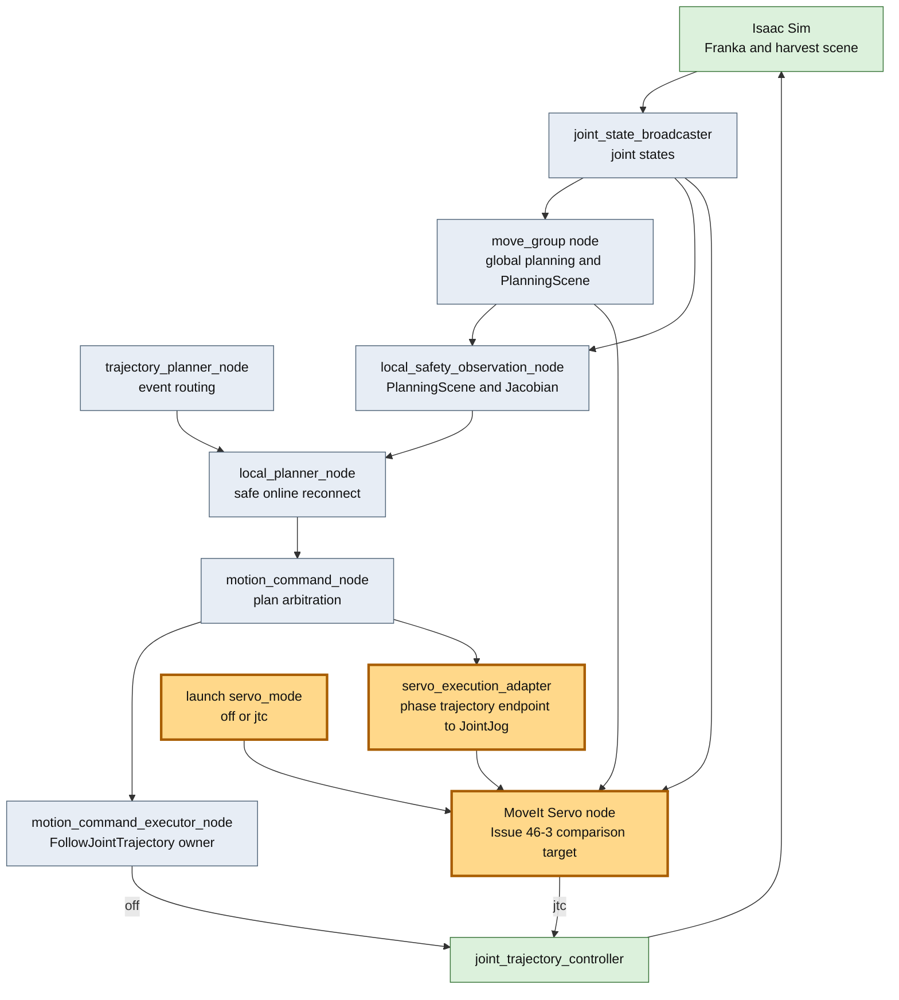
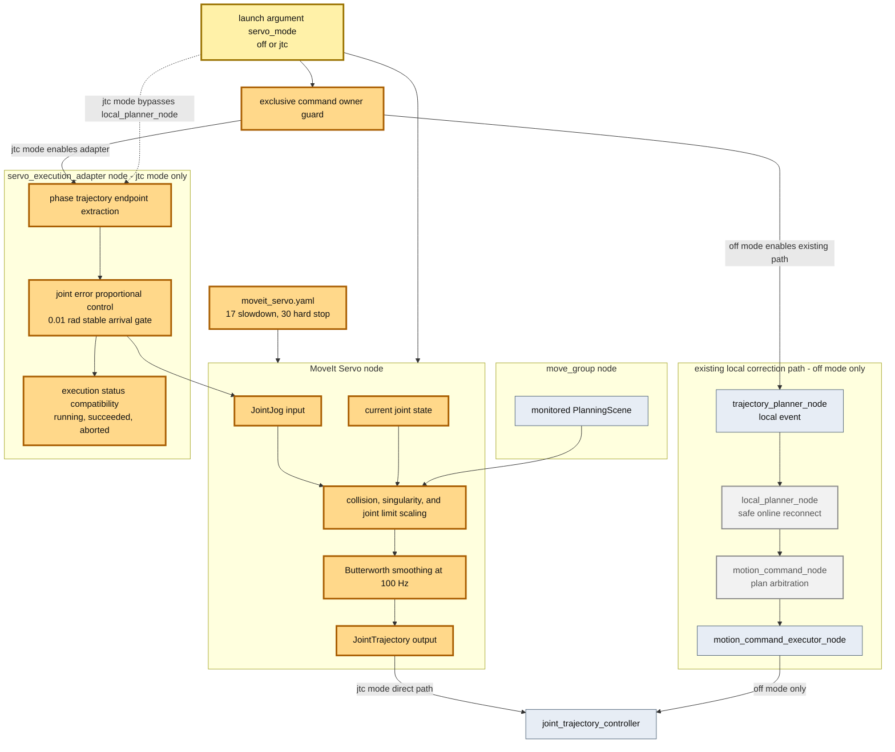

# Issue #46-3 MoveIt Servo node比較検証レポート

## 目的

Issue #46の`safe online reconnect`とIssue #46-2の安全観測adapterに対し、MoveIt公式のServo nodeを追加した場合の接続性、安全機能、既存E2Eへの影響を比較する。本検証ではlaunch引数で既存action経路とServoからJTCへの直接接続を排他的に切り替え、既存実装を削除できるだけの非劣化根拠が揃ったかを判断する。

## 改善対象を示す全体アーキテクチャ

橙色がIssue #46-3の追加範囲である。図を縦方向にし、変更nodeと既存nodeの大枠を区別した。比較時は`servo_mode:=jtc`でServoの`JointTrajectory`をJTCへ接続し、その間は既存executorを起動しない。

## PR変更差分の詳細アーキテクチャ

灰色で示した`local_planner_node`は既存local correction経路であり、`servo_mode:=off`の場合だけ起動する。`servo_mode:=jtc`では`local_planner_node`と`motion_command_executor_node`を通らない。一方、global planとphase契約を維持する`motion_command_node`は共通であり、そのtrajectory終端を新設`servo_execution_adapter`がJointJogへ変換する。Servoが生成した短周期`JointTrajectory`だけがJTCへ直接入る。

## 比較条件

| 項目 | 既存safe online reconnect | MoveIt Servo node |
|---|---|---|
| 入力 | phase付きglobal trajectory、現在関節角、安全観測 | 連続するJointJog、TwistまたはPose、現在関節角、PlanningScene |
| 出力 | phase lifecycleを保つ補正plan | controller向け短周期JointTrajectory |
| collision | 外部adapter値でguard・減速 | CIでは外部PlanningScene安全観測adapter。Servo内部判定はcollision geometry追加後に有効化 |
| singularity | adapterの並進Jacobian指標 | Servo内部Jacobian condition number |
| 完了判定 | 既存executor/action/behavior planner | Servo単体には収穫phase完了契約がない |
| controller ownership | FollowJointTrajectory actionの単一owner | 直接topic接続すると別command producerになる |

Servoはlocal solverの計算機能だけを差し替える部品ではなく、controllerへ連続commandを送る実行系を含む。この契約差のため、launch modeごとにJTCのcommand ownerを排他化した。

## 実装内容

- CI imageへ`ros-jazzy-moveit-servo`を明示追加した。
- `moveit_servo.yaml`を追加し、100 Hz、collision check 20 Hz、singularity閾値17/30、joint margin 0.10 radを設定した。
- `move_group`をPlanningSceneの正本とし、Servo側は`is_primary_planning_scene_monitor: false`とした。
- `servo_mode:=off`ではServoを起動せず、既存executorをJTCへ接続する。
- `servo_mode:=jtc`ではServo出力を`/joint_trajectory_controller/joint_trajectory`へ接続し、既存executorを起動しない。
- `servo_execution_adapter`を追加し、既存phase trajectoryの終端を50 HzのJointJogへ変換した。0.01 rad以内を3周期確認して成功とし、timeout・不完全feedbackはabortにする。
- JTCが終端速度ゼロを要求するため、Servo出力はposition-only `JointTrajectory`とした。
- CI URDFにはcollision geometryがないためServo内部collision checkは無効とし、Issue #46-2のPlanningScene/Jacobian安全観測adapterを継続した。
- CI E2E runnerでは`TOMATO_HARVEST_SERVO_MODE`をlaunch引数へ透過する。Issue #46-4の速度Gate通過後、PR CIでServo経路を常時検証するため既定値を`jtc`へ変更した。`off`は明示fallbackとして維持する。

## 検証結果

### 設定・契約test

- Servo adapter/config test: 10件成功、failure 0
- repository Python test: 263件成功、2件skip
- off、jtcの2 modeだけが定義されることを確認
- jtc modeで既存FollowJointTrajectory executorを停止することを確認
- collision geometry未提供時の外部安全観測経路、singularity、joint margin設定を確認
- Servoが明示opt-inであることを確認
- CI imageにServo packageが明示依存されることを確認

launch interfaceでは`servo_mode`の既定値を`jtc`、有効値を`off`、`jtc`として公開する。PR CIは環境変数を省略してこの既定経路を検証する。

### ROS 2 Jazzy clean build・起動

- 対象: `ros-jazzy-moveit-servo 2.12.4`
- `franka_ros2_control` clean build: 成功
- Servo node process起動: 成功
- Panda robot model / KDL kinematics読込: 成功
- `/joint_states`購読: 成功
- `/monitored_planning_scene`購読: 成功
- Servo初期化: 成功

### 同条件E2E比較

両経路を初期姿勢`default`、`CI_HEADLESS_STEPS=3000`、同一Isaac Sim sceneで各1回実行した。

| 指標 | 既存executor (`off`) | MoveIt Servo (`jtc`) | 判定 |
|---|---:|---:|---|
| 収穫terminal phase | `complete` | `complete` | 同等 |
| target_foundからcomplete | 15.159 s | 27.223 s | Servo 79.6%遅い |
| moving_to_pregrasp | 6.323 s | 9.845 s | Servoが遅い |
| moving_to_grasp | 1.352 s | 7.179 s | Servoが遅い |
| tracking error peak | 3.17759 rad | 1.47489 rad | Servoが小さい |
| Servo終端誤差 | 対象外 | 最大0.009937 rad | 0.01 rad gate内 |
| Servo adapter abort | 対象外 | 0 | 成功 |

Servoの`moving_to_grasp`中には同名commandの更新が1回あり、adapterは最新終端へ安全に差し替えた。最終的には物理把持、detach、place、homeの全phaseを完了した。なお1回比較であり、成功率や分散の結論には10初期姿勢・複数runが必要である。

### 比較判定

Issue #46-3時点ではServo経路が79.6%遅く非劣化Gateを満たさなかったが、Issue #46-4の速度調整後2回は14.768秒、12.122秒で既存15.159秒と同等以上になった。このためPR CIの既定経路を`jtc`へ切り替える。ただし10初期姿勢と安全注入Gateは未完了のため、`safe_online_solver.py`、`local_planner_node`、`motion_command_executor_node`は`off` fallbackとして削除しない。

## 置換計画

置換は次の順序で行う。

1. 完了済み: `ServoExecutionAdapter`へServo command連続供給、到達・timeout判定、既存status契約を集約した。
2. 完了済み: launch modeでexecutorとServoを排他化し、JTC command producerを常に1つにした。
3. Servoのgain、速度上限、到達許容値を安全条件内で調整し、特にgrasp phaseの7.179 sを短縮する。
4. collision geometryをCI/production URDFへ追加し、Servo内部collision checkを再度有効化する。
5. 既存とServoを同じ10初期姿勢、tracking error注入、collision近接、特異姿勢注入でA/B実行する。
6. harvest成功率、JTC abort、phase timeout、tracking error peak、local recovery latency、最小clearanceを比較する。
7. 全指標で非劣化、かつ安全注入caseで同等以上を2回連続CI runで満たした場合だけServoをdefaultへ切り替える。
8. default切替後も1リリースは既存solverをfallbackとして残し、回帰がないことを確認してから`safe_online_solver.py`と専用selectorを削除する。

## 削除対象となる範囲

非劣化gate通過後に削除候補となるのは、`safe_online_solver.py`、そのunit test、`TOMATO_HARVEST_LOCAL_SOLVER=safe_online` selector、local planner内のsafe-online固有変換である。event routing、phase整合、plan arbitration、安全観測adapterはServo採用後も必要なため削除しない。

## 結論

MoveIt Servo nodeと`ServoExecutionAdapter`を実装し、launchで`off`、`jtc`を排他的に切り替えて、両経路の同条件E2E完了を確認した。Servoはtracking error peakを3.17759 radから1.47489 radへ抑えた一方、target_foundからcompleteまで15.159 sから27.223 sへ79.6%遅くなった。よって非劣化Gateは不合格とし、既存実装は削除せず既定経路として維持する。次のGateは速度調整、collision geometry導入、10初期姿勢・安全注入を含む反復比較である。

## 参照

- [MoveIt Realtime Servo tutorial](https://moveit.picknik.ai/main/doc/examples/realtime_servo/realtime_servo_tutorial.html)
- [MoveIt 2 Jazzy Servo parameters](https://github.com/ros-planning/moveit2/blob/jazzy/moveit_ros/moveit_servo/config/servo_parameters.yaml)
- [MoveIt 2 Jazzy Panda Servo config](https://github.com/ros-planning/moveit2/blob/jazzy/moveit_ros/moveit_servo/config/panda_simulated_config.yaml)
