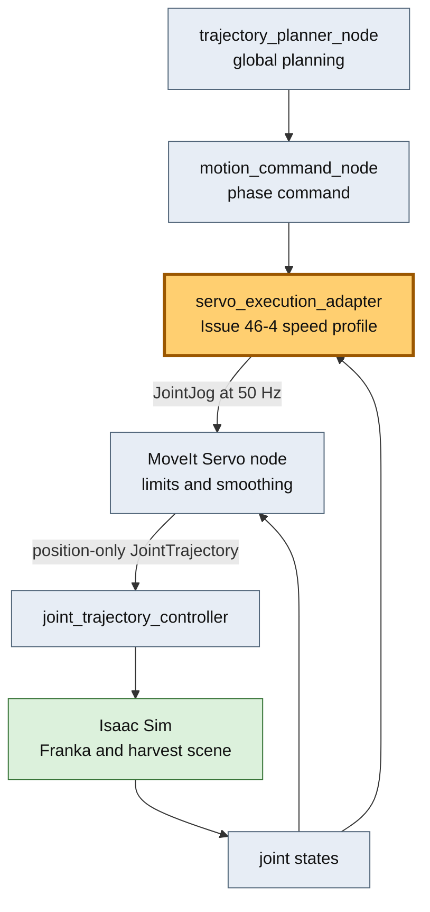
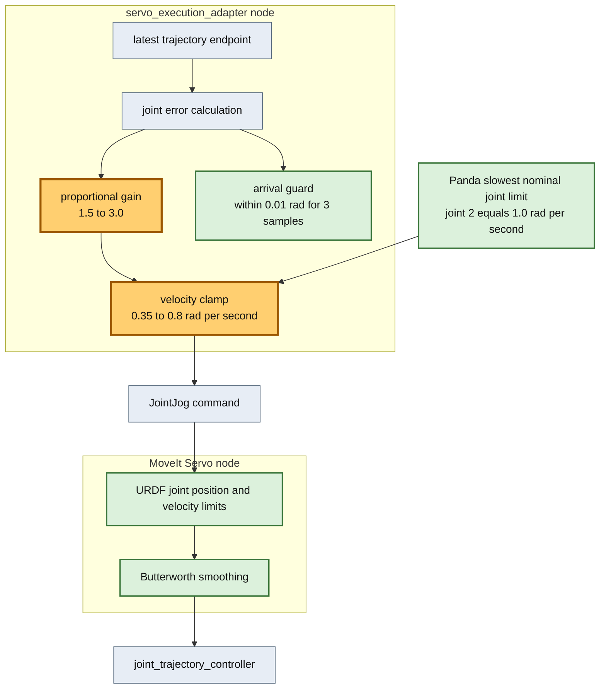

# Issue #46-4 MoveIt Servo速度調整レポート

## 目的

Issue #46-3でMoveIt Servo経路は収穫E2Eに成功したが、`target_found`から`complete`まで27.223秒かかり、既存executorの15.159秒より79.6%遅かった。本検証は、Frankaの関節速度制約、MoveIt Servoのjoint limit処理、平滑化、0.01 rad到達条件を維持したまま、既存経路と同等程度まで短縮できるかを確認する。

## 改善対象を示す全体アーキテクチャ

橙色が今回の調整箇所である。global planning、MoveIt Servo、JTC、物理sceneは変更せず、既存trajectory終端へ追従するadapterの速度プロファイルだけを変更した。

## PR変更差分の詳細アーキテクチャ

0.8 rad/sはPandaの最小公称関節速度上限1.0 rad/sより20%低い共通上限である。MoveIt Servo側のURDF joint limit処理とButterworth smoothing、およびadapterの到達・timeout guardは変更していない。

## 調整方針

MoveIt Servoの`command_in_type`は`speed_units`である。この場合JointJogの`velocities`はrad/sとして直接解釈され、`scale.joint`はunitless入力時にだけ使われる。そのため`moveit_servo.yaml`の`scale.joint`ではなく、adapterの以下2値を調整した。

| パラメータ | Issue #46-3 | Issue #46-4 | 意図 |
|---|---:|---:|---|
| 比例gain | 1.5 | 3.0 | 小さい終端誤差でも減速しすぎない |
| 共通速度clamp | 0.35 rad/s | 0.8 rad/s | 最小公称上限1.0 rad/sに20%余裕を残す |
| 到達許容値 | 0.01 rad | 0.01 rad | 把持精度を維持 |
| 安定sample数 | 3 | 3 | 一瞬の通過を成功扱いしない |

## E2E比較条件

- 初期姿勢: `default`
- scene、物理設定、planning設定: 同一
- Servo mode: `jtc`
- headless上限: 3000 steps
- 既存executor値と調整前Servo値はIssue #46-3の同条件測定値
- 調整後は再現性確認のため2回実行

## 検証結果

| 経路 | Run | terminal phase | target_foundからcomplete | abort |
|---|---:|---|---:|---:|
| 既存executor | 基準 | `complete` | 15.159 s | 比較基準 |
| 調整前Servo | 基準 | `complete` | 27.223 s | 0 |
| 調整後Servo | 1 | `complete` | 14.768 s | 0 |
| 調整後Servo | 2 | `complete` | 12.122 s | 0 |
| 調整後Servo | 平均 | `complete` | 13.445 s | 0 |

調整後2回はいずれも既存executorより速く、平均では11.3%短縮した。調整前Servo比では平均50.6%短縮したため、「変更前と同等程度まで速度を上げられるか」というGateは通過と判断する。

### phase別結果

| phase | 調整前Servo | 調整後Run 1 | 調整後Run 2 |
|---|---:|---:|---:|
| moving_to_pregrasp | 9.845 s | 5.763 s | 4.450 s |
| moving_to_grasp | 7.179 s | 2.320 s | 2.240 s |
| returning_home | 5.677 s | 4.183 s | 2.923 s |

最大のボトルネックだった`moving_to_grasp`は約68%短縮した。両runともgrasp、detach、place、return homeを完了している。

### 精度・tracking errorの解釈

- 成功時の最大関節終端誤差はRun 1が0.009362 rad、Run 2が0.009360 radで、0.01 rad gate内だった。
- adapter abortは両runとも0だった。
- 記録上のtracking error peakはRun 1が3.346120 rad、Run 2が1.456645 radだった。
- この値は既存executorの軌道時刻に対する追従偏差と同一ではなく、adapterでは「現在姿勢から最新trajectory終端までの残差」である。新command受信直後は意図的に大きくなるため、経路間の制御品質をpeak値だけで直接比較しない。

## 判定と残課題

速度Gateは通過した。ただし、今回の2回は同一初期姿勢であり、Servoへの全面置換Gateはまだ通過していない。次に必要なのは以下である。

1. 10初期姿勢と特異姿勢を含む反復E2Eで成功率と時間分散を測る。
2. tracking error注入、collision近接、joint limit近接caseで安全停止と回復を確認する。
3. CI/production URDFへcollision geometryを追加し、Servo内部collision checkを再有効化する。
4. 経路間で同一定義になるJTC desired-versus-actual tracking errorを収集する。

速度Gate通過後はPR CIでServo経路を常時検証するため、defaultを`jtc`へ変更する。既存executor、`local_planner_node`、safe online solverは`off` fallbackとして現時点では削除しない。今回の結果は速度面の置換条件だけを満たしたものである。

## テスト

- 調整profile unit test: 成功
- Servo adapter/config test: 11件成功
- 調整後GPU E2E: 2回とも成功
- repository Python test: 264件成功、2件skip

## 参照

- [MoveIt Realtime Servo tutorial](https://moveit.picknik.ai/humble/doc/examples/realtime_servo/realtime_servo_tutorial.html)
- [MoveIt Servo command scaling source](https://moveit.picknik.ai/humble/api/html/servo__calcs_8cpp_source.html)
- [Franka Control Interface robot limits](https://frankarobotics.github.io/docs/robot_specifications.html)
