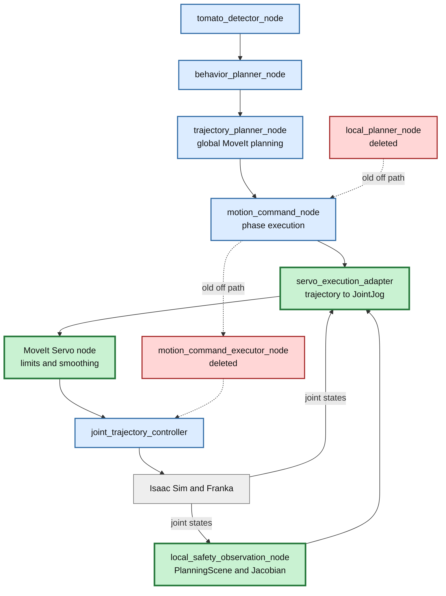

# Issue #46-5 Servo Gate判定と旧実行経路削除レポート

## 目的

Issue #46-3、#46-4で追加・速度調整したMoveIt Servo経路が、既存executorと同等以上の所要時間で収穫E2Eを完走し、PR CIでも再現できることを確認する。その結果を全面置換Gateとして判定し、二重保守になっていた`off`経路、`motion_command_executor_node`、`local_planner_node`、safe online solver、および専用テスト・CIを削除する。

この変更により、今後の安全性・追従性改善をMoveIt Servoの単一実行経路へ集中できる。旧経路の偶発的な起動や、2つのexecutorがJTCを競合して所有する構成も設計上発生しなくなる。

## Gate判定に用いた検証結果

| Gate | 結果 | 判定根拠 |
|---|---|---|
| 収穫E2E完走 | 成功 | 調整後Servo 2/2 runが`complete`、abort 0 |
| 速度劣化なし | 成功 | 既存executor 15.159 sに対しServo平均13.445 s（11.3%短縮） |
| 終端精度 | 成功 | 最大関節終端誤差0.009362 rad以下、0.01 rad gate内 |
| PR CI再現 | 成功 | PR #49 Actions run `29346477237`、`Unit And Servo E2E`が4分48秒で成功 |

以上から、Servo全面置換Gateは通過と判定する。同runの後続`Legacy Local Planner E2E`は3分31秒で失敗したが、失敗対象は廃止する旧off経路だけであり、採用するServo経路のGate結果を変えない。本変更でこのjobと対象実装をworkflowから一体で削除する。

## 改善対象を示す全体アーキテクチャ

緑が全面採用するServo実行・安全観測範囲、赤が今回削除する旧`off`経路である。`local_safety_observation_node`は名前にlocalを含むが、local plannerではない。PlanningSceneとJacobianからServo adapterへ安全観測値を供給するため維持する。

## PR変更差分の詳細アーキテクチャ

```mermaid
flowchart TB
  classDef kept fill:#c9f2d2,stroke:#287a3d,stroke-width:3px,color:#111
  classDef deleted fill:#ffd6d6,stroke:#a62929,stroke-width:2px,color:#111
  classDef ci fill:#fff0b8,stroke:#9a7600,stroke-width:2px,color:#111

  subgraph Runtime["Runtime node graph"]
    Motion["motion_command_node"]:::kept
    Adapter["servo_execution_adapter"]:::kept
    Servo["MoveIt Servo node"]:::kept
    JTC["joint_trajectory_controller"]:::kept
    Motion --> Adapter --> Servo --> JTC

    Local["local_planner_node"]:::deleted
    Solver["safe_online_solver"]:::deleted
    Executor["motion_command_executor_node"]:::deleted
    Solver -.-> Local -.-> Motion
    Motion -.-> Executor -.-> JTC
  end

  subgraph Launch["Launch and mode selection"]
    Mode["servo_mode off or jtc switch"]:::deleted
    Always["MoveIt Servo unconditional launch"]:::kept
    Mode -.-> Always
  end

  subgraph CI["GitHub Actions"]
    ServoCI["Unit And Servo E2E<br/>single required job"]:::ci
    LegacyCI["Legacy Local Planner E2E<br/>deleted"]:::deleted
  end
```

### 削除範囲

- C++ `motion_command_executor_node`、core、header、gtest、CMake依存。
- Python `local_planner_node`、`safe_online_solver`とそのunit test。
- `servo_mode=off` launch分岐と環境変数。MoveIt Servoを常時起動する。
- local planner外乱注入、suffix/local専用E2E検査、`Legacy Local Planner E2E` job。
- tracking errorのlocal routeとlocal event admission。Servo運転中のtracking errorは観測し、安全停止判断に使うが、削除済みlocal plannerへ配送しない。

### 維持する検証

- repository unit test。
- Servo経路によるIsaac Sim収穫E2E完走。
- Servo adapterがJTC feedback由来のtracking errorを周期配信する検査。
- PlanningSceneとJacobianを使う安全観測adapter。

## CI結果の解釈

PR #49のrun `29346477237`では、削除前workflowの先頭ジョブ`Unit And Servo E2E`が成功した。これはunit test、MoveIt Servo、JTC、Isaac Simを通る採用後と同じ実行経路の完走証跡である。後続のLegacy jobの失敗は、旧off経路のlocal補正検証に限定される。本変更後は旧実装とjobの双方が存在しないため、次回PR CIはServo単一jobで判定する。

## ローカル回帰結果

- Servo単一路・CI構成テスト: 11件成功。
- repository Python test: 238件成功、2件skip（削除対象専用テストを除去後）。
- shell構文検査とlaunch Python構文検査: 成功。
- C++ package buildとIsaac Sim E2E: push後の単一Servo PR CIで最終確認する。

## 結論

Servo全面置換Gateは通過した。実行経路を`motion_command_node → servo_execution_adapter → MoveIt Servo → JTC`へ一本化し、旧`off`経路とlocal planner関連資産を削除する。以後の性能・安全Gateはこの単一経路に対して蓄積する。
