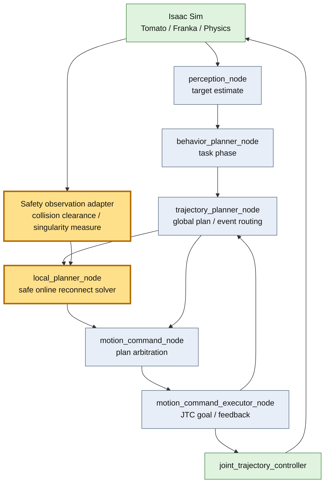

# Issue #46 安全制約付きonline local solver 検証レポート

## 目的と次につながる判断

tracking error発生時に現在関節状態からglobal plan終端へ直線補間していたlocal solverを、JTCへ渡す前に安全制約を検査するonline再接続solverへ置き換える。検証したいのは、10初期姿勢の収穫成功率を落とさず、危険な補正候補をpublish前に停止できるかである。この結果は、次段でcollision distance/JacobianをMoveIt Servo adapterから実入力する際のproducer契約と成功基準になる。

## 改善対象を示す全体アーキテクチャ



黄色が今回の変更・検証範囲である。ROS nodeの大枠としては`local_planner_node`だけを変更し、安全観測は同nodeが購読するadapter境界を追加した。

## PR変更差分の詳細アーキテクチャ

```mermaid
flowchart TB
  classDef added fill:#ffd6a5,stroke:#b45309,stroke-width:3px,color:#111
  classDef changed fill:#fff0a8,stroke:#a16207,stroke-width:3px,color:#111
  classDef kept fill:#e5e7eb,stroke:#4b5563,color:#111

  subgraph N[local_planner_node]
    Event[Hybrid planning event callback]:::kept
    State[/joint_states snapshot]:::kept
    Status[/local_safety_status adapter input]:::added
    Select[solver selector<br/>safe_online default / linear baseline]:::changed
    Guard[Safety guards<br/>collision / singularity / joint position]:::added
    Timing[Smoothstep time scaling<br/>velocity / acceleration limits]:::added
    Stamp[producer metadata stamping]:::kept
    Publish[harvest_motion_plan publisher]:::kept
    Stop[No publish + global recovery metric]:::added
  end

  Event --> Select
  State --> Select
  Status --> Guard
  Select --> Guard
  Guard -->|safe| Timing
  Guard -->|hard stop| Stop
  Timing --> Stamp --> Publish
```

### guardとlimitの意味

- collision guard: clearanceが`0.02 m`以下なら停止、`0.02–0.08 m`なら距離に応じて減速する。
- singularity guard: adapterのmanipulability指標、未提供時はPanda joint 4の伸展指標を使い、`0.05`以下で停止、`0.05–0.20`で減速する。
- joint position guard: Franka公式可動域から`0.05 rad`のmarginを内側に取り、開始点・目標点の逸脱を拒否する。
- velocity/acceleration limit: cubic smoothstepの解析上のpeak速度`1.5*d/T`とpeak加速度`6*d/T^2`から必要時間を決める。終端速度は必ず0になる。

危険時はtrajectoryを生成しないためJTCへunsafe goalは流れない。metricに`recovery=delegate_global_replan`を付け、global recoveryへ責務を戻す。これは実ロボットの安全認証ではない。

## solver比較と採用理由

| 案 | online性 | 安全制約 | 変更規模 | 判断 |
|---|---|---|---|---|
| 従来linear | あり | 速度の概算のみ | 最小 | `TOMATO_HARVEST_LOCAL_SOLVER=linear`で比較用に保持 |
| safe online reconnect | あり | collision/singularity/位置/速度/加速度 | producer内部だけ | 今回採用 |
| 短区間MoveIt replan | service待ち | planning scene全体 | latencyとIK枝変更が増える | hard-stop後のglobal recovery候補 |
| MoveIt Servo node | 高い | 公式のcollision/singularity/limit | command契約の変更が大きい | adapter実入力の次段候補 |

既存の`producer_kind / instance_id / revision`と`harvest_motion_plan`を変えず、下流を変更せずに比較できるsafe online reconnectを採用した。

## テスト結果

### 自動テスト

- Python全体: 229件成功、2件skip
- solver unit: endpoint、collision stop/slow、singularity stop/slow、joint margin、速度・加速度、baseline切替を確認
- `git diff --check`: 成功

### 10初期姿勢 no-injection E2E

`CI_HEADLESS_STEPS=1800`、4 phaseで通常local補正を有効化して実行した。最初の900-step試行はIsaac Sim初期化前に上限へ達したため、solver failureとは分離して再試験した。

| Case | Result | tracking samples | peak error rad | local publish/adopt | max adoption ms | E2E sec |
|---|---|---:|---:|---:|---:|---:|
| default | PASS | 318 | 3.00871 | 2/2 | 3 | 143 |
| elbow_left | PASS | 300 | 4.42352 | 2/2 | 3 | 106 |
| elbow_right | PASS | 240 | 2.56839 | 0/0 | - | 108 |
| shoulder_high | PASS | 229 | 4.58540 | 1/1 | 1 | 116 |
| shoulder_low | PASS | 237 | 2.78815 | 0/0 | - | 110 |
| wrist_left | PASS | 210 | 2.72061 | 3/3 | 2 | 101 |
| wrist_right | PASS | 276 | 3.11499 | 2/2 | 3 | 92 |
| folded_near | PASS | 235 | 2.24926 | 0/0 | - | 97 |
| extended_far | PASS | 269 | 2.96742 | 1/1 | 2 | 98 |
| near_singularity_extended | PASS | 215 | 3.24400 | 1/1 | 1 | 93 |

成功率は10/10（100%）、local planは12/12採用、最大adoption latencyは3 ms、JTC abortは0だった。Issue #41 baselineも10/10、最大2 msであり、成功率を維持しつつ最大値は1 ms増えた（実行間変動を含む）。

## 結論と残課題

安全制約付きsmooth online solverへの既定切替後も10姿勢成功率100%を維持した。危険入力のhard-stopと減速はunit testで再現できた。一方、今回の実E2Eではcollision clearance topicの実producerは未接続であり、collision guardの実scene距離検証は未完である。次はMoveIt PlanningScene/Servo側adapterからclearanceとJacobian指標を周期供給し、collision近接注入と特異姿勢注入でstop理由、停止距離、復帰latencyをE2E計測する。
