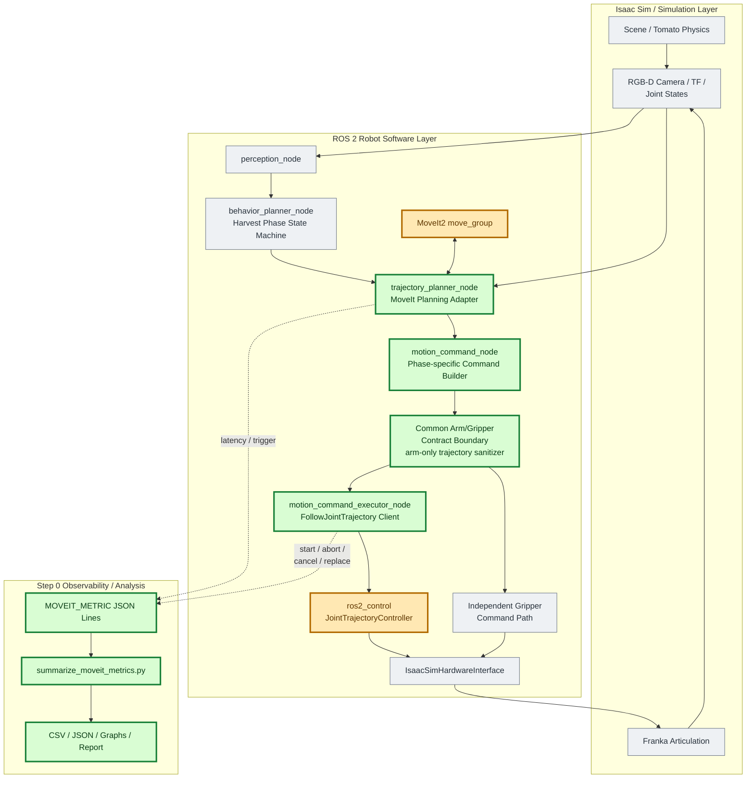
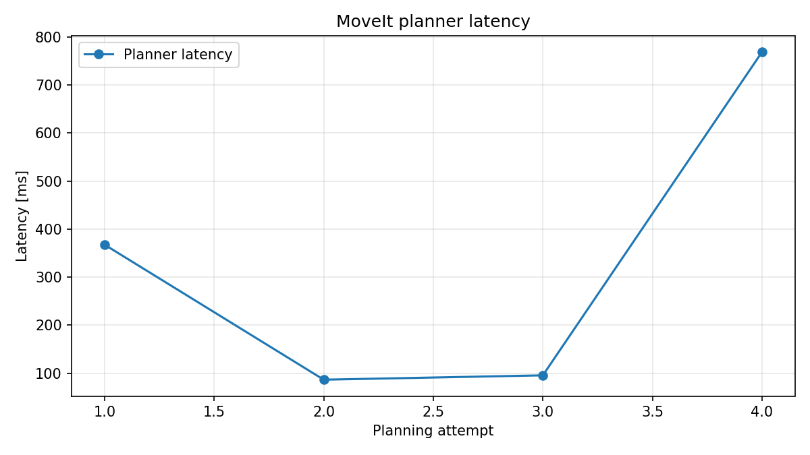
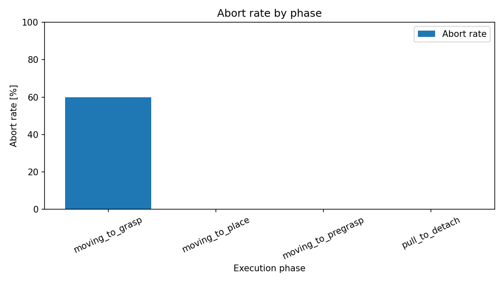

# MoveIt 改善 Step 0: 観測追加基盤レポート

## 1. 目的

GitHub Issue #8 と `docs/planning_movit2_improvements.html` の Step 0 に従い、後続の
replanning 改善を比較できる現行基準線を作る。制御規則は変更せず、planner latency、
cancel 回数、phase 別 abort 率、trajectory 差し替え回数を構造化ログとして取得する。

### 1.1 全体アーキテクチャと今回の検証範囲



| 色 | 意味 | 今回の扱い |
| --- | --- | --- |
| 緑 | 直接変更・検証した範囲 | planner/executor観測、command生成、共通sanitizer、集計とレポート |
| 橙 | E2Eで入出力・結果を観測した外部境界 | MoveIt2 planning service、ros2_control JTC action |
| 灰 | 全体アーキテクチャ上は必要だが今回変更していない範囲 | Isaac Sim、認識、behavior、物理、hardware bridge |

実線は制御・データフロー、点線は観測イベントを表す。今回の検証は、計画要求からarm JTCの
goal結果までの経路と、その経路から生成されるStep 0メトリクスに限定した。認識精度、収穫物理、
gripper力制御、cycle完走性は全体図に含まれるが、今回の合否判定対象ではない。

## 2. 実行条件

| 項目 | 値 |
| --- | --- |
| 対象 branch | `feature/moveit2-improvements` |
| 対象 base commit | `cec0de26a575a391847247abc79353d2edd55e22` |
| 実行日時 | 2026-07-10 12:54 UTC（2026-07-10 21:54 JST） |
| 構成 | Isaac Sim 6.0 / ROS 2 Jazzy / MoveIt2 / ros2_control JTC |
| mode | `--isaac --moveit --headless --auto-start` |
| headless steps | 900 |
| grasp mode | `success` |
| unit test | Python 109件、C++ 5件、全件成功 |
| E2E result | cycle 未完了。`moving_to_place` 実行中に 900 steps が終了 |

E2E 実行コマンド:

```bash
CI_ARTIFACT_ROOT=/tmp/moveit-step0-e2e ./scripts/ci/run_e2e.sh
```

集計の再実行コマンド:

```bash
MPLCONFIGDIR=/tmp/moveit-mpl XDG_CACHE_HOME=/tmp/moveit-xdg \
python3 scripts/summarize_moveit_metrics.py \
  docs/reports/moveit_replanning/step0_artifacts/robot_node.log \
  docs/reports/moveit_replanning/step0_artifacts/franka_controller.log \
  --output-dir docs/reports/moveit_replanning/step0_artifacts
```

## 3. 取得メトリクス

ログは `MOVEIT_METRIC {JSON object}` 形式とした。通常の ROS ログと同居しても固定
prefix から抽出でき、JSON と CSV の双方へ再集計できる。

| 指標 | イベント | 集計方法 |
| --- | --- | --- |
| planner latency | `planner_completed` | `latency_ms` の件数、平均、最小、最大 |
| cancel 回数 | `trajectory_cancel_requested` | event 件数 |
| phase 別 abort 率 | `trajectory_started`, `trajectory_aborted` | aborted / started |
| trajectory 差し替え回数 | `trajectory_replaced` | event 件数 |
| replan 発火理由 | `planner_completed.trigger` | `target_found` / `trajectory_aborted` |

生ログと集計結果は `docs/reports/moveit_replanning/step0_artifacts/` に保存した。

## 4. 結果

### 4.1 planner latency

- planning: 4回
- 平均: 329.538 ms
- 最小: 86.520 ms
- 最大: 768.542 ms



初回 full-chain planning は 367.508 ms だった。`moving_to_grasp` の abort を起点とする
再計画は 86.520 ms、95.583 ms、768.542 ms と分散が大きい。

### 4.2 phase 別 abort



| phase | started | aborted | abort rate |
| --- | ---: | ---: | ---: |
| `moving_to_pregrasp` | 1 | 0 | 0% |
| `moving_to_grasp` | 5 | 3 | 60% |
| `pull_to_detach` | 1 | 0 | 0% |
| `moving_to_place` | 2 | 0 | 0% |

cancel は3回、trajectory 差し替えも3回だった。今回は active goal のある状態で新しい
trajectory を受け取った全ケースが cancel-and-replace になった。

## 5. 結果の解釈

最大のボトルネックは planner の純粋な計算時間だけではない。`moving_to_grasp` で
finger joints を含む trajectory が arm JTC に渡り、`Joints on incoming trajectory don't
match the controller joints` として3回 reject された。その abort が即 full-chain replan を
起動し、短時間に planner invocation と trajectory publish が連鎖している。

また phase 遷移時の通常 command と abort 後 replan の双方が同じ executor に入り、active
goal があると無条件で cancel-and-replace される。今回の3回という値は、この churn を
改善前後で比較する有効な基準線になる。

### 5.1 joint mismatch 修正後の確認

Step 0 で特定した原因に対し、すべてのphaseで生成した motion command を共通の
arm-only sanitizerへ通す境界を設けた。MoveIt計画、stop、homeのどのtrajectoryも、arm JTCが
管理する関節へ名前ベースで射影され、gripperは独立したcommandフィールドでのみ制御する。
phase固有処理はarm/gripperの分離を意識する必要がない。修正後に同じ900-step E2Eを再実行した
結果は次のとおりだった。

| 指標 | 修正前 | 修正後 |
| --- | ---: | ---: |
| `Joints on incoming trajectory don't match` | 3 | 0 |
| JTC goal reject | 3 | 0 |
| `trajectory_aborted` 起点の replan | 3 | 0 |
| `moving_to_grasp` abort | 3 | 0 |

修正後は pregrasp、grasp、AT_GRASP の stop trajectory がすべて JTC に受理され、該当する
goal は success まで到達した。cycle completion は900-step上限のため未達だが、joint set
mismatch とそれに伴う abort/replan churn は再現しなくなった。

900-step E2E は `moving_to_place` 中に終了し、cycle completion marker を満たさなかった。
追加で3600-stepも試したが、auto-start 時点の入力受信競合により planning event が発生せず、
cycle completion marker を満たさなかった。したがって本レポートは「cycle 成功率」ではなく、
Issue #8 の観測指標が1回の E2E から欠損なく回収・再集計できることを示す基準線である。

## 6. 次ステップへ渡す判断材料

1. arm/gripper分離を全phase共通のcommand境界へ集約した。後続ステップでplan producerや
   replan方式が増えても、arm trajectoryとgripper commandの契約はこの1箇所で分離される。
2. `target_found` と `trajectory_aborted` の trigger 別 latency を継続観測する。
3. phase 遷移による通常差し替えと、同一 phase replan による差し替えを後続 Step 1 の
   revision/producer metadata で区別する。
4. E2E harness の auto-start と headless step budget は、cycle completion を安定して再現する
   条件へ別 issue で修正する。

## 7. 残課題

- 1 run のため latency 分布の統計的な代表性はない。
- abort rate は started event を母数とする。将来の plan adoption/rejection は別イベントが必要。
- E2E cycle 自体は未完了であり、観測結果と収穫成功判定を混同してはならない。
- cancel response の成功/失敗は Step 0 では計測対象外である。
