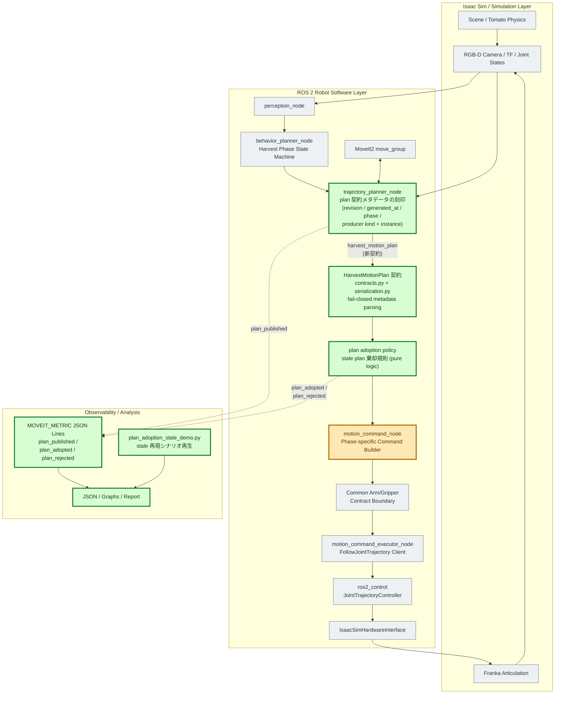
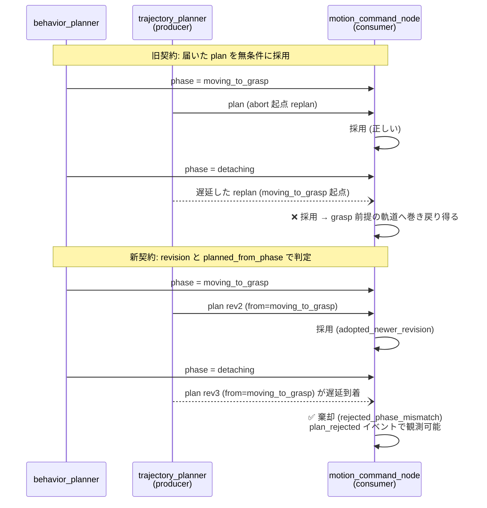
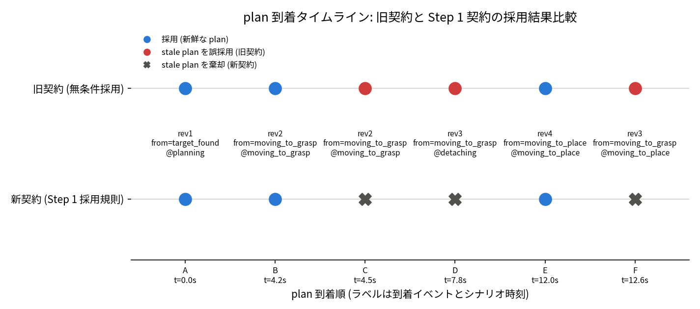
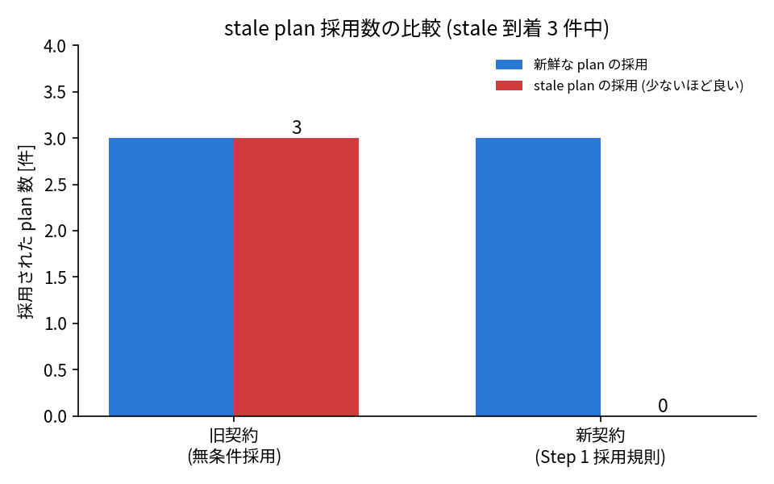

# MoveIt 改善 Step 1: plan 契約安定化レポート

## 1. 目的

GitHub Issue #9 と `docs/planning_movit2_improvements.html` の Step 1 に従い、plan producer を
将来複線化 (Step 5 以降の global / local planner 併存) するための plan 契約を安定化する。
具体的には `HarvestMotionPlan` に revision、生成時刻、計画起点 phase、producer 種別の
メタデータを追加し、consumer 側に stale plan を採用しない最低限の規則を導入する。

### 1.1 全体アーキテクチャと今回の検証範囲



| 色 | 意味 | 今回の扱い |
| --- | --- | --- |
| 緑 | 直接変更・検証した範囲 | plan 契約 (contracts/serialization)、producer のメタデータ刻印、adoption policy、観測イベント、再現シナリオと可視化 |
| 橙 | 変更を組み込んだが挙動自体は従来どおりの境界 | motion_command_node (採用済み plan からの command 生成そのものは不変) |
| 灰 | 全体アーキテクチャ上は必要だが今回変更していない範囲 | Isaac Sim、認識、behavior、MoveIt2、executor 以下の実行経路 |

実線は制御・データフロー、点線は観測イベントを表す。今回の検証は「producer が刻印した
メタデータが JSON 契約を往復し、consumer の採用規則が stale plan を棄却すること」に限定した。
executor (C++) 以下の下流契約 (`MotionCommand`) は一切変更していない。

## 2. 実行条件

| 項目 | 値 |
| --- | --- |
| 対象 branch | `feature/moveit2-step1-plan-contract` (base: `feature/moveit2-improvements`) |
| 実行日 | 2026-07-11 |
| unit test | Python 132件、C++ 5件、全件成功 |
| 検証方法 | 実装の `evaluate_plan_adoption` を用いた stale 再現シナリオの決定的再生 |

再現・可視化の再実行コマンド:

```bash
MPLCONFIGDIR=/tmp/moveit-mpl PYTHONPATH=src \
python3 scripts/plan_adoption_stale_demo.py \
  --output-dir docs/reports/moveit_replanning/step1_artifacts
```

## 3. 拡張したフィールドと責務

`HarvestMotionPlan` (`src/tomato_harvest_sim/msg/contracts.py`) へ以下を追加した。
すべて既定値を持ち、旧契約の生成コード・JSON と後方互換である。

| フィールド | 型 / 既定値 | 責務 |
| --- | --- | --- |
| `plan_revision` | `int` / `0` | producer 単調増加の版数。採用順序の唯一の正。`0` は旧契約 (未版数) を表す予約値 |
| `generated_at_sec` | `float \| None` / `None` | 生成時刻 (epoch 秒)。plan 鮮度の観測 (`plan_age_sec`) 専用。ノード間時計差の影響を避けるため採用判定には使わない |
| `planned_from_phase` | `HarvestTaskPhase \| None` / `None` | 計画起点 phase。実行 phase 起点の replan を phase-bound として扱う根拠 |
| `producer_kind` | `PlanProducerKind` / `GLOBAL_PLANNER` | plan を生成した producer 種別。Step 5 の複線化 (`global_planner` / `local_planner`) の識別子。未知値は `UNKNOWN` へ縮退 |
| `producer_instance_id` | `str \| None` / `None` | producer process の起動単位。planner 再起動で revision が 1 に戻るケースと、旧 instance から遅延到着した plan を識別する |

シリアライズ層 (`serialization.py`) は、旧 JSON (フィールドなし) を既定値で読み、
未知の `producer_kind` / `planned_from_phase` 値をエラーにせず `UNKNOWN` / `None` へ落とす。
非legacy planでこの縮退値や必須metadata欠落を検出したconsumerは採用しない。これにより
新旧ノード混在時もデシリアライズ自体は失敗せず、採用判断はfail-closedになる。

## 4. 採用規則 (plan adoption policy)

consumer (`motion_command_node`) は plan 受信時に pure function
`evaluate_plan_adoption` (`robot/execute_manager/plan_adoption.py`) で採用可否を判定する。
規則は上から順に適用する。

1. **producer 規則**: 未知producerは棄却する。`local_planner` は識別可能だがStep 5の
   arbitration未実装なので現段階では棄却する → `rejected_unknown_producer` /
   `rejected_unsupported_producer`
2. **legacy移行規則**: `plan_revision == 0` はcurrent planが未採用またはlegacyの場合のみ採用する。
   versioned plan採用後のlegacy planは棄却する → `rejected_legacy_after_versioned`
3. **metadata完全性**: versioned planは生成時刻、計画起点phase、producer instance IDを必須とし、
   欠落・未知phaseを棄却する → `rejected_missing_plan_metadata`
4. **phase 整合規則**: 実行 phase (`moving_to_*` / `detaching` / `returning_home`) 起点の replan は
   phase-bound とし、現在 phase と一致する場合のみ採用。phase が先へ進んだ後に届いた
   replan は棄却 → `rejected_phase_mismatch`。pre-motion phase (`target_found` 等) 起点の
   full-chain plan は phase-bound にしない。phase-bound plan受信時にconsumer phaseが未確定なら
   棄却する → `rejected_current_phase_unknown`
5. **同一instance revision規則**: 同一producer instance内では採用済みrevision以下をstaleとして
   棄却する → `rejected_stale_revision`
6. **planner再起動規則**: producer instanceが異なる場合は生成時刻を比較し、新instanceのplanを
   採用する。新instance採用後に旧instanceから遅延到着したplanは棄却する →
   `adopted_newer_producer_instance` / `rejected_stale_producer_instance`

判定結果は `MOVEIT_METRIC` の `plan_adopted` / `plan_rejected` イベントとして reason 付きで
記録され、producer 側の `plan_published` と突き合わせられる。

### 4.1 旧契約と新契約の比較 (stale シナリオのシーケンス)



## 5. stale plan 再現ケースと抑止結果

Step 0 で実測した abort 起点 replan の latency 分散 (86〜768 ms) を根拠に、
「phase が進んだ後に古い plan が届く」6 イベントのシナリオを定義し、実装の
`evaluate_plan_adoption` へそのまま通した (`scripts/plan_adoption_stale_demo.py`)。
シナリオには仕様としての期待値 (`expected_stale`) を持たせ、実装判定と期待の一致は
unit test (`tests/test_plan_adoption_stale_demo.py`) で担保している。

| イベント | 内容 | 旧契約 | 新契約 (Step 1) |
| --- | --- | --- | --- |
| A | 初回 full-chain plan (rev1, from=target_found) | 採用 | 採用 (`adopted_initial`) |
| B | abort 起点 replan (rev2, from=moving_to_grasp) | 採用 | 採用 (`adopted_newer_revision`) |
| C | rev2 の再配送 (同一 revision) | **誤採用** | 棄却 (`rejected_stale_revision`) |
| D | 遅い replan (rev3, from=moving_to_grasp) が detaching 到達後に到着 | **誤採用 (巻き戻りリスク)** | 棄却 (`rejected_phase_mismatch`) |
| E | place replan (rev4, from=moving_to_place) | 採用 | 採用 (`adopted_newer_revision`) |
| F | rev3 の遅延再配送 | **誤採用** | 棄却 (`rejected_stale_revision`) |



上段が旧契約 (無条件採用)、下段が新契約。赤丸は stale plan の誤採用、X は新契約による
棄却を表す。同じ到着列に対して、新契約は新鮮な plan (青) だけを採用している。



| 指標 | 旧契約 | 新契約 |
| --- | ---: | ---: |
| 新鮮な plan の採用 | 3 | 3 |
| stale plan の採用 (3件到着中) | **3** | **0** |

新契約は正しい plan の採用数を維持したまま、stale plan の採用を 3 → 0 に抑止した。
イベントごとの判定結果は `step1_artifacts/plan_adoption_scenario.json` に保存した。

### 5.1 レビュー指摘の境界ケース

| ケース | 期待結果 | 実装結果 |
| --- | --- | --- |
| versioned rev10採用後にlegacy rev0が遅延到着 | legacyを棄却 | `rejected_legacy_after_versioned` |
| planner再起動でinstance B / rev1がinstance A / rev20の後に到着 | 新instanceを採用 | `adopted_newer_producer_instance` |
| 新instance採用後に旧instanceのrev21が遅延到着 | 旧instanceを棄却 | `rejected_stale_producer_instance` |
| versioned planのphaseが未知値または欠落 | fail-closed | `rejected_missing_plan_metadata` |
| phase-bound plan受信時にconsumer phaseが未確定 | fail-closed | `rejected_current_phase_unknown` |
| local planner planがStep 5より前に到着 | arbitration未実装なので棄却 | `rejected_unsupported_producer` |

## 6. 新旧契約の整合性 (unit test)

| 観点 | テスト |
| --- | --- |
| 新契約メタデータの JSON 往復 | `tests/test_msg_package.py::TestHarvestMotionPlanContract::test_new_contract_metadata_roundtrips_via_json` |
| 旧契約 JSON が legacy 既定値で読める | 同 `test_old_contract_json_parses_with_legacy_defaults` |
| 未知の producer/phase 値の安全な縮退 | 同 `test_unknown_metadata_values_degrade_without_error` |
| revision / phase / legacy / producer instance の採用規則 | `robot/execute_manager/tests/test_plan_adoption.py` (16件) |
| 再現シナリオの期待一致と抑止数 | `tests/test_plan_adoption_stale_demo.py` (2件) |

Python unit test は合計132件、C++ gtestは5件すべて成功した。

## 7. 次ステップへ渡す判断材料

1. 採用規則は planner 実装から独立した pure function であり、Step 2 の trigger policy /
   state aggregation の切り出し先からそのまま再利用できる。
2. `producer_kind` は識別可能だが、Step 5でlocal plannerを有効化する際はproducer間の優先度、
   command有効期間、global/local arbitrationをconsumer側へ明示的に追加する必要がある。
3. phase 整合規則は「一致した場合のみ採用」という保守的な規則とした。Step 3 の suffix
   replan で同一 phase 内の高頻度差し替えを行う際も、この規則は変更不要である。

## 8. 残課題

- 本レポートの抑止結果は決定的なシナリオ再生によるもので、実機 E2E での stale 到着頻度は
  計測していない (E2E で自然発生させるには planner latency への外乱注入が必要)。
  E2E ログ上の `plan_published` / `plan_adopted` / `plan_rejected` イベントは CI の
  Isaac E2E で回収できる。
- `generated_at_sec` は観測専用であり、最大鮮度 (max age) による棄却規則は未導入。
  時計同期の前提を整理した上で将来検討する。
- 旧契約互換はversioned plan未採用時だけ許可する。producer更新完了後にlegacy経路自体を削除できる。
- 異なるproducer instanceの比較は同一ホスト上のepoch時刻を前提とする。分散ホストへ拡張する場合は
  clock synchronizationまたは中央sequence発行が必要になる。
- local plannerは識別のみ可能で、Step 5のarbitration実装までは意図的に採用しない。
- adoption 観測イベントの集計は `summarize_moveit_metrics.py` へ未統合 (Step 2 以降で
  phase 遷移由来と replan 由来の差し替え区別に使う際に統合する)。
