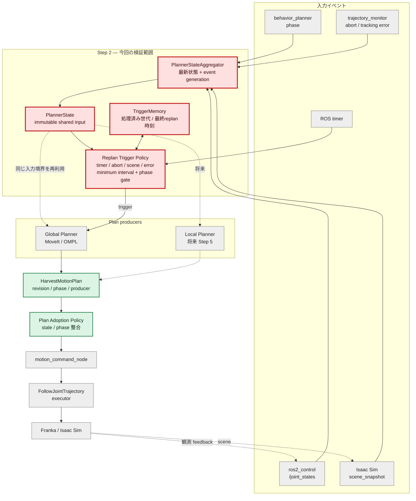
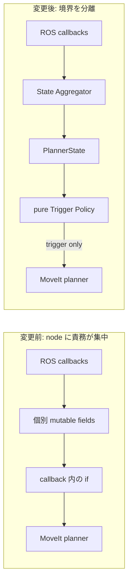
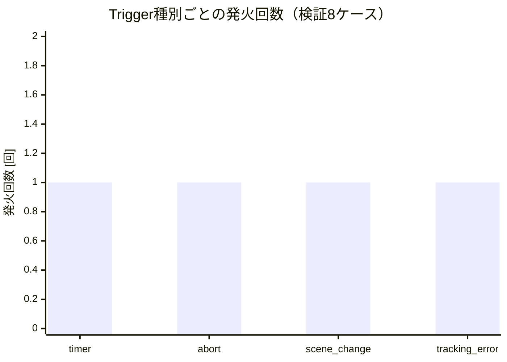
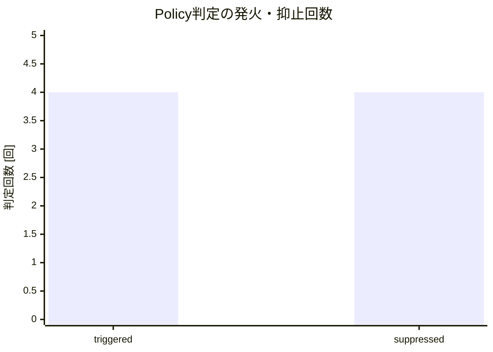
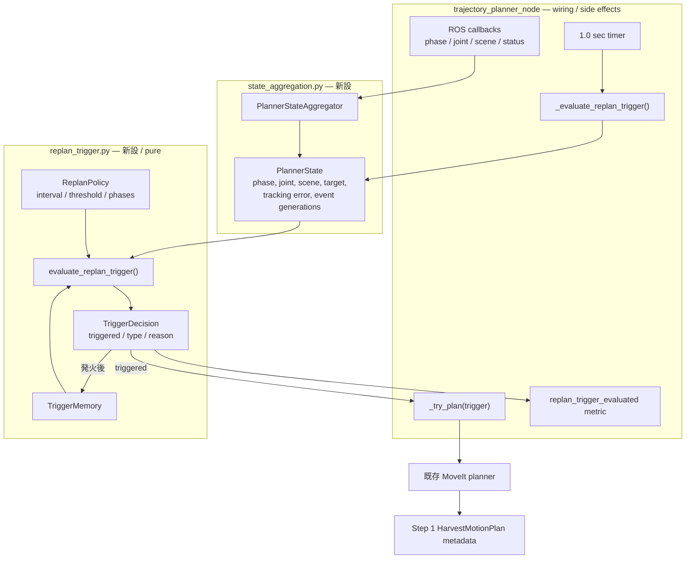

# MoveIt 改善 Step 2: State Aggregation / Trigger Policy 検証レポート

検証日: 2026-07-11  
対象: Issue #10  
結果: **PASS** (`143 passed, 2 skipped`)

## 結論

`trajectory_planner_node` が個別に保持していた phase、latest joint state、scene snapshot、target estimate を `PlannerStateAggregator` へ集約した。tracking error、abort event、scene change generation も同じ immutable `PlannerState` から参照できる。replan 条件は ROS 2 / MoveIt から独立した pure function `evaluate_replan_trigger()` に分離し、timer / abort / scene change / tracking error を個別に検証できる。Step 2では既存互換のabortだけをplanner実行へ接続し、suffix planningが必要なtimer / scene change / tracking errorはStep 3まで観測専用とする。

## 全体アーキテクチャと今回の検証範囲

凡例: **赤 = 今回追加・変更して検証した範囲**、緑 = Step 1 までに確立済み、灰 = 今回変更なし。



## 責務分離前後



| 責務 | 変更前 | 変更後 |
| --- | --- | --- |
| 最新入力 | node の `_phase` 等に散在 | `PlannerStateAggregator` |
| planner 入力 | node の mutable field を直接参照 | 一回取得した `PlannerState` snapshot |
| abort/scene event | callback の即時 if | monotonic generation で未処理を識別 |
| trigger 条件 | callback 内に散在 | `evaluate_replan_trigger()` |
| gating 状態 | 未定義 | `TriggerMemory` |
| global/local 共通入力 | 未定義 | `PlannerState` |

## Trigger policy

優先順位は `abort → scene change → tracking error → timer`。全 trigger の前に入力完全性と minimum interval を確認する。timer は `MOVING_TO_PREGRASP`、`MOVING_TO_GRASP`、`MOVING_TO_PLACE` のみ許可し、接触区間 `DETACHING` では抑止する。

| Trigger | 発火条件 | 主な抑止条件 |
| --- | --- | --- |
| abort | `abort_generation > handled_abort_generation` | 入力不足、最小間隔内 |
| scene change | planning collision objectの意味的変更 | robot/tool/cameraの動的pose更新、最小間隔内 |
| tracking error | error `>= 0.10 rad` | 閾値未満、最小間隔内 |
| timer | timer許可phase | 接触/終端phase、最小間隔内 |

## Trigger 別検証結果

policy の公開インタフェースを使う8ケースを実行した。各 trigger の発火1件と、代表的な抑止4件を確認した。

| # | 入力 | 期待 | 実績 | 判定理由 |
| ---: | --- | --- | --- | --- |
| 1 | moving_to_grasp、interval経過 | timer発火 | 発火 | `triggered_timer` |
| 2 | 未処理abort generation | abort発火 | 発火 | `triggered_abort` |
| 3 | 未処理scene generation | scene change発火 | 発火 | `triggered_scene_change` |
| 4 | tracking error = 0.10 rad | tracking error発火 | 発火 | `triggered_tracking_error` |
| 5 | 前回replanから0.5秒 | 抑止 | 抑止 | `suppressed_minimum_interval` |
| 6 | detachingのtimer | 抑止 | 抑止 | `suppressed_phase` |
| 7 | phase/joint/target不足 | 抑止 | 抑止 | `suppressed_incomplete_state` |
| 8 | tracking error < 0.10 rad、timer対象外 | 抑止 | 抑止 | `suppressed_phase` |





横軸の `triggered` は発火、`suppressed` は抑止を表す。Mermaid の
`xychart-beta` が日本語のカテゴリ識別子を字句解析できない環境との互換性を
保つため、横軸ラベルのみ ASCII で記載する。

## 次ステップへのインタフェース

- Step 3 の phase-scoped suffix planner は `PlannerState` を入力とし、node の mutable field を直接参照しない。
- Step 3ではscene change / tracking errorをplace suffix planner実行へ切り替え、周期timerはcancel churn防止のためobserve-onlyを維持する。
- Step 4 の timer tuning は `ReplanPolicy.minimum_interval_sec` と `timer_phases` を変更し、planner 実装を変更しない。
- Step 5 の local planner は global planner と同じ `PlannerState` を受け取れる。
- trigger は「plan を作るべき」という起動判断だけを担い、Step 1 の `PlanAdoptionPolicy` は候補planの採用判断を担う。

## 実行した検証

```text
PYTHONPATH=src python3 -m pytest -q tests src/tomato_harvest_sim/robot src/tomato_harvest_sim/simulator
143 passed, 2 skipped

python3 -m py_compile \
  src/tomato_harvest_sim/robot/motion_planner/node.py \
  src/tomato_harvest_sim/robot/motion_planner/state_aggregation.py \
  src/tomato_harvest_sim/robot/motion_planner/replan_trigger.py
成功
```

## PR本文用: 変更差分の詳細アーキテクチャ図

以下はPR本文にも掲載する変更差分図である。


