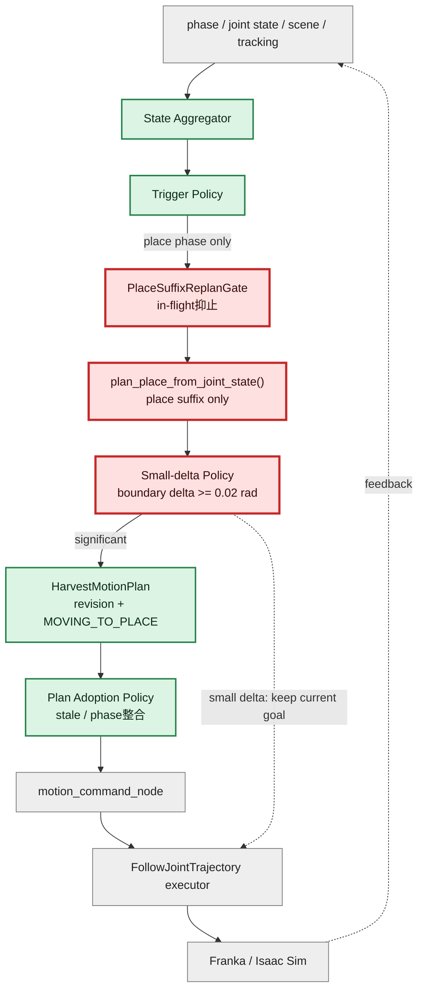
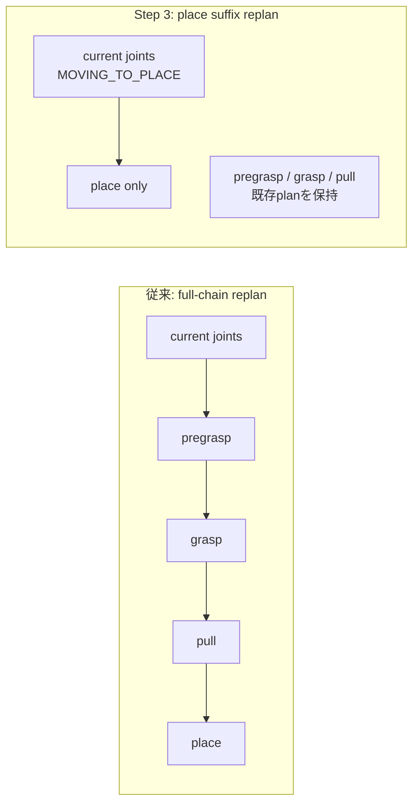
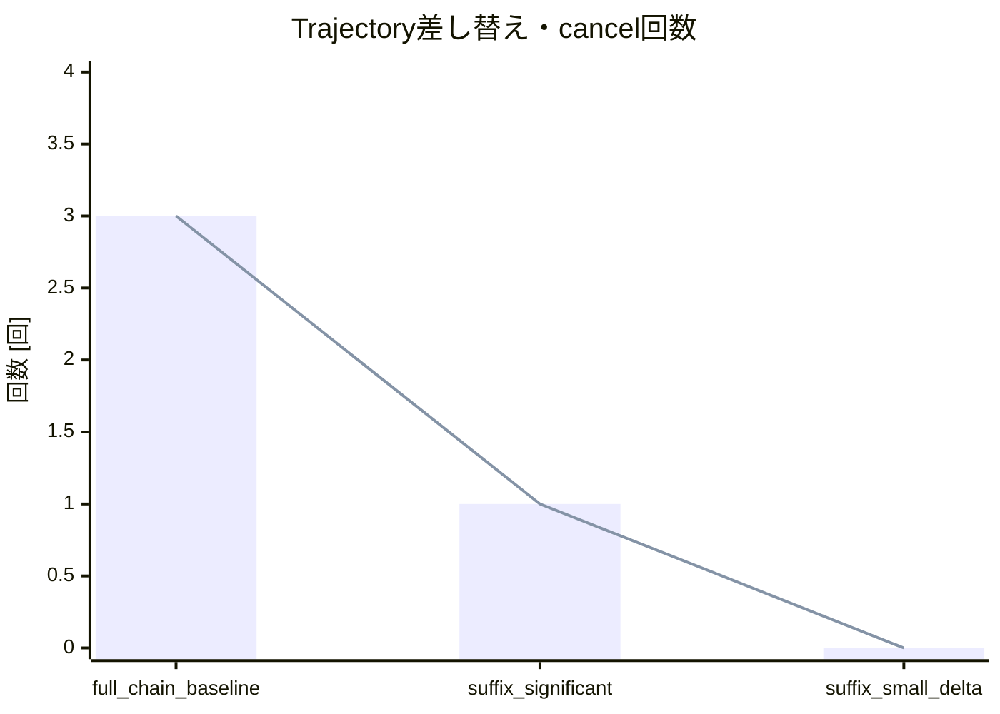
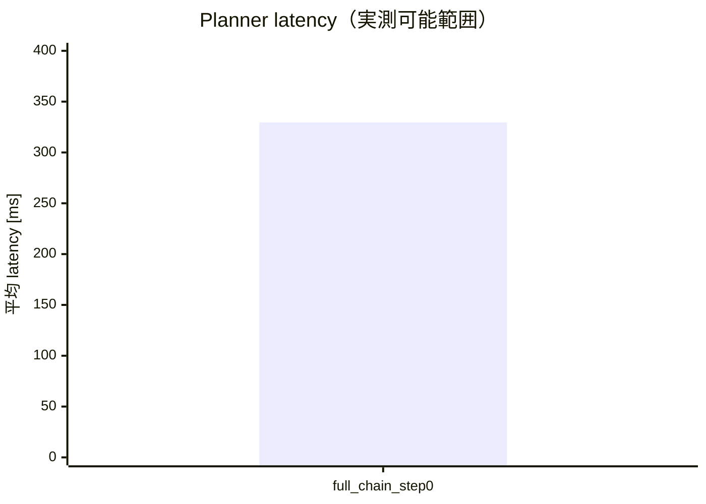
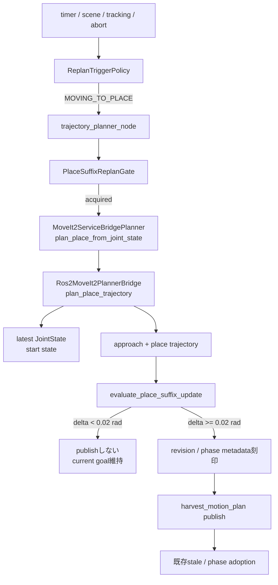

# MoveIt改善 Step 3: MOVING_TO_PLACE suffix replan検証レポート

検証日: 2026-07-11  
対象: Issue #11  
結果: **PASS**

## 結論

`MOVING_TO_PLACE` 中だけ、集約済みの最新joint stateからplace trajectoryのみを再計画する経路を追加した。pregrasp / grasp / pullは再計画しない。候補軌道の開始・終端差分が `0.02 rad` 未満なら既存goalを維持し、planner実行中はin-flight gateで二重起動を抑止する。Step 2でobserve-onlyにしたscene change / tracking errorはplace phaseに限ってsuffix plannerへ接続し、通常進捗を乱さないよう周期timerは観測専用のままとする。

## 全体アーキテクチャと検証範囲

凡例: **赤 = Step 3の追加・変更範囲**、緑 = Step 1/2で確立済み、灰 = 変更なし。



## 従来full-chain replanとの差



| 観点 | full-chain | place suffix |
| --- | --- | --- |
| start state | 初回chainの前提に戻り得る | 最新joint state |
| 計画範囲 | pregrasp → grasp → pull → place | placeのみ |
| 小差分 | 無条件publish | `0.02 rad`未満は棄却 |
| 多重起動 | callback実行モデルへ暗黙依存 | thread-safe in-flight gate |
| phase | 複数phaseを一括生成 | `MOVING_TO_PLACE`限定 |

## テスト条件と発火条件

- phase: `MOVING_TO_PLACE`
- current joints: `(0.25, 0.25) rad`（既存trajectory開始点からの姿勢ずれ）
- 実行trigger: scene change / tracking error / abort（timerはobserve-only）
- suffix target: 既存planのplace pose
- minimum boundary delta: `0.02 rad`
- integration backend: `MoveIt2ServiceBridgePlanner` + deterministic fake bridge

発火にはStep 2の入力完全性、minimum interval、phase gateを通過する必要がある。place以外のphaseと周期timerはobserve-onlyのままである。

## Integration実行ログ相当

```text
current_joint_state=(0.25, 0.25)
planner_api=plan_place_trajectory
planned_segments=[place]
candidate_start=(0.25, 0.25)
candidate_goal=(1.0, 1.0)
pregrasp_trajectory=unchanged
decision=adopted_significant_trajectory_delta
duplicate_start_while_in_flight=suppressed
```

integration testは、渡されたstart stateが最新joint stateと一致すること、place trajectoryだけが更新されること、姿勢ずれがsignificantとして採用されることを確認した。

## 主要メトリクス比較

Step 0実測ではfull-chain plannerの平均latencyは `329.538 ms`、active goalのcancel / replacementは各3回だった。Step 3 integrationの1回の姿勢ずれシナリオではsignificant候補を1回採用するためcancel / replacementは最大1回、小差分シナリオでは0回となる。integration backendはtest doubleのため、MoveIt実latencyとの数値比較は行わず、CI/E2Eでは `place_suffix_replan_completed.latency_ms` を継続収集する。



barはtrajectory replacement、lineはcancelを表す。



suffixの実MoveIt latencyは本PRのCI/E2Eでplace replan triggerを注入しないため未計測であり、test double値を混在させない。runtime metricは追加済みで、次の外乱注入E2Eで比較する。

## 実行した検証

```text
PYTHONPATH=src python3 -m pytest -q tests src/tomato_harvest_sim/robot src/tomato_harvest_sim/simulator
149 passed, 2 skipped

python3 -m py_compile ...
成功
```

## 残課題

- 実MoveIt serviceを使う外乱注入E2Eでsuffix latency分布を取得する。
- endpoint/start boundary比較を、将来は時間正規化したtrajectory distanceへ拡張する。
- local planner導入後はcancel-and-replaceではなくtrajectory blendingを検討する。
- `MOVING_TO_PREGRASP` / `MOVING_TO_GRASP`へのsuffix replan拡張はStep 4以降で扱う。

## PR本文用: 変更差分の詳細アーキテクチャ図


