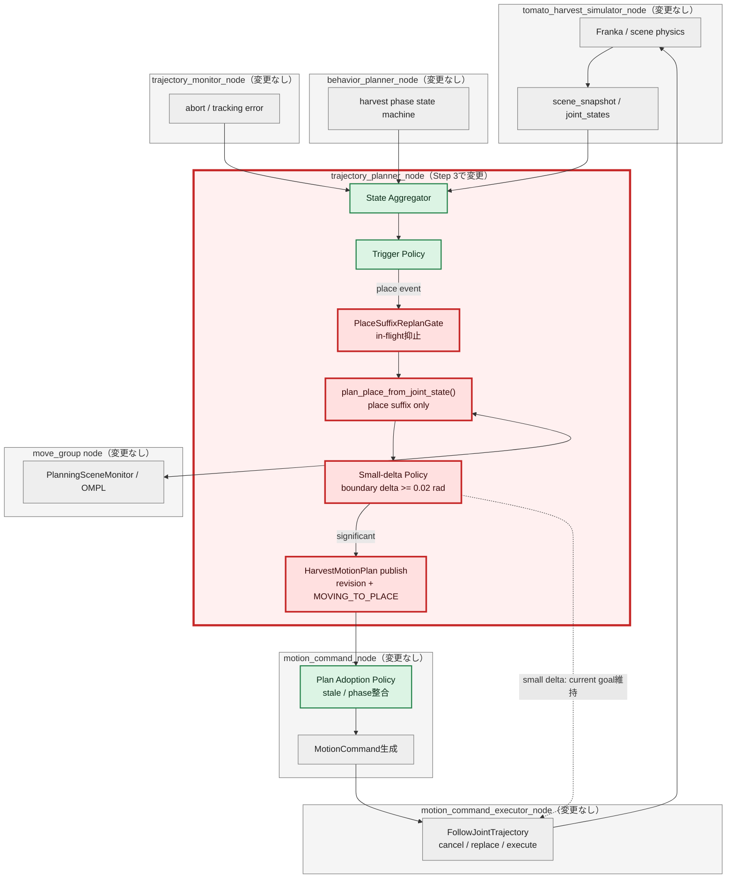
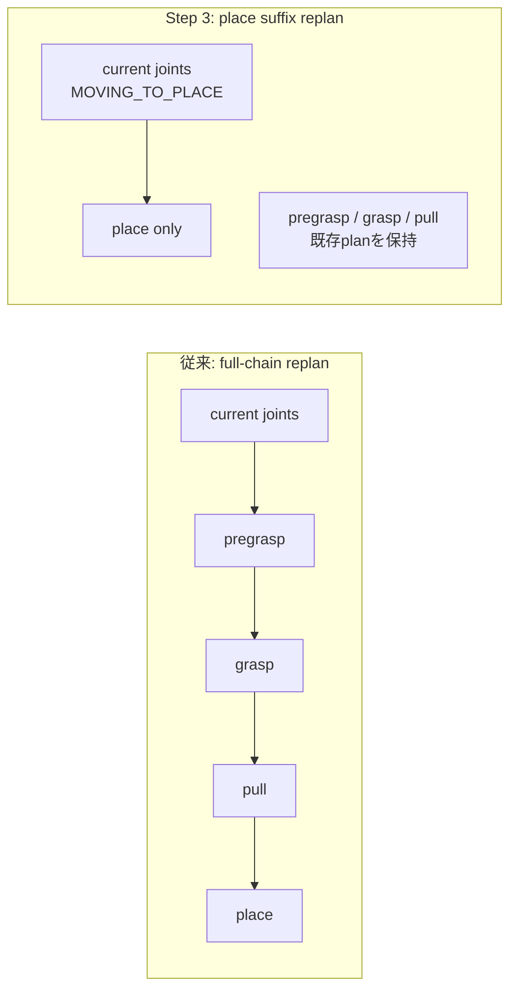
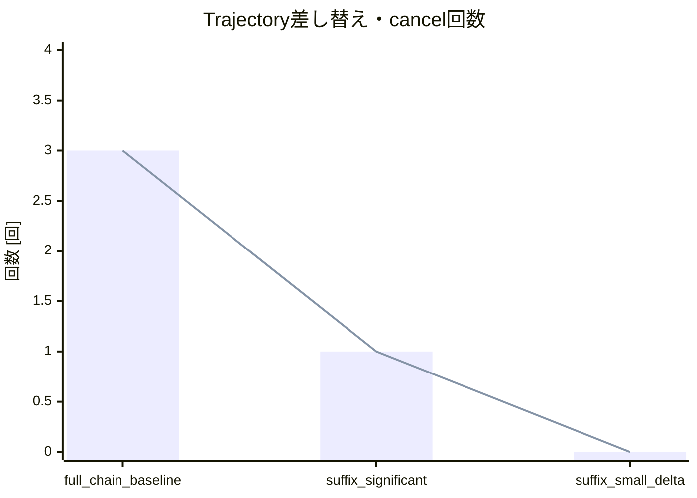
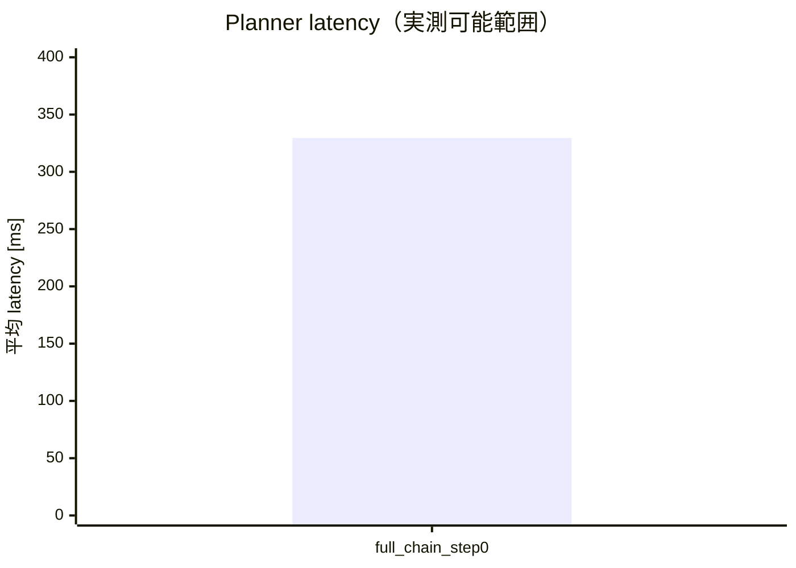
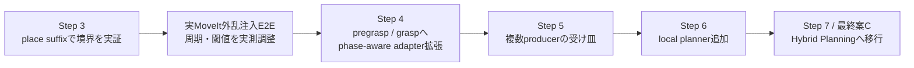
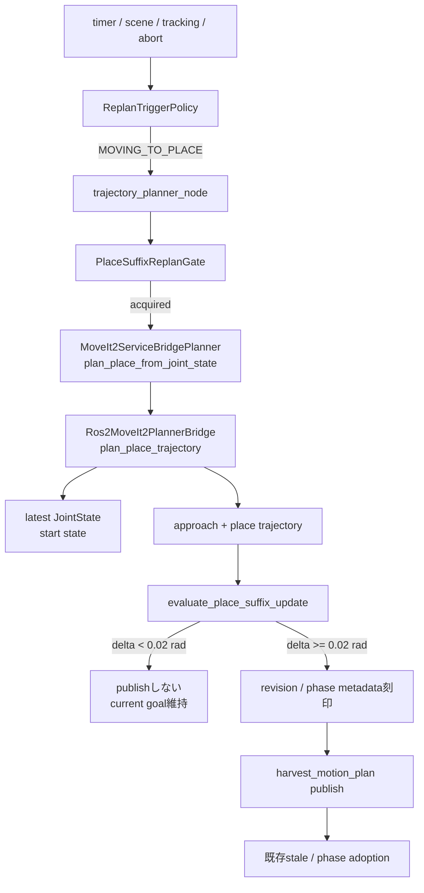

# MoveIt改善 Step 3: MOVING_TO_PLACE suffix replan検証レポート

検証日: 2026-07-11  
対象: Issue #11  
結果: **PASS**

## 用語: suffix（残り区間）とは

本レポートで使う **suffix** は、動作計画全体のうち、現在地点より後に残っている区間を意味する。日本語では「残り区間」または「後続区間」に相当する。

収穫動作全体が次の順序だとする。

```text
pregrasp → grasp → pull → place
```

すでにpullまで完了して `MOVING_TO_PLACE` に進んでいる場合、現在から先に残っているのは次の区間だけである。

```text
現在位置 → place
```

この「現在位置からplaceまでの残り区間だけを再計画すること」を、本レポートでは **place suffix replan（placeまでの残り区間の再計画）** と呼ぶ。

| 用語 | 本レポートでの意味 |
| --- | --- |
| full-chain replan（全区間の再計画） | `pregrasp → grasp → pull → place`を最初からすべて再計画する |
| place suffix replan（残り区間の再計画） | 完了済み区間は変更せず、`現在位置 → place`だけを再計画する |

以降、初出や意味を強調する箇所では「suffix（残り区間）」と併記し、コード/API名では実装上の名称である`suffix`をそのまま使用する。

## この検証の目的

この検証で確かめたいのは、収穫動作がすでに `MOVING_TO_PLACE` まで進んだ後に姿勢ずれやscene変化が起きても、完了済みのpregrasp / grasp / pullを最初から計画し直さず、**現在の関節状態からplaceまでの残りだけを安全に再計画できるか**である。

従来のfull-chain replanには、完了済みphaseを含む長い計画を作り直し、実行中goalを無条件にcancel-and-replaceする危険がある。Step 3では対象をplaceに限定し、最終的な改善案B（phaseごとに必要なsuffix（残り区間）だけを低周期・event-drivenで再計画する構成）が成立するかを最小範囲で先行確認する。

具体的には、次の問いに答える。

1. plannerへ渡すstart stateが、初回planの開始状態ではなく最新joint stateになっているか。
2. 更新対象がplace trajectoryだけで、pregrasp / grasp / pullを変更しないか。
3. stale候補、小差分候補、planner二重起動による不要なgoal差し替えを防げるか。
4. Step 1のrevision / adoption契約とStep 2のstate / trigger境界を、そのまま再利用できるか。

### 合格条件

| 検証項目 | 合格条件 |
| --- | --- |
| current state起点 | suffix plannerが最新joint stateを受け取る |
| 計画範囲 | place trajectoryだけが更新される |
| 小差分抑止 | boundary deltaが`0.02 rad`未満ならpublishしない |
| stale抑止 | Step 1 adoption policyでrevision / phase不整合を棄却する |
| 二重起動抑止 | in-flight中の2回目の開始要求を棄却する |
| 通常動作保護 | 周期timerをobserve-onlyに保ち、無条件replanしない |

## 結論

`MOVING_TO_PLACE` 中だけ、集約済みの最新joint stateからplace trajectoryのみを再計画する経路を追加した。pregrasp / grasp / pullは再計画しない。候補軌道の開始・終端差分が `0.02 rad` 未満なら既存goalを維持し、planner実行中はin-flight gateで二重起動を抑止する。Step 2でobserve-onlyにしたscene change / tracking errorはplace phaseに限ってsuffix plannerへ接続し、通常進捗を乱さないよう周期timerは観測専用のままとする。

## 全体アーキテクチャと検証範囲

凡例: **赤 = Step 3の追加・変更範囲**、緑 = Step 1/2で確立済み、灰 = 変更なし。



今回コードを変更したROS 2ノードは **`trajectory_planner_node`のみ**である。`move_group`、`motion_command_node`、`motion_command_executor_node`は既存インタフェースをそのまま利用する。planner node内部ではplace suffix routing、in-flight gate、小差分判定、revision付きpublishを追加した。

## 従来full-chain replanとの差



| 観点 | full-chain | place suffix |
| --- | --- | --- |
| start state | 初回chainの前提に戻り得る | 最新joint state |
| 計画範囲 | pregrasp → grasp → pull → place | placeのみ |
| 小差分 | 無条件publish | `0.02 rad`未満は棄却 |
| 多重起動 | callback実行モデルへ暗黙依存 | thread-safe in-flight gate |
| phase | 複数phaseを一括生成 | `MOVING_TO_PLACE`限定 |

## テスト条件と発火条件

- phase: `MOVING_TO_PLACE`
- current joints: `(0.25, 0.25) rad`（既存trajectory開始点からの姿勢ずれ）
- 実行trigger: scene change / tracking error / abort（timerはobserve-only）
- suffix target: 既存planのplace pose
- minimum boundary delta: `0.02 rad`
- integration backend: `MoveIt2ServiceBridgePlanner` + deterministic fake bridge

発火にはStep 2の入力完全性、minimum interval、phase gateを通過する必要がある。place以外のphaseと周期timerはobserve-onlyのままである。

## Integration実行ログ相当

```text
current_joint_state=(0.25, 0.25)
planner_api=plan_place_trajectory
planned_segments=[place]
candidate_start=(0.25, 0.25)
candidate_goal=(1.0, 1.0)
pregrasp_trajectory=unchanged
decision=adopted_significant_trajectory_delta
duplicate_start_while_in_flight=suppressed
```

integration testは、渡されたstart stateが最新joint stateと一致すること、place trajectoryだけが更新されること、姿勢ずれがsignificantとして採用されることを確認した。

## 主要メトリクス比較

Step 0実測ではfull-chain plannerの平均latencyは `329.538 ms`、active goalのcancel / replacementは各3回だった。Step 3 integrationの1回の姿勢ずれシナリオではsignificant候補を1回採用するためcancel / replacementは最大1回、小差分シナリオでは0回となる。integration backendはtest doubleのため、MoveIt実latencyとの数値比較は行わず、CI/E2Eでは `place_suffix_replan_completed.latency_ms` を継続収集する。



barはtrajectory replacement、lineはcancelを表す。



suffixの実MoveIt latencyは本PRのCI/E2Eでplace replan triggerを注入しないため未計測であり、test double値を混在させない。runtime metricは追加済みで、次の外乱注入E2Eで比較する。

## 実行した検証

```text
PYTHONPATH=src python3 -m pytest -q tests src/tomato_harvest_sim/robot src/tomato_harvest_sim/simulator
149 passed, 2 skipped

python3 -m py_compile ...
成功
```

## 残課題

- 実MoveIt serviceを使う外乱注入E2Eでsuffix latency分布を取得する。
- endpoint/start boundary比較を、将来は時間正規化したtrajectory distanceへ拡張する。
- local planner導入後はcancel-and-replaceではなくtrajectory blendingを検討する。
- `MOVING_TO_PREGRASP` / `MOVING_TO_GRASP`へのsuffix replan拡張はStep 4以降で扱う。

## この検証が次に何につながるか

Step 3はplace動作だけを対象に、`state aggregation → trigger判定 → suffix planning → 小差分判定 → revision付きpublish → adoption`という一連の経路を初めて接続した。この結果は次の作業へ以下のようにつながる。



- **Step 4前の実測確認**: 実MoveIt環境でplace移動中にtracking errorまたはscene changeを注入し、suffix latency、cancel回数、収穫完了率を実測する。ここで`0.02 rad`とminimum intervalの妥当性を決める。
- **Step 4のphase拡張**: placeで安全性を確認した同じ境界を `MOVING_TO_PREGRASP` / `MOVING_TO_GRASP`へ展開し、phase-aware global planner adapterへ一般化する。
- **中長期のlocal planner導入**: Step 1のproducer metadataとStep 2/3の共通state・trigger境界を使い、global planとlocal correctionをarbitrationする。executor契約を変更せずHybrid Planning / Servoへ移行する土台になる。

したがって本検証の価値は、place動作単体の改善だけではなく、全phaseを一度に変更せず、1phaseで安全なreplan境界を実証してから段階的に拡張できることにある。

## PR本文用: 変更差分の詳細アーキテクチャ図


