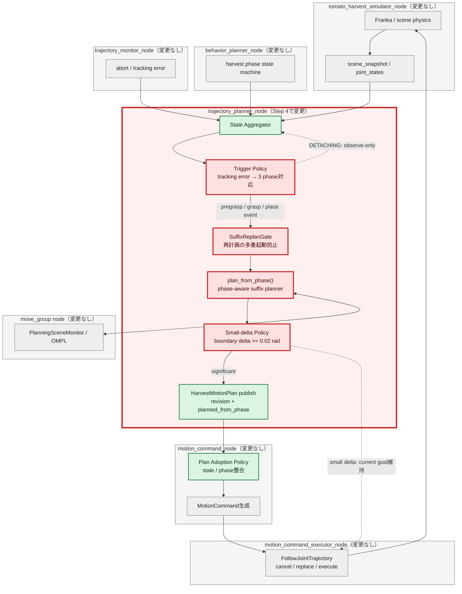
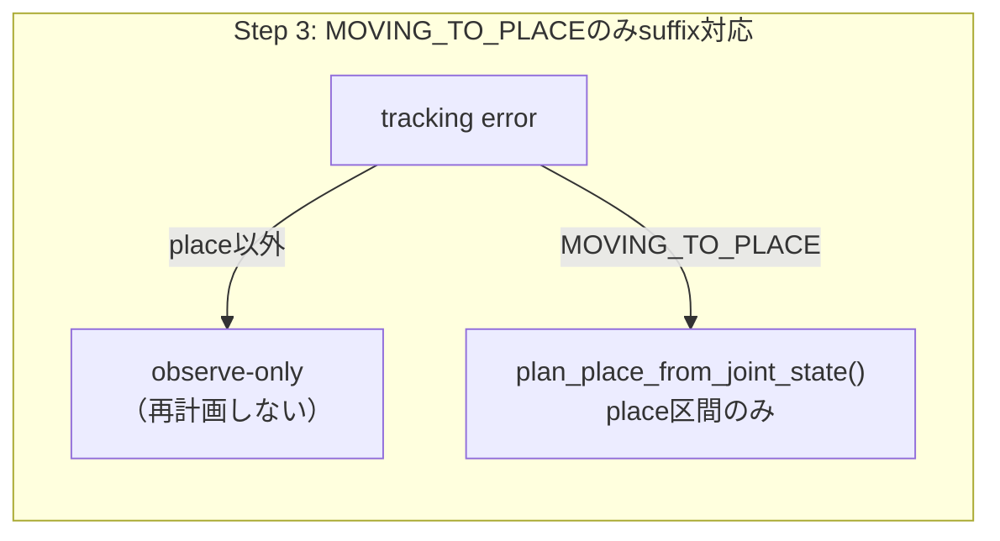
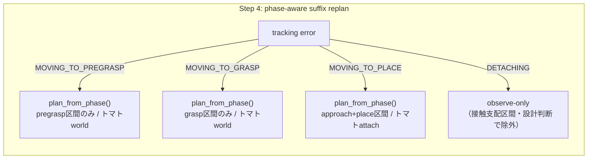
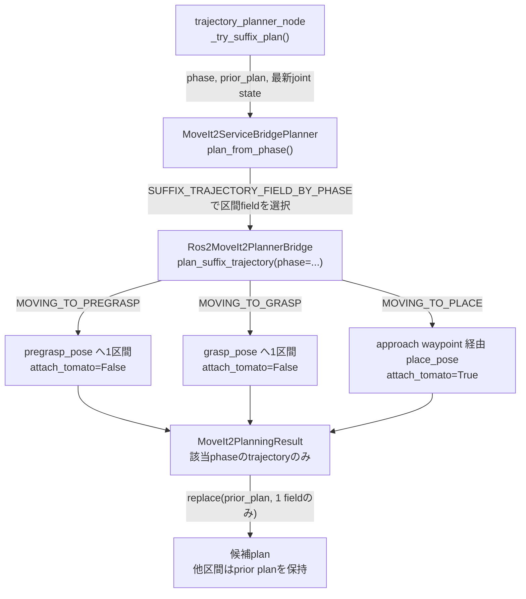
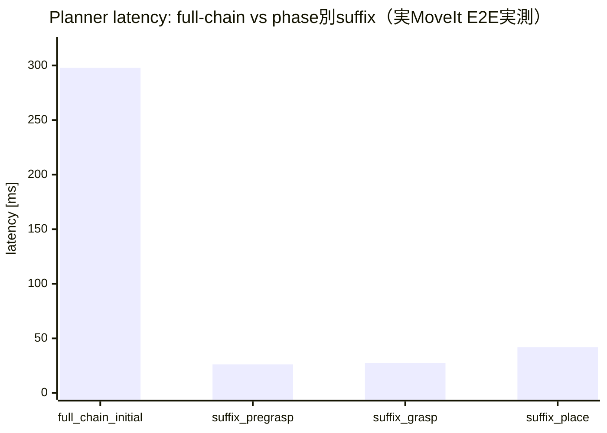
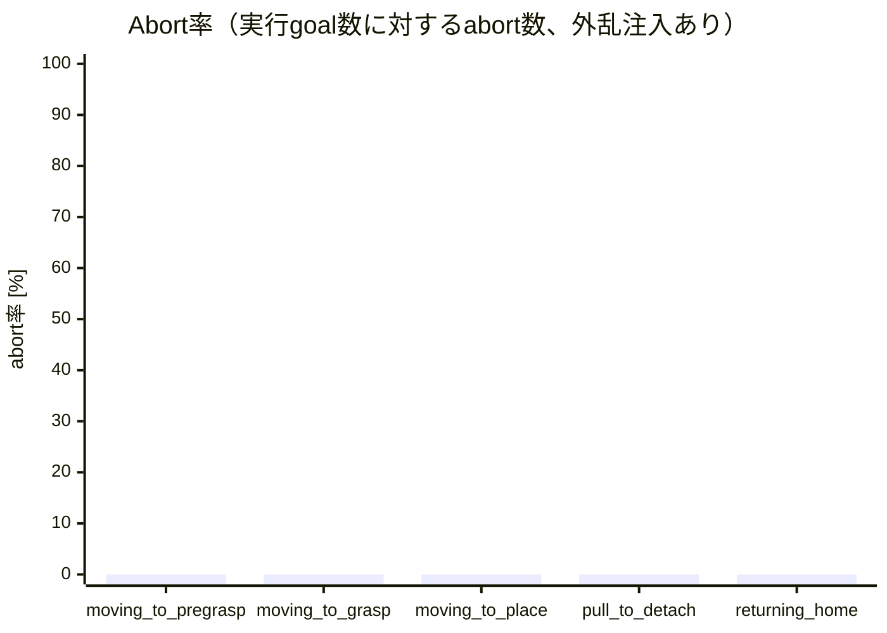
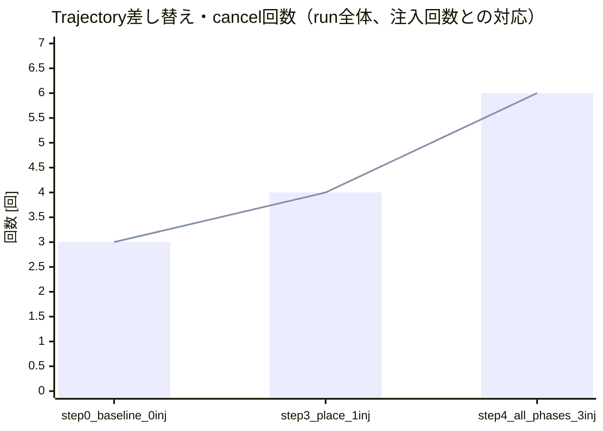
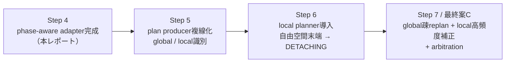
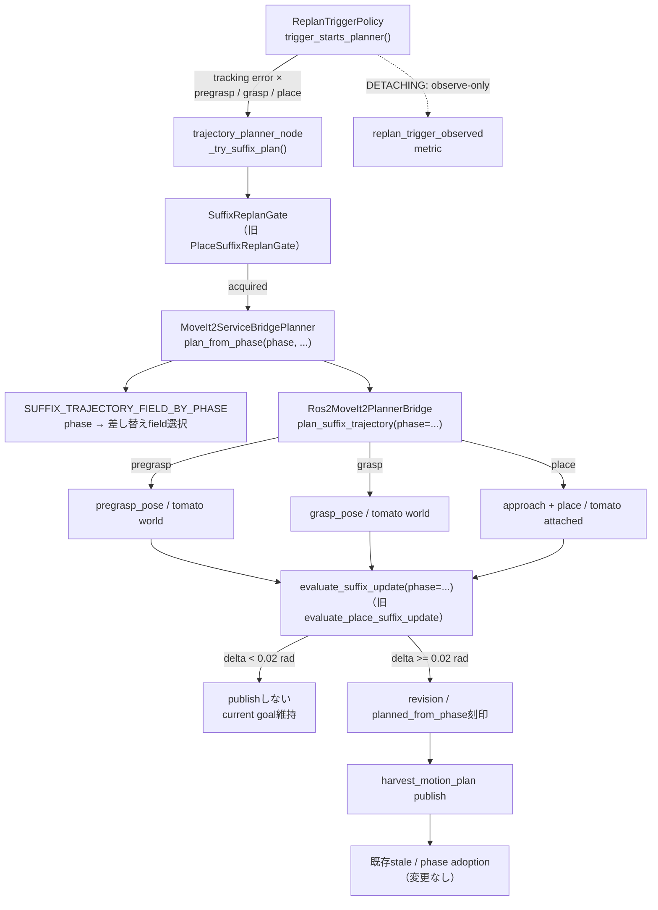

# MoveIt改善 Step 4: phase-aware suffix replan検証レポート

検証日: 2026-07-11  
対象: Issue #12  
結果: **PASS**

## 用語: phase-aware suffix replan（phase対応の残り区間再計画）とは

Step 3で導入した **suffix（残り区間）replan** は、動作計画全体のうち現在地点より後に残っている区間だけを再計画する方式である。Step 3では対象を `MOVING_TO_PLACE` の1 phaseに限定していた。

Step 4の **phase-aware suffix replan** は、これを自由空間の移動phase全体へ一般化したものである。「phase-aware（phase対応）」とは、実行中のphaseに応じて「どの区間を」「どのplanning scene設定で」再計画するかをplanner adapterが自動で選ぶことを意味する。

| 実行中のphase | 再計画する残り区間 | planning sceneのトマト |
| --- | --- | --- |
| `MOVING_TO_PREGRASP` | 現在位置 → pregrasp | world側に配置（未把持） |
| `MOVING_TO_GRASP` | 現在位置 → grasp | world側に配置（未把持） |
| `MOVING_TO_PLACE` | 現在位置 → approach → place | gripperへattach（把持中） |
| `DETACHING` | **対象外**（後述） | — |

## この検証の目的

この検証で確かめたいのは、Step 3で `MOVING_TO_PLACE` に限定して実証したsuffix replanの境界（state集約 → trigger判定 → suffix planning → 小差分判定 → revision付きpublish → adoption）が、**phase固有の分岐をnode側へ増やさずに、自由空間の全移動phaseへそのまま一般化できるか**である。

計画書（`docs/planning_movit2_improvements.html` Step 4）はこの段階の成果物を「suffix plannerそのものより、phase-aware global planner adapter」と定義している。つまりここで作るのは、将来の改善案C（Hybrid Planning / local planner構成）でglobal plannerが担う「低頻度で残区間を解き直す役割」のインタフェースそのものである。

具体的には、次の問いに答える。

1. `MOVING_TO_PREGRASP` / `MOVING_TO_GRASP` でも、最新joint stateを起点に現在phaseの残区間だけを再計画できるか。
2. phaseごとの残区間選択とplanning scene設定の違いを、node側のif分岐ではなくplanner adapter側（`plan_from_phase()`）へ寄せられるか。
3. Step 3のstale抑止・小差分抑止・多重起動抑止が、phaseを問わず同じ仕組みで機能するか。
4. 接触支配の `DETACHING` を周期replan対象から除外するという設計判断が、コードとテストで保証されているか。

### 合格条件

| 検証項目 | 合格条件 |
| --- | --- |
| phase別残区間計画 | 3つの自由空間phaseそれぞれで、そのphaseの区間だけが更新される |
| 起点state | suffix plannerが最新joint stateを受け取る |
| API一般化 | `plan_from_phase()` がphaseから区間とscene設定を自動選択する |
| node簡素化 | node側はphase集合の判定のみで、phase別の巨大if分岐を持たない |
| DETACHING除外 | tracking errorが出てもDETACHINGではplannerを起動しない |
| 小差分・stale・多重起動抑止 | Step 3と同じ規則が全対象phaseで機能する |
| 実機E2E | 実MoveItで3 phaseすべてのsuffix replanが成功し、収穫が完走する |

## 結論

Step 3でplace限定だったsuffix replanを、phase-aware API `plan_from_phase()` として自由空間の3移動phaseへ一般化した。実MoveIt E2Eでは、各phase進入時にtracking error `0.20 rad` を注入したところ、**3 phaseすべてでそのphaseの残区間だけが再計画・採用され、収穫サイクルは`complete`まで完走した**。suffix replanのlatencyはpregrasp `26.2 ms` / grasp `27.3 ms` / place `41.8 ms`で、初回full-chain planning `297.8 ms` に対し86〜91%短い。abortは全phaseで0回、cancel / trajectory差し替えは意図した採用3回分だけ増えた。

node側のplace専用分岐は「phase集合の判定」1つに置き換わり、区間選択とplanning scene設定（トマト把持前/後）の違いはplanner adapter側が吸収する。接触支配の`DETACHING`は設計判断として周期replan対象から除外し、テストで固定した。

## 全体アーキテクチャと検証範囲

凡例: **赤 = Step 4の追加・変更範囲**、緑 = Step 1〜3で確立済み、灰 = 変更なし。ノードは大枠（subgraph）で示し、変更したノードは枠線を赤くしている。



今回コードを変更したROS 2ノードは、Step 3と同じく **`trajectory_planner_node`のみ**である。他ノード（`behavior_planner_node` / `trajectory_monitor_node` / `move_group` / `motion_command_node` / `motion_command_executor_node` / simulator）は既存インタフェースをそのまま利用する。planner node内部では、place専用だったsuffix routing・多重起動防止機構・小差分判定を、phase-awareな共通実装（`phase_suffix_replan.py` + `plan_from_phase()`）へ一般化した。

## phase別planningフローの比較

### Step 3まで（place限定）



### Step 4（自由空間phaseへ一般化）



| 観点 | Step 3 (place限定) | Step 4 (phase-aware) |
| --- | --- | --- |
| 対象phase | `MOVING_TO_PLACE` のみ | `MOVING_TO_PREGRASP` / `MOVING_TO_GRASP` / `MOVING_TO_PLACE` |
| planner API | `plan_place_from_joint_state()`（place専用） | `plan_from_phase(phase, ...)`（phaseから区間を自動選択） |
| bridge API | `plan_place_trajectory()`（place専用） | `plan_suffix_trajectory(phase=...)`（phase dispatch） |
| node側の分岐 | `phase is MOVING_TO_PLACE` の特別扱い | `phase in SUFFIX_REPLAN_PHASES` の集合判定のみ |
| 更新区間の保証 | placeのみ差し替え | phase対応field 1つのみ差し替え（構造的に保証） |
| DETACHING | 暗黙に対象外 | 明示的に除外（コード・テスト・文書） |

## phase-aware API の構造



区間とplanning scene設定の対応表（`SUFFIX_TRAJECTORY_FIELD_BY_PHASE`）は pure module `phase_suffix_replan.py` が持ち、trigger policy・planner adapter・小差分判定がすべて同じ表を参照する。このためphaseを追加・除外する判断は1箇所の変更で全層に波及する。

## DETACHING を周期replan対象から除外する理由

`DETACHING`（茎からトマトを引き剥がす区間）は、次の理由でsuffix replanの対象にしない。

1. **接触支配区間である**: この区間の成否は経路形状ではなく、接触力と終端の微修正で決まる。OMPLベースのglobal replanが得意とする「障害物を避ける経路の解き直し」の問題ではない。
2. **OMPL非決定性が逆効果になる**: サンプリングベース計画は同じgoalでも毎回異なる経路を返し得る。接触中に経路が差し替わると、引き剥がし方向の力が乱れ、把持喪失や意図しない枝の揺れを招く。
3. **既存の救済経路が機能している**: DETACHINGの失敗はabort起点のfull-chain replanとJTCの成果ベース遷移（E2Eで確立済み）が救済する。周期replanを足しても得るものがない。
4. **正しい改善手段はlocal plannerである**: 接触・終端補正の高頻度微修正はMoveIt Servo / Hybrid Planningのlocal plannerの担当領域であり、Step 6で導入する。DETACHINGはそのlocal planner候補として残す。

この判断は次の3層に反映した。

- コード: `phase_suffix_replan.py` の `SUFFIX_REPLAN_PHASES` 定義（DETACHINGを含めない理由のコメント付き）と `replan_trigger.py` の `trigger_starts_planner()`。
- テスト: `test_contact_dominant_detaching_stays_observe_only` ほかで、DETACHINGのtracking errorがplannerを起動しないことを固定。
- 文書: 本レポートおよび `.codex/docs/RESEARCH.md` §17（一次情報つき設計判断）。

## テスト条件と発火条件

- 対象phase: `MOVING_TO_PREGRASP` / `MOVING_TO_GRASP` / `MOVING_TO_PLACE`（unit/integrationは3 phaseすべてをsubTestで検証）
- current joints: `(0.25, 0.25) rad`（既存trajectory開始点からの姿勢ずれ）
- 実行trigger: tracking error（timer / scene changeはobserve-onlyのまま、abortは従来どおりfull-chain）
- suffix target: 既存planのphase対応pose（pregrasp / grasp / approach+place）
- minimum boundary delta: `0.02 rad`
- integration backend: `MoveIt2ServiceBridgePlanner` + deterministic fake bridge
- E2E: 実MoveIt構成で、各対象phase進入時にtracking error `0.20 rad` を1回ずつ注入（`TOMATO_HARVEST_INJECT_SUFFIX_REPLAN_PHASES`）

## 主要メトリクス比較

実MoveIt E2E（ローカルGPU実行、headless 1552/3600 stepで収穫完走）で、各対象phase進入時にtracking error `0.20 rad` を1回ずつ注入した。3回の注入すべてで、そのphaseの残区間suffixが再計画され、`adopted_significant_trajectory_delta`（有意差あり）として採用された。

### phase別 replan latency



barはMoveIt planning serviceの往復を含む実測latencyを表す。full-chain（`target_found`時の初回planning、4区間+approachを連鎖計画）に対し、suffixはpregraspで91.2%、graspで90.8%、placeで86.0%短い。placeが他よりやや長いのはapproach waypoint経由の2区間計画のためである。

### phase別 abort率



barはphase別のabort率を表す。tracking error注入下でも全phaseでabortは0回だった（started数はpregrasp 2 / grasp 4 / place 3 / pull 1 / home 1）。外乱がabortではなくsuffix採用で解消されており、abort頼みの回復（Step 0で観測した課題）から置き換わっている。

### trajectory差し替え・cancel回数



barはtrajectory replacement、lineはcancelを表す。x軸は「基準線（注入0回）→ Step 3（place 1回注入）→ Step 4（3 phase各1回注入）」で、いずれも意図した採用数（注入数）分だけ正確に増えている。無条件cancel-and-replaceによる余計なchurnは発生していない。

### 契約整合の観測

- 3件のsuffix planはいずれも `planned_from_phase` が実行中phaseと一致した状態でpublishされ、adoption policyに `adopted_newer_revision`（revision 2→3→4）で採用された。
- `DETACHING` 中のtrigger評価は1回のみ発生し、`suppressed_minimum_interval` で終了。plannerは起動していない（設計どおり）。
- timer / scene changeはobserve-onlyのままで、余計なgoal差し替えを発生させていない。

## 実行した検証

```text
PYTHONPATH=src python3 -m pytest -q tests src/tomato_harvest_sim/robot src/tomato_harvest_sim/simulator
159 passed, 2 skipped

python3 -m py_compile（変更した全Pythonファイル） / bash -n（変更したCIスクリプト）
成功

実MoveIt E2E（Isaac Sim headless + MoveIt + ros2_control、ローカルGPU）
TOMATO_HARVEST_INJECT_SUFFIX_REPLAN_PHASES=moving_to_pregrasp,moving_to_grasp,moving_to_place
→ 3 phaseすべてでsuffix replan成功、収穫サイクルcomplete到達、abort 0回
```

unit / integrationテストは3 phaseをsubTestで網羅し、(1) 各phaseで対応する区間fieldだけが差し替わること、(2) plannerが最新joint stateを受け取ること、(3) DETACHINGでは bridgeが呼ばれずNoneが返ること、(4) tracking errorがDETACHINGでplannerを起動しないこと、(5) 小差分棄却・多重起動抑止がphaseを問わず機能することを固定した。

## どのphaseで効果があり、どのphaseをlocal planner候補として残すか

| phase | suffix replan適用 | 実測結果 | 判断 |
| --- | --- | --- | --- |
| `MOVING_TO_PREGRASP` | ○ | latency 26.2 ms、採用1回、abort 0 | **効果あり**。full-chain比91%短縮。global suffix replanで十分 |
| `MOVING_TO_GRASP` | ○ | latency 27.3 ms、採用1回、abort 0 | **効果あり**。ただし終端はトマトへの接近区間のため、末端の微修正はStep 6のlocal planner候補を兼ねる |
| `MOVING_TO_PLACE` | ○（Step 3から継続） | latency 41.8 ms、採用1回、abort 0 | **効果あり**。approach経由2区間でもlatencyはfull-chain比86%短縮 |
| `DETACHING` | ×（設計判断で除外） | trigger評価のみ、planner起動なし | **local planner候補**。接触支配区間はglobal replanの対象外とし、Servo / Hybrid Planningで扱う |
| `RETURNING_HOME` ほか | ×（timer対象外のまま） | — | 対象外。障害物構成が固定でreplan需要がない |

## 残課題（改善案Cへ渡すもの）

- **plan producer複線化の受け皿（Step 5）**: 現在のproducerは `global_planner` 1系統。`producer_kind` メタデータはStep 1で導入済みだが、複数producerのarbitrationはまだない。
- **suffix採用後の下流区間整合**: pregrasp suffixを採用すると、同じpregrasp poseでも終端joint構成がOMPL非決定性で変わり得るため、後続grasp区間の開始点と微小な不連続が生じ得る。現状はJTCの許容誤差と各phaseでのsuffix replanで吸収しているが、Cではlocal plannerのblendで解消する。
- **DETACHING / 終端補正のlocal planner導入（Step 6）**: 本Stepで除外したDETACHINGと自由空間末端の微修正区間に、MoveIt Servo / Hybrid Planningのlocal plannerを導入する。
- **timer / scene change triggerの解放**: cancel churnを避けるため観測専用のまま残した。event-based triggerとarbitrationが揃うStep 7で解放を判断する。
- **境界差分の時間正規化**: 小差分判定は開始・終端のjoint差のみを見ている。時間正規化したtrajectory distanceへの拡張はC移行時に検討する。

## この検証が次に何につながるか

Step 4は、改善案Cでglobal plannerが担う「低頻度で残区間を解き直す」役割のインタフェース（phase-aware global planner adapter）を完成させた。この結果は次の作業へ以下のようにつながる。



- **Step 5（producer複線化）**: `plan_from_phase()` はglobal planner側の残区間APIとして確定した。Step 5では同じ`HarvestMotionPlan`契約のまま、producerを複数持てる受け皿（`producer_kind` のarbitration）を作る。
- **Step 6（local planner導入）**: 本Stepで「global replanに向く区間（自由空間3 phase）」と「local correctionに向く区間（DETACHING・終端補正）」の線引きを実測つきで確定した。この線引きがそのままlocal plannerの適用範囲になる。
- **Step 7（改善案C成立）**: global疎replan（本Step成果）+ local高頻度補正（Step 6）+ event-based trigger + adoption arbitrationの4点が揃い、Hybrid Planning構成へ移行する。

## PR本文用: 変更差分の詳細アーキテクチャ図


