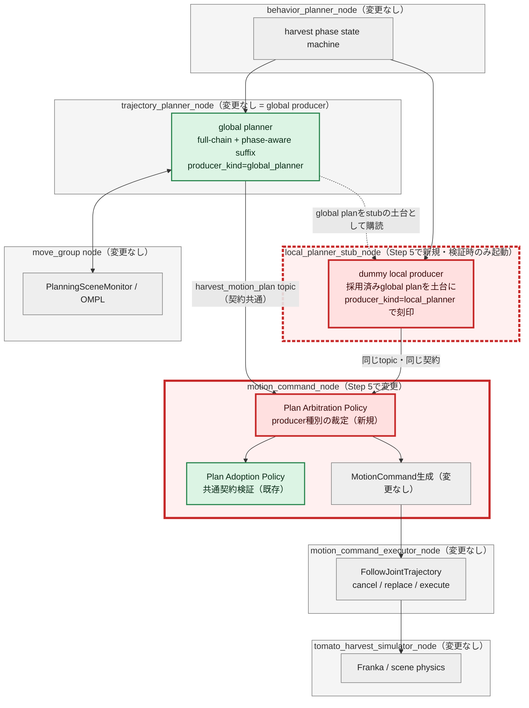
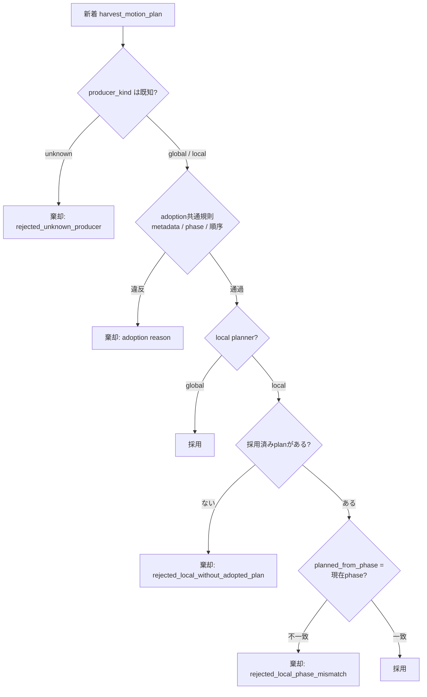
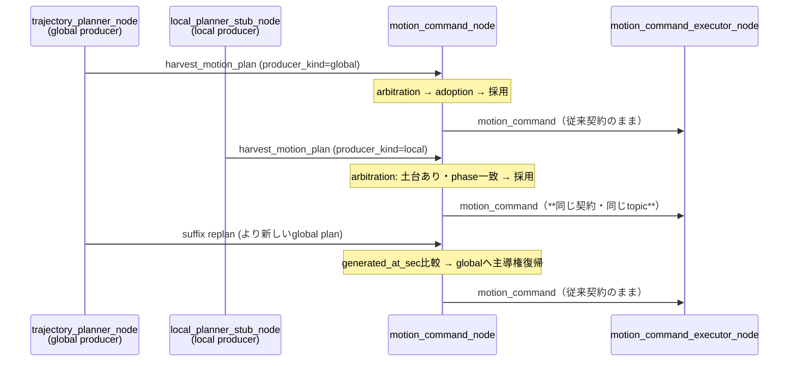
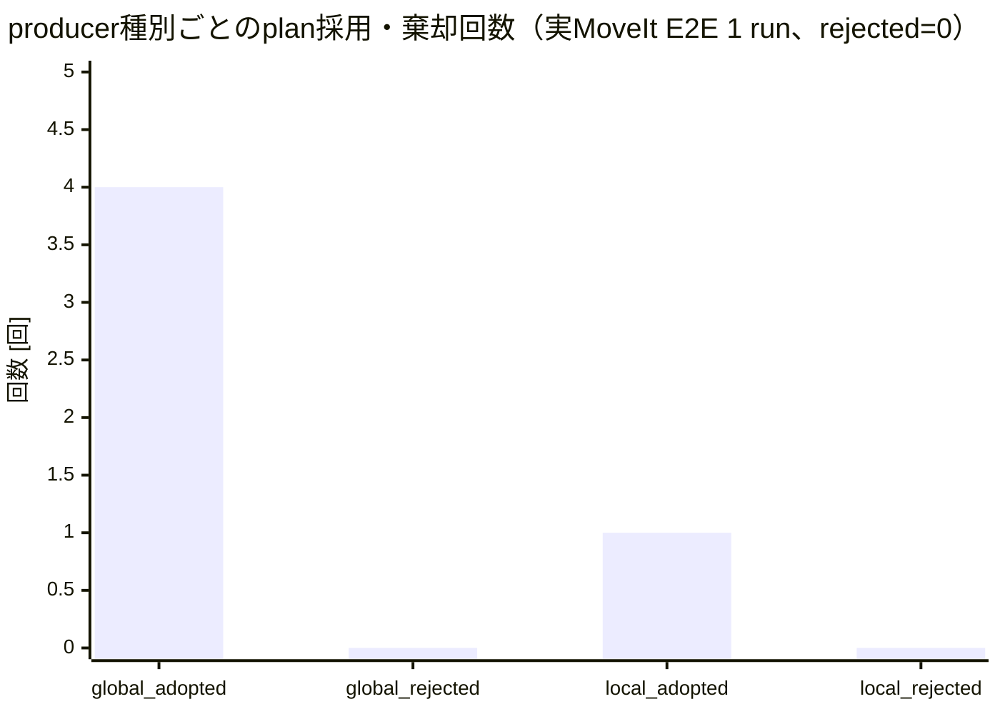
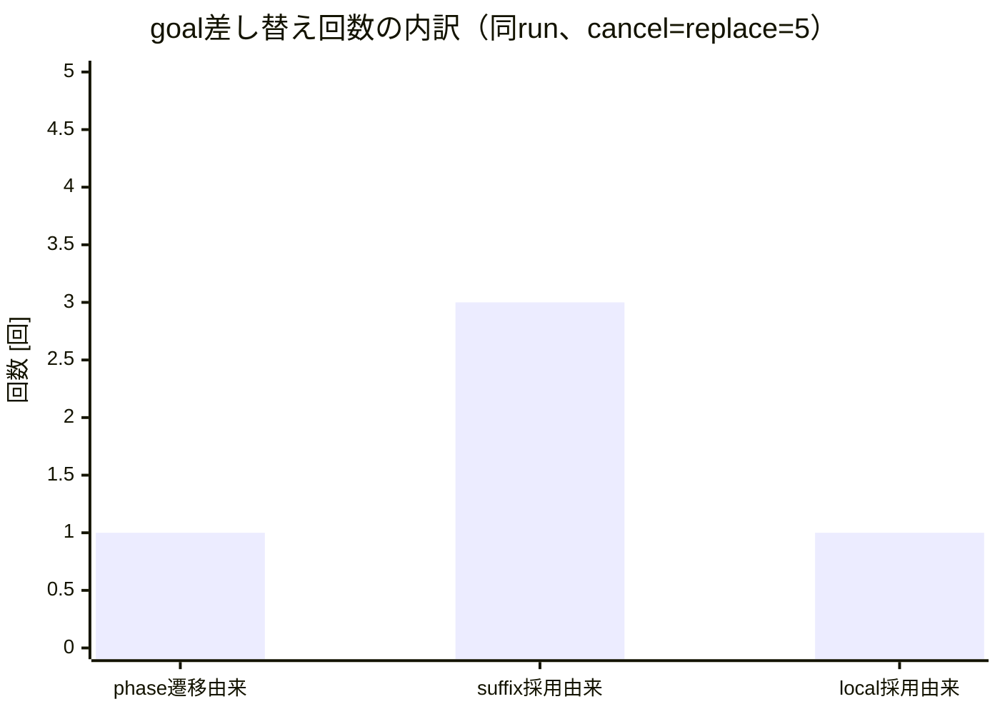
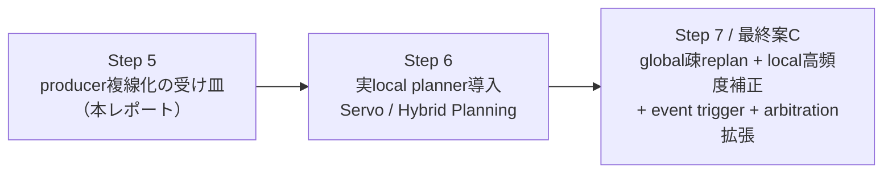
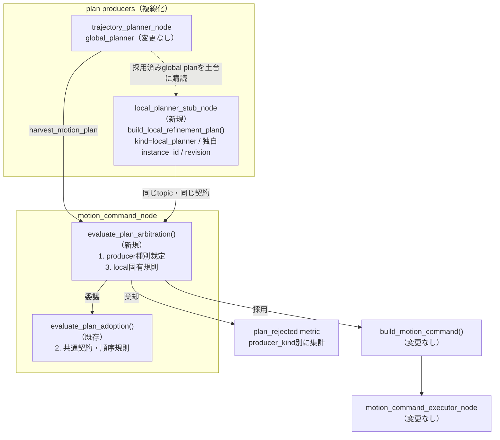

# MoveIt改善 Step 5: plan producer複線化の受け皿検証レポート

検証日: 2026-07-11  
対象: Issue #13  
結果: **PASS**

## 用語: plan producer（計画の生産者）と adoption / arbitration とは

本レポートでは、`harvest_motion_plan` を生成してpublishする主体を **plan producer（計画の生産者）** と呼ぶ。Step 4までのproducerは、MoveIt2で経路全体や残り区間を解く **global planner** の1系統だけだった。改善案Cでは、これに加えて高頻度の微修正を行う **local planner** が加わり、producerが複数になる。

consumer（`motion_command_node`）側で新着planを受け入れるか判断する規則は、次の2層に分かれる。

| 用語 | 責務 | 実装 |
| --- | --- | --- |
| adoption（採用規則） | producer種別を問わない共通の契約検証。metadata欠落のfail-closed棄却、phase整合、revision / 生成時刻による順序付け | `plan_adoption.py`（Step 1で導入済み） |
| arbitration（裁定規則） | producer種別ごとの受け入れ条件。どの種別のplanを、どの前提でパイプラインへ入れてよいかの裁定 | `plan_arbitration.py`（**Step 5で新規**） |

例えるなら、adoptionは「書類の様式チェック（誰の書類でも同じ基準）」、arbitrationは「差出人ごとの受付条件（local plannerの提案はglobal planの土台がある時だけ受ける等）」である。

## この検証の目的

この検証で確かめたいのは、**executorへ渡す下流契約（`MotionCommand` / trajectory）を一切変えずに、plan producerを複数持てる受け皿が機能するか**である。

計画書（`docs/planning_movit2_improvements.html` Step 5）はこの段階を「executorの下流契約は変えずに、plan producerを複数持てる形にする。少なくとも `global_planner` と将来の `local_planner` を識別できるようにする」と定義している。Step 6で実local planner（MoveIt Servo / Hybrid Planning）を入れる前に、複数producer混在時の採用・棄却・順序付けの規則を、ダミーproducerで先に固めておく。

具体的には、次の問いに答える。

1. `producer_kind` の識別だけで、global / local のplanが同じtopic・同じ契約のまま共存できるか。
2. adoption（共通契約）とarbitration（producer間裁定）の責務が分離され、それぞれ独立にテストできるか。
3. local plannerのダミーplanを実システムに混入させても、収穫サイクルが破綻しないか。
4. local plan採用後も、global plannerが通常規則で主導権を取り戻せるか（デッドロックしないか）。

### 合格条件

| 検証項目 | 合格条件 |
| --- | --- |
| producer識別 | `producer_kind` / `producer_instance_id` でglobal / localを識別できる |
| 責務分離 | adoption / arbitrationが別moduleの pure functionで、独立にテストできる |
| local固有規則 | 土台planなし・phase不一致のlocal planを棄却する |
| 順序付け | producer間はgenerated_at_sec、同一producer内はrevisionで順序付けられる |
| executor契約維持 | `MotionCommand` / trajectory契約と`motion_command_executor_node`が無変更 |
| 非破綻E2E | dummy local plan混入下で、実MoveIt E2Eが収穫完走する |

## 結論

consumer（`motion_command_node`）の判定窓口をarbitration policy（producer種別の裁定、新規pure module）に切り替え、既存のadoption policy（共通契約検証）へ委譲する2層構造にした。producer側には、global plannerと独立した`producer_kind` / `producer_instance_id` / revisionを刻印するdummy local producer（`local_planner_stub_node`）を追加した。

実MoveIt E2Eでは、`MOVING_TO_PLACE`進入時にdummy local planが1回publishされ、arbitrationを通って`adopted_newer_producer_instance`で採用された（global rev3 → local rev1へ主導権移動）。直後のglobal place suffix replan（41.6 ms）が同じ規則で主導権を奪還し、**global⇔local間の主導権交代がデッドロックなしで双方向に機能したまま、収穫サイクルはabort 0回で`complete`まで完走した**。executorへ渡すtopic・契約・`motion_command_executor_node`のコードは一切変更していない。

## 全体アーキテクチャと検証範囲

凡例: **赤 = Step 5の追加・変更範囲**、緑 = Step 1〜4で確立済み、灰 = 変更なし。ノードは大枠(subgraph)で示し、変更・追加したノードは枠線を赤くしている。



今回変更したROS 2ノードは **`motion_command_node`（arbitration窓口の導入）** と、検証時のみ起動する新規ノード **`local_planner_stub_node`（破線枠）** の2つである。global producerである`trajectory_planner_node`、`move_group`、`motion_command_executor_node`、simulatorは変更していない。特に、planを運ぶtopicと契約（`HarvestMotionPlan`のフィールド）は一切変えず、Step 1で導入済みのmetadata（`producer_kind` / `producer_instance_id` / `plan_revision` / `generated_at_sec` / `planned_from_phase`）だけで複線化を実現している。

## adoption / arbitration の規則

arbitrationは次の順で判定する。1〜2が全producer共通、3がlocal固有の裁定である。

| # | 規則 | 対象 | 棄却reason |
| --- | --- | --- | --- |
| 1 | 未知の`producer_kind`はfail-closedで棄却 | 全producer | `rejected_unknown_producer` |
| 2 | adoption共通規則（metadata欠落 / phase整合 / revision・時刻順序） | 全producer | `rejected_missing_plan_metadata` / `rejected_phase_mismatch` / `rejected_stale_revision` / `rejected_stale_producer_instance` ほか |
| 3a | local planは採用済みplanの土台が必要 | local | `rejected_local_without_adopted_plan` |
| 3b | local planは実行中phaseの補正専用（`planned_from_phase` = 現在phase） | local | `rejected_local_phase_mismatch` |



producer間の主導権交代はStep 1の順序規則をそのまま使う: 同一`producer_instance_id`内はrevision比較、異なるinstance（global⇔local間を含む）は`generated_at_sec`比較。このためlocal plan採用後も、より新しいglobal plan（suffix replan等）が届けば通常規則で主導権が戻り、特別な優先度制御を必要としない。

## executor契約の維持



| 契約要素 | Step 4まで | Step 5 |
| --- | --- | --- |
| plan topic / `HarvestMotionPlan` フィールド | Step 1契約 | **変更なし**（既存metadataのみ使用） |
| `MotionCommand` / `PhaseMotionPlan` | phase別trajectory + gripper | **変更なし** |
| executorのcancel / replace / execute | FollowJointTrajectory | **変更なし**（コード無変更） |
| consumerの判定窓口 | `evaluate_plan_adoption` | `evaluate_plan_arbitration`（内部でadoptionへ委譲） |

## ダミーlocal planner検証結果

実MoveIt E2E（suffix外乱3 phase注入 + local plan注入を併用）の実測イベント列（抜粋・時系列順）:

```text
local_planner_stub_started         enabled_phases=moving_to_place instance=6fcb9ddc...
local_planner_stub_base_plan_captured  plan_revision=1（global full-chain planを土台に捕捉）
plan_adopted  rev=1 global  adopted_initial
suffix_replan_completed  moving_to_pregrasp  35.7ms → plan_adopted rev=2 global
suffix_replan_completed  moving_to_grasp     14.6ms → plan_adopted rev=3 global
local_plan_published  moving_to_place  local rev=1 instance=6fcb9ddc...
plan_adopted  local rev=1  adopted_newer_producer_instance   ← localへ主導権移動
suffix_replan_completed  moving_to_place     41.6ms
plan_adopted  global rev=4  adopted_newer_producer_instance  ← globalが主導権を奪還
Phase: returning_home → complete（収穫完走）
```

確認できたこと:

1. **識別**: local planは`producer_kind=local_planner`と独自`producer_instance_id`で識別され、globalと同じtopic・同じ契約で流れた。
2. **採用**: arbitrationの土台規則（採用済みglobal planあり）とphase-bound規則（`planned_from_phase=moving_to_place`一致）を通過し、Step 1の順序規則（`generated_at_sec`比較）で採用された。
3. **主導権復帰**: local採用の直後、より新しいglobal suffix replanが同じ規則で採用され、特別な優先度制御なしにglobalへ戻った。
4. **非破綻**: goal差し替えはlocal採用分1回だけ増え、abort 0回で収穫が完走した。executor側コードは無変更。

なお、観測イベント`local_planner_stub_started` / `local_planner_stub_base_plan_captured` / `local_plan_skipped`（skip理由付き）をstubに実装しており、注入が発火しなかった場合も原因（土台plan未着 / 対象trajectory欠落）をログから特定できる。

## 主要メトリクス: producer種別ごとの採用・棄却



barはE2E 1 runでの`plan_adopted` / `plan_rejected`イベント数をproducer種別に分けたもの。global 4回（initial 1 + suffix replan 3）、local 1回で、全candidateが正当だったため棄却は0回である。棄却経路（未知producer、土台なしlocal、phase不一致local、metadata欠落、stale）は unit test 13件で網羅している（`test_plan_arbitration.py` 9件 + `test_plan_adoption.py` 更新分）。



barはtrajectory replacement 5回の由来内訳。suffix採用3回とlocal採用1回は意図した差し替えで、無条件cancel-and-replaceによる余計なchurnはない。abort率は全phaseで0%だった（started: pregrasp 2 / grasp 4 / place 4 / pull 1 / home 1）。

## 実行した検証

```text
PYTHONPATH=src python3 -m pytest -q tests src/tomato_harvest_sim/robot src/tomato_harvest_sim/simulator
172 passed, 2 skipped

python3 -m py_compile（変更した全Pythonファイル） / bash -n（変更したshellスクリプト）
成功

実MoveIt E2E（Isaac Sim headless + MoveIt + ros2_control、ローカルGPU）
TOMATO_HARVEST_INJECT_SUFFIX_REPLAN_PHASES=moving_to_pregrasp,moving_to_grasp,moving_to_place
TOMATO_HARVEST_INJECT_LOCAL_PLAN_PHASES=moving_to_place
→ dummy local plan採用 + global主導権奪還 + suffix replan 3 phase成功 + 収穫complete到達
```

unit testでは、(1) arbitrationの棄却規則（未知producer / 土台なしlocal / phase不一致local / stale / metadata欠落）、(2) local採用後のglobal復帰、(3) stubの刻印（kind / instance / revision / phase）と下流契約フィールドの保存、(4) DETACHING・trajectory欠落時の非生成、を固定した。

補足: E2Eの初回実行では、place phaseの外乱が重なった状況（goal abort + OMPL planning失敗の連鎖）でdummy local planが発行されず検証チェックに失敗した（再実行で解消、収穫自体は完走）。この事象を受けてstubへ上記の観測イベントを追加しており、再発時はskip理由をログから直接特定できる。

## C導入前の残ギャップ

- **把持直前の外乱注入E2EはOMPL非決定性でflaky**: CIで`MOVING_TO_GRASP`進入時に外乱を注入すると、grasp suffix replanが同じEE poseへ別の関節構成で向かう経路に差し替わることがあり、把持失敗（`GRASP_EVALUATION timeout` → `failed`）を確率的に誘発する（CIで2回再現。Step 5の変更とは独立の、Step 4以前からの挙動）。常設CIの外乱注入はplace phaseに絞り、pregrasp / graspへの注入はオンデマンド検証に切り替えた。末端接近区間の経路差し替えを抑えてこれを恒久解消することが、Step 6 local plannerの主要動機の一つである。
- **実local plannerの中身**: 本Stepのlocal producerはno-op refinement（採用済みglobal planの当該phase区間をそのまま再刻印）であり、実際の軌道補正はしない。MoveIt Servo / Hybrid Planning local plannerの導入はStep 6。
- **高頻度publish時の流量制御**: 実local plannerは高頻度でplanを出す。現在のarbitrationは1件ずつの裁定であり、採用頻度の上限（rate limit）や「global planの区間とlocal補正のblend」はStep 6/7で扱う。
- **producer優先度の明示**: 現在はgenerated_at_sec順で「新しい方が勝つ」。Cの最終形では「接触区間はlocal優先」「全体経路の変化はglobal優先」といったphase・状況依存のarbitrationが必要になる。
- **trigger policyのevent化**: local plannerはtimer/tracking errorではなくセンサ入力駆動になる。event-based triggerへの移行はStep 7。

## この検証が次に何につながるか

Step 5は、改善案Cの核心である「global planner（疎な全体再計画）とlocal planner（高頻度補正）の並走」に必要な受け皿を、実planner導入前に配管だけ先に完成させた。この結果は次の作業へ以下のようにつながる。



- **Step 6（実local planner）**: 本Stepで固めたarbitration窓口とlocal固有規則（土台必須・phase-bound）に、実際の補正planを流し込むだけでよい。stubの`build_local_refinement_plan()`を実装へ差し替える構造になっており、consumer側・executor側の変更は不要である。適用開始区間はStep 4で整理したとおり、自由空間末端の微修正区間（place終端）から始め、DETACHINGへ広げる。
- **Step 7（改善案C成立）**: producer複線化（本Step）+ 実local planner（Step 6）に、event-based triggerとphase依存のarbitration拡張を加えて最終形へ移行する。

## PR本文用: 変更差分の詳細アーキテクチャ図


