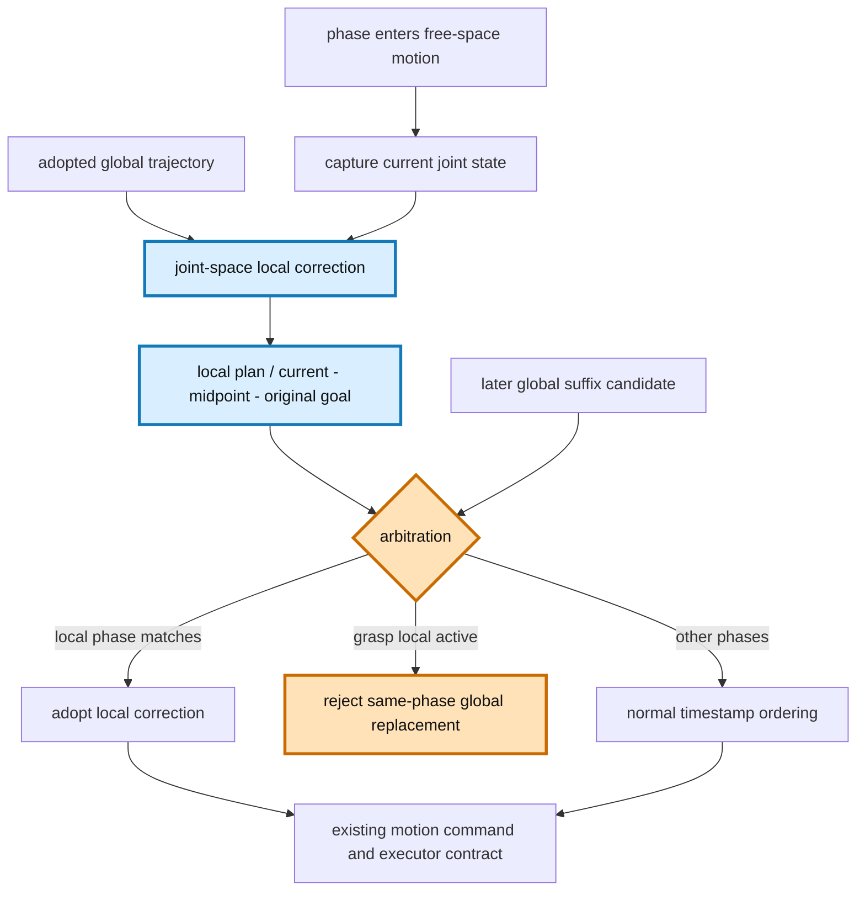
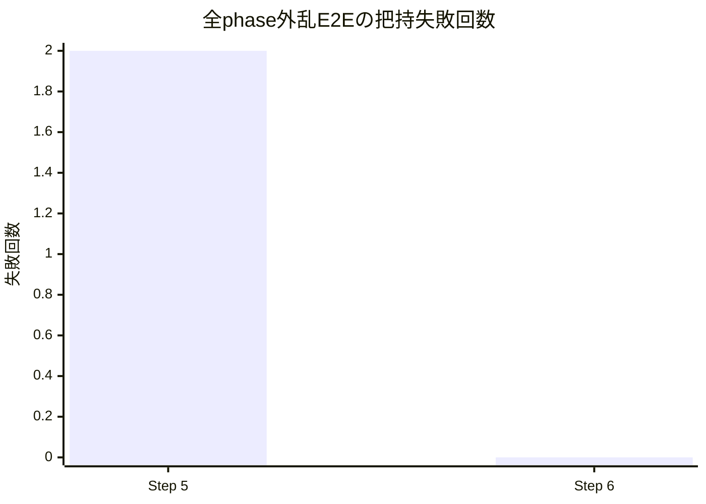
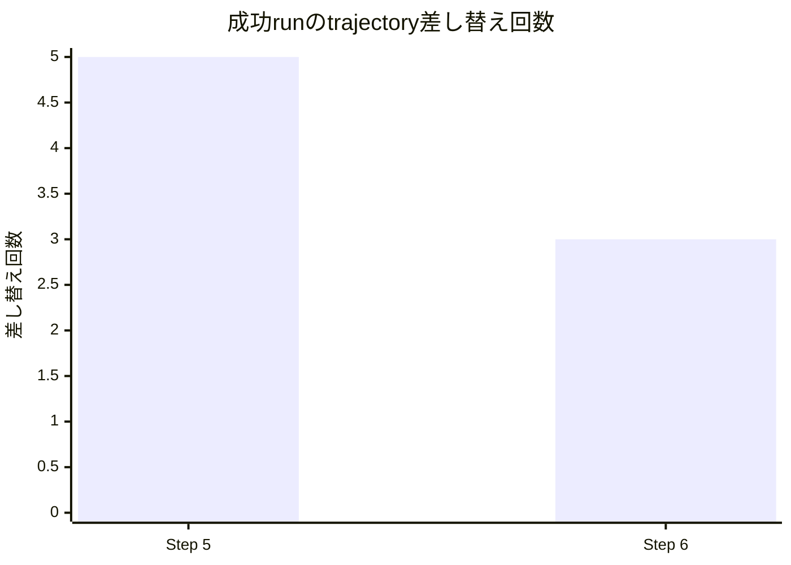

# MoveIt改善 Step 6: joint-space local planner検証レポート

## 検証目的

把持直前のtracking errorに対してglobal suffix replanをそのまま実行軌道へ差し替えると、OMPLが同じ手先姿勢へ別の関節構成を返し、`GRASP_EVALUATION timeout`へ至ることがある。本検証では、現在関節状態から既存global goalへ接続するlocal correctionを導入し、次を確認する。

1. `MOVING_TO_PREGRASP` / `MOVING_TO_GRASP` / `MOVING_TO_PLACE`でlocal plannerが動くこと。
2. global plannerとlocal plannerが同じplan契約上で共存できること。
3. 把持直前ではlocal correctionを優先し、別IK解への差し替えを防いで収穫を完走できること。
4. executorのtopic・JSON・`FollowJointTrajectory`契約を変更しないこと。

## 全体アーキテクチャと今回の範囲

青が今回変更したノード、橙が変更した裁定ロジック、灰色が変更していないノードである。

```mermaid
flowchart LR
  Camera["fixed camera node"] --> Perception["perception node"]
  Perception --> Behavior["behavior planner node"]
  Behavior --> Global["trajectory planner node / global planner"]
  Behavior --> Local["local planner node / joint-space correction"]
  Joint["joint states"] --> Global
  Joint --> Local
  Global --> Topic["harvest motion plan"]
  Local --> Topic
  Topic --> Command["motion command node / arbitration"]
  Command --> Executor["motion command executor node"]
  Executor --> Sim["Isaac Sim / Franka"]
  Sim --> Joint

  classDef changed fill:#d9efff,stroke:#1479b8,stroke-width:3px,color:#111;
  classDef policy fill:#ffe2b8,stroke:#c96b00,stroke-width:3px,color:#111;
  classDef unchanged fill:#eeeeee,stroke:#777,color:#111;
  class Local changed;
  class Command policy;
  class Camera,Perception,Behavior,Global,Joint,Topic,Executor,Sim unchanged;
```

検証範囲はlocal plannerの軌道生成と、`motion_command_node`内のglobal/local採用規則である。global planner、executor、Isaac Simの実装は変更していない。

## global / local plannerの役割分担

| 役割 | global planner | local planner |
| --- | --- | --- |
| 入力 | target、planning scene、現在関節状態 | 採用済みglobal plan、現在関節状態、現在phase |
| 出力 | 全体または残区間のOMPL trajectory | 現在状態から既存global終端へ接続する3点trajectory |
| 得意な変更 | 障害物や目標変更を含む経路全体 | 小外乱、実行開始点のずれ、終端付近の連続性 |
| 対象phase | 自由空間3phase | 自由空間3phase |
| 初回対象外 | 接触中の高速補正 | `DETACHING` |

local correctionは開始点を最新JointStateへ置き、最も近いglobal waypointから先の安全な経路形状を再時刻化し、終端はglobal planの既存関節角を保持する。これはMoveIt Servoそのものではなく、Hybrid Planningのglobal/local責務分離を既存executor契約のまま先行導入する最小構成である。

## PR変更差分の詳細アーキテクチャ

## 採用規則

- local planは採用済みplanを土台とし、`planned_from_phase`が現在phaseと一致する場合だけ採用する。
- local planが採用された後は、自由空間3phaseすべてで同phase起点のglobal suffix planを棄却する。
- phase-boundでないfull global planは従来どおり生成時刻順に主導権を取り戻せる。
- phase遷移後は新phaseのglobal/local planを通常規則で扱うため、把持phaseでglobalを永久に停止しない。

## 導入前後の比較

Step 5では把持直前の全phase外乱検証で`GRASP_EVALUATION timeout`を2回観測したため、常設CIをplace限定へ縮退していた。Step 6では全3phase注入を復元し、CI run `29159991638`で失敗0回を確認した。

Step 6の3回は各phaseのlocal correction採用に対応する。後着のglobal suffix 3件は計画自体には成功したが、実行軌道へは差し替えず棄却した。外乱強度は両Stepともtracking error `0.20 rad`で、Step 6では対象をplace 1phaseから自由空間3phaseへ拡大した。

| 指標 | Step 5 | Step 6 |
| --- | ---: | ---: |
| tracking error注入対象 | placeのみ（常設CI） | pregrasp / grasp / place |
| phase abort率 | 0%（place限定成功run） | 0%（全phase） |
| trajectory差し替え回数 | 5回 | 3回 |
| local plan採用数 | 1回（no-op） | 3回（実補正） |
| 収穫完走 | 成功。ただし全phase注入はflaky | 成功 |

Step 6のphase別started/abortはpregrasp `2/0`、grasp `4/0`、place `3/0`、pull `1/0`、home `1/0`だった。global plannerは初期plan 1件を採用、同phase suffix 3件を棄却し、local plannerは3件すべて採用された。suffix planning latencyはpregrasp `29.595 ms`、grasp `14.052 ms`、place `39.545 ms`である。

## 有効なケースと未解決ケース

| ケース | 判定 | 理由 |
| --- | --- | --- |
| pregrasp開始点の小外乱 | 対象 | 現在JointStateから既存終端へ連続に接続する |
| grasp直前のtracking error | 主対象 | globalの別IK解によるgoal差し替えを抑止する |
| place移動中の小外乱 | 対象 | local補正後もglobalへの主導権復帰を許す |
| targetや障害物の大変化 | global planner担当 | 既存経路の終端保持だけでは解決できない |
| `DETACHING`中の接触・力制御 | 未解決 | velocity/pose command型Servoと力・接触観測が必要 |
| 高頻度連続補正 | 未解決 | 今回はphaseごと1回。rate limitとstale command制御はStep 7で扱う |

## 実行した検証

- pure unit test: 現在JointStateの関節名順序をtrajectory順へ変換し、開始点へ反映する。
- pure unit test: global終端関節角とexecutor契約フィールドを維持する。
- arbitration test: grasp local制御中の同phase global suffixを棄却する。
- regression: Python全体 `174 passed, 2 skipped`。
- syntax: Python compile、shell `bash -n`、`git diff --check`。
- 実Isaac Sim E2E: CI run `29159991638`（成功、全3phase外乱、収穫完走）。

## 次のステップとの関係

本検証は、Step 7の「global疎replan + local高頻度補正 + event-based trigger」へ進むための最小local plannerである。Step 7ではphase進入時1回の補正をセンサイベント駆動へ置き換え、MoveIt Servo相当の速度・pose command、collision/singularity監視、rate limit、stale command制御を追加する。今回残したexecutor契約の互換性により、移行範囲をlocal producerとarbitration境界へ限定できる。

## 参照

- [MoveIt Hybrid Planning](https://moveit.picknik.ai/main/doc/concepts/hybrid_planning/hybrid_planning.html)
- [MoveIt Realtime Servo](https://moveit.picknik.ai/main/doc/examples/realtime_servo/realtime_servo_tutorial.html)
- Issue #14
