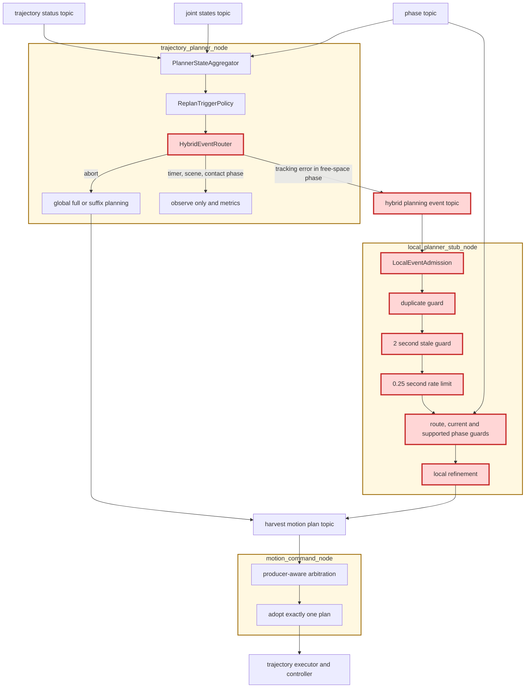
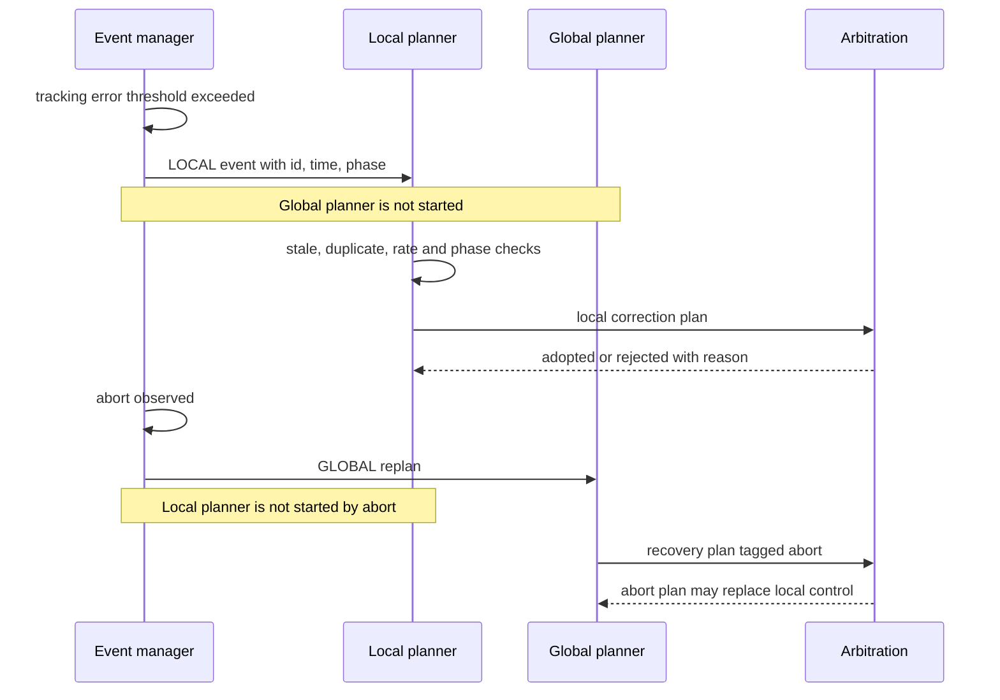

# MoveIt改善 Step 7: 最終Hybrid Planning検証レポート

## 目的と、この検証が次につながる点

初期計画と重大障害の復旧を担うglobal plannerと、実行中の追従誤差を即時に扱うlocal plannerを分離し、同じ外乱から両方が競合起動しないことを検証する。Step 7の成果は、現在のjoint-space補正をMoveIt Servo等の実時間solverへ交換するためのイベント・採用境界となる。

## 検証範囲を示す全体アーキテクチャ

凡例: 赤はStep 7変更、緑は既存利用、灰は検証範囲外。

```mermaid
flowchart LR
  Camera[Camera nodes] --> Perception[perception node]
  Perception --> Behavior[behavior planner node]
  Simulator[Isaac Sim node] --> State[joint state / scene]
  Behavior --> Manager[trajectory planner node<br/>event manager]
  State --> Manager
  Manager --> Global[global planner node<br/>MoveIt planning]
  Manager --> Event[hybrid planning event]
  Event --> Local[local planner node<br/>joint-space correction]
  Global --> Arbitration[motion command node<br/>arbitration]
  Local --> Arbitration
  Arbitration --> Executor[trajectory executor node]
  Executor --> Controller[joint trajectory controller]
  Controller --> Simulator
  classDef changed fill:#ffd6d6,stroke:#c62828,stroke-width:3px
  classDef existing fill:#d9f2df,stroke:#238636
  classDef outside fill:#eeeeee,stroke:#777777
  class Manager,Event,Local,Arbitration changed
  class Global,State,Executor,Controller existing
  class Camera,Perception,Behavior,Simulator outside
```

## PR変更差分の詳細アーキテクチャ

黄色の大枠がROS 2 node、赤がStep 7で追加・変更した処理またはtopicを表す。`HybridEventRouter`は`trajectory_planner_node`内、各guardと`LocalEventAdmission`は`local_planner_stub_node`内、最終的なproducer競合判定は`motion_command_node`内にある。これにより、図中の論理モジュールがどの実行nodeに属するかを追跡できる。

### HybridEventRouterの役割

図の`HybridEventRouter`は独立したROS 2 nodeの名前ではなく、`hybrid_event.py`の`route_event()`と`trajectory_planner_node`のイベントpublish処理を合わせた論理モジュール名である。入力は、`ReplanTriggerPolicy`が正規化したイベント種別（`tracking_error`、`abort`、`timer`、`scene_change`）と現在phaseで、出力は次の3種類の配送先である。

| 配送結果 | 条件 | 実行すること | 実行しないこと |
|---|---|---|---|
| `LOCAL` | 自由空間phase中の`tracking_error` | event ID、発生時刻、phase、誤差をlocal plannerへpublishする | global plannerを起動しない |
| `GLOBAL` | `abort` | 現在phaseから復旧するglobal full/suffix replanを起動する | 同じabortからlocal補正を起動しない |
| `OBSERVE` | `timer`、`scene_change`、接触支配phaseのtracking error | metricを残し、後から発生傾向を分析できるようにする | plan生成やcontroller goal置換はしない |

このモジュールの要点は、優先順位を付けて両plannerを順番に起動することではなく、**一つのイベントの担当plannerを一つに決めること**である。例えば`MOVING_TO_GRASP`で`0.20 rad`のtracking errorを検出した場合、Step 6ではlocal補正とglobal suffix replanの両方が候補になり得た。Step 7では`LOCAL`だけを返し、global計画による別IK解への差し替えとcancel churnを入口で防ぐ。

`timer`と`scene_change`を`OBSERVE`にしている理由も同じである。現在のscene generationはsnapshot更新に伴って頻繁に変化するため、そのままglobal replanへ接続すると「意味のある障害物変化」ではない更新でも再計画が連続する。将来、物体poseやcollision状態の意味的差分を判定できるようになった時点で、重大なscene changeだけを`GLOBAL`へ昇格させる。

### LocalEventAdmissionの役割

図の`LocalEventAdmission`も独立nodeではなく、`local_planner_stub_node`がイベントを受信したときに呼ぶ`admit_local_event()`という純粋な判定ロジックである。`HybridEventRouter`が「どのplannerの仕事か」を決めるのに対し、`LocalEventAdmission`は「local planner宛てイベントを**今この瞬間に実行して安全か**」を判定する。

判定に通った場合だけlocal refinement planを生成・publishする。抑止された場合はplanを生成せず、controller goalも置換せず、`local_event_suppressed` metricへ理由を記録する。したがってguardはエラーを隠すものではなく、危険または無駄な補正を止めつつ、止めた理由を観測可能にする境界である。

### 図中のguardとlimit

`guard`は「条件を満たさない入力を先へ通さない検査」、`limit`は「許容する頻度や時間の上限」である。Step 7では次の順に確認する。

| 図中の名称 | 検査内容 | 防ぐ問題 | 抑止理由 |
|---|---|---|---|
| route / current-phase guard | eventのrouteが`LOCAL`で、eventに記録されたphaseがnodeの現在phaseと一致するか | phase遷移後に前phase用trajectoryを差し替える競合 | 対象外routeは無視、phase不一致は実行しない |
| duplicate guard | `event_id`が最後に採用したIDと同じでないか | ROS再配送や重複publishによる同一補正の二重実行 | `duplicate_event` |
| 2 second stale guard | `now - event_at_sec`が2秒以内で、未来時刻でもないか | callback遅延やqueue滞留により、既に解消・変化した誤差へ古い補正を適用すること | `stale_event` |
| 0.25 second rate limit | 前回採用時刻から0.25秒以上経過したか | tracking statusが高周期で届くたびにtrajectoryをpublishし、controllerをcancel-and-replaceし続けること | `rate_limited` |
| supported-phase guard | phaseがpregrasp、grasp、placeの自由空間phaseか | `DETACHING`など接触中にjoint-space補正を適用し、把持や離脱を壊すこと | `unsupported_phase` |

具体例として、時刻`10.00秒`にevent Aを採用した直後を考える。

- `10.05秒`に同じIDのevent Aが再到着した場合は、duplicate guardで止める。
- `10.10秒`に別IDのevent Bが到着しても、前回から`0.10秒`しか経っていないためrate limitで止める。
- `10.30秒`に別IDのevent Cが到着すれば、他の条件も満たす限り採用できる。
- 現在時刻が`10.30秒`なのに発生時刻が`8.00秒`のevent Dは、2秒を超えて古いためstale guardで止める。
- eventが`MOVING_TO_GRASP`用でも、受信時点で`AT_GRASP`へ遷移済みならcurrent-phase guardで止める。

`0.25秒`と`2秒`は、今回のCIでイベント配送と競合抑止を検証するための初期設定値であり、ロボット固有の安全保証値ではない。前者はlocal plan publishを最大約4回/秒に制限し、後者は明らかに古いqueue入力を除外する。本番ではcontroller周期、センサ周期、network jitter、補正計算のp95 latencyを実測し、設定ファイルへ外出ししたうえで再調整する必要がある。

## 実行シーケンス

## phase別責務

| phase | tracking error | abort | local補正 |
|---|---|---|---|
| moving_to_pregrasp | localへ配送 | global復旧 | 有効 |
| moving_to_grasp | localへ配送 | global復旧 | 有効 |
| detaching | 観測のみ | global復旧 | 無効 |
| moving_to_place | localへ配送 | global復旧 | 有効 |
| その他 | 観測のみ | global復旧 | 無効 |

## Before / Step 3 / 最終案Cの比較

| 指標 | Before (Step 0) | Step 3 | 最終案C (Step 7) |
|---|---:|---:|---:|
| tracking error時のglobal replan | なし | place suffix 1回 | 0回（localへ排他配送） |
| trajectory replacement / cancel | 3 / 3 | 4 / 4 | 外乱によるglobal replacement 0 |
| 実MoveIt計画latency | fullのみ | full 342.122 ms / suffix 41.888 ms | tracking error経路では0 ms |
| 外乱対象phase | なし | place | pregrasp / grasp / place |
| Step 6実測abort率（比較根拠） | - | 0% | 0%（3 phase） |

Step 7の単体検証は169件成功、2件skip。ローカル実MoveIt E2Eでは3phaseすべてで `hybrid_event_routed(route=local)`、local plan publish、arbitration採用、収穫完走を確認し、tracking error起点のglobal suffix計画は0件だった。self-hosted runnerの過去ログ混入を防ぐため、CI判定前にartifact logをtruncateする。GitHub Actionsの最終run IDはPRへ記録する。

## latency、abort、tracking error、cancel、replacement

| 観測項目 | Step 3 | Step 6 | Step 7期待値 / CI判定 |
|---|---:|---:|---|
| suffix latency [ms] | 41.888 (place) | 29.595 / 14.052 / 39.545 | tracking errorでは計測対象外 |
| tracking error注入 [rad] | 0.20 | 0.20 | 0.20 |
| abort | 0 | 0 | 0を要求 |
| 外乱由来global cancel | 1 | 採用0 | 0を要求 |
| local replacement | 0 | 3 | 3を要求 |

rate limitは「高頻度入力を受けられるが、controller goalを無制限に置換しない」ための安全弁である。イベントが0.25秒より短い間隔なら抑止し、2秒より古いイベントや同じIDは採用しない。

## 結論と本番採用判断

イベント配送、global/local責務、競合裁定の構造は採用可能である。一方、現local plannerはglobal waypointを保持して停止点を加えるjoint-space補正であり、センサ閉ループの速度／pose solverではない。このため、構造は本番採用、補正solverは条件付き不採用とする。

本番採用までの残件は、MoveIt Servoまたは同等solverへの差し替え、collision・singularity・joint bound停止のE2E、安全停止からglobal復旧を要求するlocal event、実機周期でのp95 latency測定である。次はこの境界を維持したままlocal planner内部だけをServoへ置換し、10初期姿勢CI（Issue #13）と組み合わせて成功率を継続蓄積する。
