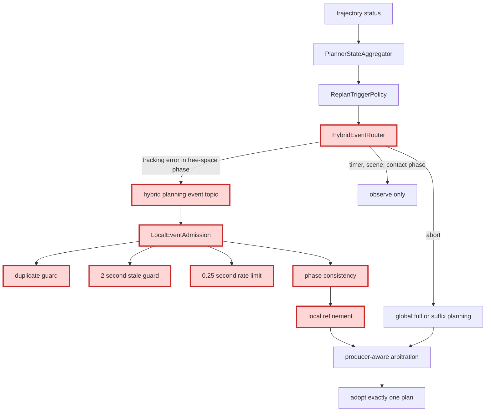
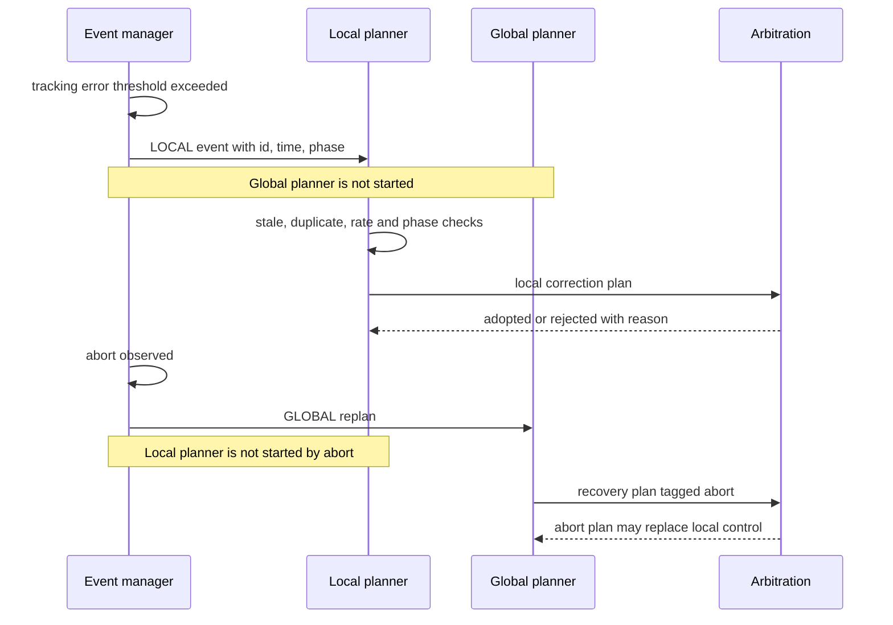

# MoveIt改善 Step 7: 最終Hybrid Planning検証レポート

## 目的と、この検証が次につながる点

初期計画と重大障害の復旧を担うglobal plannerと、実行中の追従誤差を即時に扱うlocal plannerを分離し、同じ外乱から両方が競合起動しないことを検証する。Step 7の成果は、現在のjoint-space補正をMoveIt Servo等の実時間solverへ交換するためのイベント・採用境界となる。

## 検証範囲を示す全体アーキテクチャ

凡例: 赤はStep 7変更、緑は既存利用、灰は検証範囲外。

```mermaid
flowchart LR
  Camera[Camera nodes] --> Perception[perception node]
  Perception --> Behavior[behavior planner node]
  Simulator[Isaac Sim node] --> State[joint state / scene]
  Behavior --> Manager[trajectory planner node<br/>event manager]
  State --> Manager
  Manager --> Global[global planner node<br/>MoveIt planning]
  Manager --> Event[hybrid planning event]
  Event --> Local[local planner node<br/>joint-space correction]
  Global --> Arbitration[motion command node<br/>arbitration]
  Local --> Arbitration
  Arbitration --> Executor[trajectory executor node]
  Executor --> Controller[joint trajectory controller]
  Controller --> Simulator
  classDef changed fill:#ffd6d6,stroke:#c62828,stroke-width:3px
  classDef existing fill:#d9f2df,stroke:#238636
  classDef outside fill:#eeeeee,stroke:#777777
  class Manager,Event,Local,Arbitration changed
  class Global,State,Executor,Controller existing
  class Camera,Perception,Behavior,Simulator outside
```

## PR変更差分の詳細アーキテクチャ

## 実行シーケンス

## phase別責務

| phase | tracking error | abort | local補正 |
|---|---|---|---|
| moving_to_pregrasp | localへ配送 | global復旧 | 有効 |
| moving_to_grasp | localへ配送 | global復旧 | 有効 |
| detaching | 観測のみ | global復旧 | 無効 |
| moving_to_place | localへ配送 | global復旧 | 有効 |
| その他 | 観測のみ | global復旧 | 無効 |

## Before / Step 3 / 最終案Cの比較

| 指標 | Before (Step 0) | Step 3 | 最終案C (Step 7) |
|---|---:|---:|---:|
| tracking error時のglobal replan | なし | place suffix 1回 | 0回（localへ排他配送） |
| trajectory replacement / cancel | 3 / 3 | 4 / 4 | 外乱によるglobal replacement 0 |
| 実MoveIt計画latency | fullのみ | full 342.122 ms / suffix 41.888 ms | tracking error経路では0 ms |
| 外乱対象phase | なし | place | pregrasp / grasp / place |
| Step 6実測abort率（比較根拠） | - | 0% | 0%（3 phase） |

Step 7の単体検証は169件成功、2件skip。ローカル実MoveIt E2Eでは3phaseすべてで `hybrid_event_routed(route=local)`、local plan publish、arbitration採用、収穫完走を確認し、tracking error起点のglobal suffix計画は0件だった。self-hosted runnerの過去ログ混入を防ぐため、CI判定前にartifact logをtruncateする。GitHub Actionsの最終run IDはPRへ記録する。

## latency、abort、tracking error、cancel、replacement

| 観測項目 | Step 3 | Step 6 | Step 7期待値 / CI判定 |
|---|---:|---:|---|
| suffix latency [ms] | 41.888 (place) | 29.595 / 14.052 / 39.545 | tracking errorでは計測対象外 |
| tracking error注入 [rad] | 0.20 | 0.20 | 0.20 |
| abort | 0 | 0 | 0を要求 |
| 外乱由来global cancel | 1 | 採用0 | 0を要求 |
| local replacement | 0 | 3 | 3を要求 |

rate limitは「高頻度入力を受けられるが、controller goalを無制限に置換しない」ための安全弁である。イベントが0.25秒より短い間隔なら抑止し、2秒より古いイベントや同じIDは採用しない。

## 結論と本番採用判断

イベント配送、global/local責務、競合裁定の構造は採用可能である。一方、現local plannerはglobal waypointを保持して停止点を加えるjoint-space補正であり、センサ閉ループの速度／pose solverではない。このため、構造は本番採用、補正solverは条件付き不採用とする。

本番採用までの残件は、MoveIt Servoまたは同等solverへの差し替え、collision・singularity・joint bound停止のE2E、安全停止からglobal復旧を要求するlocal event、実機周期でのp95 latency測定である。次はこの境界を維持したままlocal planner内部だけをServoへ置換し、10初期姿勢CI（Issue #13）と組み合わせて成功率を継続蓄積する。
