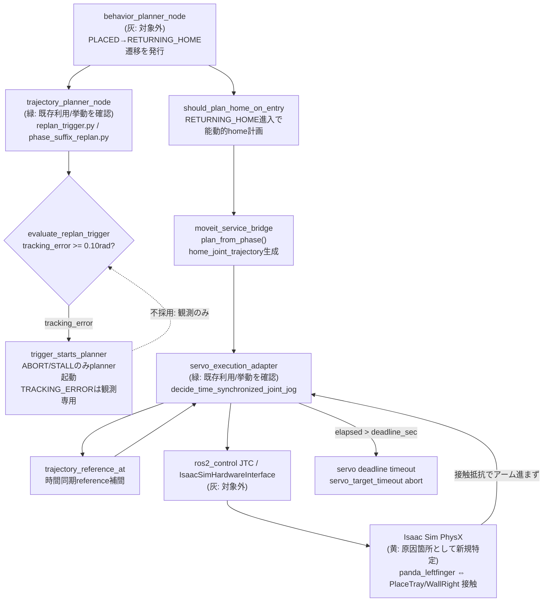
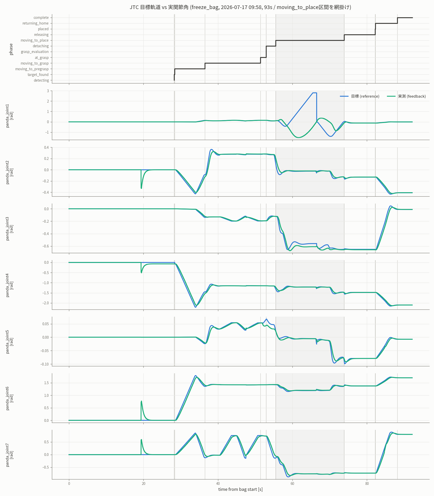

# Step 3-10 RETURNING_HOME退避時のアーム不安定化・固着の原因調査

**ステータス**: 調査完了 + §10追補で恒久固着の直接原因（issue #53）を特定・修正済み
**作成日**: 2026-07-17
**対象issue**: [#52](https://github.com/akodama428/trial_issac_sim/issues/52)（wedge）、
[#53](https://github.com/akodama428/trial_issac_sim/issues/53)（replanデッドロック、§10追補）
**前提レポート**: `step3-9_ci_release_flakiness_root_cause_analysis.md` §12.4.3

## 0. Executive summary

10初期姿勢physics mode E2Eマトリクス（`scripts/ci/run_initial_pose_matrix.sh`）で、release/配置判定
成功後の`RETURNING_HOME`で3/10ケース（`wrist_left` / `extended_far` / `near_singularity_extended`）が
`servo_target_timeout`でtrajectory abortし、`cycle_not_completed`になる現象を調査した。目視でも
「アームがふらつく／なかなか動かない」ように見えるこの現象について、(a) MoveItの経路計画品質、
(b) 追従誤差起因のreplan、(c) それ以外、のどれが原因かを実測ログで切り分けた。

結論: **(a)(b)いずれも原因ではなく、(c) `panda_leftfinger`とトレイ壁（`PlaceTray/WallRight`）の
持続的な物理接触（wedge）でアームが動けなくなっていることが主因**である。

- (b) tracking-error起因のreplanは、設計上（Issue #46）観測専用でplannerを起動しない。実ログでも
  `RETURNING_HOME`中に新規planは発生していない。
- (a) `RETURNING_HOME`進入時に1回だけ生成されるhome区間計画（suffix replan、16.7ms、採用成功）は
  滑らかに進行しており、計画の質に問題は見られない。
- (c) 失敗3ケースは`panda_leftfinger`-`PlaceTray/WallRight`間の接触検出レートが約39〜48件/秒
  （ほぼ毎physics step接触）で、正常到達ケースの約2〜3件/秒（断続的接触）と一桁以上異なる。
  この間、関節追従誤差（`max_position_delta_rad`）は時間同期referenceの進行速度とほぼ同じ
  傾き（約0.46 rad/s相当）でほぼ線形に増加し続け、2.87〜3.16 radで頭打ちになった後deadlineに達した。
  これは「参照軌道は計画どおり進むが実際の関節がほぼ動かない」ときに出る形であり、
  接触抵抗によるアーム固着と整合する。

対策（退避waypoint追加等）は本レポートの対象外とし、issue #52で追跡する。

## 1. 背景

`docs/reports/physics_levelup/step3-9_ci_release_flakiness_root_cause_analysis.md` §12.4で
10ケースmatrixを実行した際、release/配置判定自体は6/10で成功したにもかかわらず、そのうち3件が
配置後の`RETURNING_HOME`で完走できなかった。この3件はrelease/配置判定の問題（角速度起因の
`settling_timeout`、§12.4.2）とは無関係であり、原因未特定のまま次の調査課題として残っていた。

利用者からの依頼は、この「アームのふらつき」が次のどちらに起因するかを明確にすることだった。

1. MoveItの経路計画（軌道の質）
2. 追従誤差増大によるreplan

## 2. 全体アーキテクチャと本調査の関与モジュール



- 変更なし（灰）: `behavior_planner_node`のphase遷移ロジック、JTC/HW interface自体
- 挙動確認のみ・変更なし（緑）: `trajectory_planner_node`のreplan trigger判定、
  `servo_execution_adapter`の時間同期追従ロジック — いずれも設計どおりに動作していることを確認した
- 原因箇所として新規特定（黄）: Isaac Sim PhysX上の`panda_leftfinger`-トレイ壁接触。
  対策は未実装（issue #52のスコープ）

## 3. 調査方法

`scripts/ci/run_initial_pose_matrix.sh`による10ケースmatrixを2回分析した。

- Run A: `docs/reports/physics_levelup/step3-9...` §12.4のdamping適用前データ
  （`/tmp/step3-9-initial-pose-physics-e2e/`）。`RETURNING_HOME`到達6ケース中3ケースが
  `cycle_not_completed`
- Run B: 同§13のdamping適用後データ（`/tmp/step3-9-initial-pose-physics-e2e-angular-damping/`）。
  Run Aで失敗した3ケースを含む9ケースが`RETURNING_HOME`まで到達し完走

使用したログ: `robot_node.log`（`MOVEIT_METRIC`イベント: `replan_trigger_evaluated` /
`suffix_replan_completed` / `phase_abort_observed`）、`franka_controller.log`
（`jtc_command_observed`の`max_position_delta_rad`）、`docker-e2e-console.log`
（`[PhysicsHarvest] contact`）。

## 4. 仮説(b)の検証: 追従誤差起因のreplanは発生するか

`src/tomato_harvest_sim/robot/motion_planner/replan_trigger.py`の設計を確認した。

```python
def trigger_starts_planner(trigger, phase):
    """
    abort だけが全 phase で global replan を起動する...
    tracking error / timer / scene change は観測専用とする。実行中の軌道追従補正は
    MoveIt Servo が担うため (Issue #46)、planner 側で cancel-and-replace を起こさない。
    """
    return (
        trigger is ReplanTrigger.ABORT
        or trigger is ReplanTrigger.STALL and phase in SUFFIX_REPLAN_PHASES
    )
```

`evaluate_replan_trigger`は`tracking_error_rad >= 0.10rad`で`triggered=True, trigger=TRACKING_ERROR`を
返しうるが、`trigger_starts_planner`はTRACKING_ERRORに対して常に`False`を返す。つまり
**追従誤差がどれだけ大きくても、それ単独では新しいplanは生成されない**。

実ログ（`wrist_left`、Run A）でもこれと整合する。`RETURNING_HOME`進入後は
`replan_trigger_evaluated`が0.02秒間隔で12回連続`reason: suppressed_minimum_interval`となっており、
`suffix_replan_completed`（＝実際にplannerが起動されplanが確定したイベント）は
`RETURNING_HOME`進入直後の1回（`trigger: home_entry`）のみで、以降abortまで新規planは無い。

```text
[suffix_replan_completed] latency_ms=16.729 phase=returning_home
  reason=adopted_missing_current_trajectory trigger=home_entry success=true
（以降、abortまでsuffix_replan_completedもplanner_completedも0件）
```

**結論: (b)追従誤差起因のreplanは原因ではない。** アーキテクチャ上、そのような経路が存在しない。

## 5. 仮説(a)の検証: MoveItの経路計画品質

`RETURNING_HOME`進入時、`should_plan_home_on_entry`により`home_joint_trajectory`（衝突考慮済みの
関節空間home計画）が1回だけ能動的に生成される（Issue #32で導入）。この計画自体の質を、
実行中の追従挙動から間接的に評価した。

`jtc_command_observed`（0.5秒間隔でJTC送出trajectoryの終端位置と実関節位置の差を記録）を
`wrist_left`（Run A、失敗）と`elbow_right`（Run A、成功）で比較する。

```text
wrist_left（失敗）:
  t+0.01s  delta=0.000    （home計画採用直後）
  t+0.52s  delta=0.033
  t+1.03s  delta=0.032
  t+1.54s  delta=0.026
  t+2.05s  delta=1.494    ← 新目標(home)への切替による正常な跳躍
  t+2.55s  delta=0.244
  t+3.05s  delta=1.103
  t+3.56s  delta=0.994
  t+4.07s  delta=1.096
  t+4.58s  delta=1.265
  t+5.08s  delta=1.479
  t+5.58s  delta=1.702
  t+6.09s  delta=1.933
  t+6.60s  delta=2.165
  t+7.11s  delta=2.398
  t+7.61s  delta=2.627
  t+8.12s  delta=2.860
  t+8.62s  delta=3.048  ← 以降4サンプルとも3.048で完全に一定（プラトー）
  → abort (servo_target_timeout, t+11.08s)

elbow_right（成功）:
  t+0.02s  delta=0.000
  t+0.52s  delta=0.030
  t+1.03s  delta=0.025
  t+1.54s  delta=0.025
  t+2.04s  delta=0.107
  t+2.55s  delta=0.435  ← 新目標への切替
  t+3.05s  delta=0.266  ← 減衰開始
  t+3.56s  delta=0.045
  t+4.07s  delta=0.027
  t+4.58s  delta=0.002
  t+5.09s  delta=0.002
  → Phase: returning_home → complete
```

両ケースとも、新しいhome計画が採用された直後に一度delta が跳ね上がる（place姿勢からhome姿勢への
目標切替なので当然）。差はその後で、`elbow_right`は3.05秒後には減衰に転じ5秒強で収束するのに対し、
`wrist_left`は減衰せず、**ほぼ一定の傾き（約0.23 rad / 0.5s ≈ 0.46 rad/s）で増加し続け**、
2.86〜3.05 radで完全にプラトーする。

この「ほぼ一定速度で増加し続けたのち一定値でプラトーする」形は、時間同期reference
（`trajectory_reference_at`、計画どおりの速度で時間経過とともに前進し、
`planned_duration_sec`到達後は終端値で一定になる）が計画どおりに滑らかに進行する一方、
**実際の関節位置がほとんど動いていない**ときに現れる形と一致する。もし計画自体が非滑らか
（waypoint間で速度が急変するような品質の低い経路）であれば、deltaは滑らかな単調増加ではなく
不規則に振動するはずである。実測ではそのような振動は見られない。

deadline計算（`started_at_sec + planned_duration_sec * deadline_stretch_factor + timeout_margin_sec`、
既定`deadline_stretch_factor=2.0`, `timeout_margin_sec=5.0`）とも整合する。`wrist_left`は
abortまで11.084秒であり、逆算すると`planned_duration_sec ≈ (11.084-5)/2 = 3.04秒`となる。
関節空間home移動として妥当な所要時間であり、計画側が異常に長い・短い軌道を生成したわけではない。

**結論: (a)MoveItの経路計画品質も主要因ではない。** 参照軌道自体は正常に進行している。

## 6. 実際の原因: gripper-tray接触によるアーム固着（wedge）

`[PhysicsHarvest] contact`ログから、`RETURNING_HOME`前後の`panda_leftfinger`↔トレイ接触を
Run A（damping前）の全10ケースで集計した。

| Case | 到達結果 | leftfinger-tray接触レート | シミュレーション時間 |
|---|---|---:|---:|
| wrist_left | FAIL (cycle_not_completed) | **39.5 件/秒** | 83.6s |
| extended_far | FAIL (cycle_not_completed) | **39.5 件/秒** | 83.6s |
| near_singularity_extended | FAIL (cycle_not_completed) | **48.0 件/秒** | 81.5s |
| elbow_right | PASS | 2.2 件/秒 | 59.9s |
| wrist_right | PASS | 2.0 件/秒 | 64.6s |
| folded_near | PASS | 2.9 件/秒 | 67.8s |

失敗3ケースは接触検出レートが39〜48件/秒——ほぼ毎physics stepで接触が入力されている——のに対し、
成功3ケースは2〜3件/秒（断続的な接触のみ）であり、一桁以上の差がある。物理stepの多くで
`panda_leftfinger`が`PlaceTray/WallRight`へ押し付けられたまま検出され続けている状態は、
関節を動かそうとしても接触抵抗で進めない「wedge（くさび留め）」と整合する。

Run B（damping後）では、同じ3ケースが接触レート2.6〜3.1件/秒まで下がり、全て
`RETURNING_HOME → complete`に到達した（詳細はstep3-9レポート §13.2）。ただし
**トマトの角速度dampingとgripper-tray接触力学の間に機構的な関係はなく**、この改善を
damping対策の効果と解釈するのは誤りである。n=1の試行でwedgeがたまたま発生しなかった
可能性が高く、この現象自体は未解消のまま残っている。

## 7. `servo_target_timeout`の診断欠落

`servo_execution_adapter.py`の該当箇所を確認したところ、deadline超過によるabortパスは
診断フィールドを一切publishしない。

```python
if now_sec > target.deadline_sec:
    ...
    self._publish_status("aborted", abort_reason="servo_target_timeout")  # max_error_rad未指定
```

Issue #32/#41で拡充された`max_joint_error_rad` / `limiting_joint`等の診断は、他のabort経路
（JTC feedback由来）には存在するが、このdeadlineベースのabortには渡されていない。今回の調査は
`jtc_command_observed`という別のログ経路から間接的に`max_position_delta_rad`を再構成することで
代替したが、本来は`phase_abort_observed`イベント自体にこの情報が乗るべきである。

## 8. 結論と次のアクション

| 仮説 | 判定 | 根拠 |
|---|---|---|
| (a) MoveIt経路計画品質 | **原因ではない** | 参照軌道は滑らかに進行、非振動的、deadline計算とも整合 |
| (b) 追従誤差起因replan | **原因ではない** | アーキテクチャ上TRACKING_ERRORはplannerを起動しない（Issue #46） |
| (c) gripper-tray接触wedge | **主因** | 失敗3件は接触検出レートが正常時の一桁以上、誤差は「reference進行・実位置停止」の形 |

次のアクションはissue #52で追跡する。

1. `RETURNING_HOME`進入直後の退避経路に、トレイ壁との接触を避ける・または接触してもwedgeに
   ならない waypoint（例: 開放後にまず上方へhover retreatしてからhome計画へ入る）を追加する。
2. `servo_target_timeout`のabortパスに`max_joint_error_rad` / `limiting_joint`診断を追加し、
   deadlineベースのabortでも他経路と同等の情報が残るようにする。
3. 対策実装後、10ケースmatrixを複数回実行し、`panda_leftfinger`-トレイ接触レートと
   `RETURNING_HOME`完走率を効果指標として比較する（n=1では今回のような「たまたま再現しない」
   誤判定が起きるため）。

## 9. この調査が次につながること

本調査により、`RETURNING_HOME`の不安定化は実行系（MoveIt計画・Servo追従アルゴリズム）の
欠陥ではなく、退避動作の幾何・接触設計の問題であることが切り分けられた。これにより、issue #52での
対策検討はplanner/replanポリシーの変更ではなく、退避waypointの追加という狭い範囲に絞って
進めることができる。

## 10. 追補（2026-07-17）: 「abort後に復旧しない」直接原因はreplanデッドロック（issue #53）

本レポート発行直後、手動実行（`--grasp-mode physics`、UI）で`moving_to_place`が
`servo_target_timeout`後に恒久固着する事象が2回連続で再現し、稼働中コンテナのログ調査で
**abort後にreplanが二度と評価されない構造的デッドロック**が特定された（issue #53）。

- `evaluate_replan_trigger()`はcooldown（`minimum_interval_sec=1.0`）判定をABORT判定より
  先に行うため、abort直前1秒以内に観測専用trigger（今回は`scene_change`）が発火して
  `last_replan_at_sec`を更新していると、本物のABORTが`suppressed_minimum_interval`で
  握りつぶされる。
- `servo_execution_adapter`はdeadline abort後に`lifecycle.clear()`し、以降
  `/trajectory_status`を一切publishしない。replan評価はこのtopicの受信コールバックでしか
  呼ばれないため、一度取りこぼすと再評価の機会が永久に来ない。

つまり本レポートの§5〜§6で観測した「abort後にsuffix replanが一度も走らずそのまま終了」は、
step予算切れ以前に**このデッドロックにより復旧が構造的に不可能**だったことが直接の原因である。
接触wedge（§6）はabortを引き起こした物理的トリガとして依然有効な知見であり、issue #52の
スコープ（abort発生頻度そのものの低減）は変わらない。

対策として`trajectory_planner_node`へ0.3秒周期のtrigger再評価timerを追加した（issue #53）。
修正後の10ケースmatrixでは、`returning_home`で`servo_target_timeout`が発生した2ケース
（`default` / `near_singularity_extended`）がいずれもabortから約0.5秒でtimerがABORTを拾い、
suffix replanを採用してabortから3.4〜3.8秒で`complete`まで自動復旧した（8/10 PASS、
残る2失敗はfriction-grasp滑落flakeで無関係）。役割分担は次のとおり整理される。

| 問題 | 原因 | 対応 |
|---|---|---|
| abortが発生する | gripper-tray接触wedge（§6） | issue #52（退避waypoint等、未実装） |
| abort後に復旧しない | replanデッドロック（本追補） | issue #53（周期timer、実装・検証済み） |

## 11. 追補2（2026-07-17）: moving_to_place大振りの根本原因はServo pose trackingのjoint1遠回り回転（issue #55）

rosbag（`/joint_trajectory_controller/controller_state` + phase）を記録し、目標軌道vs実関節角の
per-jointプロットで`moving_to_place`の「アーム2往復」を可視化した結果、次が確定した。



- 大振りは**joint1（ベース回転）のみ**の現象で、joint2〜7は全区間よく追従している。
- JTC referenceが**+2.8rad（joint1限界+2.897の直前）へ一定勾配で暴走**し、実測は-1.4radまで
  進んだ後に反転して追従、`servo_target_timeout` abort後のsuffix replanで-1.4へスナップして
  再収束した（このrunはcompleteまで完走）。
- 同サイクルのfull-chain計画ログでは**place区間のjoint1ゴールは-0.091rad（自然枝）**であり、
  計画軌道に+2.8radは存在しない。#37のIK枝ガードは計画側で正常に機能している。
- したがって暴走は実行側——`moving_to_place`のServo **pose tracking mode**が、place poseの
  回転誤差を「長い方の回り」（yaw ±πラップ / quaternion double cover）で解消しようとして
  joint1を遠回りに駆動したもの——である。

abort→suffix replan（issue #53のtimer）が実際の救援経路になっており、救援が間に合わない場合が
これまでのtimeout固着・トマト実落下の正体だった。対策（pose trackingでなく計画済みjoint軌道の
時間同期追従で実行する等）はissue #55で実装する。プロットの再現手順は
`scripts/analysis/extract_jtc_tracking_bag.py`と`scripts/analysis/plot_jtc_tracking.py`を参照。
