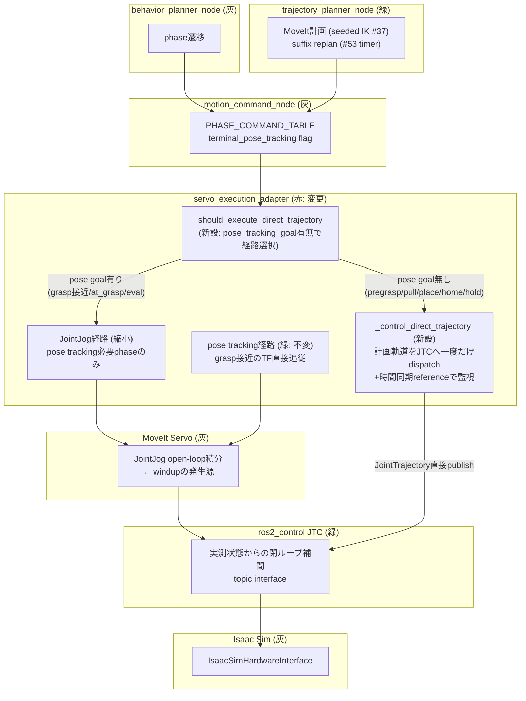
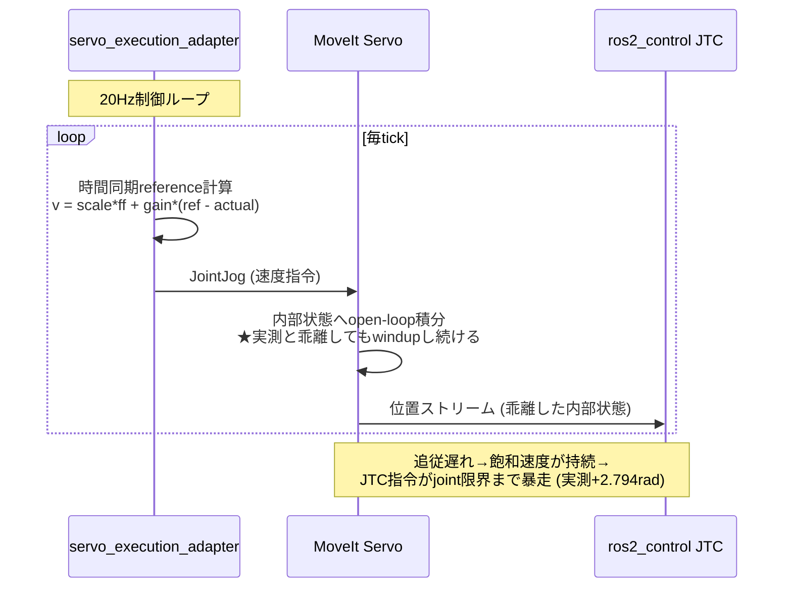
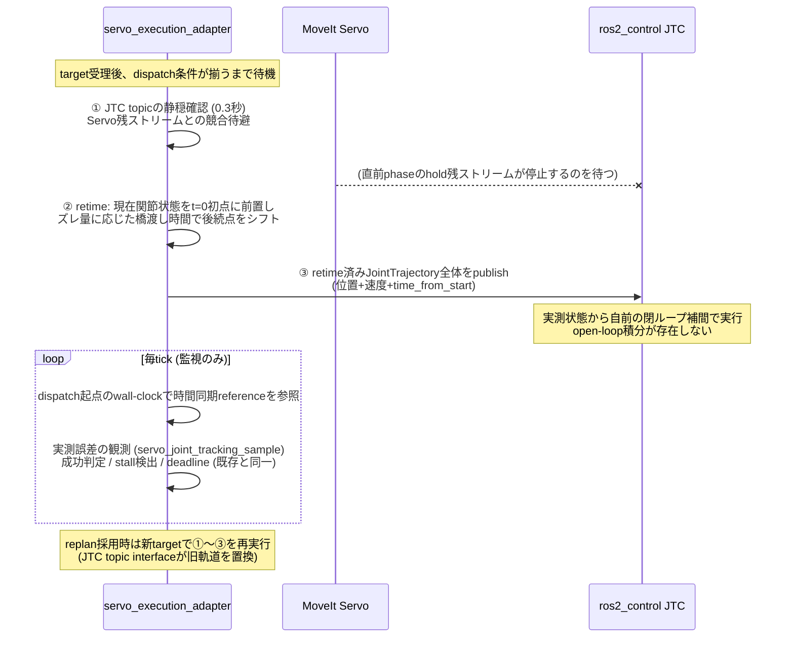

# Step 3-11 FOLLOW_TRAJECTORY実行のJTC直接化 — Servo内部積分暴走の排除 (Issue #55)

**ステータス**: 実装完了 / 10ケースE2E検証 10/10 (100%)
**作成日**: 2026-07-17
**対象issue**: [#55](https://github.com/akodama428/trial_issac_sim/issues/55)
**前提レポート**: `step3-10_returning_home_arm_freeze_investigation.md` §11

## 0. 検証目的

`moving_to_place`で観測されたアームの大振り（joint1が±πを跨いで2往復）とservo_target_timeoutの
根本原因を排除し、physics mode E2Eの搬送・退避動作を安定化する。本レポートは、
(1) 実測データによる根本原因の最終確定（issue #55起票時の仮説の訂正を含む）、
(2) 対策アーキテクチャの設計と実装、(3) 10ケースE2Eによる効果検証、を記録する。

## 1. 根本原因の最終確定: Servo JointJog内部積分器のwindup

### 1.1 issue起票時仮説の訂正

issue #55起票時は「Servo pose trackingのyaw±πラップ」を仮説としたが、実測ログの精査で棄却した。

- `moving_to_place`実行中のservoログは`servo_joint_tracking_sample`が95件、
  `servo_pose_tracking_sample`は0件 → **moving_to_placeはjoint jog経路で実行されていた**
- `PHASE_COMMAND_TABLE`でも`MOVING_TO_PLACE`の`terminal_pose_tracking`は元からFalse

### 1.2 確定した機構（実測サンプル seq 203-207）

```text
q_ref_rad    = -0.156          ← 計画referenceは自然枝で正常
q_actual_rad = -0.50 → -0.28   ← 実測はreferenceへ収束中（正常）
q_jtc_rad    = +2.794          ← JTCへの位置指令がjoint1限界(+2.897)手前で凍結
q_hardware   = +2.793          ← hardware指令も同値
v_cmd        = +0.8            ← 誤差フィードバック(gain 3.0×error)は正しい方向
```

機構: adapterはJointJog**速度**指令をServoへ送り、Servoはそれを**open-loopで内部積分**して
位置指令ストリームをJTCへ流す。追従遅れ中に飽和速度指令(±0.8rad/s)が続くと、Servoの内部
積分状態が実機と乖離したまま巻き上がり（windup）、joint1限界手前(+2.794)までのランプ指令が
JTCへ流れて腕を大振りさせる。プロット
（`assets/step3-10_joint1_pose_tracking_runaway.png`）で「目標」が+2.8radへ一定勾配で
暴走して見えたのは、この**Servo積分器の暴走**であり、計画軌道でもpose trackingでもなかった。

副次確認: `servo_pose_tracking_timeout`は`moving_to_grasp`（pose tracking使用phase）で
発生しており（`servo_status=null`のままpose収束せず）、grasp接近の遅延・abortはpose tracking
経路自身の別課題として残る（§6）。

## 2. 全体アーキテクチャと変更範囲

凡例: 赤=本変更で修正、緑=既存利用（挙動確認済み）、灰=対象外。



## 3. 変更前後のアーキテクチャ

### 3.1 変更前（全FOLLOW_TRAJECTORYがServo経由）



### 3.2 変更後（pose tracking不要ならJTC直接実行）



①②は10ケースE2E検証の失敗から導いた必須要素である（§5.1）。①が無いと直前phaseの
Servo hold残ストリームがdispatch直後に軌道を上書きしてJTC指令が凍結し、②が無いと
pose tracking実行後の実構成と計画初点のズレ（実測0.78rad）が追従不能なステップ指令になる。

経路選択は`should_execute_direct_trajectory(target)`（`pose_tracking_goal is None`）の
純粋関数1点で行う。phase別の内訳:

| Phase | terminal_pose_tracking | 実行経路（変更後） |
|---|---|---|
| MOVING_TO_PREGRASP | False | **JTC直接** |
| MOVING_TO_GRASP | True | Servo（jog→pose tracking、不変） |
| AT_GRASP / GRASP_EVALUATION | True | Servo pose tracking（不変） |
| DETACHING | False | **JTC直接** |
| MOVING_TO_PLACE | False | **JTC直接** ← 今回の主対象 |
| RELEASING / PLACED (HOLD) | False | **JTC直接**（現在位置の停止軌道） |
| RETURNING_HOME | False | **JTC直接** |

## 4. 実装

- `src/tomato_harvest_sim/robot/execute_manager/servo_execution_adapter.py`
  - `should_execute_direct_trajectory()`: 経路選択の純粋関数（新設）
  - `can_dispatch_direct_trajectory()`: JTC topic静穏（0.3秒）の判定純粋関数（新設）。
    `_on_jtc_command`がthrottle前に全メッセージの到着時刻を記録し、Servoの
    残ストリーム停止を確認してからdispatchする
  - `retime_target_from_state()`: 現在関節状態をt=0初点に前置し、初点ズレ量に応じた
    橋渡し時間（`max(0.3秒, ズレ/0.8rad/s×1.5)`）で後続点とdeadlineをシフトする
    純粋関数（新設）
  - `_control_direct_trajectory()`: 静穏確認→retime→一度きりdispatch→監視（新設）。
    観測は既存の`servo_joint_tracking_sample` / `execution_status` / stall検出 /
    deadline abortをそのまま使い、CIログ契約を維持する
  - `_ros_trajectory_from_target()`: 契約型`JointTrajectory`→ROS message変換（新設）
  - `_control_step()`: deadline判定を先頭へ移し（Servo mode未確立でもtimeoutが
    発火するよう改善）、direct経路をServo mode gateの前に分岐
- `src/tomato_harvest_sim/simulator/physics_tuning.py` / `scene_config.py` /
  `config/scene.yaml`
  - `tomato_solver.disable_sleep: true`（新設）: トマト剛体の`sleepThreshold=0`。
    §5.1 iteration 3で特定したsleep起因のvelocity読み値凍結への対策
- 監視referenceの時計は**dispatch起点のwall-clock経過**を使う（JTCが時間パラメータ化を
  自前で実行するため、progress scalingによる参照時計の伸縮はdirect経路では不要）

### 検証（unit）

- `test_trajectory_target_without_pose_goal_executes_directly_on_jtc`（新設）
- `test_pose_tracking_target_stays_on_servo_path`（新設）
- `test_direct_dispatch_waits_for_servo_stream_quiescence`（新設）
- `test_retime_bridges_start_mismatch_from_current_state` ほかretime系3件（新設）
- scene_config `disable_sleep`読み込み2件（新設）
- 全suite: 284 passed, 2 skipped

## 5. 10ケースE2E検証結果

### 5.1 検証イテレーションと発見した従属原因

direct化は1回で完成せず、10ケースmatrixの失敗解析から2つの従属原因を発見して修正した。
この過程自体が「Servo経路が暗黙に吸収していた前提」の棚卸しになっている。

| Iteration | 結果 | 発見した原因 | 対策 |
|---|---|---|---|
| 1 | 0/10 | **計画初点と実状態のズレ**: full-chain計画の後続区間(pull等)は計画上の前区間終端から始まるが、pose tracking実行後の実構成は0.78radずれる(全ケースのMax tracking error 0.76-0.78の正体)。旧Servo経路は誤差FB+progress gatingで暗黙に吸収していた。direct JTCでは初点への0.78radステップが追従不能→timeout→縮退replan(5msで成功を返すがpull軌道なし)→`missing_trajectory`永久ループ | `retime_target_from_state()` |
| 2 | 0/10 | **Servo残ストリームによる上書き**: hold phase(at_grasp/grasp_eval)ではadapterが20Hzでゼロ速度jogを送り続け、Servoが100HzでJTCへhold軌道をストリームする。pull dispatch直後に残メッセージが到着して軌道を置換(`q_jtc=0.7516`凍結、pull不実行)。pregraspだけ動いたのは「セッションでまだServoが発話していなかった」ため | `can_dispatch_direct_trajectory()` (0.3秒静穏gate) |
| 3 | 7/10 | direct経路は全phase動作。残る3失敗は全て`releasing`の`settling_timeout`で、**角速度読み値が0.51〜0.55rad/s(閾値0.5の直上)で3秒間完全一定・contact=0・位置凍結**。微小球(半径1cm)がPhysX sleepに入り、`physics:angularVelocity`属性が眠る直前の値で凍結していた(step3-9 §13.2で予見した「angular velocity readout stale」の正体) | `tomato_solver.disable_sleep` |
| 4 | **10/10** | — | — |

### 5.2 最終結果: 10/10 (100%)

| Case | Result | E2E sec | Case | Result | E2E sec |
|---|---|---:|---|---|---:|
| default | PASS | 97 | wrist_left | PASS | 99 |
| elbow_left | PASS | 88 | wrist_right | PASS | 97 |
| elbow_right | PASS | 106 | folded_near | PASS | 134 |
| shoulder_high | PASS | 96 | extended_far | PASS | 91 |
| shoulder_low | PASS | 97 | near_singularity_extended | PASS | 97 |

品質指標（`default`ケースの代表値、全ケース同傾向）:

- **`servo_target_timeout`: 全10ケースで0件**。step3-9以降の失敗連鎖の起点だったabortが
  実行経路の構造変更で消滅した
- direct dispatchは全trajectory phaseで発火（pregrasp/pull/place/hold/home、
  bridge 0.3〜1.12秒）し、成功判定は既存と同じ誤差0.01rad以内で完了
- releaseのsettlingは0.62秒で`settled_in_tray`（sleep無効化により実速度が観測され、
  angular damping済みの減衰が判定に反映される）

成功率の推移: 3/10（step3-9開始時）→ 9/10（damping+#53+#54）→ **10/10（本変更）**。
10ケースmatrixでの100%はIssue #39/40時（2026-07-14）以来で、physics grasp mode
（摩擦保持・物理release）では初である。n=1のため、複数run蓄積での再現性確認は
CI（本変更によりPR CIの既定がphysics mode）で継続する。

## 6. 残課題と次ステップ

1. **DETACHING full-chain replanの縮退**（§5.1 iteration 1で発見）: pull実行が失敗して
   abortすると、full-chain replanが約5msで`success=true`を返すがpull軌道を含まない
   planをpublishし、`missing_trajectory` abort→replan→…の1.2秒周期の永久ループになる。
   本変更でpullが正常実行される限り顕在化しないが、レジリエンス欠陥として残る。
   後続issue化を推奨。
2. **grasp接近のpose tracking遅延**: `servo_pose_tracking_timeout`（`servo_status=null`）が
   `moving_to_grasp`で発生しており、pose tracking経路自身の収束性・Servo statusの観測は
   未解決。TF直接追従が必要な区間のみに縮小されたため影響範囲は限定された。
3. Servo JointJog経路はgrasp接近のjoint区間に残っており、同経路のwindupリスクは
   理論上残る（軌道が短く実害未観測）。静止物体把持の現仕様ではgrasp系もdirect化して
   Servoを実行経路から完全に外せる可能性があり、A/B実験候補（`PHASE_COMMAND_TABLE`の
   `terminal_pose_tracking`フラグ切替のみで試せる構造になった）。
4. issue #52（RETURNING_HOMEのgripper-tray接触wedge）は本変更と独立に残存。
   ただし退避軌道の実行がJTC直接になったことで、接触時の挙動観測は
   `direct_trajectory_dispatched`とJTC実測の突合で単純化された。

本変更により、搬送・退避系の実行は「MoveItの衝突考慮済み計画をJTCがそのまま実行する」
という単純な構造になり、以降の失敗解析は計画品質（trajectory_planner）と物理接触
（Isaac/PhysX）の2レイヤへ切り分けられる。
