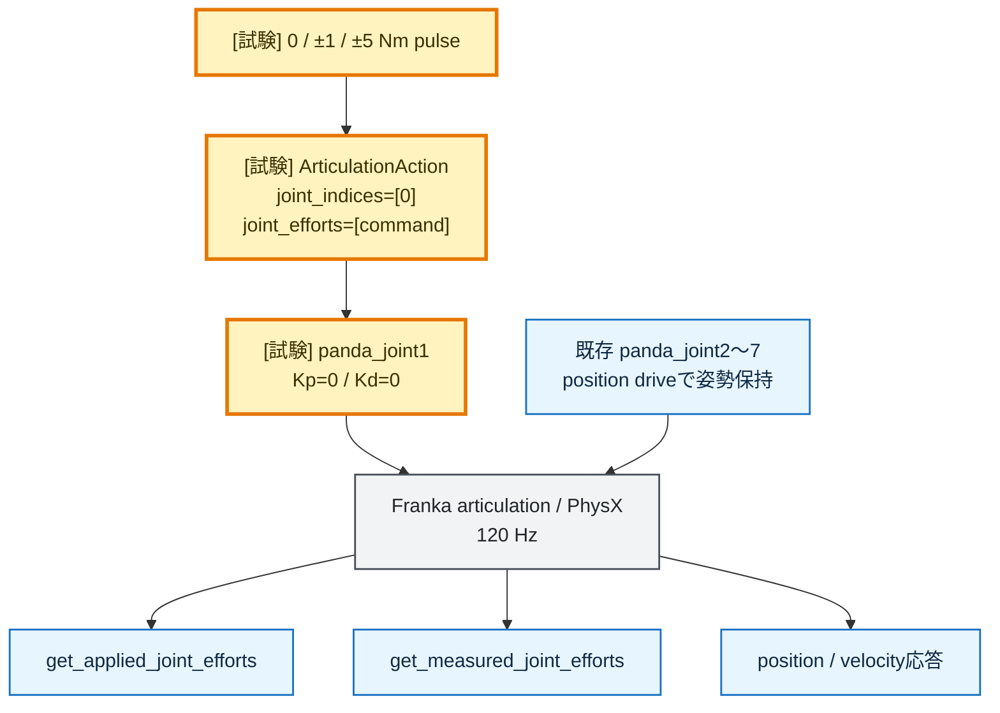

# Step 3-13-2 Isaac joint effort校正試験

**ステータス**: 評価完了

**作成日**: 2026-07-19

**関連レポート**:
`step3-13_jtc_effort_command_interface_implementation_plan.md`

## 0. 結論

Isaac Sim 6.0 / PhysX / 公式Franka USDで、panda_joint1へ0、±1、±5 Nmの既知effortを
直接入力した。joint1のimplicit drive gainを0、他arm軸のposition driveを有効にした
66.7 ms pulse試験では、次を確認した。

- commanded effortと`get_applied_joint_efforts()`は全sampleで完全一致した。
- `get_measured_joint_efforts()`は最大約`4.77e-6 Nm`の数値誤差内でcommandと一致した。
- 正effortでjoint1速度が正、負effortで負となり、符号とjoint mappingも一致した。
- stage scaleは1.0 m/USD unit、joint1はrevolute DOFであり、effort単位はNmである。
- 他関節の最大速度は約0.0049 rad/sで、校正pulse中のcouplingは小さかった。

従って、`/isaac_joint_states/panda_joint1/effort`へ至るdirect effort経路に、
degree/radian係数、符号反転、joint indexずれ、Nm scale誤りは認められない。

ただし、この結果はdirect effort入力時の校正である。Aのposition_velocity modeでPhysXの
implicit PD driveが内部生成したclamp後torqueを
`get_measured_joint_efforts()`がそのまま返すことまでは証明しない。moving_to_placeで観測した
約-5 Nmは「単位変換漏れ」とは解釈せず、solverのprojected measured effortとして扱う。

## 1. 背景

Step 3-13のruntime確認では、Franka arm driveのArticulationController API値が
Kp=22918.3125、Kd=4583.6626、max effortがjoint1〜4で87 Nm、joint5〜7で12 Nmだった。
一方、Aのmoving_to_placeでposition/velocity誤差が大きいにもかかわらず、
`/isaac_joint_states/panda_joint1/effort`は約-5 Nmだった。

この差について、次の仮説を切り分ける。

1. ROS 2 bridgeまたはPlotJugglerにeffort scale誤りがある。
2. degree/radian変換がeffort値へ不足している。
3. joint indexまたは符号が誤っている。
4. `measured_joint_efforts`とimplicit drive torqueの意味が異なる。

## 2. 公式仕様

確認日は2026-07-19、対象はIsaac Sim 6.0である。

| API / sensor | 公式仕様上の意味 |
| --- | --- |
| `get_applied_joint_efforts()` | 利用者が`set_joint_efforts()`で直接設定したeffort |
| `get_measured_joint_efforts()` | solver joint forceをDOFの運動方向へ射影したmeasured effort |
| `get_measured_joint_forces()` | incoming jointの6次元spatial force / torque |
| Joint State Sensor effort | revolute DOFはNm、prismatic DOFはN |

`get_measured_joint_efforts()`はchild linkへ入るjoint forceという符号規約を持つ。
Isaac Sim 6.0では旧`isaacsim.sensors.physics.EffortSensor`がdeprecatedであり、
新規実装には`isaacsim.sensors.experimental.physics`が推奨される。

一次情報:

- https://docs.isaacsim.omniverse.nvidia.com/latest/sensors/isaacsim_sensors_physics_joint_state.html
- https://docs.isaacsim.omniverse.nvidia.com/latest/sensors/isaacsim_sensors_physics_articulation_force.html
- https://docs.isaacsim.omniverse.nvidia.com/6.0.0/sensors/isaacsim_sensors_physics_effort.html
- https://docs.isaacsim.omniverse.nvidia.com/6.0.0/py/source/deprecated/isaacsim.core.api/docs/index.html

## 3. 試験構成

### 3.1 制御構成



### 3.2 条件

| 項目 | 設定 |
| --- | --- |
| simulator | Isaac Sim 6.0 / PhysX |
| asset | 公式Franka Panda USD |
| stage scale | 1.0 m/USD unit |
| physics rate | 120 Hz |
| 初期姿勢 | `[0, -0.4, 0, -2.1, 0, 1.7, 0.8] rad` |
| 対象DOF | index 0 / panda_joint1 |
| joint1 drive | Kp=0、Kd=0、effort mode=`force` |
| joint2〜7 | 既存Kp/Kdでhome姿勢保持 |
| pulse | 0、+1、-1、+5、-5 Nm |
| pulse長 | 8 physics step = 66.7 ms |
| case間処理 | 同一home位置、全DOFゼロ速度へreset |

各physics stepでcommanded、applied、measured effort、joint1 position/velocity、
joint2〜7 position/velocityを記録した。

### 3.3 受け入れ条件

- `dof_names[0] == panda_joint1`
- `applied_joint1 == commanded_joint1`
- measured effortのscaleと符号がcommandに一致する
- 正負commandに対するjoint1速度変化の符号が一致する
- 他関節の運動がjoint1応答を支配しない

## 4. 評価結果

### 4.1 effort一致

| command [Nm] | applied平均 [Nm] | applied最大絶対誤差 [Nm] | measured平均 [Nm] | measured範囲 [Nm] |
| ---: | ---: | ---: | ---: | ---: |
| 0 | 0 | 0 | -6.77e-12 | -1.61e-11〜3.01e-12 |
| +1 | +1 | 0 | +1.00000032 | +0.99999994〜+1.00000048 |
| -1 | -1 | 0 | -1.00000036 | -1.00000060〜-1.00000012 |
| +5 | +5 | 0 | +5.00000119 | +4.99999857〜+5.00000381 |
| -5 | -5 | 0 | -5.00000125 | -5.00000477〜-4.99999952 |

±5 Nmを含め、measured effortの最大差は約`4.77e-6 Nm`だった。57.2958倍または
1/57.2958倍のscale差はなく、degree/radian換算をeffortへ追加する必要はない。

### 4.2 運動応答

| command [Nm] | position変化 [rad] | velocity変化 [rad/s] | 最終velocity [rad/s] |
| ---: | ---: | ---: | ---: |
| 0 | -5.72e-8 | +3.05e-7 | +7.18e-7 |
| +1 | +0.012862 | +0.162062 | +0.185209 |
| -1 | -0.012862 | -0.162062 | -0.185206 |
| +5 | +0.064308 | +0.810311 | +0.926043 |
| -5 | -0.064309 | -0.810313 | -0.926035 |

正負応答はほぼ対称で、5 Nmの速度変化は1 Nmの約5倍だった。したがって、joint1 mapping、
effort符号、作用方向は一致している。

全caseにおけるjoint2〜7の最大絶対速度は0.00488 rad/s未満であり、joint1の応答
0.185〜0.926 rad/sに対して十分小さい。

### 4.3 pilot長pulse

初回は24 step（0.2秒）pulseを使用した。±1 Nmまではcommanded/applied/measuredが一致したが、
+5 Nmでjoint1速度が約2.11 rad/sへ達し、-5 Nmでは他関節速度が約2.63 rad/sへ増えた。
これは校正より運動限界・姿勢couplingの影響が大きい条件なので、正式評価から除外し、
8 step pulseへ短縮した。

## 5. 仮説判定

| 仮説 | 判定 | 根拠 |
| --- | --- | --- |
| ROS bridgeでeffort scaleが変わる | 棄却 | 現行bridgeはfloat変換だけ。direct API校正も1:1 |
| degree/radian換算がeffortへ不足 | 棄却 | ±1/±5 Nmが換算なしで一致 |
| joint indexがずれている | 棄却 | index 0はpanda_joint1、運動方向も一致 |
| effort符号が反転している | 棄却 | command、applied、measured、velocityの符号が一致 |
| measured effortが常に不正 | 棄却 | direct effort条件では数値精度内で正しい |
| measured effortがAのimplicit drive torqueと同義 | 未確定 | 本試験はjoint1 Kp/Kd=0のdirect effort条件 |

## 6. moving_to_place観測への含意

Aの`/isaac_joint_states/panda_joint1/effort ≈ -5 Nm`について、topicの値を57.2958倍する、
符号を反転する、別jointとして読む、といった補正は不要である。

一方、本試験で1:1になった理由は、joint1のimplicit driveを無効にして既知effortだけを
入力したためである。Aではposition/velocity implicit drive、関節間coupling、接触・拘束が
同時に働く。従って約-5 Nmはsolverが返したjoint1軸方向のprojected measured effortとしては
有効だが、次を直接意味しない。

- driveが-5 Nmだけcommandした
- driveが87 Nmへ飽和していない
- position/velocity誤差から計算したPD需要が-5 Nmである

このため、Aのgainを上げる判断には使用しない。次の調査では、implicit driveのclamp後出力を
直接取得できるPhysX APIまたはsensorがあるかを確認し、存在しなければcommand/stateと
drive modelからの推定値を`measured effort`とは別名で記録する。

## 7. 成果物

```text
.artifacts/issue61-step3-13-2/
├── effort_calibration.py
├── plot_effort_calibration.py
├── samples.csv
├── result.json
└── effort_calibration.png
```

## 8. 総合判定

校正試験は合格とする。

- direct effort commandのNm単位: 合格
- applied effort readback: 合格
- measured effort readback: direct effort条件で合格
- joint mapping: 合格
- 符号: 合格
- Aのimplicit drive torque観測: 本試験の対象外、未解決

従って、現在の`/isaac_joint_states/panda_joint1/effort`実装を単位誤りとして修正しない。
信号名・レポート上では`measured projected joint effort`と明記し、implicit drive commandとは
区別する。

## 9. clamp後implicit PD drive torqueの公開API調査

### 9.1 結論

2026-07-19時点のIsaac Sim 6.0 / Omni Physics / PhysX articulation公開APIには、
**solverが生成してmaxForceを適用した後のimplicit PD drive torqueだけ**を返すgetterは
確認できなかった。

### 9.2 類似APIとの違い

| API | 取得できる値 | drive-only clamp後torqueとして使えるか |
| --- | --- | --- |
| `get_applied_joint_efforts()` | `set_joint_efforts()`で直接設定したeffort | 不可。implicit driveとは別 |
| `get_dof_actuation_forces()` | tensor APIへ直接設定したDOF actuation force | 不可。公式にimplicit PD forceから独立 |
| `get_measured_joint_efforts()` | incoming joint forceのDOF方向射影 | 不可。drive以外の寄与を分離できない |
| `get_measured_joint_forces()` | incoming jointの6D spatial force | 不可。合力・合トルク |
| `eLINK_INCOMING_JOINT_FORCE` | parentからchildへ伝達されたjoint spatial force | driveを含むがdrive-onlyではない |
| `computeJointForce()` | 指定加速度に必要なinverse-dynamics force | 不可。drive/dampingを計算に含めない |
| `eJOINT_SOLVER_FORCES` | 旧solver constraint force | 不可。値が不正としてdeprecated |

### 9.3 measured effortに含まれるもの

PhysX公式は`eLINK_INCOMING_JOINT_FORCE`へ、少なくとも次のjoint内部機構を含めると説明している。

- joint friction
- max joint velocity clamp
- 利用者が直接設定したjoint force / torque
- joint drive
- joint limit

さらにincoming joint forceはlink間を伝達するspatial forceであり、外力、接触constraint、
重力・Coriolis、子link側負荷との釣り合いの中で決まる。DOF方向へ射影すればjoint軸方向の
measured effortは得られるが、drive成分だけを逆算できない。

### 9.4 単純PD式を実出力と見なせない理由

PhysX articulation driveはimplicit driveである。step開始時の`q`、`v`へ
`Kp * error + Kd * velocity_error`を一度だけ計算する明示制御ではなく、step終了時のposition /
velocity constraintとしてsolverが反復する。そのため次式は需要の近似には使えても、
clamp後実出力の直接readbackにはならない。

```text
tau_est =
  clamp(
    Kp * (q_target - q_actual)
    + Kd * (v_target - v_actual),
    -maxForce,
    +maxForce
  )
```

### 9.5 現実的な選択肢

#### 選択肢A: measured projected effortを総合joint effortとして使う

現行`/isaac_joint_states/*/effort`を維持する。接触・limit・関節伝達を含むjoint負荷の観測には
有効だが、drive saturation判定には使わない。

#### 選択肢B: implicit driveの推定値を別信号として記録する

runtime gain、target、state、maxForceから`estimated_drive_effort`を計算する。ただしimplicit
solver、effective inertia、constraint couplingを省略した推定値であることを明記し、
`measured_joint_effort`とは別topic・別列にする。

#### 選択肢C: 明示effort controllerへ置換する

Step 3-13のeffort modeのように、controller側でtorqueとclampを計算し、PhysX drive gainを0にする。
この場合commanded/clamped/applied effortを完全に観測できる。一方、Step 3-13 E2Eでは単純な
関節別PIDだけではpregrasp追従に失敗しており、gravity/Coriolis feed-forward等が必要である。

#### 選択肢D: PhysX solverをinstrumentationする

drive constraintのsolver impulseを内部実装から取得・公開する。drive-onlyの厳密値に最も近いが、
公開APIの範囲外であり、Isaac Sim / PhysX versionへの強い依存と保守コストを伴う。

### 9.6 推奨

Issue #61の追加調査では、まず選択肢AとBを併記する。

- `/isaac_joint_states/*/effort`: measured projected joint effort
- `estimated_drive_effort`: runtime gainとtarget/stateから求めた近似・clamp値

ただしBを「PhysXが実際に出したtorque」と表記しない。drive saturationの厳密判定が必須なら、
implicit driveの内部値取得へ依存するより、inverse dynamics feed-forwardを備えた明示effort
controllerへ制御責務を移す方が観測性と移植性に優れる。

一次情報:

- https://nvidia-omniverse.github.io/PhysX/physx/5.3.0/docs/Articulations.html
- https://docs.omniverse.nvidia.com/kit/docs/omni_physics/107.3/extensions/runtime/source/omni.physics.tensors/docs/api/python.html
- https://nvidia-omniverse.github.io/PhysX/physx/5.4.0/_api_build/struct_px_articulation_drive.html
