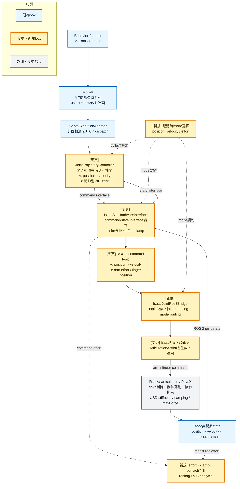
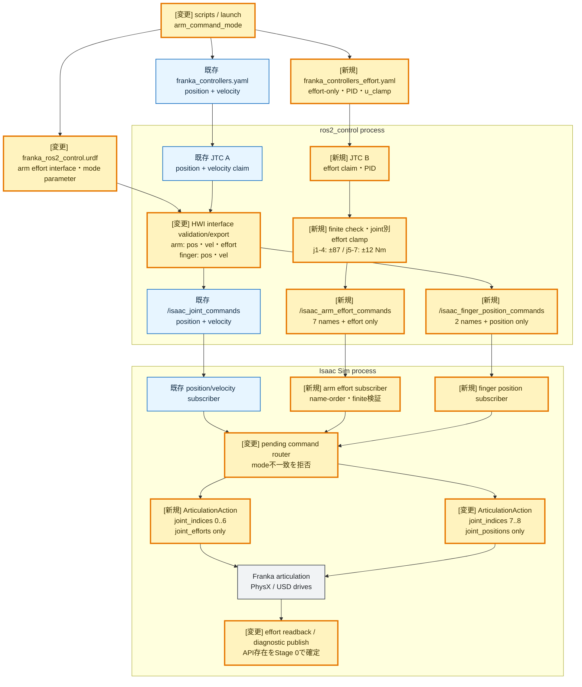

# Step 3-13 JTC effort command interface化 実装計画（Issue #61）

**ステータス**: 実装・評価完了 / effort mode既定化見送り

**作成日**: 2026-07-18

**対象issue**: [#61](https://github.com/akodama428/trial_issac_sim/issues/61)

**前提レポート**:
`step3-12_grasp_direct_jtc_ab_experiment.md` §4.2.3

## 0. 結論

Issue #61の初回実装は、JTCを`effort`単独command interfaceで動かし、JTC PIDが生成した
トルクをFranka articulationへ直接渡す構成とする。既存のposition+velocity方式は既定値のまま
残し、起動時フラグでA/Bを選択する。実行中のhot switchは行わない。

arm 7軸とfinger 2軸はIsaac側でjoint indexを分ける。effortモードではarmへ
`joint_efforts`だけを適用し、fingerへは従来どおりposition targetを適用する。同一arm jointへ
position/velocity/effortを混在させない。

トルク上限はJTCの`u_clamp_min/max`と`IsaacSimHardwareInterface`の防御的clampで二重に守る。
絶対上限はFranka USDの`maxForce`に合わせ、joint1〜4を±87 Nm、joint5〜7を±12 Nmとする。
PID gainはレポート作成時点では確定しない。小振幅のfree-space試験で段階的に同定してから
E2Eへ進む。

## 1. 背景と目的

Step 3-12のmoving_to_place解析では、JTC目標速度はFranka USDの
`physics:maxJointVelocity`の25%未満であり、「MoveIt速度上限が大きすぎる」仮説は支持されなかった。
一方、USD driveのstiffness/dampingから推定した非飽和トルク需要は、joint1とjoint7で
`maxForce`を頻繁に超えた。

現行系ではJTCがposition+velocity targetを出力し、Isaac articulation内部のdriveが
PD制御と`maxForce`制限を担う。この境界ではJTCから実際のトルク飽和が見えず、追従誤差に対する
制御則もIsaac側へ隠れている。

本Stepでは、JTC自身が位置・速度誤差からeffortを生成し、Frankaの`maxForce`を明示的に
考慮できる経路を追加する。そのうえで、moving_to_placeのjoint1追従誤差と、接触時を含む
E2E安定性を現行方式と比較する。

## 2. スコープ

### 2.1 対象

- `IsaacSimHardwareInterface`へのarm effort command interface追加
- JTC effort-only設定、関節別PID、output clamp、anti-windup設定
- ROS 2 command bridgeと`IsaacFrankaDriver`へのeffort伝送・適用
- position+velocity方式とeffort方式の起動時A/B切替
- command effort、clamp、追従誤差、接触のrosbag観測
- free-space tuningとtray接触OFF/ON E2Eの段階評価
- 必要性が確認された後の逆動力学feed-forward検討

### 2.2 対象外

- Issue #59で決定したServo/direct JTCのphase割当て再検討
- trayやgripper geometry、接触経路そのものの修正
- 実機Frankaへの即時適用
- effort modeを既定値へ切り替えること
- 実行中のcontroller command mode hot switch

## 3. 公式仕様と設計制約

確認日は2026-07-18、対象はROS 2 Jazzy / ros2_control Jazzy / Isaac Sim 6.0系である。

| 確認済み事項 | 設計への影響 |
| --- | --- |
| JTCは`effort`単独command interfaceをサポートし、position+velocityの追従誤差をPIDでeffortへ変換する | Issue #61の主経路はeffort-only JTCとする |
| trajectory pointのeffortはJTC PID出力へfeed-forward加算される | 初期検証では空配列または0とし、逆動力学feed-forwardは後段に分離する |
| `position, effort`併用時はJTC PIDが使われず、両commandが直接転送される | PID比較目的に合わず、初回案から除外する |
| effort-only JTCにはpositionとvelocityのstate interfaceが必要 | 現行feedback契約は維持できる |
| JTC PIDは`u_clamp_min/max`、I clamp、anti-windupを持つ | 関節別maxForce制約をcontroller設定へ明示する |
| Isaac articulationはeffort commandを受けられる | driverからarmへ`joint_efforts`を適用する |
| Isaacでは同一jointを複数方式で同時制御できない | arm effort actionとfinger position actionをjoint indexで分離する |

一次情報:

- [ros2_control Jazzy JointTrajectoryController](https://control.ros.org/jazzy/doc/ros2_controllers/joint_trajectory_controller/doc/userdoc.html)
- [ros2_control Jazzy JTC parameters](https://control.ros.org/jazzy/doc/ros2_controllers/joint_trajectory_controller/doc/parameters.html)
- [ROS 2 Jazzy hardware interface types](https://docs.ros.org/en/jazzy/p/hardware_interface/doc/hardware_interface_types_userdoc.html)
- [Isaac Sim Articulation Controller](https://docs.isaacsim.omniverse.nvidia.com/latest/robot_simulation/articulation_controller.html)

## 4. 全体アーキテクチャ

凡例の**オレンジ色・太枠**がIssue #61で変更または新規追加するboxである。既存経路は青、
外部物理モデルは灰色とする。色だけに依存しないよう、変更boxのラベルには`[変更]`または
`[新規]`も付ける。



### 4.1 各コンポーネントの役割

#### MoveIt

開始状態と目標pose、衝突モデル、速度・加速度制限を用いて、arm 7関節をまとめた
`JointTrajectory`を計画する。trajectory pointには各関節の目標角度と
`time_from_start`が入り、設定とparameterizationに応じて目標速度・加速度も入る。

MoveItが決めるのは「どの時刻に全関節がどの状態へ到達するか」であり、Isaacのdriveへ
stepごとのトルクを直接指令しない。

#### JointTrajectoryController（JTC）

MoveItの離散trajectory pointを現在のtrajectory時刻へ補間し、各control周期の目標状態を作る。
modeごとの役割は次のとおり。

| mode | JTCの処理 | JTC出力 |
| --- | --- | --- |
| `position_velocity` | 現在時刻の各関節の目標角度・目標速度を軌道から補間する | position command + velocity command |
| `effort` | 補間した目標角度・速度と実測角度・速度の誤差を、関節別PIDへ入力する | effort command |

JTCは7関節を同じtrajectory時刻で同期して進めるが、**関節間の優先順位付けは行わない**。
effort modeのPIDも各関節に1個ずつ置かれた独立SISO制御であり、次を扱わない。

- ある関節の誤差を優先して他関節を減速する処理
- 慣性行列による関節間coupling補償
- gravity、Coriolis、摩擦のmodel-based補償
- Cartesian Jacobianに基づく特異点回避
- 複数関節のトルクを全体最適化する処理

全関節を協調させた幾何学的な動きは上流のMoveIt軌道が担う。JTCはその軌道を共通時計で
再生するため、完全に無関係な7制御器という意味ではないが、feedback制御則自体は関節ごとに
独立している。

#### IsaacSimHardwareInterface

JTCとsimulation transportの間にある`ros2_control` hardware境界である。
JTC commandをROS 2 topicへ変換し、Isaacから返ったjoint stateをJTCのstate interfaceへ戻す。
effort modeではfinite checkとjoint別absolute clampも担当する。

#### IsaacJointRos2Bridge / IsaacFrankaDriver

bridgeはROS 2 commandを受信し、joint name、配列長、finite値、起動modeを検証してdriverへ渡す。
driverはIsaacの`ArticulationAction`を生成し、Franka articulationへ適用する。

| mode | driverの処理 |
| --- | --- |
| `position_velocity` | armの目標角度・目標速度を値変換せずArticulationActionへ設定する。fingerにはpositionを設定する |
| `effort` | armの目標effortを値変換せずjoint index 0〜6へ設定する。finger positionはindex 7〜8へ分離する |

したがって「スルーパス」という認識は値の意味については正しい。ただしbridge/driverは、
joint mapping、mode分岐、arm/finger分離、入力検証、Isaac API形式への変換を行うため、
単純なROS relayではない。

#### Franka articulation / PhysX

Franka USDから剛体、質量、慣性、joint、drive、衝突形状を読み込み、物理stepを進める。

- `position_velocity`では、PhysX driveがposition/velocity誤差と
  stiffness/dampingから関節力を生成し、maxForceで制限する。
- `effort`では、arm driveのstiffness/dampingを0にして、JTC由来effortだけをarmへ適用する。
- 両modeとも、関節間の慣性coupling、gravity、Coriolis、接触・拘束反力はPhysXが解く。

よってposition_velocity modeで実関節が目標から外れた場合、JTCより下流のdrive応答、
maxForce、動力学的coupling、接触外力も原因候補になる。

### 4.2 制御則

effort-only JTCの基本形は次式である。

```text
u_raw =
    k_ff * v_desired
  + effort_feedforward
  + Kp * (q_desired - q_actual)
  + Ki * integral(position_error)
  + Kd * (v_desired - v_actual)

u_jtc = clamp(u_raw, u_clamp_min, u_clamp_max)
u_hwi = clamp_and_validate(u_jtc, usd_max_force)
```

初期実装では`effort_feedforward=0`、`Ki=0`、`k_ff=0`から開始する。これにより、まず
P/D feedback経路、符号、joint対応、clampを単独で検証できる。I項を有効にするときは
`conditional_integration`または`back_calculation`を必須とする。

### 4.3 stiffness / damping / effortの確認方法

#### 実行時のdrive設定

USDファイルの記載値だけでなく、初期化後のArticulationControllerからruntime値を確認する。
`franka_driver`は起動済み`IsaacFrankaDriver` instanceを表す。

```python
controller = franka_driver._articulation.get_articulation_controller()
kps, kds = controller.get_gains()
max_efforts = controller.get_max_efforts()
effort_modes = controller.get_effort_modes()

print("dof_names:", franka_driver._articulation.dof_names)
print("stiffness / kps:", kps)
print("damping / kds:", kds)
print("max_efforts:", max_efforts)
print("effort_modes:", effort_modes)
```

確認時は`dof_names`と配列indexの対応も同時に記録する。想定するarmの順序は
`panda_joint1`〜`panda_joint7`である。Franka USDのangular driveにはstiffness 400、
damping 80が記載されているが、ArticulationController APIはrad基準へ変換したgainを返す。
したがってruntime APIで期待する値は、400/80そのものではなく、それぞれに`180 / pi`を
掛けた約22918.31 / 4583.66である。maxForceはjoint1〜4が87 Nm、joint5〜7が12 Nmである。
runtime値がこれらと異なる場合は、調整前にUSD参照、単位変換、初期化、runtime上書きの
どこで変化したかを切り分ける。

#### 2026-07-19 runtime確認結果（A: position_velocity）

CI E2Eと同じIsaac Sim 6.0 container、公式Franka asset、default pose、physics modeを使用し、
home初期化直後に上記APIを呼び出した。

| DOF | `dof_names` index | runtime Kp | runtime Kd | max effort | effort mode |
| --- | ---: | ---: | ---: | ---: | --- |
| panda_joint1 | 0 | 22918.3125 | 4583.6626 | 87 Nm | force |
| panda_joint2 | 1 | 22918.3125 | 4583.6626 | 87 Nm | force |
| panda_joint3 | 2 | 22918.3125 | 4583.6626 | 87 Nm | force |
| panda_joint4 | 3 | 22918.3125 | 4583.6626 | 87 Nm | force |
| panda_joint5 | 4 | 22918.3125 | 4583.6626 | 12 Nm | force |
| panda_joint6 | 5 | 22918.3125 | 4583.6626 | 12 Nm | force |
| panda_joint7 | 6 | 22918.3125 | 4583.6626 | 12 Nm | force |
| panda_finger_joint1 | 7 | 3000.0 | 120.0 | 15 N | force |
| panda_finger_joint2 | 8 | 0.0 | 0.0 | 0 N | acceleration |

arm 7軸のruntime gainは全軸同一で、USD記載値との比は次のとおり一致した。

```text
22918.3125 / 400 = 57.29578 ≒ 180 / pi
4583.6626  / 80  = 57.29578 ≒ 180 / pi
```

従って、400/80がruntimeへ反映されていないのではなく、angular driveの単位変換後の値が
APIから返っていると判断する。armのmax effortとjoint順は想定どおりであり、joint mappingの
入れ替わりもなかった。

同時点のAPI観測では`get_applied_joint_efforts()`は全arm軸0だった。これはAが
`set_joint_efforts()`を使わずposition/velocity driveで動くためであり、drive出力が0という意味
ではない。`get_measured_joint_efforts()`は非ゼロ値を返したが、home command適用後10 update時点の
過渡状態なので、moving_to_placeのdrive torqueを表す評価値には使用しない。

runtime Kpだけでmax effortへ達する位置誤差の目安は、速度誤差を0とすると次になる。

```text
joint1〜4: 87 / 22918.3125 = 0.00380 rad（約0.218 deg）
joint5〜7: 12 / 22918.3125 = 0.000524 rad（約0.030 deg）
```

このためmoving_to_placeで0.2 rad級の位置誤差がある状況はgain不足とは解釈できない。
gainをさらに上げる前に、Aのposition/velocity driveがmaxForceへclampされた実出力を観測する
手段を追加し、単位変換後gainを用いてstep3-12の推定飽和率を再計算する必要がある。

#### commandと実測値

PlotJugglerでは次を比較する。

```text
/isaac_joint_commands/position[0]
/isaac_joint_commands/velocity[0]
/isaac_joint_states/position[0]
/isaac_joint_states/velocity[0]
/isaac_joint_states/effort[0]
```

`/isaac_joint_states/effort[0]`は
`get_measured_joint_efforts()`が返すjoint1軸方向のsolver計算値であり、単位はNmである。
これはposition_velocity driveの純粋なactuator commandや実機motor電流ではなく、
関節を通じた動力学・拘束の影響を含む測定effortとして扱う。したがって、この値だけから
driveがmaxForceへ飽和したとは判定しない。

effort modeではJTC commandを次で直接観測できる。

```text
/isaac_arm_effort_commands/effort[0]
```

position_velocity modeのdrive torque需要は、runtime gainとstateから次式で推定する。

```text
tau_drive_est =
  clamp(
    stiffness * (q_command - q_actual)
    + damping * (v_command - v_actual),
    -maxForce,
    +maxForce
  )
```

この推定値、`measured_joint_efforts`、position/velocity誤差を同一時系列で比較する。
推定値が上限へ張り付く一方でmeasured effortが小さい場合は、両者の意味を混同せず、
runtime drive設定とPhysXのeffort観測定義を追加確認する。

## 5. 変更箇所アーキテクチャ

position+velocityとeffortの両command interfaceをros2_control URDFへ公開し、起動時に選択した
JTCだけが対象interfaceをclaimする。HardwareInterface、JTC YAML、Isaac bridgeにも同じmodeを
渡す。設定不一致や未知のmodeは起動失敗とし、暗黙のfallbackを行わない。

effortモードのROS 2伝送は、arm effortとfinger positionを別topicに分ける。標準
`sensor_msgs/JointState`を使いながら、非対象fieldへ現在値や0を埋めるsentinel契約を避ける。



### 5.1 起動時mode契約

想定する公開設定名は`arm_command_mode`とする。

| 値 | JTC command interface | armへのIsaac action | fingerへのIsaac action |
| --- | --- | --- | --- |
| `position_velocity`（既定） | position + velocity | position + velocity | position |
| `effort`（opt-in） | effort | effort only | position |

`scripts/run_ros2_components.sh`と`scripts/ci/run_e2e.sh`からlaunch、HardwareInterface、
Isaac bridgeまで同じ値を渡す。次を起動時にfail-fast検証する。

- `effort`選択時に7軸すべてのeffort interfaceが存在する
- active JTCが選択modeのcommand interfaceだけをclaimする
- bridgeとHardwareInterfaceのmodeが一致する
- arm/fingerのjoint name、順序、配列長が一致する
- effortがfiniteであり、関節別上限内である

### 5.2 トルク制限

| joint | USD `maxForce` | JTC output clamp | HWI防御clamp |
| --- | ---: | ---: | ---: |
| panda_joint1〜4 | 87 Nm | -87〜+87 Nm | -87〜+87 Nm |
| panda_joint5〜7 | 12 Nm | -12〜+12 Nm | -12〜+12 Nm |

最初のgain tuningは安全余裕20%を取ったsoft clamp（69.6 Nm / 9.6 Nm）で開始し、
単関節試験の結果をレビューしてから上表の絶対上限まで拡張する。HWIの絶対上限は設定で
拡張不可とし、USD値を超える設定は初期化時に拒否する。

## 6. 代替案比較

| 案 | 概要 | 利点 | 欠点 | 判定 |
| --- | --- | --- | --- | --- |
| A. JTC effort-only | JTC PIDが追従誤差をeffortへ変換 | 標準JTCでmaxForce clamp、anti-windup、trajectory toleranceを維持できる | PID tuningとeffort観測が必要 | **採用** |
| B. JTC position+effort | position targetとfeed-forward effortを同時出力 | 接触保持の追加力用途には適する | JTC PIDを使わず、Isaacの同一joint複数制御禁止とも不整合 | 初回検証では不採用 |
| C. custom torque controller | 独自controllerで逆動力学+feedbackを実装 | 制御則の自由度が高い | 実装・検証範囲が大きく、JTC A/BというIssue目的から外れる | 将来候補 |

## 7. ファイル別変更計画

| 対象 | 予定変更 |
| --- | --- |
| `src/franka_ros2_control/config/franka_controllers_effort.yaml`（新規） | effort-only JTC、関節別PID、soft/absolute output clamp、anti-windup |
| `src/franka_ros2_control/config/franka_ros2_control.urdf` | arm effort command interfaceとhardware mode/topic parameterを追加 |
| `src/franka_ros2_control/launch/franka_ros2_control.launch.py` | `arm_command_mode`宣言、mode別controller YAML選択、未知値拒否 |
| `src/franka_ros2_control/include/.../isaac_sim_hardware_interface.hpp` | effort command buffer、mode、上限、publisherを追加 |
| `src/franka_ros2_control/src/isaac_sim_hardware_interface.cpp` | interface検証/export、finite check、二重clamp、arm/finger分離publish |
| `src/franka_ros2_control/CMakeLists.txt` | HWIのmode/clampを検証するgtest target追加 |
| `src/tomato_harvest_sim/simulator/isaac_joint_ros2_bridge.py` | mode-aware subscriber、arm effort/finger position routing、入力検証 |
| `src/tomato_harvest_sim/simulator/isaac_franka_driver.py` | effort-only action生成、arm/finger joint index分離、readback |
| `src/tomato_harvest_sim/simulator/isaac_viewer.py` | mode引数をbridge生成へ渡す |
| `scripts/run_ros2_components.sh` | 手動GUI/Headless起動のmode optionとenv pass-through |
| `scripts/ci/run_e2e.sh`, `scripts/ci/in_container_e2e.sh` | E2E A/B mode、bag topic、成果物metadata追加 |
| simulator / HWI tests | joint mapping、clamp、mode mismatch、no mixed control、default不変を追加 |
| rosbag analysis script | phase別追従誤差、effort、飽和率、接触、成功率の比較表・plotを生成 |

## 8. 実装フェーズとゲート

### Stage 0: 観測APIとcommand contractの確定

- 現在使用中のIsaac Sim 6.0 APIで、commanded/applied/measured effortの取得可否と意味を実測する
- arm effort actionとfinger position actionを同tickに別joint indexへ適用できることを最小scriptで確認する
- rosbagへ保存するtopic、message型、単位、joint orderを固定する

**通過条件**: effort commandの入力値と少なくとも1種類のIsaac effort readbackを同時記録でき、
armへposition targetを送らずfinger positionを維持できる。

### Stage 1: ros2_control interfaceと安全境界

- URDFにarm effort interfaceを追加する
- JTC effort YAML、mode選択、HWI effort export/publishを追加する
- JTC clampとHWI絶対clamp、finite check、mode mismatch拒否をテストする

**通過条件**:
`ros2 control list_hardware_interfaces`でeffort mode時にarm effortだけがJTCにclaimされ、
87/12 Nmを超えるcommandがIsaac側へ到達しない。

### Stage 2: Isaac bridge/driver effort適用

- bridgeをarm effortとfinger positionへ分離する
- driverがarm 0..6へeffort-only、finger 7..8へposition-only actionを適用する
- ゼロeffort、正負小effort、clamp近傍でjoint mappingと符号を確認する

**通過条件**: 7軸すべてでcommand符号とreadback符号が一致し、非対象jointが動かない。

### Stage 3: free-space PID tuning

1. home姿勢でゼロeffort起動と停止を確認する
2. 各jointへ小振幅stepを単独で与える
3. `Ki=0`のP/Dから開始し、overshoot、settling、飽和率を評価する
4. steady-state誤差が問題になる場合だけI項とanti-windupを有効化する
5. 7軸同時の短い低速trajectoryで干渉を確認する

**通過条件**: runaway、持続振動、joint limit違反がなく、停止後にJTC goal toleranceへ収束する。

### Stage 4: E2E A/B評価

- A: 現行`position_velocity`
- B: `effort`
- 各条件でtray collision OFF / ONを実行する
- まずdefault pose、通過後に10 initial-pose matrixへ拡張する
- rosbag、controller/robot/physics log、設定snapshotを同じartifactへ保存する

**通過条件**: §9の受け入れ条件を満たし、BがAより明確に悪化しない。

### Stage 5: 逆動力学feed-forward（条件付き）

P/Dだけで重力方向のsteady-state誤差または高い飽和率が残る場合に限り、MoveIt軌道へ
inverse-dynamics effortを付加する。feed-forward単独の精度、PIDとの加算後clamp、
model mismatchを別A/Bで評価する。Stage 4を通過するなら実装を見送る。

## 9. テスト計画と受け入れ条件

### 9.1 自動テスト

- 既定modeが`position_velocity`であり、現行command payloadが不変
- effort modeでJTCがeffortだけをclaim
- joint1〜4は±87 Nm、joint5〜7は±12 Nmでclamp
- soft clampから絶対clampを超える設定を拒否
- NaN、Inf、未知joint、配列長不一致、mode不一致を拒否
- arm effort actionにposition/velocity fieldがない
- finger position actionにeffort fieldがない
- arm/finger actionのjoint indexが重複しない
- controller停止・再activate時に非ゼロeffortを残さない

### 9.2 E2E観測項目

| 指標 | 集計単位 |
| --- | --- |
| `abs(q_reference - q_feedback)`最大値・RMS・95 percentile | joint × phase |
| `abs(v_reference - v_feedback)`最大値・RMS | joint × phase |
| commanded / clamped / applied effort最大値 | joint × phase |
| soft/absolute clamp飽和sample率 | joint × phase |
| tray/gripper/tomato contact force | contact pair × phase |
| JTC abort、timeout、goal到達時間 | phase |
| joint limit違反、持続振動、最大実速度 | joint |
| harvest完了率 | initial pose × collision条件 |

### 9.3 Issue #61完了条件

- effort commandがHWI、ROS bridge、driverを経てFranka articulationへ到達する
- 全sampleでjoint1〜4が87 Nm、joint5〜7が12 Nmを超えない
- moving_to_placeのjoint1追従誤差をA/Bの同一条件で比較できる
- tray collision OFF / ONの両方でE2E結果を取得できる
- timeout、持続振動、joint limit違反が現行方式より増加しない
- 設定、rosbag、plot、成功率、採否判断を本レポートへ追記する

定量的な採否判定は、まず安全条件を必須とし、そのうえでdefault poseのmoving_to_placeにおける
joint1最大絶対誤差とRMSがAより改善することを要求する。10 pose matrixへ進んだ後は、
E2E成功率がAの95%信頼区間を下回らないことを確認する。試行数が少なく信頼区間比較が
成立しない場合は、成功率の悪化0件とfailure mode不変を最低条件とする。

## 10. ロールバックと互換性

- `position_velocity`を既定値として維持する
- effort設定とtopicはopt-inで追加し、A条件のYAMLとpayloadを変更しない
- effort mode初期化失敗時にAへ自動fallbackしない。設定不整合を隠さず起動失敗にする
- E2Eで安全条件または成功率条件を満たさなければ、Issue #61の結果として記録したうえで
  既定modeは変更しない
- 実機用Franka hardware interfaceには今回のsim固有topicやmode parameterを流用しない

## 11. 実装開始前の確認事項

1. Isaac Sim 6.0の現行APIで取得できるeffort readbackが
   commanded/applied/measuredのどれかをStage 0で確定する
2. JTC PID gainの初期探索範囲をsingle-joint試験で決め、根拠なしにUSDの
   stiffness=400 / damping=80を転記しない
3. gravity compensationがeffort actionに自動で含まれるかを最小試験で確認する
4. arm effort action適用時にUSD driveのposition/velocity targetが残留しないことを確認する
5. tray collision OFFの定義をscene設定で再現可能にし、A/Bでそれ以外の条件を固定する

## 12. 実装結果

### 12.1 command modeとJTC

起動時環境変数`TOMATO_HARVEST_ARM_COMMAND_MODE`へ
`position_velocity`（既定値）または`effort`を指定できるようにした。実行中のhot switchと、
設定不整合時のposition方式への自動fallbackは実装していない。

effort modeでは専用の`franka_controllers_effort.yaml`を選択し、JTCのcommand interfaceを
`effort`だけ、state interfaceを`position`と`velocity`にした。評価に使用した最終gainは次のとおり。

| joint | P | I | D | `u_clamp_min/max` [Nm] |
| --- | ---: | ---: | ---: | ---: |
| joint1〜4 | 100 | 0 | 10 | -87 / +87 |
| joint5〜7 | 50 | 0 | 5 | -12 / +12 |

anti-windupは`conditional_integration`を設定した。I項は0であり、本評価では積分制御を使用して
いない。

### 12.2 HWI、ROS bridge、Isaac driver

- arm 7軸にeffort command interfaceを追加した。
- effort modeではarm commandを`/isaac_arm_effort_commands`、finger position commandを
  `/isaac_finger_position_commands`へ分離した。
- HWIでNaN/Infを0へ置換し、joint1〜4を±87 Nm、joint5〜7を±12 Nmへ絶対clampする。
- Isaac driverではarm index 0〜6へ`joint_efforts`だけ、finger index 7〜8へ
  `joint_positions`だけを適用し、同一jointへのcommand方式混在を防いだ。
- effort modeのhome姿勢設定後にarm driveのstiffness/dampingを0へ切り替え、初期姿勢設定と
  effort-only制御が競合しない順序にした。
- `/isaac_joint_states.effort`へIsaacの`get_measured_joint_efforts()`を記録する経路を追加した。
  この値は拘束・接触反力を含む測定値であり、actuator commandそのものではない。

### 12.3 評価・解析系

- CI E2Eと手動起動scriptへcommand mode引数を追加した。
- rosbag記録対象へarm/finger command topicと`/isaac_joint_states`を追加した。
- `extract_jtc_tracking_bag.py`へ`joint_effort.csv`出力を追加した。
- command mode、joint mapping、finite check、arm/finger action分離、effort readbackの単体テストを
  追加した。

## 13. 自動テスト結果

| 対象 | 結果 |
| --- | --- |
| simulator Python test（コンテナ） | 334 passed |
| `franka_ros2_control` package test | 24 passed |
| host Python test discovery | 221 passed, 2 skipped |
| C++ build | 成功。既知の`on_init` deprecated warningのみ |
| shell syntax / Python compile | 成功 |
| `git diff --check` | 成功 |

既定値は`position_velocity`のままであり、既存A条件のcommand payloadは維持される。

## 14. E2E評価条件

同一のdefault pose、同一scene、同一harvest sequenceを用い、最大1600 simulation stepで評価した。
Aは既存position+velocity方式、Bは本Stepのeffort方式である。

| 条件 | artifact | 結果 |
| --- | --- | --- |
| A: position+velocity | `.artifacts/issue61-step3-13/position-velocity-1600/e2e` | 1292 stepで`complete` |
| B: effort、最終gain・home順序修正版 | `.artifacts/issue61-step3-13/effort-final-1600/e2e` | `moving_to_pregrasp`でtimeout |

解析結果は次に保存した。

- A:
  `.artifacts/issue61-step3-13/analysis/position-velocity-1600/`
- B:
  `.artifacts/issue61-step3-13/analysis/effort-final-1600/`

各directoryには`controller_state.csv`、`phase.csv`、`joint_effort.csv`、
`joint_tracking.png`が含まれる。Bのrosbagにはcontroller state 6021行、phase 3行、
effort readback 1600行が記録された。

## 15. 評価結果

### 15.1 A: position+velocity

Aは`detecting`から`returning_home`まで進み、`complete`へ到達した。
moving_to_placeの目標角と実関節角の誤差は次のとおり。

| joint | 最大絶対誤差 [rad] | RMS [rad] |
| --- | ---: | ---: |
| joint1 | 0.841241 | 0.410939 |
| joint2 | 0.009564 | 0.005248 |
| joint3 | 0.139447 | 0.057391 |
| joint4 | 0.015036 | 0.005681 |
| joint5 | 0.019546 | 0.010544 |
| joint6 | 0.017152 | 0.010582 |
| joint7 | 0.022000 | 0.012910 |

step3-12で問題にしたmoving_to_placeのjoint1乖離は再現した。

### 15.2 B: effort

Bは`moving_to_pregrasp`中に`servo_target_timeout`でabortした。suffix replan自体は成功したが、
追従誤差が残り、harvest完了にもmoving_to_placeにも到達しなかった。

moving_to_pregrasp開始以降の誤差は次のとおり。abort後のreplan区間を含むため、単一軌道だけの
step responseではなく、E2E failure全体の指標である。

| joint | 最大絶対誤差 [rad] | RMS [rad] |
| --- | ---: | ---: |
| joint1 | 1.751434 | 0.493316 |
| joint2 | 0.521783 | 0.320085 |
| joint3 | 0.306403 | 0.044159 |
| joint4 | 0.223801 | 0.170762 |
| joint5 | 0.449418 | 0.139867 |
| joint6 | 0.270780 | 0.082782 |
| joint7 | 0.591580 | 0.218940 |

HWIからIsaacへ渡した1599 sampleのcommand effortは全sampleで絶対上限内だった。

| joint | command peak [Nm] | 上限 [Nm] | 上限到達sample率 |
| --- | ---: | ---: | ---: |
| joint1 | 87.0000 | 87 | 10.57% |
| joint2 | 61.0997 | 87 | 0.00% |
| joint3 | 41.3398 | 87 | 0.00% |
| joint4 | 71.7048 | 87 | 0.00% |
| joint5 | 12.0000 | 12 | 51.47% |
| joint6 | 12.0000 | 12 | 59.10% |
| joint7 | 12.0000 | 12 | 51.78% |

`/isaac_joint_states.effort`も非ゼロ値を記録し、effortがbridge/driverを経てarticulationへ到達した
ことを確認した。ただし前述のとおり、このreadbackは拘束反力を含むため、command clampの検証には
使用せず、command logを正とした。

### 15.3 tuning過程

USD drive値をそのまま転記したP=400/D=80の初期条件では、joint5〜7の上限到達率が
95.7〜97.8%となった。P=100/D=10（joint1〜4）、P=50/D=5（joint5〜7）へ下げると
wristの飽和率は約51〜59%まで低下したが、pregrasp timeoutは解消しなかった。

また、arm drive gainをhome姿勢設定前に0にすると初期姿勢へ収束できないことを確認したため、
最終評価ではhome設定と10 updateの後にeffort modeをactivateした。この順序修正後もBのE2E結果は
同じfailure classだった。

## 16. 考察

今回の結果は「effort command interfaceを追加すれば、JTC PIDだけで既存軌道を直ちに追従できる」
という仮説を支持しない。主な観測根拠は次のとおり。

1. command伝送と87/12 Nm clampは意図どおり動作している。
2. それにもかかわらず、free-spaceのpregraspで全arm jointに大きな追従誤差が出た。
3. 特にjoint5〜7はgainを下げた後も過半数のsampleで12 Nmに達した。
4. Aは同じE2E条件で完了しており、Bのfailureをtray/gripper接触だけでは説明できない。

したがって、Bの主要課題はmoving_to_placeのtray接触以前にある。単純な関節別PDでは、
重力、関節間coupling、摩擦を補償できず、低いwrist maxForce内で軌道を保持できていない可能性が
高い。次段では、ロボット動力学に基づくgravity/coriolis feed-forward、またはIsaac側で利用可能な
gravity compensationの仕様を切り分けたうえで、低振幅single-joint試験から再同定する必要がある。

## 17. 受け入れ条件の判定

| Issue #61完了条件 | 判定 | 根拠 |
| --- | --- | --- |
| effortがHWI、bridge、driverを経てarticulationへ到達 | 達成 | 非ゼロcommandとmeasured effort readbackを取得 |
| 全sampleで87/12 Nm以下 | 達成 | 1599 command sampleで上限超過0 |
| moving_to_place joint1を同一条件でA/B比較 | 未達 | Bがpregraspで停止 |
| tray collision OFF / ONの両方でE2E取得 | 未達 | free-space相当のpregraspを通過せず、接触A/Bへ進めなかった |
| timeout、振動、joint limit違反がAより増えない | 未達 | Bのみ`servo_target_timeout` |
| 設定、bag、plot、成功率、採否を記録 | 達成 | 本節およびartifactへ保存 |

## 18. 採否判断

effort command interfaceの実装経路と安全clampは残すが、**effort modeの既定化は見送る**。
既定modeは`position_velocity`を維持する。

本StepのE2E成功率はAが1/1、Bが0/1であり、Bはmoving_to_placeへ到達しなかった。このため
moving_to_placeのjoint1誤差改善、tray collision OFF/ON比較、10 initial-pose matrixには進めない。
これらを無理に実施してもIssue #61の主経路の成立性を評価できないため、pregrasp通過を次の
gateとする。

次の実装候補は、別Stepとして以下の順で扱う。

1. single-joint小振幅試験でgravity compensation有無とeffort readbackの意味を確定する。
2. gravity/coriolis inverse-dynamics feed-forwardをJTC PID出力へ加える。
3. 87/12 Nm内でpregrasp goal toleranceへ収束するgainを再同定する。
4. pregrasp通過後にmoving_to_place A/B、tray collision OFF/ON、10 pose matrixを再開する。
