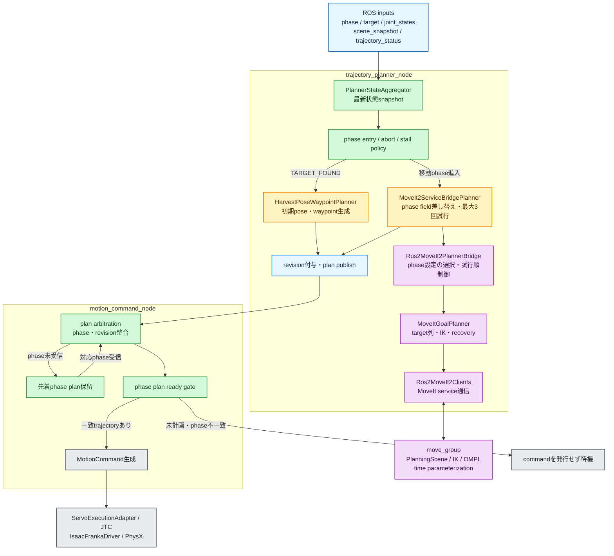
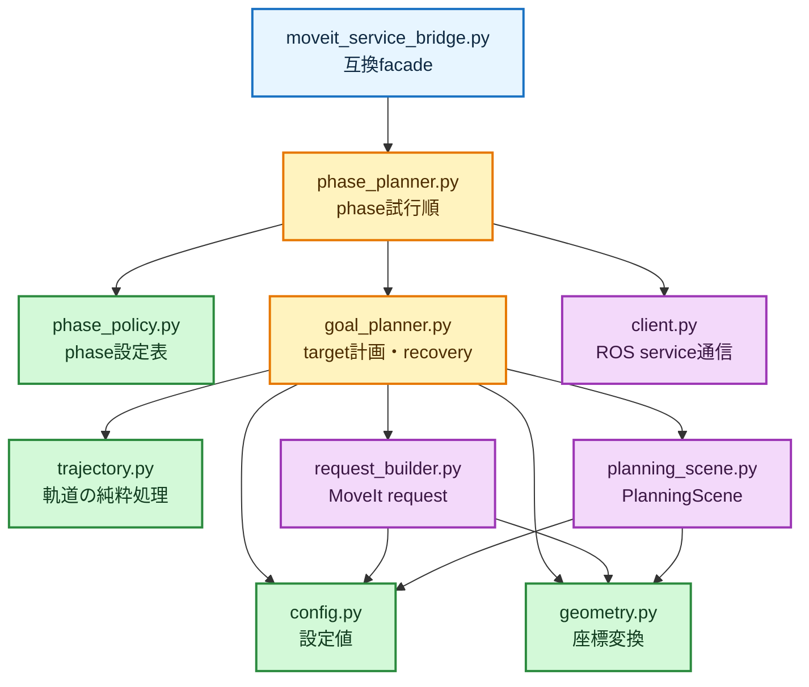
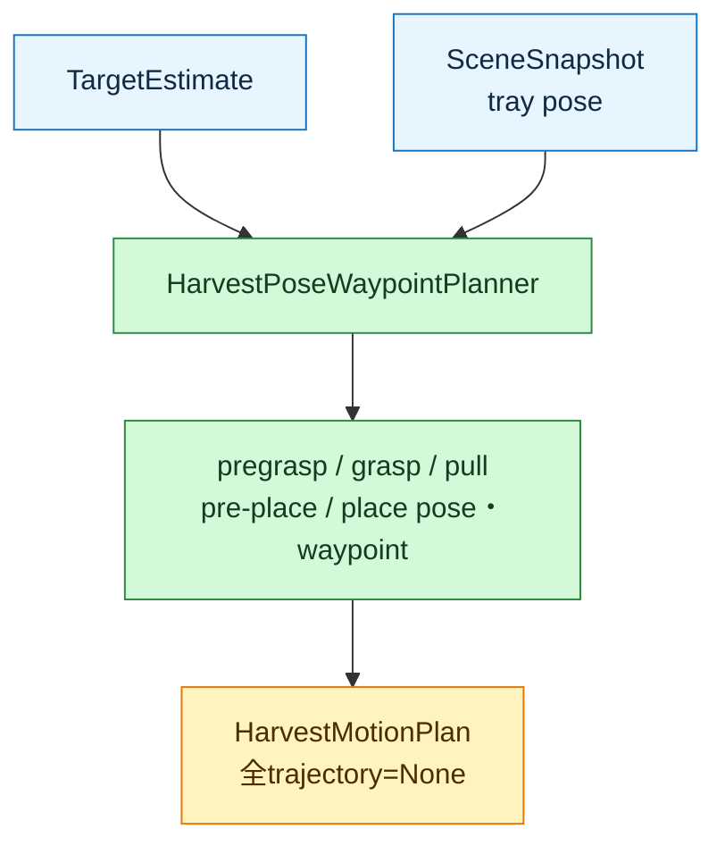
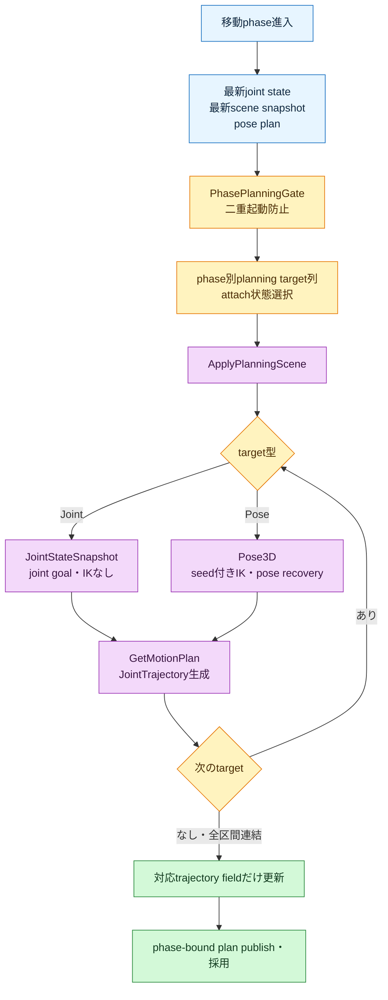

# Step 3-14 現行motion_plannerアーキテクチャ

**ステータス**: 現行実装反映済み

**作成日**: 2026-07-20

**更新日**: 2026-07-20（MoveIt bridgeの責務別ファイル分割を反映）

**対象範囲**:

- `src/tomato_harvest_sim/robot/motion_planner/`
- `src/tomato_harvest_sim/robot/execute_manager/motion_command.py`
- `src/tomato_harvest_sim/robot/msg/planner.py`
- `src/tomato_harvest_sim/msg/contracts.py`

**関連レポート**:
[Step 3-14 RETURNING_HOME trayリブ接触の原因調査・実装計画](step3-14_returning_home_tray_collision_avoidance_plan.md)

## 0. 結論

現行motion plannerは、初期時点で全phaseの`JointTrajectory`を一括計画しない。
処理を次の2段階へ分離している。

1. `TARGET_FOUND`では、targetとtrayから各phaseの目標pose・waypointだけを決定する。
2. 各移動phaseへ進入した時点で、最新joint stateとPlanningSceneから、そのphaseの
   実行用`JointTrajectory`だけをMoveItで生成する。

対象となる移動phaseは次の5つである。

| phase | 生成するfield | goal | tomatoのPlanningScene状態 |
| --- | --- | --- | --- |
| `MOVING_TO_PREGRASP` | `pregrasp_joint_trajectory` | pregrasp pose | world object |
| `MOVING_TO_GRASP` | `grasp_joint_trajectory` | grasp pose | world object |
| `DETACHING` | `pull_joint_trajectory` | pull pose | attached object |
| `MOVING_TO_PLACE` | `place_joint_trajectory` | pre-place→place pose | attached object |
| `RETURNING_HOME` | `home_joint_trajectory` | 固定home関節構成 | world、attached解除 |

`AT_GRASP`、`GRASP_EVALUATION`、`RELEASING`、`PLACED`はHOLDまたはgripper操作であり、
新しいMoveIt trajectoryを要求しない。

phase通知とphase planは別topicを通るため、consumerで受信順序が逆転し得る。
`motion_command_node`はphaseに一致するplanだけを実行し、先着したphase planは対応phase通知まで
一時保留する。これにより、古いtrajectoryの実行と新planの取りこぼしを防ぐ。

Issue #52のtray退避waypointは未実装である。`RETURNING_HOME`は最新状態からMoveIt計画されるが、
現時点では`current → home`の単一区間である。

---

## 1. 入出力と責務

### 1.1 入力

| 入力 | 用途 |
| --- | --- |
| `/tomato_harvest/phase` | 初期pose planおよびphase trajectory計画の起動 |
| `/tomato_harvest/target_estimate` | target poseと収穫目標poseの算出 |
| `/joint_states` | 各phase trajectoryのMoveIt start state |
| `/tomato_harvest/scene_snapshot` | branch、stem、tomato、trayのPlanningSceneとplace pose |
| `/tomato_harvest/trajectory_status` | abort/stall後の自由空間phase再計画 |
| 0.3秒timer | minimum intervalで抑止されたabort/stallの再評価 |

初期pose planは`target_estimate`と`scene_snapshot`だけを必要とし、`joint_state`を必要としない。
実行trajectoryの計画は、対応phaseへ進入した時点の最新`joint_state`を必要とする。

### 1.2 出力

`/tomato_harvest/harvest_motion_plan`へ`HarvestMotionPlan`をpublishする。

- 初期plan:
  - pose・waypointを保持する
  - 全`JointTrajectory` fieldは`None`
  - `planned_from_phase=TARGET_FOUND`
- phase plan:
  - pose・waypointを保持する
  - 現在phaseに対応するtrajectory fieldを更新する
  - `planned_from_phase=<現在phase>`

publish時には`plan_revision`、`generated_at_sec`、`producer_kind`、
`producer_instance_id`を付与する。

---

## 2. 全体アーキテクチャ



### 2.1 MoveIt bridgeのファイル構成

従来1,500行を超えていた`moveit_service_bridge.py`は、外部互換facadeと
責務別`moveit_bridge/`パッケージへ分割した。facadeは113行となり、
既存の`MoveIt2ServiceBridgePlanner`、`Ros2MoveIt2PlannerBridge`、
`build_planner()`のimport経路を維持する。

```text
motion_planner/
├── moveit_service_bridge.py       # 既存public APIの互換facade
└── moveit_bridge/
    ├── config.py                  # 環境変数と定数の解決
    ├── phase_policy.py            # phase→目標列・attach状態の設定表
    ├── phase_planner.py           # phase計画のオーケストレーション
    ├── goal_planner.py            # target列、IK、recovery、診断
    ├── request_builder.py         # GetMotionPlan request生成
    ├── planning_scene.py          # collision objectとattach状態遷移
    ├── client.py                  # ROS 2 service client
    ├── trajectory.py              # 軌道変換・連結・関節範囲補正
    └── geometry.py                # pose offset・quaternion変換
```



ROS message型は`request_builder.py`、`planning_scene.py`、`client.py`の関数または
constructor内で遅延importする。これにより、domain policy、軌道処理、facadeを
ROS 2未導入のunit-test環境でもimportできる。

---

## 3. 初期pose plan



`MoveIt2ServiceBridgePlanner.plan()`は`HarvestPoseWaypointPlanner.plan()`の結果をそのまま返す。
この段階ではPlanningScene適用、IK、OMPL、time parameterizationを呼ばない。

---

## 4. phase開始時trajectory計画



`MoveIt2ServiceBridgePlanner.plan_phase_trajectory()`はbridge呼び出しを最大3回試す。
`Ros2MoveIt2PlannerBridge.plan_phase_trajectory()`がphase固有処理を担当する。
bridgeの戻り値`MoveIt2PlanningResult`は、呼び出し時にphaseが確定しているため
単一の`joint_trajectory`だけを持つ。上位plannerが
`PHASE_TRAJECTORY_FIELD_BY_PHASE`を使い、`HarvestMotionPlan`の対応fieldへ格納する。

bridge内では`_phase_planning_specs()`が全5移動phaseの目標列候補、tomato attach状態、
失敗理由を設定表として返す。`plan_phase_trajectory()`は設定表を`for`で走査し、
一致したphaseを共通`_plan_configured_phase()`へ渡す。

- `MOVING_TO_PREGRASP`:
  homeから遠い初期構成では`(home joint state, pregrasp pose)`を共通`_plan_phase()`へ渡す。
  設定表の第1候補が失敗した場合は、第2候補`(pregrasp pose,)`でcurrent→pregraspへ戻る。
- `MOVING_TO_GRASP`:
  world tomatoを維持してgrasp poseへ計画する。
- `DETACHING`:
  tomatoをattached objectとしてpull poseへ計画する。接触支配区間のためabort後suffix再計画はしない。
- `MOVING_TO_PLACE`:
  attached tomatoを維持し、第1候補`(pre-place pose, place pose)`を連結する。
  失敗して既知のplace終端関節構成がある場合は、第2候補のjoint goalをIKなしで計画し、
  成功理由`joint_goal_fallback`として返す。
- `RETURNING_HOME`:
  attached tomatoを解除し、`(home joint state,)`を共通`_plan_phase()`へ渡す。

---

## 5. planning target列とpose goalの回復順序

`_plan_phase()`はPlanningSceneを適用後、`planning_targets`を順番に処理する。
`JointStateSnapshot`はIKを実行せず`_plan_joint_goal()`へ渡し、`Pose3D`だけを
`_plan_pose_target()`へ渡す。各区間の終端joint stateを次区間の開始点とし、
全区間が成功した場合だけtrajectoryを連結する。

Pose目標は次の順序で回復を試みる。

1. 現在joint stateをseedに`/compute_ik`を呼ぶ。
2. 現在構成から各関節2.2rad以内のIK枝だけを受理する。
3. 採用IK解をjoint-space goalとして`/plan_kinematic_path`へ渡す。
4. 失敗した場合、全arm関節window付きpose goalを試す。
5. window内に解がなければ、windowなしpose goalを試す。
6. abort後replanで既存trajectory終端がある場合、既知joint goalへのfallbackを試す。

window付き・なしのpose goal試行、診断保存、joint goal fallbackは
`_plan_pose_goal_with_recovery()`へ集約されている。

---

## 6. phase plan実行ゲート

`motion_command_node`は`FOLLOW_TRAJECTORY` phaseについて、次の両方を要求する。

1. `plan.planned_from_phase == current_phase`
2. phase対応fieldに、1点以上を持つ`JointTrajectory`が存在する

満たさない場合は`motion_command_deferred reason=phase_plan_not_ready`を記録し、
commandをpublishしない。

異なるtopic間では次の順序逆転が起こり得る。

```text
trajectory_planner_node: phaseを受信 → phase planをpublish
motion_command_node:      phase planを先に受信 → phaseを後から受信
```

この場合、plan arbitrationは一度`rejected_phase_mismatch`または
`rejected_current_phase_unknown`を返す。
`motion_command_node`はそのplanを`pending_plan`として保持し、対応phase通知後に再評価する。
stale revisionなど、phase順序以外の理由で棄却したplanは保留しない。

---

## 7. abort後replan

phase開始時の初回計画とabort後replanは同じ`plan_phase_trajectory()`を使う。
ただしabort後replan対象は自由空間phaseに限定する。

| phase | 開始時計画 | abort後replan |
| --- | --- | --- |
| `MOVING_TO_PREGRASP` | Yes | Yes |
| `MOVING_TO_GRASP` | Yes | Yes |
| `DETACHING` | Yes | No |
| `MOVING_TO_PLACE` | Yes | Yes |
| `RETURNING_HOME` | Yes | Yes |

候補planに現在phaseのtrajectoryがまだ無ければ必ず採用する。
既存trajectoryがあるreplanでは開始点・終端点の最大差を比較し、0.02rad未満の差分は棄却する。

---

## 8. MoveIt service境界

| Service | 責務 |
| --- | --- |
| `/apply_planning_scene` | branch、stem、tray、world/attached tomatoの反映 |
| `/compute_ik` | target poseからseed近傍の関節goal候補を取得 |
| `/plan_kinematic_path` | start stateからpose/joint goalへのcollision-aware trajectory生成 |
| `/check_state_validity` | planning失敗時のstart state・contact診断 |

move_groupは`allow_trajectory_execution=False`であり、trajectoryを実行しない。
実行責務はmotion command以降のJTC経路にある。

---

## 9. 主要moduleの責務

| module/class | 責務 |
| --- | --- |
| `PlannerStateAggregator` | ROS入力を最新immutable snapshotへ集約 |
| `phase_suffix_replan.py` | phase開始時計画、suffix対象、採否、二重起動のpure policy |
| `HarvestPoseWaypointPlanner` | target/trayからpose・waypoint生成 |
| `MoveIt2ServiceBridgePlanner` | 初期pose planとphase trajectory planのapplication facade |
| `Ros2MoveIt2PlannerBridge` | phase別PlanningScene・goal・fallbackの選択 |
| `_Ros2MoveIt2Clients` | MoveIt serviceとのROS通信 |
| `motion_command_node` | plan採用、topic順序吸収、実行ready gate、command publish |

---

## 10. 現時点の制約

- phase plan失敗時は安全側にcommandを発行せず待機するが、behavior phaseを`FAILED`へ遷移させる
  明示的なplanning failure通知はまだない。
- `RETURNING_HOME`はMoveIt計画済みだが、tray上方retreat waypointを経由しない。
- PlanningSceneとIsaac USDのcollision geometry一致、およびtrajectory全点のminimum clearanceは
  Issue #52で引き続き検証する。
- この変更ではIssue #52の回避経路、tray geometry、PhysX contact観測は変更していない。
