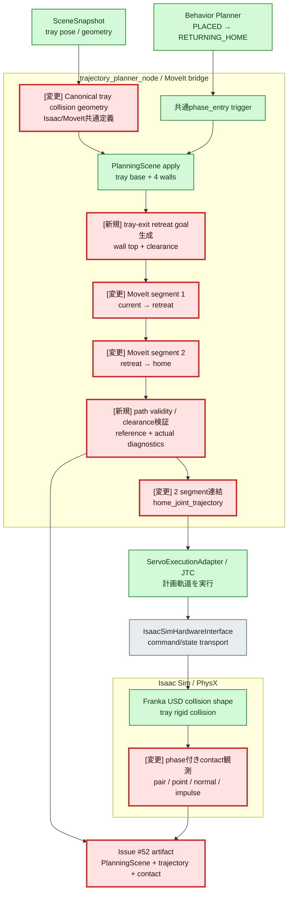
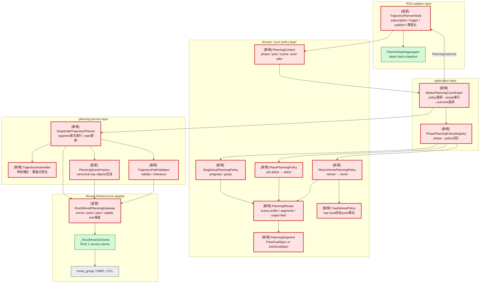
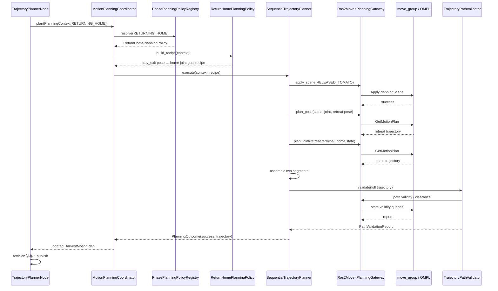

# Step 3-14 RETURNING_HOME trayリブ接触の原因調査・実装計画（Issue #52）

**ステータス**: 原因調査・実装計画完了（実装未着手）

**作成日**: 2026-07-19

**更新日**: 2026-07-20（全移動phaseの開始時計画アーキテクチャを反映、Issue #52実装は未着手）

**対象issue**: [#52](https://github.com/akodama428/trial_issac_sim/issues/52)

**前提レポート**:
[Step 3-10 RETURNING_HOME退避時のアーム不安定化・固着の原因調査](step3-10_returning_home_arm_freeze_investigation.md)

## 0. 結論

現行コードではtrayはMoveIt PlanningSceneへ登録されており、`RETURNING_HOME`でもMoveItが
trayを含むsceneに対してhome復帰軌道を生成している。したがって、今回の直接原因を
「trayが障害物として一切登録されていない」「RETURNING_HOMEがMoveItを使っていない」と
結論づけることはできない。

確認できた経路は次のとおりである。

1. trayは`place_tray_base`と4個の`place_tray_wall_*`、合計5個のboxとして
   `/apply_planning_scene`へ送られる。
2. `PLACED → RETURNING_HOME`進入時に共通の`phase_entry` planが起動する。
3. plannerはPlanningSceneを再適用してから、最新joint stateをstart、固定home関節構成をgoalとして
   OMPLへ`GetMotionPlan`を要求する。
4. 変更前の手動GUI artifactでも、旧`home_entry`計画の成功、publish、adoptを複数cycleで確認できる。

一方、**MoveItが衝突なしと判定した軌道でPhysX上のgripperとtrayリブが接触する理由は、
現在の証跡だけでは確定できない**。最有力は次のモデル・検証ギャップである。

- MoveIt用gripper collision modelはlaunch時に追加する独自primitiveであり、Isaac USDの実collision
  shapeを正本としていない。
- trayも同じ寸法値から作られているものの、Isaac側とMoveIt側で別々にbox配置式を実装している。
- `planning_scene_object_ids`は「登録しようとしたID」を示すだけで、move_group内部の最終pose・寸法、
  start stateの接触pair、trajectory全点のminimum distanceを証明しない。
- OMPLはedge上を離散的にcollision checkするため、細いリブと小さいfingerの組合せでは検査分解能も
  実測対象にする必要がある。
- 現行artifactにはMoveItの衝突距離とPhysX contact pointを同一時刻で比較できるtopicがない。

よって実装は、先にPlanningSceneとPhysXのfalse-negativeを再現・可視化し、その結果を反映した
collision modelを用いて、`RETURNING_HOME`を
**release位置 → tray上方のretreat waypoint → home**の二段MoveIt計画へ変更する。
単なる固定関節補間やcollision checkを迂回するCartesian直線指令は採用しない。

## 1. 調査対象と問い

Issue #52では、ほぼ100%の再現率で最後の`RETURNING_HOME`中にgripperとtrayリブが接触する現象を扱う。
Step 3-10では、失敗runの`panda_leftfinger`と`PlaceTray/WallRight`の持続接触が約39〜48件/s、
成功runが約2〜3件/sであり、接触wedgeが追従不能の主因であることまで特定した。

本Stepで答える問いは次の3点である。

1. trayのbase・リブはMoveIt PlanningSceneへ障害物として登録されているか。
2. `RETURNING_HOME`の実行軌道は、そのPlanningSceneを使ったMoveIt計画か。
3. 1と2が真なら、なぜMoveIt計画済み軌道がPhysX上で接触するのか。また、どこを変更すべきか。

## 2. 調査条件

- 調査日: 2026-07-19
- 対象: repository HEAD `7b873a1`
- ROS 2 / MoveIt: Jazzy系、OMPL `RRTConnect`
- simulator: Isaac Sim 6.0系 / PhysX
- 調査方法:
  - Issue #52本文・コメントの確認
  - PlanningScene生成、MoveIt request、phase遷移、tray生成、robot collision URDFの静的解析
  - 既存unit testとartifact logの確認
  - MoveIt公式一次情報との照合
- 本Stepではコード実装と新規E2Eは行わない。

## 3. 既存artifact

以下はローカルworkspace内のartifactへの相対リンクである。`.artifacts`は通常Git管理外なので、
GitHub上ではなく同じworkspaceを保持する環境で参照する。

- [手動GUI robot log](../../../.artifacts/manual-gui/robot_node.log)
  - 複数cycleで`PLACED → RETURNING_HOME`
  - `trigger=home_entry`の`suffix_replan_completed success=true`
  - 新planのpublish/adopt
  - `RETURNING_HOME → complete`
- [手動GUI simulator/controller統合log](../../../.artifacts/manual-gui/run_ros2_components.log)
  - PhysX materialとsolver設定の適用先として左右fingerとtray各wallを確認できる
  - contact debug logを含むが、現状はtomato-finger中心で、RETURNING_HOMEの
    gripper-tray contact point・normal・impulseをphase付きで抽出できない
- [手動GUI rosbag metadata](../../../.artifacts/manual-gui/home_divergence_bag_20260718_010824/metadata.yaml)
  - joint command/state、JTC controller state、phaseを含む既存bag
  - MoveIt PlanningScene geometryとPhysX contact pairは記録対象外
- [Step 3-13 position-velocity E2E robot log](../../../.artifacts/issue61-step3-13/position-velocity-1600/e2e/robot_node.log)
  - `home_entry` plan成功後に`RETURNING_HOME → complete`した比較用run
- [Step 3-13 position-velocity rosbag metadata](../../../.artifacts/issue61-step3-13/position-velocity-1600/e2e/home_divergence_bag/metadata.yaml)

Step 3-10が参照したdamping前後の10姿勢matrixは`/tmp`に保存されており、現在の
`.artifacts`配下には残っていない。そのため本StepではStep 3-10の集計値を既知のベースラインとして
使用し、実装評価時には新しいIssue #52専用artifactへ再取得する。

## 4. 現行実装の確認

### 4.1 入出力、振る舞い

#### 入力

- `SceneSnapshot.tray_pose`: trayのworld pose。現行設定は
  `(x, y, z)=(0.35, -0.35, 0.45)m`、roll/pitch/yawは0。
- `tray_inner_size_m`: `(0.22, 0.16, 0.05)m`。
- `tray_wall_thickness_m`: `0.012m`。
- `TRAY_COLLISION_MARGIN_M`: MoveIt側だけで追加する`0.015m`の保守margin。
- `JointStateSnapshot`: `RETURNING_HOME`計画開始時の実関節角。
- `home_joint_state()`: 固定home関節goal。

#### 出力

- `/apply_planning_scene`: tray base、4 wall、branch、stem、tomato状態の差分。
- `/plan_kinematic_path`: start joint stateからhome joint goalへのMotionPlanRequest。
- `HarvestMotionPlan.home_joint_trajectory`: MoveItが返したcollision-aware trajectory。
- 実行時JTC trajectory: ServoExecutionAdapterからdispatchされるhome trajectory。

#### 現行処理

1. `trajectory_planner_node`が`RETURNING_HOME`へのphase変化を検出する。
2. `should_plan_phase_on_entry()`が全移動phase共通の`phase_entry` planを一度起動する。
3. `MoveIt2ServiceBridgePlanner.plan_phase_trajectory()`が最新joint stateを取得する。
4. `Ros2MoveIt2PlannerBridge.plan_phase_trajectory()`がtrayを含むPlanningSceneを適用する。
5. 固定home関節goalをOMPLへ渡す。
6. 成功した`home_joint_trajectory`をpublishし、execute managerが新revisionを採用する。

### 4.2 trayは障害物判定されているか

**コード上はYesである。**

`_build_planning_scene_request()`はbranch/stemへ続けて`_tray_collision_objects()`を追加する。
trayは次の5 objectで構成される。

| MoveIt object ID | 形状 | 対応するIsaac prim |
| --- | --- | --- |
| `place_tray_base` | box | `/World/PlaceTray/Base` |
| `place_tray_wall_front` | box | `/World/PlaceTray`のx正側wall |
| `place_tray_wall_back` | box | `/World/PlaceTray`のx負側wall |
| `place_tray_wall_left` | box | `/World/PlaceTray`のy正側wall |
| `place_tray_wall_right` | box | `/World/PlaceTray`のy負側wall |

ただしIsaac側の`WallFront/Back`はy側、`WallLeft/Right`はx側であり、MoveIt object IDの方位名とは
入れ替わっている。yaw=0の現行sceneでは5 boxの集合としては同じ四周を表すため、
名前の入れ替わりだけで衝突漏れにはならない。しかしcontact logとのpair対応を誤読しやすく、
将来の回転tray対応も含めて共通のside定義へ統一すべきである。

### 4.3 RETURNING_HOMEでMoveItに考慮されているか

**Yesである。**

`plan_phase_trajectory(RETURNING_HOME)`は次の順序を明示している。

```text
_apply_phase_planning_scene(attach_tomato=False)
  → /apply_planning_scene success
  → _plan_joint_goal(current_joint_state, home_joint_state)
  → /plan_kinematic_path
  → home_joint_trajectory
```

PlanningScene適用が失敗した場合は`planning_scene_unavailable`となり、home計画を続行しない。
変更前の手動GUI logでも旧`home_entry`計画が約17msで成功し、そのrevisionが
`planned_from_phase=returning_home`として採用されている。

### 4.4 robot側collision geometry

`move_group.launch.py`はkinematic URDFへ計画用primitiveを動的に追加する。

| link | MoveIt用collision primitive |
| --- | --- |
| `panda_link7` | 半径0.055mのsphere |
| `panda_hand` | `0.08 x 0.08 x 0.06m`のbox、z=-0.03m |
| `panda_leftfinger` | `0.018 x 0.018 x 0.05m`のbox、z=+0.025m |
| `panda_rightfinger` | 同上 |

したがって「fingerのcollision geometryが完全に無い」とも言えない。しかしこれらは
Isaac USDのcollision shapeやworld AABBから生成された値ではなく、コードに手入力された近似である。
実fingerの形状、origin、姿勢、開口量、contact offsetを包含するかを検証した証跡がない。

## 5. 原因分析

### 5.1 確認済み事実

- tray 5 objectはPlanningScene requestに含まれる。
- `RETURNING_HOME`はtray scene適用後のMoveIt/OMPL計画を使う。
- 実行時にはPhysXでfinger-tray持続接触が過去runで観測されている。
- 現行MoveIt robot/tray geometryとIsaac USD collision geometryの一致を検証するtestはない。
- 現行artifactはtrajectory中のMoveIt minimum distance/contact pairを保持しない。

### 5.2 現時点の原因仮説

| 優先度 | 仮説 | 現時点の判定 | 確認方法 |
| --- | --- | --- | --- |
| 1 | MoveItのgripper primitiveが実USD collision shapeを過小近似 | **最有力、未確定** | 同一joint stateでMoveIt contact/distanceとPhysX contact/AABBを比較 |
| 2 | tray boxのpose・寸法・side定義がIsaac実形状とずれる | **有力、未確定** | `/monitored_planning_scene`とUSD world transform/AABBを数値比較 |
| 3 | collision-freeなstartでもOMPL edgeの離散検査間をfingerがリブを横切る | **可能性あり** | trajectoryを高密度補間し全state validityを検査、分解能A/B |
| 4 | 計画はcollision-freeだが追従誤差で実軌跡がリブ側へ外れる | **可能性あり** | reference/actual双方をFKし、各々のtray最小距離を比較 |
| 5 | start stateが既に接触・penetration状態である | **可能性あり** | `RETURNING_HOME`進入直前のGetStateValidityとPhysX contactを比較 |
| 6 | trayがPlanningSceneへ未登録 | **コード上棄却** | object IDだけでなくmonitored sceneを取得して最終確認 |
| 7 | `RETURNING_HOME`が非MoveIt直行軌道を使う | **現行コード上棄却** | `phase_entry` publish/adoptとdispatch revisionを同一runで照合 |

最終原因は仮説1〜5を同一runで比較するまで断定しない。特に、MoveIt計画が正しくてもJTC/PhysXの
actual pathが計画pathから外れれば接触は起こりうるため、referenceだけのstate validityでは不十分である。

## 6. 公式仕様との照合

確認日は2026-07-19。

- MoveIt PlanningSceneはrobot geometry、robot state、world geometryを保持する。
- collision checkingは主にFCLが担い、world objectにはbox等のprimitiveを使用できる。
- Allowed Collision Matrixで許可されたpairは検査されない。現行SRDFにfinger-tray許可はないが、
  runtime ACMも診断時に保存する。
- OMPLの既定motion validatorはedgeを離散化してstate collisionを調べる。細い障害物では
  `longest_valid_segment_fraction`や`maximum_waypoint_distance`が粗いと見落としうる。
- PlanningSceneの`is_path_valid`はtrajectory各stateのcollision avoidance/feasibility検証に使える。

一次情報:

- [MoveIt Kinematics / Collision Checking](https://moveit.picknik.ai/main/doc/concepts/kinematics.html)
- [MoveIt Planning Scene Monitor](https://moveit.picknik.ai/main/doc/concepts/planning_scene_monitor.html)
- [MoveIt OMPL Planner / Longest Valid Segment Fraction](https://moveit.picknik.ai/main/doc/examples/ompl_interface/ompl_interface_tutorial.html)
- [MoveIt PlanningScene API](https://moveit.picknik.ai/main/doc/api/python_api/_autosummary/moveit.core.planning_scene.html)
- [MoveIt Visualizing Collisions](https://moveit.picknik.ai/main/doc/examples/visualizing_collisions/visualizing_collisions_tutorial.html)

## 7. 全体アーキテクチャ

赤・太枠がIssue #52で変更する範囲、緑が既存利用、灰が対象外である。色だけに依存しないよう、
変更boxには`[変更]`、新規boxには`[新規]`を付ける。



## 8. 変更箇所アーキテクチャ

### 8.1 現行構造の複雑化リスク

現行`trajectory_planner_node`はROS callback、state集約、trigger判定、planner起動、plan revision付与、
publishを同じnode classで扱う。一方、phaseごとの具体的な計画手順は
`Ros2MoveIt2PlannerBridge.plan_phase_trajectory()`の`if phase is ...`連鎖に集まっている。

Issue #52の処理をこの連鎖へ直接追加すると、`RETURNING_HOME`分岐だけが次を所有する。

- tray retreat poseの計算
- PlanningScene適用
- pose goal計画
- segment終端joint stateの取得
- home joint goal計画
- trajectory連結
- path validity / clearance検証
- segment別failure reasonとfallback判断

この構造では、次に別phaseへwaypointや検証を追加すると同じprivate method群が増える。
問題は「RETURNING_HOMEが特別なこと」ではなく、**phaseごとに異なる計画手順と、
全phase共通のMoveIt実行手順が分離されていないこと**である。

したがってStep 3-14では、nodeへreturn-home専用plannerを埋め込まず、以下の境界を設ける。

1. nodeは「いつ計画するか」とROS I/Oだけを担当する。
2. phase policyは「どのscene profileで、どのgoalを、どの順に計画するか」を
   `PlanningRecipe`として宣言する。
3. generic executorはrecipeを順番にMoveItへ渡し、start state更新、連結、検証を共通処理する。
4. MoveIt service、PlanningScene message、ROS messageは外側のgatewayへ閉じ込める。

### 8.2 検討した構造

| 案 | 概要 | メリット | デメリット | 判定 |
| --- | --- | --- | --- | --- |
| A. 現行bridgeへ専用method追加 | `_plan_return_home_with_retreat()`を`if RETURNING_HOME`から呼ぶ | 変更量が最小 | scene、計画、連結、検証がbridgeへ集中し、次の複合phaseで再び分岐が増える | 不採用 |
| B. phase別StrategyがMoveItを直接呼ぶ | `ReturnHomeStrategy`等がservice clientを所有 | phase分岐は消える | 各Strategyがscene適用、retry、診断を重複実装し、policyがROS/MoveItへ依存する | 不採用 |
| C. pure recipe policy + generic executor | phase policyは`PlanningRecipe`だけを返し、共通executorがMoveItを呼ぶ | 手順差と実行共通部を分離でき、unit testがROS不要 | 小さなmodel/protocol追加が必要 | **推奨** |

案Cは一般的なtask graph engineやDSLまでは導入しない。Step 3-14で必要な
`pose goal`、`joint goal`、直列segment、明示的failure policyだけをimmutable dataclassで表現する。
条件分岐・並列・loopを持つ汎用workflow基盤にはしない。

### 8.3 推奨class構造

赤・太枠はIssue #52で新設または責務変更するclass、緑は既存classをそのまま利用または薄くする範囲、
灰色は外部境界である。`PlanningRecipe`等は値objectであり、外部APIを呼ばない。



### 8.4 class責務

#### ROS adapter layer

| Class | 責務 | 入力 | 出力・状態 | エラー時 |
| --- | --- | --- | --- | --- |
| `TrajectoryPlannerNode` | ROS subscription、trigger評価、coordinator呼出し、revision付与、publish | phase、target、joint state、scene、execution status | `HarvestMotionPlan` topic、metric | outcome失敗をmetric化し、未検証planをpublishしない |
| `PlannerStateAggregator` | 非同期topicの最新値を一貫したsnapshotへ集約 | 各callbackの値 | immutable state snapshot | 必須入力不足をsnapshotで表し、計画判断はしない |

`TrajectoryPlannerNode`は`RETURNING_HOME`のretreat poseやsegment数を知らない。
phase進入時に既存の共通`phase_entry` triggerを発生させ、`PlanningContext`をcoordinatorへ渡すだけとする。

#### Application layer

| Class | 責務 | 主なmethod | 保持状態 | 依存先 |
| --- | --- | --- | --- | --- |
| `MotionPlanningCoordinator` | planning use caseを1回実行する。policy選択、recipe実行、結果のplan field反映を統括 | `plan(context) -> PlanningOutcome` | 原則なし | registry、sequence planner |
| `PhasePlanningPolicyRegistry` | phaseに対応するpolicyを返す | `resolve(phase) -> PhasePlanningPolicy` | immutable mapping | policy protocolのみ |

coordinatorはphase別`if`を持たない。未登録phaseは
`PlanningOutcome.failure("unsupported_phase")`を返す。retry回数やfallback可否もnodeではなく
recipeまたはgeneric executorの共通ruleとして扱う。

#### Domain / pure policy layer

| Class / value | 責務 | 外部依存 |
| --- | --- | --- |
| `PlanningContext` | phase、最新actual joint state、scene snapshot、TF、prior plan、triggerをまとめるimmutable入力 | なし |
| `PlanningRecipe` | scene profile、順序付きsegment、結果格納field、validation/failure policyを宣言 | なし |
| `PlanningSegment` | 1区間のgoal、label、goal toleranceを表す | なし |
| `PoseGoalSpec` / `JointGoalSpec` | goal種別を型で区別するvalue object | なし |
| `SingleGoalPlanningPolicy` | pregrasp/grasp等の単一区間recipeを生成 | なし |
| `PlacePlanningPolicy` | pre-place→place recipeを生成 | なし |
| `ReturnHomePlanningPolicy` | tray retreat pose→home joint goal recipeを生成 | `TrayRetreatPolicy`のみ |
| `TrayRetreatPolicy` | tray geometryとclearanceからretreat poseを計算・検証 | なし |

`ReturnHomePlanningPolicy`が生成するrecipe例:

```text
PlanningRecipe(
  scene_profile=RELEASED_TOMATO,
  segments=(
    PoseGoalSpec(label="tray_exit", pose=retreat_pose),
    JointGoalSpec(label="home", state=home_joint_state),
  ),
  output_field="home_joint_trajectory",
  require_path_validation=True,
  failure_policy=STOP_WITH_DIAGNOSTIC,
)
```

ここにはMoveIt service名、ROS message、timeout待ち、trajectory連結アルゴリズムを含めない。

#### Planning service layer

| Class | 責務 | 入力 | 出力 | エラー時 |
| --- | --- | --- | --- | --- |
| `SequentialTrajectoryPlanner` | sceneを1回適用し、recipeのsegmentを順番に計画する。各終端を次startへ渡す | context、recipe | assembled trajectoryとsegment diagnostics | 最初の失敗で停止し、失敗segment labelを返す |
| `TrajectoryAssembler` | joint順序検証、重複start点除去、`time_from_start`補正 | segment trajectories | 単一trajectory | joint集合不一致や非単調時刻を拒否 |
| `TrajectoryPathValidator` | 高密度補間した全stateのvalidityとminimum clearanceを検証 | scene、trajectory | `PathValidationReport` | invalid index/contact pair付きで失敗 |
| `PlanningSceneFactory` | canonical geometryからMoveIt world object diffを作る | scene snapshot、scene profile | framework非依存scene specまたはMoveIt request | geometry不整合をfail-fast |

#### Infrastructure adapter

| Class | 責務 | 実装するport |
| --- | --- | --- |
| `Ros2MoveItPlanningGateway` | framework非依存のscene/goal/validation要求をROS 2 MoveIt messageへ変換する | `PlanningScenePort`、`MotionPlanPort`、`PathValidationPort` |
| `_Ros2MoveIt2Clients` | service availability、async request、timeout、response parse | gateway内部詳細 |

現行`Ros2MoveIt2PlannerBridge`のうち、goal request構築とservice呼出しはgatewayへ残す。
phase判定、retreat policy、segment順序、fallback判断はgatewayから除く。

### 8.5 RETURNING_HOME処理シーケンス



途中のscene適用、retreat segment、home segment、path validationのどこかが失敗した場合、
sequenceはそこで終了する。Nodeへは構造化された`PlanningFailure`が返り、旧direct-homeへ
silent fallbackしない。

### 8.6 単一責務と依存関係

- `TrajectoryPlannerNode`の変更理由はROS topic/trigger/publish契約だけ。
- phaseごとの動作変更は各`PhasePlanningPolicy`だけを変更する。
- MoveIt API変更は`Ros2MoveItPlanningGateway`だけを変更する。
- trajectory連結規則は`TrajectoryAssembler`だけを変更する。
- collision validation規則は`TrajectoryPathValidator`だけを変更する。
- pure policy層は`rclpy`、`moveit_msgs`、Isaac Sim APIをimportしない。
- infrastructure adapterがdomain/application側のportとvalue objectに依存し、その逆方向は禁止する。
- simulator側とrobot側はcanonical geometryのframework非依存valueだけを共有し、
  motion plannerがsimulator moduleを直接importしない。

### 8.7 過剰分割を防ぐルール

見通し改善のためにclassを増やしすぎないよう、初回実装は次の4 moduleを上限の目安とする。

| 新規module候補 | 収容するclass/value |
| --- | --- |
| `planning_model.py` | `PlanningContext`、`PlanningRecipe`、goal/segment/outcome value |
| `phase_planning_policy.py` | policy protocol、registry、single/place/return-home policy |
| `trajectory_sequence_planner.py` | sequential planner、assembler、validator |
| `moveit_gateway.py` | MoveIt port実装、既存client wrapper |

`TrayRetreatPolicy`は小さいpure policyとして`phase_planning_policy.py`へ置く。
classが状態を持たず単一式だけなら関数でよく、Java的な1 class 1 file構成にはしない。
既存`phase_suffix_replan.py`はtrigger/adoption policyへ限定し、MoveIt手順を追加しない。

## 9. 実装計画

### Stage 0: false-negativeの観測を先に追加

目的は、回避waypointで現象を隠す前にMoveItとPhysXの判定差を確定することである。

1. Issue #52専用artifact rootを
   `.artifacts/issue52-step3-14/<case>/<run>/e2e/`として固定する。
2. `/monitored_planning_scene`または`GetPlanningScene`を保存し、次をJSONへ抽出する。
   - tray 5 objectのID、frame、pose、quaternion、primitive寸法
   - robot link collision geometry
   - ACMのfinger/hand対tray pair
3. `RETURNING_HOME`の計画trajectoryを高密度補間し、各stateについて次を保存する。
   - state validity
   - contact pair
   - minimum distance
   - 最小距離state indexとjoint state
4. rosbagへphase、JTC reference/feedback、Isaac joint stateを記録する。
5. PhysX contact reportをphase付きで保存する。
   - actor/prim pair
   - contact point
   - normal
   - normal impulse
   - simulation timestamp
6. reference joint stateとactual joint stateの双方を同じMoveIt sceneへ再生し、次を分類する。
   - referenceもcollision: planner/path validation漏れ
   - referenceはfree、actualだけcollision: tracking/model dynamics起因
   - MoveIt actualはfree、PhysXはcontact: geometry/transform/contact-offset差

### Stage 1: collision geometryを単一source of truthへ寄せる

1. tray 5面のlocal pose/sizeを返すpure functionを追加する。
2. Isaac `_add_tray()`とMoveIt `_tray_collision_objects()`が同じside IDと同じ幾何式を使う。
3. `scene.yaml`から読み込んだ寸法をMoveItへ渡し、クラス定数の重複を除く。
4. tray yawを含むworld transformを全boxへ適用する。
5. planning用Franka primitiveはUSD collision shapeのworld/local boundsを包含する値に校正する。
6. 物理contact offsetと追従誤差を含む安全marginを、根拠付き設定値として分離する。

`TRAY_COLLISION_MARGIN_M`を闇雲に増やすだけでは、place/release goal自体をinvalidにして計画不能へ
変える可能性がある。marginはStage 0のminimum distance、actual tracking deviation、
PhysX contact offsetから決める。

### Stage 2: recipe executorへ既存phase planningを移行

1. `PlanningContext`、`PlanningRecipe`、`PlanningSegment`、`PlanningOutcome`を追加する。
2. `SequentialTrajectoryPlanner`と`Ros2MoveItPlanningGateway`のport境界を追加する。
3. まず既存のpregrasp/graspを`SingleGoalPlanningPolicy`へ移し、出力trajectoryが変更前と同じことを
   characterization testで固定する。
4. placeのpre-place→placeを`PlacePlanningPolicy`へ移し、既存fallback policyを明示する。
5. `plan_phase_trajectory()`のphase別`if`をregistry lookupへ置き換える。
6. `TrajectoryPlannerNode`はcoordinatorを呼ぶだけとし、retreat固有処理を追加しない。

### Stage 3: RETURNING_HOMEを二段MoveIt recipeへ変更

1. retreat poseをtray local frameで定義する。
   - x/y: release時の安全な内側位置、原則tray中心
   - z: `tray base + wall thickness + inner height + gripper clearance`
   - orientation: release時のgripper姿勢を維持
2. 最新actual joint stateからretreat poseへのMoveIt計画を生成する。
3. segment 1終端joint stateからhome関節goalへのMoveIt計画を生成する。
4. 両segmentを時刻重複なしで連結し、`home_joint_trajectory`として既存契約へ載せる。
5. どちらかが失敗した場合は、従来のtray横切り直行trajectoryへsilent fallbackしない。
   `return_home_retreat_plan_failed`として停止・診断し、再計画対象にする。
6. `planning_scene_unavailable`時も同様に実行しない。
7. 上記手順は`ReturnHomePlanningPolicy.build_recipe()`で宣言し、MoveIt呼出しは
   `SequentialTrajectoryPlanner`の共通処理へ委譲する。

二段計画を採用する理由は、home関節goalだけではOMPLがtrayのどちら側を通るかに意味づけがなく、
短いがリブ近傍をかすめる経路を選びうるためである。tray上端より上のretreat goalを中間制約として
与え、リブから抜ける区間とhomeへ戻る自由空間区間を分ける。

### Stage 4: timeout診断の欠落を補う

Issue #52の既存受け入れ条件に従い、`servo_target_timeout`にも次を残す。

- `max_joint_error_rad`
- `limiting_joint`
- `reference_positions`
- `actual_positions`
- `planned_duration_sec`
- `elapsed_sec`
- 直近gripper-tray contact pair/rate（取得できる場合）

既存のJTC abort診断と同じJSON契約を再利用し、timeout専用の別形式を作らない。

## 10. 変更予定ファイル

| ファイル/モジュール | 変更内容 |
| --- | --- |
| `config/scene.yaml` | retreat clearance、geometry marginの根拠付き設定 |
| `simulator/scene_config.py` | 設定load/validation |
| `simulator/isaac_viewer.py` | canonical tray geometryの利用 |
| `robot/motion_planner/node.py` | coordinator呼出しへ薄型化。retreat固有分岐は追加しない |
| `robot/motion_planner/planning_model.py`（新規候補） | context、recipe、segment、outcome value |
| `robot/motion_planner/phase_planning_policy.py`（新規候補） | policy protocol、registry、single/place/return-home policy |
| `robot/motion_planner/trajectory_sequence_planner.py`（新規候補） | segment逐次計画、連結、path validation |
| `robot/motion_planner/moveit_gateway.py`（新規候補） | MoveIt service/message adapter |
| `robot/motion_planner/moveit_service_bridge.py` | 既存public planner互換facade。phase分岐と手順詳細を委譲 |
| `robot/motion_planner/phase_suffix_replan.py` | suffix対象・trigger・adoption policyのみ維持 |
| `franka_ros2_control/launch/move_group.launch.py` | gripper planning collision primitiveの校正 |
| `robot/execute_manager/servo_execution_adapter.py` | timeout診断field追加 |
| `simulator/physics_harvest.py` | phase付きgripper-tray contact観測 |
| `scripts/analysis/compare_moveit_physx_collision.py` | MoveIt validityとPhysX contactの時刻比較 |
| `scripts/ci/run_initial_pose_matrix.sh` | Issue #52 artifact、複数run、接触率集計 |
| 関連unit/integration tests | geometry一致、二段計画、failure policy、診断契約 |

本表の新規module名は実装前の候補であり、プロジェクト全体の`PROJECT.md`と`ARCHITECTURE.md`が
未作成、`ADR.md`もdraftであるため、全体architectureの確定事項とは扱わない。ただしIssue #52内では、
nodeをROS adapterに保ち、pure policyがMoveIt/Isaacへ依存しないという依存方向を受け入れ条件にする。

## 11. テスト計画

### 11.1 Unit test

1. tray 5 boxの中心・寸法がIsaac生成とMoveIt生成で一致する。
2. yaw=0だけでなくyaw=90degでも4 wallが正しいworld位置になる。
3. MoveIt sceneに5 objectが含まれ、ID重複・欠落がない。
4. planning robot modelにhandと左右fingerのcollision geometryが存在する。
5. USDから取得した基準boundsをplanning primitiveが包含する。
6. retreat zがtray wall top + clearance以上になる。
7. `RETURNING_HOME`はretreat segmentとhome segmentをこの順で計画・連結する。
8. segment 1/2またはscene apply失敗時に危険な直行fallbackを返さない。
9. `servo_target_timeout`に最大誤差と律速jointが含まれる。
10. registryへtest policyを差し替え、nodeを起動せずrecipe生成を検証できる。
11. single/place policy移行前後で既存trajectory契約とfailure reasonが変わらない。
12. pure policy modulesが`rclpy`、`moveit_msgs`、Isaac Sim packageをimportしない。

### 11.2 PlanningScene integration test

代表的なrelease joint stateと既知wedge stateをfixture化し、次を実move_groupで確認する。

- 既知wedge stateはfinger/hand対trayのcollisionまたは安全margin未満として検出される。
- 旧direct-home trajectoryは接触または小clearanceを再現できる。
- 新retreat trajectoryは全補間stateでcollision-free。
- retreat後のhome trajectoryもcollision-free。
- `longest_valid_segment_fraction`を変えたA/Bで見落とし有無を比較する。

### 11.3 E2E評価

10初期姿勢を最低3回ずつ実行し、変更前後を同一条件で比較する。

| 指標 | Baseline | 合格基準 |
| --- | ---: | ---: |
| `RETURNING_HOME`到達runの完走率 | 新規baselineを3回取得 | 100%、最低29/30 |
| gripper-tray持続接触wedge | 過去失敗39〜48件/s | 0件 |
| `RETURNING_HOME`中contact rate | 過去成功2〜3件/s | 原則0件/s、最大でも1件/s未満 |
| `servo_target_timeout` | 過去に発生 | 0件 |
| path minimum clearance | 現在未計測 | 設定clearance以上 |
| place/release成功率 | 既存baseline | 低下しない |

「接触してもcompleteした」は合格にしない。今回の要求はwedgeからのabort recoveryではなく、
gripperとtrayリブの接触自体をMoveIt経路で回避することである。

## 12. 実装順序と完了条件

1. Stage 0観測を追加し、現行direct-homeでfalse-negative分類を確定する。
2. geometry共通化とcollision model校正を実装する。
3. recipe model、policy registry、generic executor、MoveIt gatewayの境界を追加する。
4. single/placeの既存挙動をpolicyへ移行し、characterization testで非回帰を確認する。
5. 旧direct-homeを同じPlanningSceneで再評価し、geometry修正だけで解消するかA/Bする。
6. return-home retreat recipeを追加する。
7. unit / PlanningScene integration testを通す。
8. 10姿勢×3回のE2Eを行い、artifactと集計を本レポートへ追記する。
9. Issue #52の全受け入れ条件を照合する。

実装完了の判定は「home計画が成功した」ではなく、MoveIt path validity、PhysX contact、
cycle完走の3層が同時に合格することとする。

## 13. 現時点の未解決事項

- MoveItの`panda_arm` group指定時にend effectorのfinger collision geometryがworld collision判定へ
  どの範囲で含まれるかを、既知接触stateの`GetStateValidity`で実測する必要がある。
- Isaac USDのfinger collision shape、contact offset、rest offsetの実値取得が必要である。
- 現象がrelease直後から既に接触しているのか、direct-home edgeの途中で初めて接触するのかを、
  phase付きcontact timestampで確定する必要がある。
- retreat poseをtray中心固定にするか、現在finger位置から最もclearanceが増える方向へ決めるかは、
  Stage 0の接触点分布を見て確定する。
- tomatoをworld objectへ戻すタイミングと、retreat中のtomato-tray collisionをどう扱うかを
  PlanningScene snapshotで確認する必要がある。

## 14. 実装から逆起こしした要件

| 要件ID | 要件 |
| --- | --- |
| S314-REQ-01 | trayのbaseと全リブを、IsaacとMoveItで同じpose・寸法として表現できること |
| S314-REQ-02 | MoveIt robot modelが実Isaac gripper collision shapeを保守的に包含すること |
| S314-REQ-03 | `RETURNING_HOME`開始時に最新のtray sceneとactual joint stateを使うこと |
| S314-REQ-04 | homeへ戻る前に、MoveItで計画されたcollision-freeなtray-exit retreatを完了できること |
| S314-REQ-05 | retreatとhomeの全trajectory stateがtrayとの安全clearanceを満たすこと |
| S314-REQ-06 | scene適用またはretreat計画に失敗したとき、未検証の直行軌道を実行しないこと |
| S314-REQ-07 | MoveItの衝突判定とPhysXの実接触を同一run・同一時刻で比較できること |
| S314-REQ-08 | timeout時にも律速jointと最大追従誤差を後追いできること |
| S314-REQ-09 | 10姿勢の複数runで、RETURNING_HOME中のgripper-tray接触を再現しないこと |
| S314-REQ-10 | nodeがphase固有のwaypoint、segment順序、MoveIt message詳細を持たないこと |
| S314-REQ-11 | phase policyをROS/MoveIt/Isaac非依存のunit testで検証できること |
| S314-REQ-12 | phase追加時にgeneric executorと既存policyを変更せず、registryと新policy追加で対応できること |

## 15. 要件とclassの機能割付

| 要件ID | 主担当class/module | 補助class/module |
| --- | --- | --- |
| S314-REQ-01 | `PlanningSceneFactory` / canonical geometry | `scene_config.py`、`isaac_viewer.py` |
| S314-REQ-02 | planning collision model生成 | USD bounds fixture、`move_group.launch.py` |
| S314-REQ-03 | `MotionPlanningCoordinator` | `PlannerStateAggregator`、`PlanningContext` |
| S314-REQ-04 | `ReturnHomePlanningPolicy` | `TrayRetreatPolicy`、`SequentialTrajectoryPlanner` |
| S314-REQ-05 | `TrajectoryPathValidator` | `Ros2MoveItPlanningGateway` |
| S314-REQ-06 | `SequentialTrajectoryPlanner` | `PlanningOutcome`、`TrajectoryPlannerNode` |
| S314-REQ-07 | collision比較analysis | `TrajectoryPathValidator`、PhysX contact event |
| S314-REQ-08 | `ServoExecutionAdapter`診断 | planner metric forwarding |
| S314-REQ-09 | initial-pose matrix CI | artifact summarizer |
| S314-REQ-10 | `TrajectoryPlannerNode` / `MotionPlanningCoordinator`境界 | `PhasePlanningPolicyRegistry` |
| S314-REQ-11 | pure `PhasePlanningPolicy`群 | `PlanningRecipe` value |
| S314-REQ-12 | `PhasePlanningPolicyRegistry` | generic `SequentialTrajectoryPlanner` |
