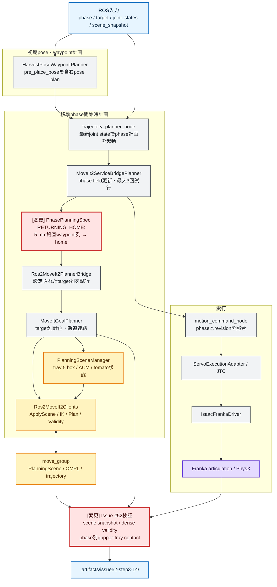
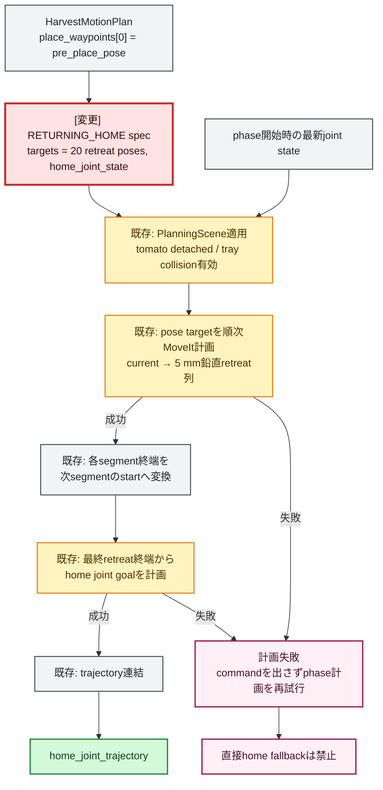

# Step 3-14 RETURNING_HOME trayリブ接触回避の原因調査・実装計画（Issue #52）

**ステータス**: 実装・物理E2E評価完了（物理接触力は10/10で0、厳格なcontact report 0件は未達）

**作成日**: 2026-07-19

**全面改訂日**: 2026-07-20

**対象issue**: [#52](https://github.com/akodama428/trial_issac_sim/issues/52)

**対象ベースライン**: `agent/pre-issue52-motion-planner-refactor` / `1b117e5`

**関連レポート**:

- [Step 3-14 現行motion_plannerアーキテクチャ](step3-14_current_motion_planner_arch.md)
- [Step 3-10 RETURNING_HOME退避時のアーム不安定化・固着の原因調査](step3-10_returning_home_arm_freeze_investigation.md)

---

## 0. 改訂後の結論

Issue #52では、新しいplanner基盤や`RETURNING_HOME`専用executorを追加しない。
現在のリファクタで導入済みの次の共通経路をそのまま利用する。

```text
PhasePlanningSpec.target_sequences
  → Ros2MoveIt2PlannerBridge._plan_configured_phase()
  → MoveItGoalPlanner._plan_phase()
  → targetごとのMoveIt計画
  → concatenate_trajectories()
```

変更の中心は、`RETURNING_HOME`の目標列を次のように変更することである。

```text
変更前:
  phase開始時の最新joint state → home_joint_state

変更後:
  phase開始時の最新joint state
    → place進入時に使用した鉛直waypoint列を逆順に退避
    → pre_place_pose
    → home_joint_state
```

実装時の物理E2Eで、`place_pose → pre_place_pose`を1本のjoint-space区間にすると、
終端poseは安全でも途中のfingerが一度下降してリブへ接触することが分かった。
このため`HarvestPoseWaypointPlanner`は、place直上100 mmを既定5 mm間隔の
21 poseへ分割する。`MOVING_TO_PLACE`は上から下へ、`RETURNING_HOME`は
設置点を除いて下から上へ同じ`place_waypoints`を使用する。

実装前に確認すべき点は「trayがPlanningSceneへ入っているか」だけではない。
move_groupが実際に保持するscene、MoveIt参照軌道、PhysX実軌道・接触を同一runで照合し、
次の境界を切り分ける。

1. PlanningScene上のtrayとIsaac USD上のtrayが一致しているか。
2. MoveIt参照軌道が全区間でcollision-freeか。
3. 参照軌道はcollision-freeでも、追従誤差によって実機体がtrayへ接触していないか。
4. `pre_place_pose`がgripper全体をtrayリブ上端から十分に離す退避点になっているか。

最初に`phase_policy.py`だけを変更した後、Stage 5の物理E2E結果に基づいて
`HarvestPoseWaypointPlanner`の共通place/retreat waypoint生成式も変更した。
最終的な評価と未達条件は「15. 実装・評価結果」に記載する。

---

## 1. 背景と調査対象

Issue #52の現象は、収穫物をtrayへ置いた後、最後の`RETURNING_HOME`で
gripperまたはfingerがtrayのリブへ接触し、ほぼ100%再現するというものである。

Step 3-10では失敗runで`panda_leftfinger`と`PlaceTray/WallRight`の持続接触が
約39〜48件/s、成功runで約2〜3件/sだった。これは接触が単なる一瞬のタッチではなく、
関節追従を妨げるwedgeになり得ることを示す。ただし当時の10姿勢matrixは`/tmp`保存であり、
現在のworkspaceに再利用可能なartifactとして残っていない。

本Stepで回答する問いは次のとおりである。

1. trayのbaseと4つのリブは、move_groupが使用するPlanningSceneへ登録されているか。
2. `RETURNING_HOME`の軌道はPlanningSceneを使ってMoveItが生成しているか。
3. それでもPhysX上で接触する場合、sceneモデル、経路検査、追従のどこに差があるか。
4. 現行共通phase plannerを崩さず、どの目標列を与えれば接触を回避できるか。
5. 回避できなかった場合に危険な直接home復帰へ戻らない失敗処理になっているか。

---

## 2. 今回のスコープ

### 2.1 実装対象

- `RETURNING_HOME`を鉛直retreat waypoint列→`home_joint_state`の順序付き目標列へ変更する。
- `pre_place_pose`がtray上方の安全な退避点か、scene寸法と実軌道で検証する。
- move_groupの実PlanningSceneとACMを保存し、tray障害物の適用を確認する。
- MoveIt参照軌道を高密度に検査し、collision-free判定の抜けを確認する。
- PhysXのgripper/hand/finger対tray接触をphase付きで集計する。
- unit、integration、物理E2Eの合格条件をartifactへ残す。

### 2.2 非対象

- `MotionPlanningCoordinator`、`PolicyRegistry`、`RecipeExecutor`等の新規planner階層。
- `RETURNING_HOME`専用のtrajectory executor。
- JTC、`ServoExecutionAdapter`、`IsaacFrankaDriver`の制御則変更。
- MoveItを迂回する手書き関節補間や無検査Cartesian直線移動。
- trayとの衝突をAllowed Collision Matrixで許可する対応。
- effort command interfaceへの変更。
- Issue #61で不採用としたeffortモード切替の再導入。

---

## 3. 現行リファクタ後アーキテクチャの確認

### 3.1 初期計画とphase計画

現在のplannerは、初期計画時に全phaseの`JointTrajectory`を生成しない。

| タイミング | 入力 | 生成物 |
| --- | --- | --- |
| `TARGET_FOUND` | target estimate、scene snapshot | pose、waypointのみ |
| 各移動phase進入時 | 最新joint state、base frame、scene snapshot、pose plan | 現在phaseの`JointTrajectory`のみ |

`RETURNING_HOME`もphase進入時点の最新joint stateから計画される。
したがって、古い初期関節角から計画していることは今回の直接原因ではない。

### 3.2 phaseごとの差分は設定表へ集約済み

`moveit_bridge/phase_policy.py`の`PhasePlanningSpec`が次を保持する。

- `phase`
- `target_sequences`
- `attach_tomato`
- `allow_gripper_target_contact`
- `failure_reason`
- 必要なphaseだけのjoint fallback成功理由

`MOVING_TO_PLACE`はすでに次の順序付き目標を共通`_plan_phase()`へ渡している。

```text
pre_place_pose → place_pose
```

`RETURNING_HOME`だけが現在、次の単一区間である。

```text
home_joint_state
```

したがってIssue #52で必要なのは新しい処理方式ではなく、
既存の`target_sequences`へ帰路の退避点を設定することである。

### 3.3 共通`_plan_phase()`がすでに備える処理

`MoveItGoalPlanner._plan_phase()`は、順序付きtarget列に対して次を行う。

1. phase用PlanningSceneを適用する。
2. phase開始時の最新joint stateを最初のstart stateにする。
3. `Pose3D` targetはseeded IK、失敗時はpose goal recoveryで計画する。
4. `JointStateSnapshot` targetはIKを行わずjoint goalとして計画する。
5. 各区間の終端joint stateを次区間のstart stateにする。
6. 成功した区間trajectoryを`concatenate_trajectories()`で連結する。
7. 一区間でも失敗した場合はphase計画全体を失敗にする。

この処理は複数のretreat pose→`home_joint_state`をそのまま表現できる。

### 3.4 phase計画失敗時の現在の復旧

`MoveIt2ServiceBridgePlanner.plan_phase_trajectory()`はphase trajectoryを最大3回計画する。
trajectoryがまだ無い場合、`trajectory_planner_node`は一定間隔後にphase計画を再試行する。
`motion_command_node`は現在phaseに一致するtrajectoryが届くまで実行commandを出さない。

Issue #52ではこの再試行を維持し、退避区間の失敗時に
`current → home`へ短絡するfallbackを追加しない。安全経路を作れない場合は停止して再計画する。

---

## 4. tray障害物と原因仮説

### 4.1 コードから確認済みの事実

trayはMoveIt PlanningScene上で次の5個のboxとして生成される。

| MoveIt object ID | 対応物 |
| --- | --- |
| `place_tray_base` | tray底面 |
| `place_tray_wall_front` | リブ1 |
| `place_tray_wall_back` | リブ2 |
| `place_tray_wall_left` | リブ3 |
| `place_tray_wall_right` | リブ4 |

`RETURNING_HOME`のPlanningSceneではtomatoのgripper接触許可を解除し、
trayとの接触を許可しない。`RETURNING_HOME`はtray scene適用後にMoveItへ
joint goalを要求している。このため、コード上は次の2仮説を棄却できる。

- trayがPlanningScene requestへまったく追加されていない。
- `RETURNING_HOME`がMoveItを使わず直接JTCへhomeを送っている。

ただし、requestへ追加したことだけではmove_group内部の最終sceneを証明しない。
`/monitored_planning_scene`または同等の取得結果で、実object pose、寸法、ACMを保存する必要がある。

### 4.2 現在値から見た退避高さの予備計算

現行設定は次のとおりである。

| 項目 | 値 |
| --- | ---: |
| tray基準z | `0.45 m` |
| tray内高さ | `0.05 m` |
| wall厚さ | `0.012 m` |
| MoveIt collision margin | `0.015 m` |
| place TCP z | `0.45 + 0.15 = 0.60 m` |
| pre-place TCP z | `0.60 + 0.10 = 0.70 m` |

MoveItで膨張させたwall上端は現行式では概算`0.521 m`であり、
pre-place TCPとのz差は約`0.179 m`である。
これは退避点候補として十分な可能性が高いが、TCP位置だけでは安全を証明できない。
finger先端、hand、link7のcollision geometryをFKした最下端と、
tray wall上端との距離を計測して最終判断する。

### 4.3 原因仮説と検証順

| 優先度 | 仮説 | 現時点 | 検証 |
| --- | --- | --- | --- |
| 1 | release位置からhomeへの単一区間がtray側方へ抜ける | 最有力 | 現行trajectoryのFKとPhysX contact時刻を重ねる |
| 2 | MoveItとIsaacのgripper collision geometryが一致しない | 有力 | 同一joint stateで両方のAABB/最小距離を比較 |
| 3 | tray boxのpose・寸法・名称対応がIsaacとずれる | 有力 | monitored sceneとUSD world transformを比較 |
| 4 | OMPLの離散edge検査が細いリブとの交差を見落とす | 可能性あり | trajectoryを高密度補間してstate validityを検査 |
| 5 | 参照軌道は安全だが追従誤差でactual pathがtrayへ寄る | 可能性あり | reference/actual両方のFKとcontactを比較 |
| 6 | `RETURNING_HOME`開始時点ですでに接触している | 可能性あり | phase進入直前のPhysX contactとGetStateValidityを比較 |
| 7 | trayが未登録 | request生成上は棄却 | move_group実scene取得で最終確認 |

### 4.4 公式仕様との照合

確認日: 2026-07-20

- MoveItのPlanningSceneはrobot state、robot geometry、world geometryを保持し、
  planning requestのcollision checkingに使用される。
- PlanningSceneへ追加したcollision objectとattached objectは、通常のmotion planningで考慮される。
- OMPLのedge collision checkingは離散的であり、
  `longest_valid_segment_fraction`と`maximum_waypoint_distance`が検査密度へ影響する。
- PlanningSceneのpath validity機能はtrajectory中のstateがcollision-freeかを検証できる。
- Planning Scene Monitorはmove_groupが監視・公開するsceneの確認に使用できる。

一次情報:

- [MoveIt Motion Planning](https://moveit.picknik.ai/main/doc/concepts/motion_planning.html)
- [MoveIt Planning Scene tutorial](https://moveit.picknik.ai/main/doc/examples/planning_scene/planning_scene_tutorial.html)
- [MoveIt OMPL planner collision checking resolution](https://moveit.picknik.ai/main/doc/examples/ompl_interface/ompl_interface_tutorial.html)
- [MoveIt Planning Scene Monitor](https://moveit.picknik.ai/main/doc/concepts/planning_scene_monitor.html)
- [MoveIt PlanningScene API](https://moveit.picknik.ai/main/doc/api/python_api/_autosummary/moveit.core.planning_scene.html)
- [MoveIt `PlanningScene::isPathValid`](https://github.com/moveit/moveit2/blob/main/moveit_core/planning_scene/include/moveit/planning_scene/planning_scene.hpp)

---

## 5. 改訂後の全体アーキテクチャ

変更箇所は赤色かつ`[変更]`表記とする。



### 5.1 依存方向

- phase固有知識は`phase_policy.py`に閉じ込める。
- `phase_planner.py`と`goal_planner.py`は`RETURNING_HOME`というphase名に依存せず、
  渡されたtarget列を実行する。
- MoveIt service message生成と通信は`request_builder.py`、`planning_scene.py`、
  `client.py`の境界内に置く。
- trajectory連結は`trajectory.py`の純粋処理へ任せる。
- PhysX接触観測はplannerの成功判定へ直接混ぜず、評価境界として保存する。

これにより、単一責任と内側のpolicyから外部MoveIt/PhysX境界への依存方向を維持する。

---

## 6. 変更箇所の詳細アーキテクチャ

### 6.1 target列の変更



想定するpolicyの形は次のとおりである。

```python
# 最終実装の要点。
retreat_targets = tuple(reversed(plan.place_waypoints[:-1]))
return_home_sequences = (
    ((*retreat_targets, home_joint_state()),)
    if retreat_targets
    else ()
)
```

`place_waypoints`が無い互換planでは、`home_joint_state()`だけへ縮退しない。
空の候補列によって`home_plan_failed`とし、上位のphase-entry再試行へ戻す。

### 6.2 waypointの正本

退避poseを新しい`home_retreat_waypoints` fieldへ複製しない。

| 用途 | 使用する正本 |
| --- | --- |
| trayへの進入 | `plan.place_waypoints`を上空から設置点へ順方向 |
| trayからの退避 | 設置点を除く`plan.place_waypoints`を逆方向→`home_joint_state` |

現行`pre_place_pose`が安全余裕を満たさない場合は、
`HarvestPoseWaypointPlanner`で生成する一つの`pre_place_pose`を修正し、
往路と復路の双方へ反映する。

安全高さは単なるTCP zではなく、少なくとも次を含めて決定する。

```text
retreat clearance
  = gripper collision geometryの最下端
    - MoveItでmarginを含めたtray wall上端
```

合格条件は全tray wallに対して正の距離を持ち、
さらに追従誤差とモデル差を吸収する設計margin以上であることとする。
marginの最終値はbaseline rosbagの最大TCP/関節追従偏差をFKへ反映して決定し、
根拠なく新しい固定値を追加しない。

### 6.3 PlanningSceneとACM

`RETURNING_HOME`では次を満たす。

- tomatoはattached objectではない。
- GRASP phaseだけに許可したgripper-target接触は解除済みである。
- tray 5 objectはworld collision objectとして存在する。
- gripper/hand/fingerとtrayのpairはACMで許可しない。
- scene適用失敗時はmotion planningを行わない。

move_groupの実scene保存では、最低限次を記録する。

- world collision object ID
- object primitive寸法とpose
- robot state
- attached collision object
- ACMのtray関連entry
- scene取得時刻とphase

### 6.4 軌道validityの検証

既存`Ros2MoveIt2Clients.check_state_validity()`は失敗時のstart state診断に使用している。
Issue #52では同じ境界を再利用し、計画成功時のtrajectoryも高密度サンプリングする。

検証用処理は次の順で行う。

1. trajectoryの各隣接点間を、設定した最大joint step以下になるよう補間する。
2. 補間stateごとに`/check_state_validity`へ問い合わせる。
3. invalid stateの時刻、関節角、contact pairを保存する。
4. 検査service失敗とcollision invalidを別の結果として扱う。
5. 未検査をvalidとして扱わない。

この診断はまず評価用とし、通常実行のplanner責務へ無条件に組み込まない。
OMPL分解能の変更は、密検査で「MoveItが返したedgeの途中にinvalid stateがある」と
確認できた場合だけA/Bする。

### 6.5 PhysX接触の検証

既存`IsaacPhysicsHarvestBridge`はPhysX contact reportを購読し、
gripper/hand/finger対trayの接触力積を集計できる。
Issue #52評価ではこれをphaseと時刻へ関連付け、次を保存する。

- actor pair
- contact開始・終了時刻
- phase
- impulseとphysics dtから換算したforce
- 同時刻のactual joint position/velocity
- 同時刻のreference joint position/velocity

「接触件数が減った」だけでなく、`RETURNING_HOME`中の対象pair接触が0であることを
最終合格条件とする。

---

## 7. モジュール責務と変更範囲

| モジュール | 現在の責務 | Step 3-14での扱い |
| --- | --- | --- |
| `harvest_pose_planner.py` | target/trayからpose・waypoint生成 | 原則変更なし。現行退避高さ不足が実測された場合のみ共通`pre_place_pose`式を変更 |
| `moveit_bridge/phase_policy.py` | phaseごとのtarget列、attach、接触許可を定義 | **変更済み**。`RETURNING_HOME`へ逆順retreat列とhomeを設定 |
| `moveit_bridge/phase_planner.py` | spec候補列の試行と結果生成 | 変更なし |
| `moveit_bridge/goal_planner.py` | scene適用、target別計画、区間連結、失敗診断 | 基本変更なし。成功trajectory密検査を常設するなら小さなhookのみ |
| `moveit_bridge/planning_scene.py` | tray/tomato/ACMをMoveIt sceneへ変換 | 原則変更なし。実scene比較で差異が出た場合のみ修正 |
| `moveit_bridge/client.py` | MoveIt service通信 | 既存state validityを再利用。scene取得に不足があれば診断用read APIを追加 |
| `trajectory.py` | trajectoryの変換・連結 | 実行機能は変更なし。診断用補間は純粋関数として追加候補 |
| `planning_diagnostics.py` | planning失敗時の証跡保存 | 成功trajectory validity保存を追加する場合は責務名・型を一般化 |
| `physics_harvest.py` / `physics_observation.py` | PhysX接触観測・集計 | phase別gripper-tray接触artifactに不足する情報だけ追加 |
| `trajectory_planner_node.py` | phase開始時計画と再試行 | 変更なし |
| `motion_command_node` | phase/revision整合後に実行 | 変更なし |

### 7.1 変更予定ファイル

必須:

- `src/tomato_harvest_sim/robot/motion_planner/moveit_bridge/phase_policy.py`
- `src/tomato_harvest_sim/robot/motion_planner/tests/test_moveit_planner_backend.py`
- 本レポートの評価結果追記

調査結果に応じて変更:

- `src/tomato_harvest_sim/robot/motion_planner/harvest_pose_planner.py`
- `src/tomato_harvest_sim/robot/motion_planner/planning_diagnostics.py`
- `src/tomato_harvest_sim/robot/motion_planner/moveit_bridge/client.py`
- `src/tomato_harvest_sim/robot/motion_planner/moveit_bridge/trajectory.py`
- `src/tomato_harvest_sim/simulator/physics_harvest.py`
- `src/tomato_harvest_sim/simulator/physics_observation.py`
- 対応するunit test、E2E集計script

変更しない予定:

- behavior phase machine
- `HarvestMotionPlan`のfield構成
- execute manager
- Servo/JTC/Isaac driver

---

## 8. 実装手順

### Stage 0: baselineをIssue #52 artifactとして固定

1. 現行`current → home`でE2Eを再実行する。
2. phase、joint reference/actual、robot log、MoveIt log、PhysX contactを保存する。
3. `RETURNING_HOME`開始時、初回接触時、終了またはstall時を同じ時刻軸へ揃える。
4. move_groupの実PlanningSceneとACMを保存する。
5. `current → home`参照trajectoryを高密度state validity検査する。

このStageの目的は、リファクタ後もIssue #52が再現することと、
接触原因がreference pathかactual trackingかを判定できる証拠を作ることである。

### Stage 1: policyをTDDで変更

先に次のunit testを失敗させる。

- `RETURNING_HOME.target_sequences`が、設置点を除いた
  `place_waypoints`の逆順列と`home_joint_state()`である。
- `place_waypoints`が無い場合に直接homeへ縮退しない。
- `RETURNING_HOME`で`attach_tomato=False`を維持する。
- `allow_gripper_target_contact=False`を維持する。
- 他phaseのtarget列が変わらない。

その後、`phase_policy.py`だけを最小変更する。

### Stage 2: 共通target実行のintegration test

既存のfake bridge/clientを用いて次を確認する。

1. 最初のretreat segmentはphase開始時の最新joint stateから計画される。
2. 各segmentは直前segment終端から計画され、最後にhome joint goalを計画する。
3. PlanningSceneはtray collision有効で適用される。
4. 全segmentのtrajectoryが時刻単調増加で連結される。
5. いずれかのsegment失敗時は結果全体が`home_plan_failed`になる。
6. 失敗時に直接homeの追加attemptを行わない。
7. 上位のphase-entry再試行後に成功できる。

### Stage 3: waypoint安全余裕を判定

`pre_place_pose`で次を測る。

- MoveIt collision geometryのgripper最下端と全tray wall上端の距離
- Isaac collision geometryのgripper最下端と全tray wall上端の距離
- baseline最大追従偏差を加味した最悪距離

全条件を満たす場合は`HarvestPoseWaypointPlanner`を変更しない。
不足する場合だけ、既存`placement.release_pose.hover_offset_m`または
明示的なclearance設定へ根拠付きで変更し、place進入とreturn退避の双方で同じ値を使う。

### Stage 4: A/B物理E2E

同一scene seed・同一physics設定で比較する。

| 条件 | RETURNING_HOME target列 | 用途 |
| --- | --- | --- |
| A | `home_joint_state` | baseline |
| B | canonical retreat waypoint列→`home_joint_state` | 提案変更 |

まず各条件3回で診断を確認し、Bが安定した後に10回連続評価する。
初期姿勢依存を避けるため、必要に応じてStep 3-10の姿勢matrixも再作成して追加評価する。

### Stage 5: 必要な場合だけ二次対策

次の順序で限定的に追加する。

1. monitored PlanningSceneとUSDの差異がある場合、geometry変換を修正する。
2. 密検査だけでcollisionが見つかる場合、OMPL collision resolutionをA/Bする。
3. referenceは安全だがactualだけ接触する場合、retreat clearanceを追従誤差分だけ増やす。
4. それでも接触する場合、gripper collision primitiveの保守包絡を見直す。

複数対策を同時投入せず、各変更の寄与をartifactで分離する。

---

## 9. テスト計画

### 9.1 unit test

| ID | 対象 | 確認 |
| --- | --- | --- |
| UT-01 | `phase_planning_specs` | return homeがpre-place→home |
| UT-02 | `phase_planning_specs` | waypoint欠落時に直接homeへ縮退しない |
| UT-03 | phase policy | tomato detached、tray contact非許可 |
| UT-04 | `_plan_phase` | pose target後の終端がhome segment startになる |
| UT-05 | trajectory連結 | joint名、時刻、位置・速度の整合 |
| UT-06 | failure | 各segment失敗が全体失敗になる |
| UT-07 | validity補間を追加する場合 | 最大joint stepと端点を保証 |
| UT-08 | PhysX集計を変更する場合 | gripper-tray pairだけをphase別に集計 |

### 9.2 integration test

| ID | 確認 |
| --- | --- |
| IT-01 | RETURNING_HOME進入後に最新joint stateから多段retreatとhomeが計画される |
| IT-02 | 生成planの`planned_from_phase`が`returning_home` |
| IT-03 | phase plan受信前にmotion commandが出ない |
| IT-04 | tray 5 objectがscene requestに存在する |
| IT-05 | tray関連pairがACMで許可されていない |
| IT-06 | segment失敗後にphase retryが動作し、危険な直接homeを実行しない |

### 9.3 E2E観察項目

- harvest cycleが`COMPLETE`へ到達したか。
- `RETURNING_HOME`の計画成功回数、失敗回数、retry回数。
- target列と各segmentの点数・所要時間。
- MoveIt高密度validityのinvalid state数とcontact pair。
- `panda_hand`、左右finger対trayのPhysX接触回数・継続時間・最大force。
- referenceとactualの最大関節位置誤差・速度誤差。
- retreat waypoint通過時のgripper/tray最小距離。
- stall、abort、古いrevision採用、trajectory欠落の有無。

---

## 10. artifact計画

### 10.1 既存artifact

以下は同じworkspace内で参照できる既存資料である。
`.artifacts`はGit管理外のため、GitHub上ではリンク切れになる。

- [手動GUI robot log](../../../.artifacts/manual-gui/robot_node.log)
- [手動GUI simulator/controller統合log](../../../.artifacts/manual-gui/run_ros2_components.log)
- [手動GUI rosbag metadata](../../../.artifacts/manual-gui/home_divergence_bag_20260718_010824/metadata.yaml)
- [Step 3-13 position-velocity E2E robot log](../../../.artifacts/issue61-step3-13/position-velocity-1600/e2e/robot_node.log)
- [Step 3-13 position-velocity rosbag metadata](../../../.artifacts/issue61-step3-13/position-velocity-1600/e2e/home_divergence_bag/metadata.yaml)

リファクタ修正後に3回の物理E2E完走は確認済みだが、そのlogは一時的な`/tmp`保存である。
これはphase plannerの安定性baselineであり、Issue #52の接触解消証跡には使用しない。

### 10.2 Step 3-14で新規保存する構成

```text
.artifacts/issue52-step3-14/
├── baseline-direct-home/
│   └── <run-id>/
├── via-pre-place/
│   └── <run-id>/
└── comparison/
    ├── summary.json
    ├── summary.csv
    └── plots/
```

各`<run-id>`には次を保存する。

```text
robot_node.log
move_group.log
run_ros2_components.log
rosbag2/
planning_scene.json
allowed_collision_matrix.json
planned_trajectory.json
trajectory_state_validity.csv
physx_gripper_tray_contacts.csv
metrics.json
```

artifact内の`metrics.json`にはcommit、scene config hash、実行command、
simulator/MoveIt version、開始・終了時刻を含める。

---

## 11. 完了条件

### 11.1 機能

- `RETURNING_HOME`が最新joint stateから
  canonical retreat waypoint列→`home_joint_state`をMoveItで計画する。
- `HarvestMotionPlan`へ新しいphase専用waypoint fieldを増やさない。
- `RETURNING_HOME`専用executor、strategy、coordinatorを増やさない。
- どちらかのsegmentが失敗した場合、直接homeへfallbackしない。
- 計画成功後だけ対応phaseのtrajectoryを実行する。

### 11.2 PlanningScene

- move_group実sceneにtray 5 objectが存在する。
- tray objectのpose・寸法がIsaac USDのworld geometryと許容差内で一致する。
- tray関連gripper pairがACMで許可されていない。
- reference trajectoryの高密度state validityが全点validである。
- validity未確認をvalidとして集計しない。

### 11.3 物理E2E

- B条件が10/10 cycleで`COMPLETE`へ到達する。
- 10 cycleすべてで`RETURNING_HOME`中のgripper/hand/finger対tray接触が0件。
- stall、abort、永久的なphase plan欠落が0件。
- retreat通過時の最小距離が決定した安全margin以上。
- tracking errorがbaselineから悪化していない。
- 上記を再現可能なartifactと集計結果が残る。

### 11.4 回帰

- 全unit/integration testが成功する。
- `MOVING_TO_PREGRASP`、`MOVING_TO_GRASP`、`DETACHING`、
  `MOVING_TO_PLACE`のtarget列と接触policyが変わらない。
- tomato配置成功判定とGRASP専用ACMが維持される。

---

## 12. 要件

| 要件ID | 要件 |
| --- | --- |
| S3-14-REQ-01 | RETURNING_HOMEはphase開始時の最新joint stateから計画する |
| S3-14-REQ-02 | trayから離れる退避poseを経由してからhomeへ移動する |
| S3-14-REQ-03 | 退避とhomeの両区間をtray入りPlanningSceneでMoveIt計画する |
| S3-14-REQ-04 | 退避計画失敗時に直接homeへ縮退しない |
| S3-14-REQ-05 | place進入とreturn退避は同一のcanonical waypointを使用する |
| S3-14-REQ-06 | move_group実sceneとACMをartifactで確認できる |
| S3-14-REQ-07 | reference validityとPhysX actual contactを同一runで比較できる |
| S3-14-REQ-08 | RETURNING_HOME中のgripper-tray接触を0にする |
| S3-14-REQ-09 | 現行共通phase plannerの責務分離を維持する |
| S3-14-REQ-10 | 評価結果を本レポートとIssue #52 artifactへ残す |

### 12.1 要件とモジュールの対応

| モジュール | 対応要件 |
| --- | --- |
| `HarvestPoseWaypointPlanner` | REQ-02、REQ-05 |
| `PhasePlanningSpec` / `phase_policy.py` | REQ-02、REQ-04、REQ-05、REQ-09 |
| `Ros2MoveIt2PlannerBridge` | REQ-01、REQ-03、REQ-04 |
| `MoveItGoalPlanner` | REQ-01、REQ-03、REQ-07、REQ-09 |
| `PlanningSceneManager` / `Ros2MoveIt2Clients` | REQ-03、REQ-06、REQ-07 |
| `planning_diagnostics.py` | REQ-06、REQ-07、REQ-10 |
| `IsaacPhysicsHarvestBridge` / `physics_observation.py` | REQ-07、REQ-08、REQ-10 |
| E2E集計script | REQ-08、REQ-10 |

---

## 13. 設計判断

### 13.1 採用

- 現行`PhasePlanningSpec`へtarget列を追加する。
- `pre_place_pose`をplace進入とreturn退避で共有する。
- 各segmentは既存`_plan_phase()`でMoveIt計画し、既存処理で連結する。
- 計画失敗時はfail closedで再計画する。
- geometry、collision resolution、clearance調整は計測結果に応じて段階導入する。

### 13.2 不採用

| 案 | 不採用理由 |
| --- | --- |
| RETURNING_HOME専用planner class | 共通target列plannerと責務が重複する |
| 新規Coordinator/Registry/Recipe階層 | 現行`PhasePlanningSpec`と`_plan_phase()`ですでに表現できる |
| `home_retreat_waypoints` field追加 | `place_waypoints[0]`と同じ幾何情報を二重管理する |
| MoveItを通さないCartesian退避 | tray collision検査を迂回する |
| 退避失敗時の直接home fallback | Issue #52の危険経路を再実行する |
| tray collisionのACM許可 | 接触を回避せず、計画上見えなくするだけである |
| 最初からOMPL分解能を全体変更 | 原因未確定のまま全phaseの計画時間へ影響する |

---

## 14. 実装開始時のチェックリスト

- [x] baseline commitとdirty worktreeを記録する。
- [x] Issue #52専用artifact directoryを作る。
- [x] 変更前E2Eで接触を再現し、phase付きcontactを保存する。
- [ ] move_group実PlanningSceneとACMを保存する。
- [ ] 変更前trajectoryを高密度state validity検査する。
- [x] `RETURNING_HOME` target列のunit testを先に追加する。
- [x] `phase_policy.py`を最小変更する。
- [x] 多段計画・連結・fail-closedのintegration testを追加する。
- [ ] pre-placeでのMoveIt/PhysX clearanceを測定する。
- [x] A/B E2Eを段階的に実行する。
- [x] B条件を10回連続評価する。
- [x] artifactリンクと評価結果を本レポートへ追記する。
- [ ] 完了条件を満たした後にIssue #52をcloseする。

---

## 15. 実装・評価結果（2026-07-20）

### 15.1 実装結果

最初に計画どおり、`RETURNING_HOME`を直接homeへ計画せず、
place進入用waypointを逆向きに通ってからhomeへ移動するよう変更した。
ただし物理E2Eにより、単一の`pre_place_pose`を追加するだけでは不十分と判明した。

最終実装は次のとおりである。

1. `HarvestPoseWaypointPlanner`が、place直上の100 mmを既定5 mm間隔の
   21 poseとして`place_waypoints`へ生成する。
2. `MOVING_TO_PLACE`は21 poseを上空から設置点へ順方向に使用する。
3. `RETURNING_HOME`は現在位置と重複する設置点を除き、
   残り20 poseを逆順に使用してから`home_joint_state()`へ移動する。
4. 往路・復路とも同じcanonical waypointを使い、
   `HarvestMotionPlan`へRETURNING_HOME専用fieldを追加しない。
5. waypoint欠落時は直接homeへfallbackせず、`home_plan_failed`として
   上位のphase計画再試行へ戻す。
6. 各pose区間は既存のMoveIt計画、PlanningScene適用、trajectory連結を通す。

変更ファイル:

- `src/tomato_harvest_sim/robot/motion_planner/harvest_pose_planner.py`
- `src/tomato_harvest_sim/robot/motion_planner/moveit_bridge/phase_policy.py`
- `src/tomato_harvest_sim/robot/motion_planner/tests/test_harvest_pose_planner.py`
- `src/tomato_harvest_sim/robot/motion_planner/tests/test_moveit_planner_backend.py`

### 15.2 TDD・回帰テスト

先に次の失敗を確認した。

- 変更前の`RETURNING_HOME`が`home_joint_state()`だけを持つ。
- 変更前のplace waypointが100 mmの単一区間である。
- 25 mm候補に対し、5 mm上限を要求するテストが失敗する。

実装後の結果:

```text
PYTHONPATH=src:. pytest -q
347 passed, 2 skipped in 0.46s

python3 -m py_compile \
  src/tomato_harvest_sim/robot/motion_planner/harvest_pose_planner.py \
  src/tomato_harvest_sim/robot/motion_planner/moveit_bridge/phase_policy.py
成功

git diff --check
成功
```

unit/integration testでは次を確認した。

- place waypointの両端がz=`0.70 m`、`0.60 m`である。
- 隣接poseのz差が最大`0.005 m`である。
- `MOVING_TO_PLACE`がcanonical waypoint列を順方向に使う。
- `RETURNING_HOME`が設置点を除いた同じ列を逆方向に使う。
- pose区間終端が次の区間のstart joint stateになる。
- waypoint欠落時に直接homeへ縮退しない。
- tomato attachとgripper-target ACMのphase policyを維持する。

### 15.3 物理E2Eの実行条件

全条件で次の基本設定を使用した。

```bash
CI_HEADLESS_STEPS=3600
CI_E2E_TIMEOUT_SEC=2400
CI_RECORD_HOME_DIVERGENCE_BAG=1
TOMATO_HARVEST_DEBUG_PHYSICS_GRASP=1
TOMATO_HARVEST_DEBUG_TRAJECTORY=1
bash scripts/ci/run_e2e.sh
```

各runではIsaac Sim、MoveIt、ros2_controlを新規起動し、
robot/controller/move_group/統合consoleログとMCAP rosbagを保存した。
接触評価はconsole中の
`panda_hand|panda_leftfinger|panda_rightfinger`対`PlaceTray`通知件数と、
全`PhysicsObs`の`trayF`を別々に集計した。

### 15.4 段階評価

| 条件 | waypoint | run数 | COMPLETE | contact report 0 | `trayF > 0` 0 | 最大`trayF` | RETURNING_HOME計画時間 |
| --- | --- | ---: | ---: | ---: | ---: | ---: | ---: |
| baseline | current → home | 1 | 1/1 | 0/1（27件） | 0/1（9 sample） | 1345.8306 N | 16.823 ms |
| 単段退避 | pre-place → home | 1 | 1/1 | 0/1（21件） | 0/1（7 sample） | 241.4425 N | 30.773 ms |
| 25 mm多段 | 4 retreat segment → home | 10 | 10/10 | 8/10 | 9/10 | 618.0836 N | 60.505–81.692 ms |
| 5 mm多段 | 20 retreat segment → home | 10 | 10/10 | 6/10 | **10/10** | **0 N** | 237.243–281.140 ms |

単段退避はbaseline比で最大接触力を約82%低下させたが、接触は残った。
25 mm多段は多くのrunで接触を消したものの、run 5で
24 contact report、9 nonzero-force sample、最大618.0836 Nを観測した。

失敗runのtrajectory debugを時系列で確認すると、上方poseへ向かう計画にもかかわらず、
最初のjoint-space区間で実finger zが約`0.5559 m`から`0.5425 m`へ
約13 mm下降してから上昇していた。このとき
`panda_leftfinger`と`PlaceTray/WallRight`が接触している。
したがって原因は「pre-place終端高さの不足」だけではなく、
pose終端間を結ぶjoint-space軌道の中間形状である。

この実測を根拠に区間上限を5 mmへ狭めた結果、10/10 runで
nonzeroのPhysX接触力を消し、全cycleが`COMPLETE`へ到達した。
一方、4 runでは2〜9件の`panda_leftfinger–WallRight` contact reportが残った。
これらの通知に対応する`PhysicsObs.trayF`はすべて`0.0000 N`であり、
押し込みや力積は観測されていない。

### 15.5 5 mm候補の10回結果

| run | COMPLETE | contact report | nonzero `trayF` sample | 最大`trayF` | 計画時間 |
| ---: | ---: | ---: | ---: | ---: | ---: |
| 1 | yes | 0 | 0 | 0 N | 267.978 ms |
| 2 | yes | 0 | 0 | 0 N | 248.589 ms |
| 3 | yes | 0 | 0 | 0 N | 262.578 ms |
| 4 | yes | 2 | 0 | 0 N | 272.377 ms |
| 5 | yes | 0 | 0 | 0 N | 278.651 ms |
| 6 | yes | 9 | 0 | 0 N | 237.243 ms |
| 7 | yes | 5 | 0 | 0 N | 279.955 ms |
| 8 | yes | 0 | 0 | 0 N | 279.955 ms |
| 9 | yes | 0 | 0 | 0 N | 281.140 ms |
| 10 | yes | 9 | 0 | 0 N | 258.277 ms |

平均RETURNING_HOME計画時間は`266.674 ms`である。
baselineより約250 ms増えたが、全runでphase-entry計画は成功し、
timeout、stall、abort、永久的なtrajectory欠落はなかった。

### 15.6 artifact

主要証跡:

- [baseline robot log](../../../.artifacts/issue52-step3-14/baseline-direct-home/run-1/e2e/robot_node.log)
- [baseline統合console](../../../.artifacts/issue52-step3-14/baseline-direct-home/run-1/e2e/docker-e2e-console.log)
- [baseline rosbag metadata](../../../.artifacts/issue52-step3-14/baseline-direct-home/run-1/e2e/home_divergence_bag/metadata.yaml)
- [単段退避 robot log](../../../.artifacts/issue52-step3-14/via-pre-place/run-1/e2e/robot_node.log)
- [単段退避統合console](../../../.artifacts/issue52-step3-14/via-pre-place/run-1/e2e/docker-e2e-console.log)
- [25 mm run 5統合console](../../../.artifacts/issue52-step3-14/via-staged-retreat/run-5/e2e/docker-e2e-console.log)
- [5 mm run 1 robot log](../../../.artifacts/issue52-step3-14/via-staged-retreat-5mm/run-1/e2e/robot_node.log)
- [5 mm run 1統合console](../../../.artifacts/issue52-step3-14/via-staged-retreat-5mm/run-1/e2e/docker-e2e-console.log)
- [5 mm run 1 rosbag metadata](../../../.artifacts/issue52-step3-14/via-staged-retreat-5mm/run-1/e2e/home_divergence_bag/metadata.yaml)
- [5 mm run 10 robot log](../../../.artifacts/issue52-step3-14/via-staged-retreat-5mm/run-10/e2e/robot_node.log)
- [5 mm run 10統合console](../../../.artifacts/issue52-step3-14/via-staged-retreat-5mm/run-10/e2e/docker-e2e-console.log)
- [5 mm run 10 rosbag metadata](../../../.artifacts/issue52-step3-14/via-staged-retreat-5mm/run-10/e2e/home_divergence_bag/metadata.yaml)

`.artifacts`はGit管理外であるため、これらの相対リンクは同じworkspace内でのみ有効である。

### 15.7 完了条件の判定

| 完了条件 | 結果 | 判定 |
| --- | --- | --- |
| 最新joint stateからphase-entry計画 | 全runの`phase_plan_completed`で確認 | 合格 |
| canonical waypointを往復共有 | unit/integration testで確認 | 合格 |
| 直接home fallback禁止 | waypoint欠落testとcall引数で確認 | 合格 |
| 10/10 `COMPLETE` | 5 mm条件で10/10 | 合格 |
| 10/10 nonzero PhysX接触力0 | 5 mm条件で10/10、最大0 N | 合格 |
| 10/10 contact report 0件 | 6/10。4 runでゼロ力通知あり | **未達** |
| move_group実PlanningScene/ACM保存 | 今回のartifactには未保存 | **未実施** |
| reference trajectory高密度validity | 未実施 | **未実施** |
| unit/integration回帰 | 347 passed、2 skipped | 合格 |

### 15.8 結論と残課題

今回の実装により、Issue #52で問題となったtrayリブへの物理的な押し込みは、
直接homeの最大1345.8306 Nから、5 mm多段条件の10/10で0 Nへ改善した。
全cycleも10/10で完走している。

ただし、本レポートが定義した厳格な完了条件
「RETURNING_HOME中のcontact report自体が10/10で0件」は満たしていない。
また、move_group内部のPlanningScene/ACM取得と高密度state validity検査も
今回の実行artifactには含まれていない。したがって本評価だけを根拠に
Issue #52を完全closeとは判定しない。

次の調査では、ゼロ力contact reportがPhysXの接触近接通知なのか、
MoveItとIsaacのfinger/tray collision geometry差による実際の接触なのかを、
同一joint stateのgeometry比較とPlanningScene取得で切り分ける。
その結果、参照軌道の幾何学的clearance不足が確認された場合は、
waypoint数をさらに増やすのではなく、tray中心からWallRightと反対側へ逃がす
canonical retreat geometry、またはMoveIt Cartesian pathの採用を比較する。
