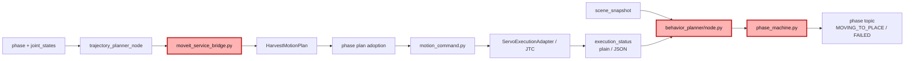
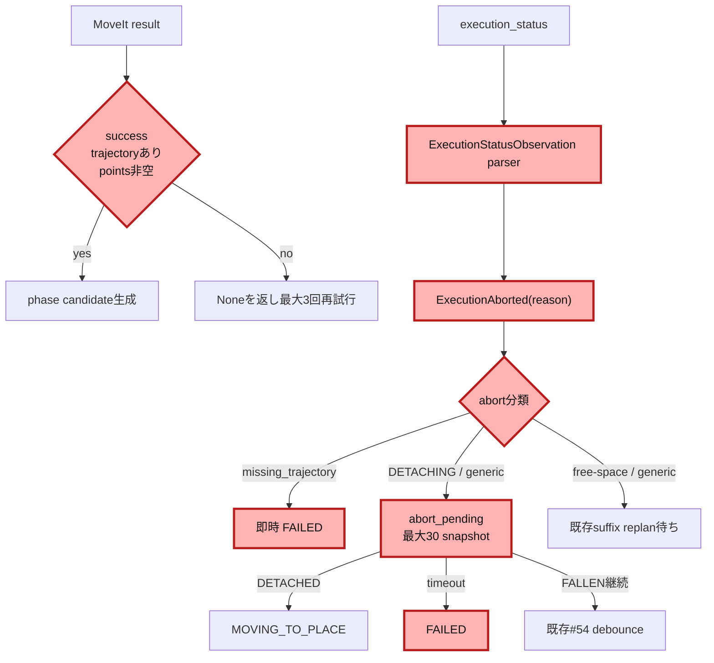
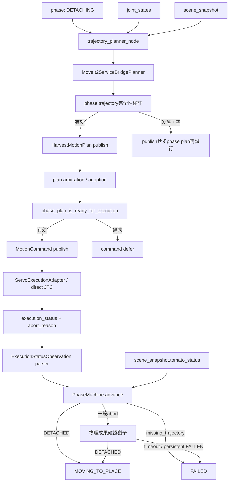

# Step 3-16 Issue #58 DETACHING abortレジリエンス実装計画

**ステータス**: 実装・評価完了

**作成日**: 2026-07-20

**対象issue**: [#58 DETACHING縮退replanのレジリエンス欠陥](https://github.com/akodama428/trial_issac_sim/issues/58)

**対象ベースライン**: `main` / `334e8d8120e3bdce79cdc8facc10f76f02f6db58`

**関連レポート**:

- [Step 3-11 direct JTC trajectory execution](step3-11_direct_jtc_trajectory_execution.md)
- [Step 3-12 grasp direct JTC A/B](step3-12_grasp_direct_jtc_ab_experiment.md)
- [Step 3-14 現行motion planner architecture](step3-14_current_motion_planner_arch.md)
- [Step 3-15 Issue #53 / #54 / #58 マージ後確認](step3-15_issue53_54_58_post_merge_status.md)

---

## 全体アーキテクチャ



赤色はStep 3-16で変更したモジュールを示す。既存のplan adoptionと
motion command境界は変更せず、回帰testを追加してfail-closed契約を固定した。

## 変更モジュールの詳細変更アーキテクチャ



## 0. 結論

Issue #58をそのまま旧実装へ当てはめて「missing trajectoryの連続回数だけを数える」変更は行わない。
PR #64のphase開始時計画リファクタにより、元の高速ループを作った次の経路はすでに遮断されている。

```text
pull軌道なしplanをpublish
  → motion command化
  → adapterがmissing_trajectory abort
  → full-chain replan
  → 同じ欠落planをpublish
```

現行実装は次の三段でfail-closedにする。

1. phase plannerは`success`かつtrajectory非Noneの場合だけcandidate planを返す。
2. trajectory plannerは対象phase trajectoryがNoneまたは空のcandidateを採用しない。
3. motion commandは同一`planned_from_phase`の非空trajectoryが届くまでpublishしない。

一方で、DETACHINGの有効なpull trajectoryを実行した後にabortした場合は、
次の新しい停止条件が残る。

```text
DETACHING execution abort
  → behavior plannerは同phaseでreplan待ち
  → DETACHINGは接触支配phaseなのでsuffix replan対象外
  → DETACHEDが観測されなければ永久待機
```

したがってStep 3-16では、#58の受け入れ条件を
「pull軌道欠落による高速ループを防ぐ」から、次の有限終端契約として具体化する。

- 欠落または空のphase trajectoryを実行境界へ通さない。
- `missing_trajectory`が実行系から来た場合は内部契約違反として即時FAILEDにする。
- DETACHINGの一般abortは短い物理成果確認猶予を設ける。
- 猶予中に`DETACHED`を観測した場合は正常にMOVING_TO_PLACEへ進む。
- 猶予内に成果を観測できなければFAILEDへ終端し、永久待機しない。

実装責務は、plan完全性をmotion planner / execute manager、
abort後のtask終端をbehavior plannerへ分離する。

---

## 1. 入出力、振る舞い

### 1.1 入力信号

- `/tomato_harvest/phase`
  - 現在の`HarvestTaskPhase`。
  - DETACHING進入時にphase plannerとmotion commandの対象trajectoryを決める。
- `/tomato_harvest/harvest_motion_plan`
  - phase別pose、waypoint、`JointTrajectory`、plan revision、
    `planned_from_phase`を持つ。
  - DETACHINGでは`pull_joint_trajectory`が実行に必須である。
- `/joint_states`
  - phase開始時計画のstart state、および停止commandの現在関節状態。
- `/tomato_harvest/motion_command`
  - 実行する`MotionCommand`。
  - FOLLOW_TRAJECTORYでは非空`joint_trajectory`が必要である。
- `/tomato_harvest/execution_status`
  - `running`、`succeeded`、`aborted`。
  - JSON形式では`abort_reason`、tracking error等を含む。
  - 旧plain文字列との互換を維持する。
- `/tomato_harvest/trajectory_status`
  - execution statusをplanner向けに変換した状態。
  - 自由空間phaseのsuffix replan triggerに利用する。
- `/tomato_harvest/scene_snapshot`
  - `tomato_status`を含む物理成果観測。
  - DETACHINGでは`DETACHED`がJTC結果より優先される正常完了条件である。

### 1.2 出力信号

- `/tomato_harvest/harvest_motion_plan`
  - 対象phaseの非空trajectoryを含む場合だけ新revisionをpublishする。
- `/tomato_harvest/motion_command`
  - 同一phase用の実行可能planが採用済みの場合だけpublishする。
- `/tomato_harvest/execution_status`
  - adapterは実行結果と`abort_reason`をpublishする。
- `/tomato_harvest/phase`
  - DETACHING成果成功時はMOVING_TO_PLACE。
  - plan契約違反、またはabort猶予timeout時はFAILED。
- `MOVEIT_METRIC`
  - plan拒否、abort分類、物理成果猶予、終端理由を保存する。

### 1.3 モジュール内の処理概要

正常系:

```text
DETACHING進入
  → 最新joint stateからpull trajectoryを計画
  → 非空trajectoryを検証・plan採用
  → motion command publish
  → pull実行
  → snapshotでDETACHED
  → MOVING_TO_PLACE
```

phase計画失敗:

```text
DETACHING進入
  → MoveIt失敗、None、または空trajectory
  → planをpublishしない
  → motion commandもpublishしない
  → 1秒間隔でphase planを再試行
```

`missing_trajectory` fault:

```text
execution_status(aborted, reason=missing_trajectory)
  → status parserがreasonを保持
  → phase state machineが内部契約違反と分類
  → 即時FAILED
  → 同じcommandを再publishしない
```

DETACHING一般abort:

```text
execution_status(aborted, reason≠missing_trajectory)
  → DETACHING abort pending
  → snapshot猶予中:
       DETACHED → MOVING_TO_PLACE
       FALLEN継続 → 既存#54規則でFAILED
       成果なし → counter加算
  → 猶予上限 → FAILED
```

### 1.4 現時点の不明点

- Issue #58の元artifactは一時領域で、PR #64後の現行コードに対する同一fault replayはない。
- 旧full-chain plannerが`success=true`かつpull欠落planを返した正確な分岐は、
  大規模リファクタで削除済みのため現行コードから直接再現できない。
- DETACHING abort後に物理`DETACHED`が遅れて観測される最大tick数は、
  保存済みartifactだけでは上限を確定できない。

このため実装時は、まず現行コードのfault injectionを追加し、
abortから`DETACHED`観測までの実測分布をE2E artifactへ保存する。

---

## 2. モジュール内の構成



### 2.1 `MoveIt2ServiceBridgePlanner`

- phase開始時の最新joint stateから当該phase trajectoryだけを生成する。
- `MoveIt2PlanningResult.success`とtrajectory実体を両方検査する。
- 計画失敗を欠落planへ縮退させず`None`として上位へ返す。

### 2.2 `phase_suffix_replan.py`

- phaseとtrajectory fieldの対応を単一表で保持する。
- `evaluate_phase_plan_update()`で対象phase trajectoryの存在とpoint数を検査する。
- DETACHINGはphase-entry planning対象だが、abort後のsuffix replan対象外にする。
- 接触状態からの再計画を暗黙に有効化しない。

### 2.3 `motion_command.py`

- `planned_from_phase`が現在phaseと一致することを要求する。
- FOLLOW_TRAJECTORY phaseでは非空trajectoryを要求する。
- 無効planではcommandを生成・publishしない。
- adapterをplan完全性の主検証者にしない。

### 2.4 `servo_execution_adapter.py`

- 最終防御としてtrajectory欠落を`missing_trajectory` abortで報告する。
- 欠落commandのretry回数やtask phaseを所有しない。
- 同じinvalid commandを自己再送しない。

### 2.5 execution status parser

- plain statusとJSON statusを正規化する。
- `status`だけでなく`abort_reason`を保持する。
- ROS message parseをpure functionにし、状態遷移から分離する。

### 2.6 `phase_machine.py`

- task phaseとabort後の有限終端を所有する。
- `missing_trajectory`を再計画可能な運動失敗ではなく契約違反として扱う。
- DETACHING一般abort後は物理成果を優先する短い猶予を持つ。
- 猶予上限、FAILED、phase変更時のcounter resetをpure transitionで決める。

---

## 3. モジュールの要件

### 3.1 実装から逆起こした既存要件

- 各移動phaseは、phase開始時の最新joint stateから実行trajectoryを生成できること。
- FOLLOW_TRAJECTORY phaseは、現在phaseに対応する非空trajectoryなしで実行を開始しないこと。
- 計画失敗時は古いphase trajectoryや他phase trajectoryへ縮退しないこと。
- DETACHINGの成功はJTC成功だけでなく物理的`DETACHED`で判定できること。
- 自由空間phaseのabortは同phase suffix replanで復旧できること。
- 接触支配DETACHINGを自由空間phaseと同じ規則で無条件に再計画しないこと。
- plan revisionと`planned_from_phase`により、遅延planや別phase planを採用しないこと。

### 3.2 Issue #58で追加する要件

- `success=true`でも対象phase trajectoryがNoneまたは空なら計画成功として扱わないこと。
- 欠落trajectoryを持つplanからmotion commandを生成しないこと。
- `missing_trajectory` abortを受信した場合、再送・再計画ループへ入らずFAILEDへ終端すること。
- DETACHING一般abort後も、物理成果が成立していればMOVING_TO_PLACEへ進めること。
- DETACHING一般abort後に成果が成立しない場合、有限snapshot数でFAILEDへ終端すること。
- free-space phaseの既存suffix replan挙動を変えないこと。
- plain execution statusとの後方互換を維持すること。
- abort理由、猶予数、終端理由をartifactから判別できること。

### 3.3 安全要件

- contact状態のDETACHINGから、最新joint stateだけを根拠にpullを自動再実行しないこと。
- abort後の古いpull commandを再publishしないこと。
- failure時にgripper close保持を勝手に解除しないこと。
- FAILED後は新しいSTART/RESET操作なしに運動commandを再発行しないこと。

---

## 4. 現行ギャップ分析

| 境界 | 現行状態 | #58に対する評価 |
| --- | --- | --- |
| MoveIt result → phase plan | successかつtrajectory非Noneを要求 | 防御済み。ただし空pointsの直接testを追加する |
| candidate plan → planner publish | 対象phase trajectory None/空を拒否 | 防御済み |
| adopted plan → motion command | phase一致と非空trajectoryを要求 | 防御済み |
| invalid command → adapter | `missing_trajectory` abortを1回publish | 最終防御済み |
| status parse → behavior event | `status`だけ保持しreasonを捨てる | 未対応 |
| DETACHING abort → state machine | 同phase維持、replan待ち | 未対応。replan producerが存在せず永久待機可能 |
| fault injection | layer別unit testはあるがend-to-end chainなし | 未対応 |

Step 3-15では「plan採用境界に要求phase trajectory検証がない」と整理したが、
PR #64後の詳細traceでは`evaluate_phase_plan_update()`と
`phase_plan_is_ready_for_execution()`に既に存在することを確認した。
Step 3-16はこの訂正後の現行構造を正とする。

---

## 5. 対応案比較

### 案A: DETACHINGをsuffix replan対象へ追加

DETACHING abort後も最新joint stateからpull trajectoryを再計画する。

メリット:

- 成功すれば自動復旧してサイクルを継続できる。
- free-space phaseと同じreplan基盤を再利用できる。

デメリット:

- tomato、stem、finger接触中の再計画であり、start stateとPlanningScene attach状態の
  整合が自由空間phaseより難しい。
- 同じpullを再実行して過大な引張りやgrasp破綻を起こす可能性がある。
- Issue #12でDETACHINGをsuffix replanから除外した判断と衝突する。
- #58の「永久ループを止める」ためには過剰な変更である。

### 案B: `missing_trajectory`連続回数だけをadapterで数える

adapterが一定回数後に別のterminal statusをpublishする。

メリット:

- 元issueの症状へ直接対応できる。
- 変更箇所が一見小さい。

デメリット:

- adapterはtask phaseのFAILED遷移を所有しない。
- 現行command境界では欠落trajectoryが通常adapterへ届かないため、主故障経路を外す。
- 一般DETACHING abort後の永久待機を解消しない。
- 実行I/Oとtask policyを密結合させる。

### 案C: plan fail-closedを維持し、behavior plannerで有限終端する

欠落planは既存境界で遮断し、abort reasonを状態機械へ渡す。
`missing_trajectory`は即時FAILED、DETACHING一般abortは成果確認猶予後にFAILEDとする。

メリット:

- plan完全性、実行I/O、task終端の責務が分離される。
- 物理的にはdetach済みだがJTCがabortしたケースを救済できる。
- 接触状態で危険な自動replanを追加しない。
- 高速ループと静かな永久待機の両方を有限化できる。
- pure state machineへfault injectionしやすい。

デメリット:

- 自動復旧ではなく安全なFAILED終端になるケースがある。
- abort成果猶予の上限を決める必要がある。
- status parser契約の拡張が必要になる。

### 推奨

**案Cを採用する。**

Issue #58の目的は「壊れたplanで永久ループしない」ことであり、
contact-dominantなpullを安全根拠なしに再実行することではない。
自動replanは別のPlanningScene/contact再開設計を伴うため本issueから分離する。

---

## 6. 詳細設計

### 6.1 execution statusの正規化

新しいpure valueを導入する。

```text
ExecutionStatusObservation
  status: str
  abort_reason: str | None
```

parser規則:

- plain `"aborted"` → `status="aborted", abort_reason=None`
- JSON `{"status":"aborted","abort_reason":"missing_trajectory"}` →
  両fieldを保持
- JSONにstatusなし → `status="unknown"`
- 不正JSON → 従来どおりplain文字列として扱う

既存call siteを新parserへ移し、statusのみを返す旧wrapperは削除する。

### 6.2 phase eventの拡張

`ExecutionAborted`を次に変更する。

```text
ExecutionAborted
  reason: str | None = None
```

plain statusから来る旧経路は`None`で互換動作する。

### 6.3 stateの拡張

`PhaseMachineState`へphaseローカルなabort猶予状態を加える。

```text
abort_pending: bool = False
abort_reason: str | None = None
abort_wait_steps: int = 0
```

`_enter()`は全fieldを初期化する。
START、STOP、RESET、phase成功遷移で旧abort状態を持ち越さない。

### 6.4 abort分類

| phase / reason | 遷移 |
| --- | --- |
| 任意のphase / `missing_trajectory` | 即時FAILED、warning=`phase_plan_contract_violation` |
| DETACHING / その他 | 同phaseで`abort_pending=True`、物理成果猶予開始 |
| 自由空間phase / その他 | 現状どおり同phaseでsuffix replan待ち |
| HOLD・非移動phase / その他 | 状態維持、診断のみ |

`missing_trajectory`は、通常経路では到達不能であるべき防御イベントなので
retryせずfail-fastする。

### 6.5 DETACHING成果猶予

初期実装値:

```text
DETACH_ABORT_OUTCOME_CONFIRM_STEPS = 30
```

選定理由:

- 既存snapshotは約30〜60 Hz。
- 30 stepは約0.5〜1.0秒であり、JTC abortとphysics snapshotのcallback順序差を吸収する。
- #54のFALLEN確認と同じ観測単位でtestできる。

遷移優先順位:

1. `DETACHED` → MOVING_TO_PLACE
2. `FALLEN` → 既存30連続確認
3. abort pendingかつ成果なし → `abort_wait_steps += 1`
4. 上限到達 → FAILED
5. abort pendingでなければ現状維持

実装後のartifactでabort→DETACHEDの最大stepを計測し、
30 stepが不足する場合だけ根拠付きで変更する。

### 6.6 plan完全性の追加固定

既存実装を大きく変更せず、次のtestを追加する。

- bridgeが`success=True, joint_trajectory=None`を3回受けてもplanを返さない。
- bridgeが`success=True, points=()`を受けてもpublish候補として採用されない。
- `evaluate_phase_plan_update()`がDETACHINGのpull欠落・空trajectoryを拒否する。
- `phase_plan_is_ready_for_execution()`がpull欠落、空、phase不一致を拒否する。
- 無効plan受信時にmotion command publish数が0である。

空trajectoryはbridge直後かcandidate評価で拒否できればよいが、
理由語彙を`rejected_missing_phase_trajectory`へ統一する。

---

## 7. TDD実装ステージ

### Stage 0: 現行fault pathのcharacterization

最初にコードを変更せず、次をtestで固定する。

1. pull欠落planは`evaluate_phase_plan_update()`で拒否される。
2. pull欠落planはmotion commandに変換されない。
3. DETACHING execution abortは現行state machineで同phaseに留まる。
4. DETACHINGはsuffix replan対象外である。

1〜4は現行挙動を固定するcharacterization testとする。続けて
「DETACHING abort後、成果なしsnapshotが上限まで続けばFAILEDになる」という
system-level testを追加し、現行コードでredになることを確認してからStage 1へ進む。

### Stage 1: status parser

1. JSON/plain両形式のparser testを追加する。
2. `abort_reason`を保持するvalueを実装する。
3. behavior planner nodeから`ExecutionAborted(reason=...)`を渡す。
4. 既存plain status testを全通過させる。

### Stage 2: phase state machine

1. `missing_trajectory`即時FAILEDのred testを追加する。
2. DETACHING abort pendingのred testを追加する。
3. 猶予内DETACHED成功のred testを追加する。
4. 猶予timeout FAILEDのred testを追加する。
5. free-space abortの既存replan待ちが変わらないtestを追加する。
6. state fieldと遷移を最小実装する。

### Stage 3: plan完全性fault injection

1. MoveIt success + None trajectory。
2. MoveIt success + empty trajectory。
3. DETACHING candidate pull欠落。
4. phase不一致pull plan。
5. invalid plan受信後のcommand publish 0件。

各layerのtestで、invalid planがどの境界でも外側へ漏れないことを確認する。

### Stage 4: observability

次の安定したmetric reasonを追加する。

- `phase_plan_contract_violation`
- `detaching_abort_outcome_wait`
- `detaching_abort_physical_success`
- `detaching_abort_outcome_timeout`
- `rejected_missing_phase_trajectory`

最低field:

```text
phase
abort_reason
abort_wait_steps
plan_revision
planned_from_phase
terminal_phase
```

### Stage 5: unit / integration回帰

```text
python3 -m pytest -q
```

追加で関連test群を明示実行する。

```text
behavior_planner/tests/test_phase_machine.py
behavior_planner/tests/test_behavior_planner_node_outcomes.py
motion_planner/tests/test_phase_suffix_replan.py
motion_planner/tests/test_moveit_planner_backend.py
execute_manager/tests/test_motion_command.py
execute_manager/tests/test_servo_execution_adapter.py
execute_manager/tests/test_trajectory_monitor.py
```

### Stage 6: fault injection E2E

本番plannerを不安定化させず、test hookまたはtest doubleで次の2ケースを実行する。

#### Case F1: pull trajectory欠落

```text
DETACHING
  → pull trajectoryを欠くcandidate注入
  → plan rejection
  → motion command 0件
  → planner retryは間隔付き
  → missing_trajectory高速ループ0件
```

#### Case F2: adapter `missing_trajectory`注入

```text
DETACHING
  → execution_status(aborted, missing_trajectory)注入
  → FAILED
  → 同command再publish0件
  → abort event 1件
```

#### Case F3: DETACHING一般abort後の物理成功

```text
DETACHING
  → execution_status(aborted, timeout)注入
  → 30 snapshot以内にDETACHED
  → MOVING_TO_PLACE
```

#### Case F4: DETACHING一般abort後に成果なし

```text
DETACHING
  → execution_status(aborted, timeout)注入
  → HELD/ATTACHEDを30 snapshot
  → FAILED
```

### Stage 7: 通常physics E2E

- 10初期姿勢matrixを既定設定で実行する。
- #58 fault hookは無効にする。
- baselineの正常pull成功率を悪化させない。
- 各runでDETACHING開始、command、execution status、tomato status、phase終端を保存する。
- `missing_trajectory`、同一command再送回数、DETACHING滞留時間をsummaryへ追加する。

---

## 8. テストマトリクス

| ID | 条件 | 期待結果 |
| --- | --- | --- |
| U1 | MoveIt success + None trajectory | plan失敗 |
| U2 | MoveIt success + empty trajectory | candidate拒否 |
| U3 | DETACHING pullなしcandidate | `rejected_missing_phase_trajectory` |
| U4 | pullなしadopted plan | command defer |
| U5 | phase不一致pull plan | command deferまたはplan拒否 |
| U6 | plain `aborted` | reason=Noneでparse |
| U7 | JSON missing_trajectory abort | reason保持 |
| U8 | DETACHING missing_trajectory | 即時FAILED |
| U9 | DETACHING generic abort→DETACHED | MOVING_TO_PLACE |
| U10 | DETACHING generic abort→成果なし30 step | FAILED |
| U11 | DETACHING generic abort→persistent FALLEN | #54規則でFAILED |
| U12 | MOVING_TO_PLACE generic abort | suffix replan待ちを維持 |
| U13 | phase遷移後 | abort counter reset |
| I1 | invalid pull plan注入 | command publish 0 |
| I2 | missing_trajectory status注入 | abort再送なし、FAILED |
| I3 | generic abort + delayed DETACHED | 正常継続 |
| I4 | generic abort + no outcome | 有限FAILED |
| E1 | 通常10姿勢matrix | baseline非劣化、永久待機0 |

---

## 9. Artifact設計

保存先:

```text
.artifacts/issue58-step3-16/<run-id>/
```

必須ファイル:

- `pytest.log`
- `pytest-results.xml`
- `fault-injection-summary.md`
- `initial-pose-summary.md`
- `trajectory_planner.log`
- `motion_command.log`
- `servo_execution_adapter.log`
- `behavior_planner.log`
- `scene-snapshot.jsonl`
- `metrics.jsonl`

summary必須指標:

| 指標 | 合格条件 |
| --- | --- |
| invalid phase plan adopted | 0 |
| command with missing/empty trajectory | 0 |
| repeated missing_trajectory abort | 0 |
| DETACHING abort without terminal phase | 0 |
| F2のabort→FAILED | 1 event以内 |
| F3のabort→MOVING_TO_PLACE | 30 snapshot以内 |
| F4のabort→FAILED | 30 snapshot以内 |
| 通常matrixの永久待機 | 0 |

---

## 10. 変更対象

予定ファイル:

```text
src/tomato_harvest_sim/robot/behavior_planner/node.py
src/tomato_harvest_sim/robot/behavior_planner/phase_machine.py
src/tomato_harvest_sim/robot/behavior_planner/tests/test_phase_machine.py
src/tomato_harvest_sim/robot/behavior_planner/tests/test_behavior_planner_node_outcomes.py
src/tomato_harvest_sim/robot/motion_planner/moveit_service_bridge.py
src/tomato_harvest_sim/robot/motion_planner/phase_suffix_replan.py
src/tomato_harvest_sim/robot/motion_planner/tests/test_phase_suffix_replan.py
src/tomato_harvest_sim/robot/motion_planner/tests/test_moveit_planner_backend.py
src/tomato_harvest_sim/robot/execute_manager/motion_command.py
src/tomato_harvest_sim/robot/execute_manager/tests/test_motion_command.py
```

`servo_execution_adapter.py`は原則変更しない。
既存の`missing_trajectory`最終防御とreason publishが不足している場合だけ最小変更する。

新規moduleは、status parserが`node.py`から独立したpure unitとして十分な大きさになる場合だけ
`behavior_planner/execution_status.py`を追加する。小さい場合は既存module内に保持する。

---

## 11. 非スコープ

- DETACHING abort後の自動suffix replan。
- grasp contact状態を再構築するPlanningScene設計。
- pull trajectoryの速度、retime、force control変更。
- #66のFALLEN誤検出改善。
- #52のtray接触回避。
- #59のgrasp direct JTC既定化。
- ROS message typeの新規作成。現行JSON/plain topic契約を維持する。

---

## 12. リスクと対策

### 12.1 物理成功より先に猶予timeoutする

対策:

- 初期値30 snapshotで開始する。
- fault/E2E artifactでabort→DETACHEDのstep数を保存する。
- callback順序だけで不足する場合は実測上限にmarginを加えて調整する。

### 12.2 generic abortをFAILEDにして回復可能性を失う

対策:

- 即時FAILEDは`missing_trajectory`だけに限定する。
- generic DETACHING abortは物理成果を優先する。
- 自由空間phaseのsuffix replanは変更しない。

### 12.3 #54のFALLEN debounceとcounterが競合する

対策:

- 遷移優先順位を`DETACHED`、FALLEN確認、abort timeoutの順で固定する。
- `fallen_steps`と`abort_wait_steps`を別fieldにする。
- phase遷移時に両counterをresetする。

### 12.4 同じplan検証を複数layerへ重複実装する

対策:

- planner側はcandidate採用可否を担当する。
- command側は実行直前の最終preconditionを担当する。
- adapterは外部・旧publisherからの不正commandに対する最終防御だけを担当する。
- reason語彙を共有し、判定ロジックのコピーは避ける。

---

## 13. 完了条件

- [x] 現行fault pathのcharacterization testを追加した。
- [x] JSON/plain execution statusからabort reasonを保持できる。
- [x] `missing_trajectory` abortが即時FAILEDになる。
- [x] DETACHING一般abort後に物理成果を優先できる。
- [x] 成果なしDETACHING abortが30 snapshot以内にFAILEDになる。
- [x] pull欠落・空planがplannerとcommand境界で拒否される。
- [x] free-space suffix replanと#54 FALLEN debounceに回帰がない。
- [x] fault injection F1〜F4が全通過する。
- [x] 全Python testが通過する。
- [x] 通常10姿勢physics E2Eで永久待機が0件である。
- [x] `.artifacts/issue58-step3-16/`へ証跡を保存した。
- [ ] Issue #58へ結果をコメントし、受け入れ条件を満たした場合だけcloseする。

---

## 14. 実装順の最終判断

```text
characterization test
  → status parser
  → pure phase state machine
  → plan完全性fault injection
  → observability
  → unit/integration
  → fault injection E2E
  → 通常10姿勢matrix
  → Issue #58 close判断
```

最初の実装単位はbehavior plannerのstatus parserとphase machineである。
motion plannerの大規模再設計やDETACHING suffix replan追加から始めない。

---

## 15. 実装結果

### 15.1 実装した変更

- `moveit_service_bridge.py`
  - MoveItがsuccessを返してもtrajectoryが`None`または`points=()`なら
    candidateを生成せず、既存の最大3回再試行へ戻すようにした。
- `behavior_planner/node.py`
  - plain / JSON execution statusを
    `ExecutionStatusObservation(status, abort_reason)`へ正規化し、
    abort理由を状態機械まで保持するようにした。
- `behavior_planner/phase_machine.py`
  - `missing_trajectory`を内部plan契約違反として即時FAILEDにした。
  - DETACHING一般abortは同じpullを再実行せず、
    最大30 snapshotの物理成果確認猶予を設けた。
  - 猶予中のDETACHEDはMOVING_TO_PLACE、成果なしtimeoutはFAILEDとした。
  - phase進入時にabort状態を初期化し、自由空間phaseのsuffix replan待ちは維持した。
- planner / command / behavior各境界
  - 空pull trajectory、reason伝搬、有限終端、既存replanを固定するtestを追加した。

### 15.2 TDD結果

最初のred runでは、未実装の
`DETACH_ABORT_OUTCOME_CONFIRM_STEPS`をimportできずtest collectionが失敗した。
その後、最小実装を加えて次を確認した。

| 評価 | 結果 |
| --- | --- |
| 関連test | 83 passed |
| 全Python test | 359 passed, 2 skipped |
| 変更Pythonの構文確認 | pass |
| `git diff --check` | pass |

fault injection F1〜F4はROS非依存のplanner / command / phase state machine testで実施した。
結果は、無効planを外へ通さないこと、`missing_trajectory`が1イベントでFAILEDへ
終端すること、遅延DETACHEDを救済すること、成果なしが30 tickでFAILEDになることを
それぞれ確認した。

## 16. 物理E2E評価

### 16.1 結果

標準姿勢1ケースと追加初期姿勢9ケースの合計10ケースを、
physics grasp、fault hook無効、最大3600 stepで実行した。

| 対象 | 成功 | 永久待機 | `missing_trajectory` | FAILED |
| --- | ---: | ---: | ---: | ---: |
| 標準姿勢 | 1/1 | 0 | 0 | 0 |
| 追加初期姿勢matrix | 9/9 | 0 | 0 | 0 |
| 合計 | 10/10 | 0 | 0 | 0 |

追加9姿勢はすべてterminal phase `complete`へ到達した。
最大tracking errorは`shoulder_high`の1.546708 radだったが、
当該runも収穫サイクルを完了し、Issue #58のabort・永久待機は発生しなかった。

### 16.2 証跡

- 標準姿勢:
  `.artifacts/issue58-step3-16/default/e2e/`
- 9姿勢summary:
  `.artifacts/issue58-step3-16/matrix/initial-pose-summary.md`
- 9姿勢machine-readable summary:
  `.artifacts/issue58-step3-16/matrix/initial-pose-summary.json`

保存ログに対し、`missing_trajectory`、
`phase_plan_contract_violation`、`detaching_abort_outcome_timeout`、
terminal `failed`を検索し、該当0件を確認した。

## 17. 評価判定

Issue #58の実装受け入れ条件は満たした。

- 欠落・空trajectoryはplannerとcommand境界でfail-closedになる。
- 最終防御から`missing_trajectory`が届いても高速loopへ戻らずFAILEDへ終端する。
- DETACHING一般abortは物理成功を救済し、成果なしでは有限FAILEDになる。
- free-space replanと#54 FALLEN debounceを含む全Python回帰が通過した。
- 通常physics E2Eは10/10成功し、永久待機と欠落trajectory abortは0件だった。

Issue #58へのコメント・closeは外部状態変更のため、この実装・評価作業では行っていない。
