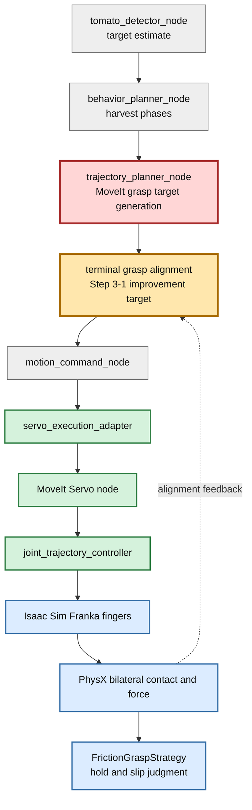
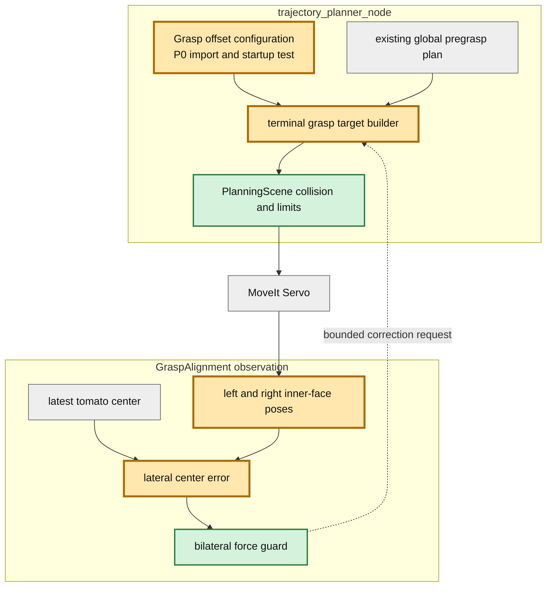

# Step 3-1 最新mainリベース後E2Eと把持位置精度改善案

## 目的

`physics/step3-friction-hold`を最新`main`へ載せ直し、人工FixedJointや幾何fallbackを使わない`physics`把持モードのE2Eを1ケース実行する。再開時点の阻害要因を切り分け、摩擦保持を成立させるために次に改善すべき把持位置決めを具体化する。

## リベース結果

- rebase先: `origin/main` `7f4a1cf`（MoveIt Servo実行経路）
- Step 2再適用commit: `cf29462`
- Step 3再適用commit: `e4ad76a`
- 競合: `scripts/ci/run_e2e.sh`の1ファイル
- 解消方針: Step 3の`CI_GRASP_MODE`と把持横補正変数を維持し、mainで削除済みのlocal planner・suffix注入変数は復活させない

## 改善対象を示す全体アーキテクチャ



赤は今回のrebase回帰で停止したnode、橙は回帰解消後に精度改善する箇所である。物理摩擦値を上げる前に、左右fingerがトマトへ同時接触できる終端位置を作る必要がある。

## E2E条件

| 項目 | 値 |
|---|---|
| 初期姿勢 | `default` |
| 把持モード | `physics` |
| 実行経路 | MoveIt planning → Servo adapter → MoveIt Servo → JTC |
| headless上限 | 3600 steps |
| 物理把持条件 | 左右各1.0 N以上を3 step、相対速度0.02 m/s以下、滑り5 mm以下 |
| 物理デバッグ | 有効 |

## E2E結果

総合判定: **FAIL（把持位置精度を評価する前にplanner nodeが停止）**。

| 観測項目 | 結果 |
|---|---|
| simulator / MoveIt / Servo起動 | 成功 |
| `trajectory_planner_node` | 起動直後に`NameError` |
| 到達phase | `idle → detecting → target_found` |
| motion plan生成 | 0件 |
| grasp到達 | 未到達 |
| 左右finger接触 | 0 / 0 |
| friction hold判定 | 未実行 |
| E2E完走marker | なし |
| simulator実行時間 | 約77.9秒 |

直接原因は、Step 3が`TOMATO_HARVEST_GRASP_LATERAL_OFFSET_M`を読む処理を`trajectory_planner_node`へ追加した一方、main側の整理後のファイルに`import os`が存在しないことである。

```text
NameError: name 'os' is not defined
node.py: os.environ.get("TOMATO_HARVEST_GRASP_LATERAL_OFFSET_M", "0.0")
```

したがって、今回観測された`hand_d=0.6413 m`、finger gap `0.0666 m`、接触力0 Nは初期待機姿勢の値であり、把持位置決め精度の評価値として使わない。

## 課題

### P0: rebase回帰でplannerが起動しない

単純なunit testはplanner nodeをROS 2上で構築していないため、未importの環境変数参照を検出できなかった。`import os`を復元するだけでなく、環境変数を設定してnode初期化または設定読込みを通す回帰テストが必要である。

### P1: 既存Step 3では6D誤差normだけでは両指接触を保証できない

rebase前のStep 3実測では、AT_GRASP入口の位置誤差normが5.0 mmでも右fingerだけが接触し、左fingerは0 Nだった。把持中心に対する横方向誤差とfinger内面までの距離を個別に評価しなければならない。

### P1: 全waypointへの固定横補正は到達性を悪化させる

既存の`+7 mm`補正はpregraspを含む全grasp waypointへ適用され、abort/replanを誘発した。位置精度を上げる目的でも、接近軌道全体を平行移動する方法は適さない。

### P2: tracking errorと把持幾何誤差の定義が異なる

Servo adapterのtracking errorは関節終端残差であり、トマト中心とfinger中心のCartesian誤差ではない。関節残差が小さくても片側接触は起こり得るため、把持専用の観測量が必要である。

## 改善案

### 推奨案: pregrasp維持 + grasp終端だけ再整列

1. pregraspまでは現在のglobal MoveIt planを変更しない。
2. pregrasp到達時の最新tomato pose、左右finger内面pose、hand poseからfinger中心を計算する。
3. 横方向中心誤差を使い、grasp終端poseだけを再生成する。
4. 変更後終端をMoveItで衝突・関節limit確認してからServoへ渡す。
5. grasp閉動作中は左右接触力を監視し、片側接触だけなら低速・小範囲の横補正を行う。

この案は、失敗実績のある「全waypoint一括offset」を避けながら、最も改善効果が必要なgrasp終端だけへ作用する。

## PR変更差分として計画する詳細アーキテクチャ



## 次の実装Gate

| Gate | 合格条件 |
|---|---|
| G0 node起動 | `TOMATO_HARVEST_GRASP_LATERAL_OFFSET_M`設定あり/なしの両方でplanner起動 |
| G1 grasp到達 | default姿勢で`AT_GRASP`へ到達し、abort 0 |
| G2 中心整列 | finger中心とtomato中心の横誤差を計測し、探索結果から決めた許容値内 |
| G3 両指接触 | 左右各1.0 N以上が3 physics step連続 |
| G4 摩擦保持 | 人工joint 0、fallback 0、0.1 m lift後5秒間の滑り5 mm以下 |
| G5 再現性 | default姿勢で3回連続成功後、10初期姿勢へ拡張 |

横誤差の許容値は現時点で推測固定しない。まず1〜2 mm刻みの終端offset sweepで両指接触範囲を測り、その実測範囲をG2の閾値にする。

## 結論

最新mainへのrebaseは完了したが、Step 3の再開Gateは未通過である。最初にplanner起動回帰を直し、その後は摩擦係数や力thresholdではなく、pregraspを維持した終端限定のCartesian整列を優先する。今回のE2Eは把持精度の数値評価には到達していないため、修正後のphysics E2EをStep 3-1の次runとして追加する。
