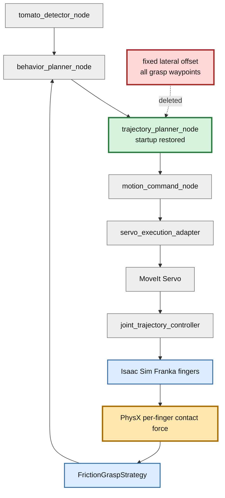
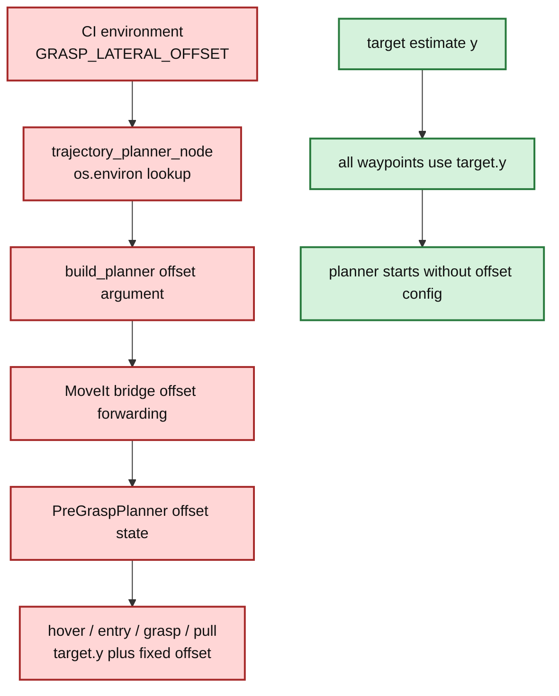

# Step 3-2 Planner復旧・固定横補正削除・Physics E2E解析

## 目的

Step 3-1で判明した`trajectory_planner_node`起動回帰を解消する。同時に、pregraspからpullまでの全waypointへ同じ横offsetを加えるパッチ的な経路を完全削除し、補正なしの基準軌道でphysics把持E2Eを1ケース実行する。結果から、摩擦保持に必要な次の改善対象を決める。

## 改善対象を示す全体アーキテクチャ

緑が今回復旧したplanner、赤が削除した固定補正、橙がE2E結果から判明した次の重点箇所である。

## 実装変更

### Planner起動復旧

Step 3-1の`NameError`は、planner nodeが固定offset環境変数を読むためだけに`os`を必要としていたことが原因だった。今回は`import os`を足す対症療法ではなく、固定offset機能自体を削除した。plannerは引数なしの`build_planner()`で起動する。

### 固定横補正の完全削除

以下を削除した。

- `TOMATO_HARVEST_GRASP_LATERAL_OFFSET_M`環境変数とDockerへの伝播。
- `build_planner()`と`MoveIt2ServiceBridgePlanner`のoffset引数。
- fallback plannerのoffset保持状態。
- grasp hover、entry、grasp、pull lift、pullの全waypointへのY加算。

全waypointのY座標はtarget pose本来の値へ戻した。固定値を別の値へ変更したのではなく、補正経路そのものをなくした。

## PR変更差分の詳細アーキテクチャ

## テスト

- 固定offset API・runtime経路が存在しないことを表す回帰テスト: 2件成功。
- repository test: 244件成功、2件skip。
- physics E2E: planner起動とgrasp到達に成功、摩擦保持は失敗。

## Physics E2E条件

| 項目 | 値 |
|---|---|
| 初期姿勢 | `default` |
| 把持モード | `physics` |
| 固定横補正 | なし |
| headless上限 | 3600 steps |
| 両指最小力 | 各1.0 N |
| 必要継続 | 3 physics step |
| 最大相対速度 | 0.02 m/s |
| 最大滑り | 0.005 m |

## E2E結果

総合判定: **FAIL。ただしStep 3-1のplanner起動問題は解消し、grasp評価まで到達した。**

| 項目 | 結果 |
|---|---|
| planning | 成功、302.028 ms |
| phase | `idle → detecting → target_found → moving_to_pregrasp → moving_to_grasp → at_grasp → grasp_evaluation → failed` |
| Servo abort | 観測なし |
| AT_GRASP入口位置誤差norm | 10.535 mm |
| 静定時位置誤差norm | 約9.32〜9.37 mm |
| 静定時X誤差 | 約+3.64 mm |
| 静定時Y誤差 | 約+7.97〜+8.03 mm |
| 静定時Z誤差 | 約-3.17 mm |
| PhysX contact event | left 342回、right 348回 |
| 最大contact impulse | left 0、right 0.506188 N·s/step |
| friction HELD | 0回 |
| 最終phase | `failed` |

## 解析

### 1. PlannerとServoは今回の直接原因ではない

plannerは正常にplanを生成し、pregraspとgraspへ到達した。Step 3-1で止まっていた起動経路は復旧している。

### 2. Y方向約8 mmの偏りが残る

6D診断の最大成分はY方向の約8 mmである。XとZを合わせた位置誤差normは約9.3 mmで、rebase前Step 3のAT_GRASP入口5.0 mmより大きい。把持中心の再整列は依然として必要である。

ただし、診断poseの座標系とfinger内面中心の座標系は同じとは限らないため、この値をそのまま`-8 mm`の固定補正へ変換してはならない。

### 3. 接触イベントと力観測が矛盾する

PhysX contact callbackでは左右両fingerの接触が多数記録された。一方、`PhysicsObs`の左impulseは全期間0で、behavior plannerへ渡るscene snapshotも左右contactをfalseとしていた。右impulseだけは約0.50 N·s/stepを継続している。

このため失敗を「左fingerが幾何的に接触していない」とだけ結論づけられない。少なくとも次のどちらか、または両方が起きている。

- finger中心が偏り、左接触はイベントだけの浅い接触で有効な法線力が発生していない。
- contact headerからper-finger impulseを集計するactor対応またはstep同期に不整合がある。

### 4. FrictionGraspStrategyのfail-closed判定は正しい

strategyは左右各1 N以上を要求するため、左force 0では`HELD`を返さない。ここでthresholdを下げると片側把持を成功扱いするため、対策にしない。

## 改善案

### P0: contact eventとper-finger forceを同一sampleで照合する

まず観測系を確定する。各physics stepで、contact actor pair、left/right impulse、force換算値、finger内面pose、tomato poseを同じsequence IDで記録する。左右イベントがあるのに左impulseが0となる最初のstepをunit/integration fixture化し、actor順序反転と複数contact point集計を検証する。

### P1: finger内面中心を基準に終端誤差を定義する

hand poseとtarget poseの差ではなく、左右finger内面の中点とtomato中心の差をgrasp alignment errorとする。これにより、診断Y誤差をそのままworld固定offsetへ変換する誤りを避ける。

### P1: 終端限定の閉ループ微修正

pregraspまでは既存MoveIt planを維持する。grasp閉動作前だけ、finger中心誤差をhand frameへ変換し、PlanningSceneとjoint limitで安全確認した小さなCartesian correctionをServoへ与える。補正量には1 step上限と累積上限を設け、片側接触時は接触側へ押し込まず中心方向へだけ動かす。

### P2: 成功範囲を探索してGate化する

観測系修正後、1〜2 mm刻みの終端限定sweepを行う。左右各1 N以上が3 step続く連続範囲を測り、その範囲中心を目標、範囲幅を許容差として採用する。単発の最良offsetを固定値にしない。

## 次のGate

| Gate | 合格条件 |
|---|---|
| G1 観測整合 | contact eventとper-finger impulseのactor対応が同一stepで説明可能 |
| G2 中心整列 | finger内面中点基準の3軸誤差を記録できる |
| G3 有効両指接触 | 左右各1.0 N以上を3 step連続 |
| G4 friction hold | 人工joint/fallback 0で`HELD`成立 |
| G5 保持性能 | 0.1 m lift後5秒、相対滑り5 mm以下 |
| G6 再現性 | default姿勢3回成功後、10姿勢へ展開 |

## 結論

planner起動は復旧し、全waypoint固定横補正も完全削除した。physics E2Eはgraspまで到達したが、約8 mmのY偏りと、左右contact eventに対して左forceが0となる観測矛盾により摩擦保持は成立しなかった。次は固定offsetを再導入せず、contact/force観測の整合を先に確定し、finger中心基準の終端限定閉ループ補正へ進む。
