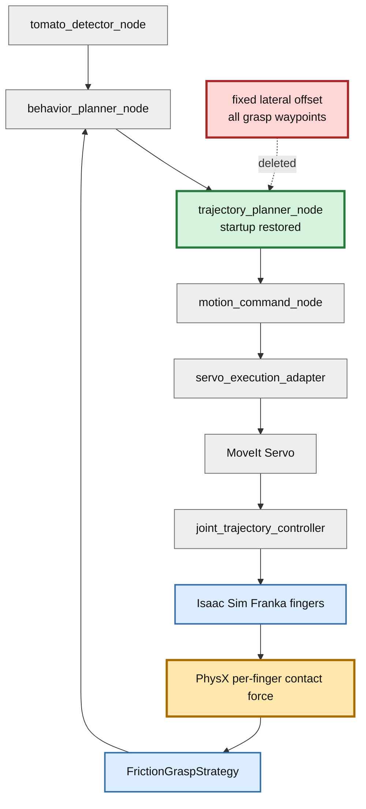
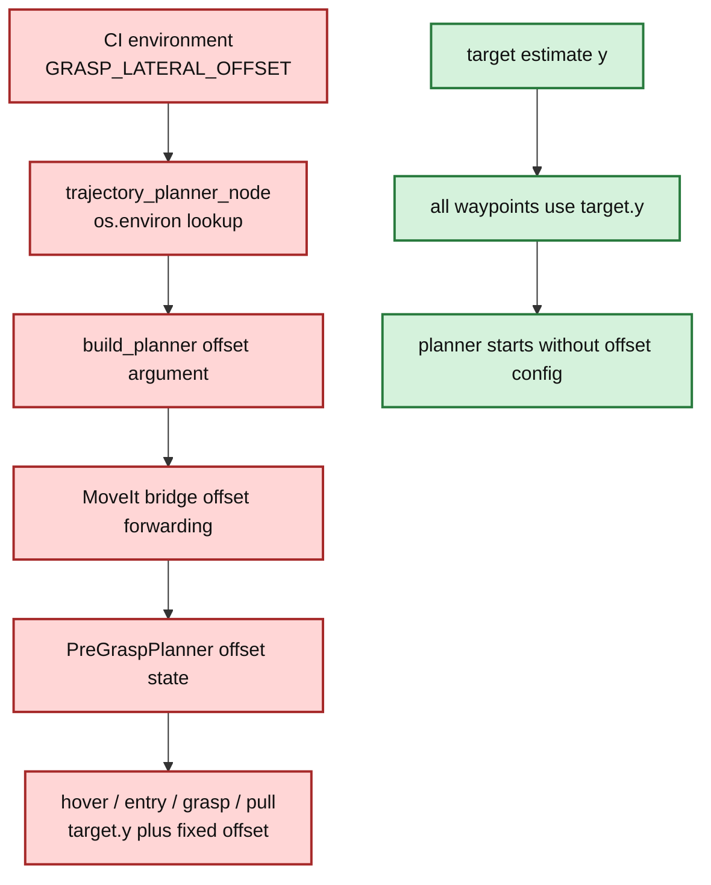

# Step 3-2 Planner復旧・固定横補正削除・Physics E2E解析

## 目的

Step 3-1で判明した`trajectory_planner_node`起動回帰を解消する。同時に、pregraspからpullまでの全waypointへ同じ横offsetを加えるパッチ的な経路を完全削除し、補正なしの基準軌道でphysics把持E2Eを1ケース実行する。結果から、摩擦保持に必要な次の改善対象を決める。

## 改善対象を示す全体アーキテクチャ

緑が今回復旧したplanner、赤が削除した固定補正、橙がE2E結果から判明した次の重点箇所である。

## 実装変更

### Planner起動復旧

Step 3-1の`NameError`は、planner nodeが固定offset環境変数を読むためだけに`os`を必要としていたことが原因だった。今回は`import os`を足す対症療法ではなく、固定offset機能自体を削除した。plannerは引数なしの`build_planner()`で起動する。

### 固定横補正の完全削除

以下を削除した。

- `TOMATO_HARVEST_GRASP_LATERAL_OFFSET_M`環境変数とDockerへの伝播。
- `build_planner()`と`MoveIt2ServiceBridgePlanner`のoffset引数。
- fallback plannerのoffset保持状態。
- grasp hover、entry、grasp、pull lift、pullの全waypointへのY加算。

全waypointのY座標はtarget pose本来の値へ戻した。固定値を別の値へ変更したのではなく、補正経路そのものをなくした。

## PR変更差分の詳細アーキテクチャ

## テスト

- 固定offset API・runtime経路が存在しないことを表す回帰テスト: 2件成功。
- repository test: 244件成功、2件skip。
- physics E2E: planner起動とgrasp到達に成功、摩擦保持は失敗。

## Physics E2E条件

| 項目 | 値 |
|---|---|
| 初期姿勢 | `default` |
| 把持モード | `physics` |
| 固定横補正 | なし |
| headless上限 | 3600 steps |
| 両指最小力 | 各1.0 N |
| 必要継続 | 3 physics step |
| 最大相対速度 | 0.02 m/s |
| 最大滑り | 0.005 m |

## E2E結果

総合判定: **FAIL。ただしStep 3-1のplanner起動問題は解消し、grasp評価まで到達した。**

| 項目 | 結果 |
|---|---|
| planning | 成功、302.028 ms |
| phase | `idle → detecting → target_found → moving_to_pregrasp → moving_to_grasp → at_grasp → grasp_evaluation → failed` |
| Servo abort | 観測なし |
| AT_GRASP入口位置誤差norm | 10.535 mm |
| 静定時位置誤差norm | 約9.32〜9.37 mm |
| 静定時X誤差 | 約+3.64 mm |
| 静定時Y誤差 | 約+7.97〜+8.03 mm |
| 静定時Z誤差 | 約-3.17 mm |
| PhysX contact event | left 342回、right 348回 |
| 最大contact impulse | left 0、right 0.506188 N·s/step |
| friction HELD | 0回 |
| 最終phase | `failed` |

## 解析

### 1. PlannerとServoは今回の直接原因ではない

plannerは正常にplanを生成し、pregraspとgraspへ到達した。Step 3-1で止まっていた起動経路は復旧している。

### 2. Y方向約8 mmの偏りが残る

6D診断の最大成分はY方向の約8 mmである。XとZを合わせた位置誤差normは約9.3 mmで、rebase前Step 3のAT_GRASP入口5.0 mmより大きい。把持中心の再整列は依然として必要である。

ただし、診断poseの座標系とfinger内面中心の座標系は同じとは限らないため、この値をそのまま`-8 mm`の固定補正へ変換してはならない。

### 3. 接触イベントと力観測が矛盾する

PhysX contact callbackでは左右両fingerの接触が多数記録された。一方、`PhysicsObs`の左impulseは全期間0で、behavior plannerへ渡るscene snapshotも左右contactをfalseとしていた。右impulseだけは約0.50 N·s/stepを継続している。

このため失敗を「左fingerが幾何的に接触していない」とだけ結論づけられない。少なくとも次のどちらか、または両方が起きている。

- finger中心が偏り、左接触はイベントだけの浅い接触で有効な法線力が発生していない。
- contact headerからper-finger impulseを集計するactor対応またはstep同期に不整合がある。

### 4. FrictionGraspStrategyのfail-closed判定は正しい

strategyは左右各1 N以上を要求するため、左force 0では`HELD`を返さない。ここでthresholdを下げると片側把持を成功扱いするため、対策にしない。

## 改善案

### P0: contact eventとper-finger forceを同一sampleで照合する

まず観測系を確定する。各physics stepで、contact actor pair、left/right impulse、force換算値、finger内面pose、tomato poseを同じsequence IDで記録する。左右イベントがあるのに左impulseが0となる最初のstepをunit/integration fixture化し、actor順序反転と複数contact point集計を検証する。

### P1: finger内面中心を基準に終端誤差を定義する

hand poseとtarget poseの差ではなく、左右finger内面の中点とtomato中心の差をgrasp alignment errorとする。これにより、診断Y誤差をそのままworld固定offsetへ変換する誤りを避ける。

### P1: 終端限定の閉ループ微修正

pregraspまでは既存MoveIt planを維持する。grasp閉動作前だけ、finger中心誤差をhand frameへ変換し、PlanningSceneとjoint limitで安全確認した小さなCartesian correctionをServoへ与える。補正量には1 step上限と累積上限を設け、片側接触時は接触側へ押し込まず中心方向へだけ動かす。

### P2: 成功範囲を探索してGate化する

観測系修正後、1〜2 mm刻みの終端限定sweepを行う。左右各1 N以上が3 step続く連続範囲を測り、その範囲中心を目標、範囲幅を許容差として採用する。単発の最良offsetを固定値にしない。

## 外部ベストプラクティス調査に基づく追加改善案（2026-07-15調査）

NVIDIA公式（Isaac Sim / omni.physx / PhysX 5）、Isaac Lab公式、MoveIt公式、および把持ベンチマーク実装（ManiSkill / robosuite / Isaac Lab Lift）の一次情報を調査し、本E2Eの3症状（Y約8mm終端誤差、左impulse=0の観測矛盾、HELD不成立）に対する改善案を整理した。**推奨は案A（最優先）と案Bの併用**である。

### 案A: contact観測系をベストプラクティス構成へ再構築する【推奨・最優先】

既存P0を具体化するもの。世間の実装定石に照らすと、症状3（左impulse=0）は観測系のバグである可能性が最も高い。

- **actorペア照合を両スロット対応にする**。omni.physxのcontact headerはactor0/actor1の順序規約を公式に保証していない。「actor0==左finger」型の前提一致は、PhysX内部順序次第で片側fingerが常にactor1側へ来て集計0になる——本E2Eの症状と一致する典型バグ型である。actor0/actor1のどちらかがfingerのcollider primパスに一致すれば採用し、headerのoffset/count範囲の全contact pointを合算する。articulation linkパスとcollider子primパスの不一致による照合漏れも確認する。
- **単位を統一する**。contact report callbackが返すのはimpulse（N·s/step）であり力（N）ではない。physics dtで割ってforce換算してから閾値（1.0 N）と比較する。参考: 右の0.506 N·s/stepはdt=1/60なら約30 Nに相当し、実機Franka Handの連続把持力70 Nに対して妥当なオーダーである。つまり右側は物理的に把持力が出ており、左だけ0は観測欠落を強く示唆する。
- **左右対称性の点検**。左fingerだけ`PhysxContactReportAPI`未適用、またはcontactReportThresholdが高い、という非対称設定を排除する。閾値は一旦0（全報告）にしてから絞る。
- **代替経路**: 自前callback集計を続ける代わりに、Isaac Labの`ContactSensor`をfingerごとに1つずつ作り（フィルタはone-to-many・単一prim限定のため左右別センサーが必須）、`force_matrix_w`（単位N、法線力）で対トマト力を読む構成が公式想定である。ManiSkillも「actorペアを明示したpairwise contact force」で per-finger 判定しており、これが実装定石になっている。

採用理由: 観測が壊れたままではP1以降のどの対策も効果検証できない。既存P0の方針（観測系の確定を先行）はベストプラクティスと一致しており、上記で手段を確定できる。

### 案B: 終端をMoveIt Servo Pose Trackingで閉ループ化する【推奨・案Aの次】

既存P1「終端限定の閉ループ微修正」を、MoveIt公式の既存機能で実現するもの。

- MoveIt ServoのPose Tracking APIは、目標EEF poseと現在poseの誤差をPID（xyz+姿勢）でtwistへ変換し、`satisfiesPoseTolerance()`で許容値を満たすまで回す閉ループを公式提供している。pregraspまでは既存MoveIt planを維持し、pregrasp→graspの最終接近だけこれに切り替え、「誤差が閾値未満を一定時間連続」を成立条件にしてから閉爪する。
- MoveIt Pro のVisual Servoingは「初期位置決めの残留誤差がある把持前の精密整列」を明示的な公式ユースケースとしており、本症状1はまさにこの型である。simではトマト真値poseが取れるため、まず真値基準のpose trackingで閉ループ効果を確認し、その後知覚基準へ置き換えるのが低リスクな段階化になる。
- 静的オフセット較正（Y −8mm固定など）は姿勢依存で再発するため定石ではない。これは既存解析2の判断と一致する。なお、Servo実行では追従遅れ由来の定常偏差の可能性もあるため、目標到達後の静止整定時間だけで誤差が縮むかのログ確認も安価な切り分けとして先に行う価値がある。

### 案C: 把持物理パラメータをコミュニティ実績値へ揃える【案A完了後に実施】

NVIDIAフォーラムで収束している把持タスク向け実績値と、Isaac Lab公式Franka設定に揃える。

| パラメータ | 実績値 |
|---|---|
| solver position iterations | 16〜32（把持系は64まで） |
| solver velocity iterations | 4〜16 |
| static/dynamic friction | finger・トマト双方に1.0以上を明示付与 |
| friction combine mode | 既定Averageは薄まるためMax/Multiply検討 |
| contact_offset | 0.005 m |
| max_depenetration_velocity | 3.0〜5.0 |
| physics rate | 60 Hzでは不足しがち、80 Hz以上またはsubstep増 |
| gripper drive | Isaac Lab実績: stiffness 2e3 / damping 1e2 / effort_limit 200 |

- 閉爪は必ずdrive経由（position target食い込み+effort limit、またはeffort制御）で行う。`set_joint_positions()`による状態直書きは物理を素通りして把持を壊す既知のバグ型である（本実装が該当するかの確認を含む）。
- Isaac Sim公式「Robot Simulation Tips」も、把持改善として双方のfriction増加・質量分布確認・gripper stiffness増加を挙げている。

### 案D: 成功判定をManiSkill式+lift testへ再定義する【案A〜B完了後】

既存P2（sweep→Gate化）の前に、判定自体をベンチマーク標準へ寄せる。

- Isaac Lab系の接触観測は**法線力のみ**で摩擦（接線）力は取得できない。「摩擦保持」を接線力で直接測る前提は成立しないため、判定はManiSkill式に置き換える: 両指の対トマトpairwise法線力 ≥ 0.5〜1.0 N、かつ力の向きが指の開閉軸から85°以内、を数step継続（両指AND）。角度条件により指先で押しているだけの誤検知を防ぐ。
- 最終成功判定はlift testに置く: 初期位置から0.04 m持ち上げて一定時間維持、−0.05 mで落下失敗——Isaac Lab Lift / robosuiteの標準形。HELDは中間診断とすることで、力閾値チューニングに頑健になる。
- 現行閾値（両指各1.0 N×3 step、滑り5 mm）は相場（ManiSkill既定min_force 0.5 N）に対して厳しすぎではなく、閾値緩和は不要。fail-closed判定を維持する既存解析4の判断はベンチマーク実装とも整合する。

### 推奨の要約

| 案 | 内容 | 優先度 | 既存改善案との対応 |
|---|---|---|---|
| **A（推奨・最優先）** | 両スロットactor照合+impulse/force単位統一+左右対称性点検（またはContactSensorへ移行） | P0 | 既存P0の具体化 |
| **B（推奨）** | MoveIt Servo Pose Trackingによる終端閉ループ整列 | P1 | 既存P1の手段確定 |
| C | 把持物理パラメータの実績値化+drive経由閉爪の確認 | P1.5 | 新規 |
| D | ManiSkill式判定+lift test化 | P2 | 既存P2の前提整備 |

Aを最優先とする根拠: 右impulseのforce換算値（約30 N）は実機把持力レンジ内で物理は概ね機能しており、左0は観測欠落の可能性が最も高い。観測を直さない限りB〜Dの効果検証が不可能である。

### 参照（確認日: 2026-07-15）

- [omni.physx Contact Reports](https://docs.omniverse.nvidia.com/kit/docs/omni_physics/latest/extensions/runtime/source/omni.physx/docs/dev_guide/contact_reports.html)（contact header構造、impulse単位、threshold）
- [Isaac Lab Contact Sensor](https://isaac-sim.github.io/IsaacLab/main/source/overview/core-concepts/sensors/contact_sensor.html)（net_forces_wは法線力のみ、filter one-to-many制約）
- [Isaac Sim Robot Simulation Tips 4.5](https://docs.isaacsim.omniverse.nvidia.com/4.5.0/robot_simulation/robot_simulation_tips.html)（把持改善の公式指針）
- [NVIDIAフォーラム: grasping物理パラメータ](https://forums.developer.nvidia.com/t/physics-and-simulation-parameters-for-grasping-and-picking-tasks-objects-slipping-away/259716)（solver iterations等の実績値、状態直書き閉爪のバグ型）
- [IsaacLab franka.py](https://github.com/isaac-sim/IsaacLab/blob/main/source/isaaclab_assets/isaaclab_assets/robots/franka.py)（gripper drive実績値） / [lift_env_cfg.py](https://github.com/isaac-sim/IsaacLab/blob/main/source/isaaclab_tasks/isaaclab_tasks/manager_based/manipulation/lift/lift_env_cfg.py)（lift test閾値）
- [MoveIt2 Realtime Servo](https://moveit.picknik.ai/main/doc/examples/realtime_servo/realtime_servo_tutorial.html) / [PoseTracking API](https://moveit.picknik.ai/humble/api/html/classmoveit__servo_1_1PoseTracking.html) / [MoveIt Pro Visual Servoing](https://docs.picknik.ai/6/how_to/visual_servoing/)（終端閉ループ整列の公式ユースケース）
- [ManiSkill panda.py](https://github.com/haosulab/ManiSkill/blob/main/mani_skill/agents/robots/panda/panda.py)（is_grasping: pairwise力0.5 N+85°角度条件） / [robosuite lift.py](https://github.com/ARISE-Initiative/robosuite/blob/master/robosuite/environments/manipulation/lift.py)（両指幾何接触AND+高さ判定）
- [Franka Hand Product Manual](https://download.franka.de/documents/220010_Product%20Manual_Franka%20Hand_1.2_EN.pdf)（連続把持力70 N / 最大140 N）

## 次のGate

| Gate | 合格条件 |
|---|---|
| G1 観測整合 | contact eventとper-finger impulseのactor対応が同一stepで説明可能 |
| G2 中心整列 | finger内面中点基準の3軸誤差を記録できる |
| G3 有効両指接触 | 左右各1.0 N以上を3 step連続 |
| G4 friction hold | 人工joint/fallback 0で`HELD`成立 |
| G5 保持性能 | 0.1 m lift後5秒、相対滑り5 mm以下 |
| G6 再現性 | default姿勢3回成功後、10姿勢へ展開 |

## 結論

planner起動は復旧し、全waypoint固定横補正も完全削除した。physics E2Eはgraspまで到達したが、約8 mmのY偏りと、左右contact eventに対して左forceが0となる観測矛盾により摩擦保持は成立しなかった。次は固定offsetを再導入せず、contact/force観測の整合を先に確定し、finger中心基準の終端限定閉ループ補正へ進む。
