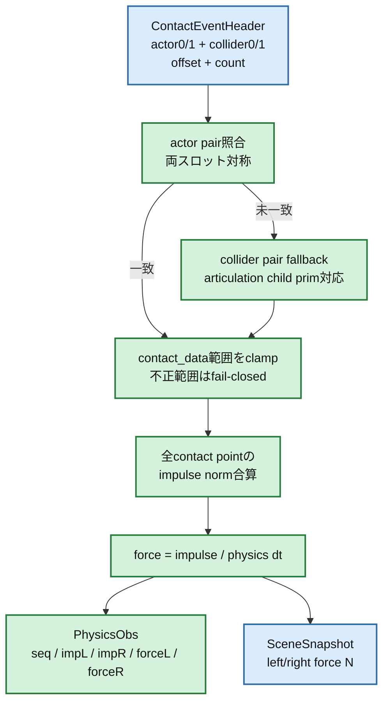
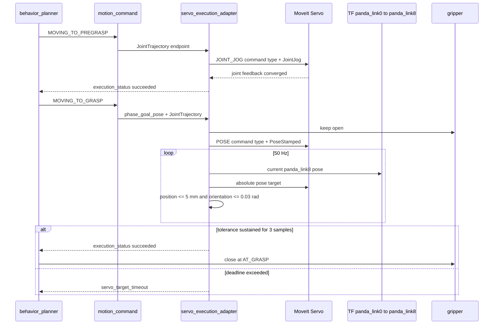
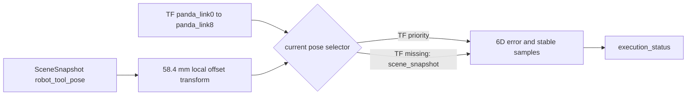

# Step 3-3 Contact観測再構築・Servo終端Pose Tracking・Physics E2E

## 目的

Step 3-2の外部ベストプラクティス調査で推奨した案Aと案Bを実装し、観測系と把持終端制御を同時に改善する。案AはPhysX contact reportを左右fingerへ確実に対応付け、同一physics stepの力積と力を記録する。案Bは`MOVING_TO_GRASP`だけをMoveIt ServoのPose commandへ切り替え、閉爪前の6D終端整列を閉ループ化する。

対象コミット:

- `3a4108f` `Implement robust per-finger contact observation`
- `d02c071` `Add Servo terminal pose tracking for grasp`

## 変更後の全体アーキテクチャ

```mermaid
flowchart LR
  classDef changed fill:#d5f2dc,stroke:#287a3d,stroke-width:3px,color:#111
  classDef existing fill:#eee,stroke:#666,color:#111
  classDef observed fill:#dcecff,stroke:#316ca6,stroke-width:2px,color:#111
  classDef failed fill:#ffd6d6,stroke:#a62929,stroke-width:3px,color:#111

  Detector["tomato_detector_node"]:::existing
  Behavior["behavior_planner_node"]:::existing
  Planner["trajectory_planner_node<br/>global JointTrajectory"]:::existing
  Command["motion_command_node<br/>phase goal pose + trajectory"]:::existing
  Adapter["servo_execution_adapter<br/>phase別command arbitration"]:::changed
  JointJog["JointJog<br/>pregrasp / pull / place / home"]:::existing
  PoseTrack["PoseStamped tracking<br/>MOVING_TO_GRASP only"]:::changed
  Servo["MoveIt Servo<br/>PlanningScene / limits / smoothing"]:::existing
  JTC["joint_trajectory_controller"]:::existing
  Panda["Isaac Sim Franka"]:::existing
  Contact["PhysX contact reports<br/>actor + collider / all points"]:::changed
  Force["sequence-aligned<br/>impulse [N s] + force [N]"]:::changed
  Strategy["FrictionGraspStrategy<br/>bilateral fail-closed gate"]:::observed
  Timeout["E2E: pose target timeout"]:::failed

  Detector --> Behavior --> Planner --> Command --> Adapter
  Adapter --> JointJog --> Servo
  Adapter --> PoseTrack --> Servo
  Servo --> JTC --> Panda
  Panda --> Contact --> Force --> Strategy --> Behavior
  PoseTrack -. "今回未到達" .-> Timeout
```



pregraspまでは既存JointJogの閉ループ実行を維持する。`MOVING_TO_GRASP`では、planに含まれるruntime tool goalを`panda_link8` goalへ変換し、Servoのabsolute pose commandへ切り替える。把持位置へ到達するまではgripper openを維持し、成功後に既存phase遷移から閉爪する。

## 案A: contact観測系の変更箇所アーキテクチャ



### 実装内容

- actor0/actor1の順序に依存せずfingerとtomatoのpairを照合する。
- actor pathがarticulation rootでfinger linkを識別できない場合、collider0/collider1の子prim pathを使う。
- `contact_data_offset`と`num_contact_data`が示す全contact pointを合算する。配列外参照は行わない。
- `FingerContactImpulses [N s]`から`FingerContactForces [N]`への変換をphysics観測モジュールへ集約した。
- `PhysicsObs`へphysics sequence IDと左右のimpulse/forceを同一行で記録する。

## 案B: Servo終端Pose Trackingの変更箇所アーキテクチャ



### 実装内容

- Pose Tracking対象を`PhaseId.MOVING_TO_GRASP`へ限定した。
- runtime tool poseからMoveIt control link `panda_link8`への既存`58.4 mm` local offsetを姿勢込みで変換する。
- Servo command type serviceをphaseに応じてJOINT_JOG/POSEへ切り替え、非同期応答の競合を防ぐ。
- `panda_link0 -> panda_link8`のTF実測から位置・姿勢誤差を計算する。
- 位置`5 mm`以下かつ姿勢`0.03 rad`以下が3周期連続した場合のみ成功とする。
- Pose Tracking開始時はgripperをopenのまま維持し、閉爪を`AT_GRASP`以降へ遅延する。

## テスト

### Unit / repository test

| 項目 | 結果 |
|---|---|
| repository pytest | **PASS: 248件、2件skip** |
| contact actor順序反転 | PASS |
| articulation actor / collider子prim fallback | PASS |
| 複数contact point合算 | PASS |
| 不正contact data範囲のfail-closed | PASS |
| impulse / physics dtによるforce換算 | PASS |
| grasp phaseだけPose Trackingを選択 | PASS |
| runtime toolから`panda_link8` goalへの変換 | PASS |
| 6D tolerance判定 | PASS |
| tracking中の閉爪遅延 | PASS |

## Physics E2E条件

実行日: 2026-07-16

```bash
CI_HEADLESS_STEPS=3600 \
CI_GRASP_MODE=physics \
TOMATO_HARVEST_DEBUG_PHYSICS_GRASP=1 \
CI_E2E_TIMEOUT_SEC=2400 \
bash scripts/ci/run_e2e.sh
```

| 項目 | 値 |
|---|---|
| 初期姿勢 | `default` |
| 把持モード | `physics` |
| headless上限 | 3600 steps |
| Servo制御周期 | 50 Hz |
| Pose位置許容差 | 0.005 m |
| Pose姿勢許容差 | 0.03 rad |
| 必要連続到達 | 3 samples |
| 両指最小力 | 各1.0 N |
| friction継続 | 3 physics steps |

## Physics E2E結果

総合判定: **FAIL。pregraspは成功したが、grasp Pose Trackingがtimeoutし、接触評価へ到達しなかった。**

| 項目 | 結果 |
|---|---|
| planning | 成功、350.856 ms |
| phase | `idle -> detecting -> target_found -> moving_to_pregrasp -> moving_to_grasp` |
| pregrasp Servo | 成功、4373.285 ms、最大joint誤差0.005694 rad |
| Servo Pose mode切替 | 成功、command type `2` |
| grasp試行1 | `servo_target_timeout`、開始から約6.34 s |
| grasp再計画後試行2 | `servo_target_timeout`、開始から約5.16 s |
| `AT_GRASP`到達 | なし |
| gripper close | なし（tracking中open維持は設計どおり） |
| PhysX finger contact event | 0件 |
| 非zero contact impulse / force sample | 0件 |
| FrictionGraspStrategy評価 | 未到達 |
| 最終結果 | completion markerなし、E2E exit 1 |

### Gate判定

| Gate | 判定 | 根拠 |
|---|---|---|
| G0 planner / pregrasp復旧 | PASS | planning成功、pregrasp Servo到達 |
| G1 Pose command mode切替 | PASS | Servo command type `2` readyを記録 |
| G2 終端Pose収束 | **FAIL** | 2回とも`servo_target_timeout` |
| G3 観測整合 | BLOCKED | grasp contactが発生せず案AをE2E評価できない |
| G4 有効両指接触 | BLOCKED | `AT_GRASP`未到達 |
| G5 friction hold | BLOCKED | FrictionGraspStrategy未評価 |

## 解析

### 1. 案Bのcommand arbitrationまでは機能した

pregraspでは従来JointJogが収束し、`moving_to_pregrasp -> moving_to_grasp`へ遷移した。その直後にServo command type `2`への切替成功が記録されているため、phase選択とservice切替は動作している。

### 2. Pose targetの到達観測がなくtimeoutした

Pose Tracking中はjoint追従誤差ではなく6D TF誤差を使うため、現行`execution_status`には周期的なposition/orientation errorが出ていない。ログからは次の候補をまだ分離できない。

- PoseStampedがServoに受理されているがEEFが動いていない。
- EEFは動いているが`panda_link8` goal変換またはframe semanticsが一致していない。
- TF lookupが成立せず、到達判定だけが更新されていない。
- planned trajectoryの所要時間を基準にしたdeadlineがPose trackingには短い。

timeout延長だけを対策にはしない。まずcommand publish数、Servo status、TF lookup成否、目標/現在6D誤差を同一周期で記録し、停止箇所を確定する必要がある。

### 3. 案Aのunit境界は改善したが、E2E Gateは未評価

今回のE2Eはgripper closeと接触前に停止したため、actor/collider照合や左右force整合の実シーン検証には至っていない。`seq / impulse / force`形式が3600 stepを通して出力され、全sampleがzeroだったことは確認できたが、これは接触が無かったためであり案A成功の証拠にはしない。

## 次の改善

優先度P0でPose Tracking観測を追加する。

1. Pose command publishごとにsequence、frame、target 6Dを記録する。
2. TF lookup失敗をcountし、例外種別と最終成功時刻を記録する。
3. current `panda_link8` pose、position error、orientation error、Servo statusを同一sampleで記録する。
4. `panda_link8`とruntime toolのoffsetを同じTF snapshot上で照合する。
5. 原因修正後に同条件E2Eを再実行し、`AT_GRASP`到達後に案Aの左右actor/collider/force整合を評価する。

## P0 Pose Tracking観測の実装と再E2E（2026-07-16）

前節の改善項目1〜3を実装し、同じE2E条件で再実行した。

### 追加した観測

- Pose commandごとの`sequence_id`と累積`published_count`。
- planning frame、EEF frame、target/currentのxyz・rpy。
- position/orientation error、到達判定、連続到達sample数。
- TF lookup成功/失敗累積、例外理由、最終成功からの経過時間。
- 同一sample時点のMoveIt Servo status。
- timeout時のpublish数、TF成功/失敗数、最終Servo status summary。

### 再E2E結果

| 項目 | 結果 |
|---|---|
| repository pytest | **PASS: 250件、2件skip** |
| planning | 成功、584.98 ms |
| pregrasp Servo | 成功、5827.327 ms、最大joint誤差0.009249 rad |
| Pose command publish | 各試行210回 |
| TF lookup成功 | 各試行0回 |
| TF lookup失敗 | 各試行210回 |
| TF例外 | `"panda_link8" ... source_frame does not exist` |
| Servo status sample | 全sample `null` |
| grasp試行 | 2回とも`servo_target_timeout` |

### 確定した直接原因

deadline不足ではない。Pose commandは50 Hzでpublishされている一方、到達判定が参照する`panda_link8`がadapterのTF treeに存在しないため、current poseと6D誤差が一度も計算されていなかった。`tf_success_count=0`かつ`tf_failure_count=published_count`で全周期を説明できる。

次の修正では、次のいずれかを仕様として選ぶ必要がある。

1. robot_state_publisher等から`panda_link0 -> panda_link8`を同一ROS graphへ提供する。
2. simulatorのscene snapshotに含まれるruntime tool poseを入力し、同じlink/tool offset変換でcurrent `panda_link8` poseを導出する。

後者はsim真値を使う段階的検証というStep 3-2の方針に合うが、ROS実機経路との契約が異なる。どちらを採るか決める前にtimeoutだけを延長してはならない。

## 結論

案Aと案Bのコードおよびunit testは導入でき、repository testは全件成功した。追加観測により、Pose Tracking timeoutの直接原因は`panda_link8` TF欠落で到達判定が一度も実行されないことだと確定した。したがって今回の変更を「摩擦保持改善成功」とは判定しない。次のGateはcurrent EEF poseの供給契約を決定してG2を通し、その後に案Aの実接触整合を検証することである。

## 方式2: SceneSnapshot current pose fallback（2026-07-16）

EEF pose供給契約には方式2を採用した。TFを第一候補として維持し、TFに`panda_link8`が無い場合だけ、0.5秒以内に受信した`SceneSnapshot.robot_tool_pose`へ既存のlocal link/tool offset 58.4 mmを適用してcurrent `panda_link8` poseを導出する。これにより実機向けTF経路を上書きせず、Step 3のsim真値による段階検証を継続できる。



### 実装と安全条件

- TF poseが存在する場合は従来どおりTFを優先する。
- SceneSnapshotは受信から0.5秒を超えた場合に利用せず、stale真値による誤到達判定を防ぐ。
- runtime tool poseとtarget runtime tool poseへ同じ姿勢込みoffset変換を適用する。
- 観測sampleに`pose_source=tf|scene_snapshot`を追加する。
- TF失敗countと例外ログはfallback成功時も残し、ROS graph不備を隠さない。

### テスト結果

| 項目 | 結果 |
|---|---|
| repository pytest | **PASS: 253件、2件skip** |
| TF優先選択 | PASS |
| TF欠落時SceneSnapshot fallback | PASS |
| 両入力欠落時の判定停止 | PASS |
| Python compile | PASS |
| GPU physics E2E | **FAIL: terminal phase `failed`** |

### GPU physics E2E詳細

| 項目 | 結果 |
|---|---|
| phase | `idle -> detecting -> target_found -> moving_to_pregrasp -> moving_to_grasp -> at_grasp -> grasp_evaluation -> failed` |
| current pose source | `scene_snapshot` |
| TF lookup | 引き続き`panda_link8`欠落、fallbackで継続 |
| moving-to-grasp Pose収束 | **PASS**、1,556.935 ms、位置誤差4.572 mm、姿勢誤差0 rad |
| grasp-evaluation hold Pose収束 | **PASS**、124.873 ms、位置誤差4.920 mm、姿勢誤差0 rad |
| 両指contact | 左右ともfalse |
| 両指force | 左右ともnull |
| gripper state | `false`のまま |
| grasp result | `awaiting_physics_release`後にtimeoutして`failed` |

### Gate更新と残課題

| Gate | 判定 | 根拠 |
|---|---|---|
| G0 planner / pregrasp復旧 | PASS | pregraspからgraspへ遷移 |
| G1 Pose command mode切替 | PASS | Pose commandがcurrent poseを収束させた |
| G2 終端Pose収束 | **PASS** | 5 mm以内を3 sample連続で満たした |
| G3 観測整合 | BLOCKED | gripperがopenのままで実接触なし |
| G4 有効両指接触 | FAIL | 左右contact=false、force=null |
| G5 friction hold | BLOCKED | 物理把持が開始されない |

方式2はTF欠落による到達判定停止を解消し、G2を通過させた。ただし摩擦保持の全体E2E成功には至っていない。次の直接課題は、Pose Tracking中に遅延した閉爪を`AT_GRASP`または`GRASP_EVALUATION`開始時に確実に有効化し、案Aの左右contact/force整合を実接触で評価することである。
