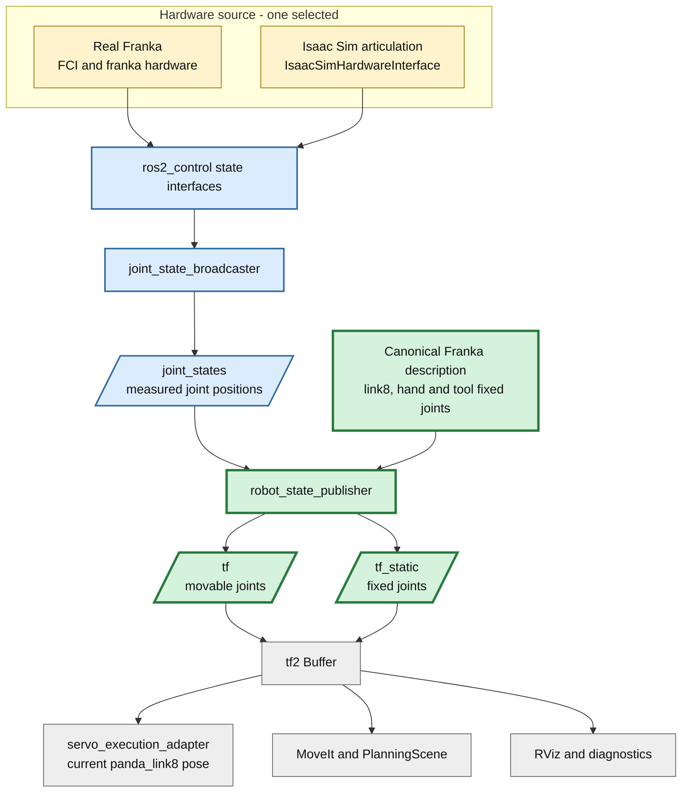
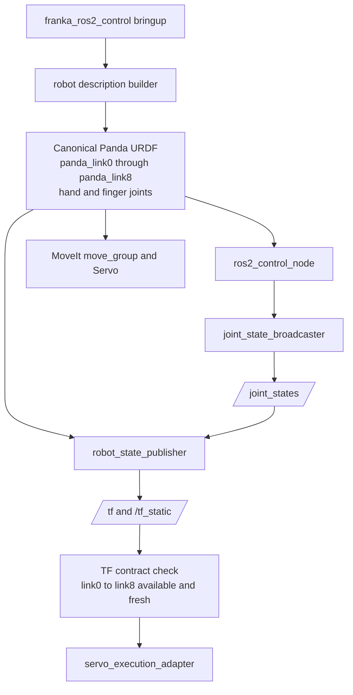

# Step 3-4 Robot TF配信責務の検討

## 目的

Step 3-3で判明した`panda_link8` TF欠落に対し、実ロボットではrobot stateをrobot systemへ入力し、そのkinematic modelからTFを生成するという前提で、TFをどのmoduleが配信すべきかを決定し、実装とE2E評価まで行う。

## 結論

`franka_ros2_control`のbringupが、canonical robot description、`joint_state_broadcaster`、独立した`robot_state_publisher`を一体として起動・設定する構成を推奨する。

TF計算をhardware interface、Isaac Sim、Servo adapterのいずれにも持たせない。simと実機で差し替えるのはjoint stateの取得元までとし、`/joint_states`以降のTF生成経路を共通化する。

## 現象と直接原因

現行起動スクリプトは既に`robot_state_publisher`を起動している。したがって直接原因はpublisherの未起動ではない。

```text
現在の独自URDF

panda_link0
    |
    v
panda_link1 ... panda_link7
    |
    | panda_hand_joint
    v
panda_hand

panda_link8: 定義なし
```

`robot_state_publisher`はURDFに存在するlinkだけをTF treeへ生成する。現行`franka_ros2_control.urdf`には`panda_link8`が無く、`panda_link7 -> panda_hand`へ直接接続している。このモデルから`panda_link0 -> panda_link8`を要求してもsource frame not foundになる。

なおStep 3-3のfallbackはSceneSnapshotの「関節角」ではなく、simulator真値の`robot_tool_pose`を使用している。関節角の正式経路はすでに`Isaac Sim -> HardwareInterface -> joint_state_broadcaster -> /joint_states`である。

## 変更後の全体アーキテクチャ

横方向へ広がらないよう、入力から利用側まで上から下へ記載する。



### 責務境界

| Component | 責務 | TF authority |
|---|---|---|
| 実機/Isaac hardware adapter | measured joint stateをros2_control state interfaceへ渡す | 持たない |
| `joint_state_broadcaster` | state interfaceを標準`/joint_states`へ公開する | 持たない |
| canonical robot description | link/joint topologyとfixed transformを定義する | TF計算の唯一のmodel |
| `robot_state_publisher` | URDFと`/joint_states`から`/tf`、`/tf_static`を生成する | robot kinematic TFの唯一のauthority |
| `servo_execution_adapter` | TFを消費して6D誤差を判定する | 持たない |
| Isaac Sim SceneSnapshot | tomato、接触、物理状態などのscene観測 | robot pose到達判定には使用しない |

## 配置案の比較

### 案A: `franka_ros2_control` bringupでrobot_state_publisherを管理（推奨）

`franka_ros2_control.launch.py`がcontroller manager、joint state broadcaster、robot state publisherへ同じrobot descriptionを渡す。sim/実機launchもこのbringupを共通利用する。

長所:

- 実機とsimで`/joint_states`以降を共通化できる。
- ROS標準packageへkinematic計算を委譲できる。
- MoveIt、ros2_control、TFのrobot model driftをlaunch testで検出できる。
- hardware I/OとTF生成の単一責務が分離される。

短所:

- 現行の独自最小URDFをcanonical modelへ統合する作業が必要。
- `scripts/run_ros2_components.sh`とpackage launchの二重起動経路を整理する必要がある。

### 案B: ros2_control HardwareInterfaceまたはcontrollerがTFを直接配信

長所:

- hardware state受信直後にTFを生成できる。
- 単一processにまとめられる。

短所:

- hardware pluginへURDF kinematicsとtf2 publish責務が混入する。
- sim/実機pluginごとに同じTF実装が必要になる。
- fixed joint、mimic joint、timestamp、`/tf_static` QoSを独自に再実装することになる。
- `robot_state_publisher`との二重authorityを招きやすい。

判断: 不採用。

### 案C: Isaac SimからTransform Treeを直接配信

長所:

- simulator USD上の実poseを直接配信できる。
- sim単体の可視化には導入しやすい。

短所:

- 実機とTF生成経路が異なる。
- ROS側robot descriptionとのframe名・topology差を隠す。
- robot_state_publisherと同じchild frameを配信するとtf2のauthority競合になる。

判断: sim専用診断には利用可能だが、robot systemの標準経路には不採用。

### 案D: Servo adapterがSceneSnapshotからTFまたはcurrent poseを生成

長所:

- Step 3-3のように短期間で到達判定を復旧できる。

短所:

- sim専用契約で実機へ移行できない。
- Servo以外のMoveIt、RViz、診断nodeはTF欠落のままになる。
- application adapterが座標変換authorityを持ち、依存方向が逆転する。

判断: 移行中のfallbackに限定し、標準経路には不採用。

## 推奨構成の変更箇所アーキテクチャ



### 具体的な所有場所

- package: `src/franka_ros2_control`
- composition root: `launch/franka_ros2_control.launch.py`、またはこれを包含する新しいbringup launch
- model source: 公式`franka_description`を基準にしたxacro/URDF。ros2_control tagは同じdescription生成処理へ注入する。
- shell script: processを個別に組み立てず、package launchを呼び出す薄いorchestratorへ縮小する。

`robot_state_publisher` node自体をC++ package内部へ独自実装するという意味ではない。robot systemのcomposition rootが標準nodeを所有し、同じdescriptionとtopic remapを設定するという意味である。

## Frame契約

最低限、次の契約を固定する。

| 契約 | 内容 |
|---|---|
| root | robot内部kinematic rootは`panda_link0` |
| control link | Servo control frameは`panda_link8` |
| tool/hand | `panda_link8`からhand/toolへのfixed transformをcanonical URDFで定義 |
| dynamic source | measured `/joint_states`のみ |
| static source | canonical URDFのみ |
| timestamp | hardware observation由来のJointState timestampを維持 |
| authority | robot link child frameごとにpublisherは1つ |
| environment | `world -> panda_link0`はcell/environment calibration責務としてrobot内部TFから分離 |

## 実装結果

1. canonical URDFへ`panda_joint8`と`panda_link8`を追加し、`panda_link7 -> panda_link8 -> panda_hand`を公式frame topologyに合わせた。
2. SRDFのarm chain tipとServo command frameを`panda_link8`へ統一し、hand/toolの45度fixed yawを目標姿勢変換へ反映した。
3. `franka_ros2_control.launch.py`が、ros2_controlと同じ`robot_description`を標準`robot_state_publisher`へ渡す構成にした。
4. `run_ros2_components.sh`はpackage bringupを呼ぶ薄いorchestratorとし、robot state publisherとcontrollerの二重組み立てを削除した。
5. E2EでTFによる制御成功を確認した後、`servo_execution_adapter`からSceneSnapshot subscription、pose cache、parser、fallback選択を削除した。TF取得不能時はfail-closedとする。
6. SRDF変更がinstall treeへ確実に反映されるよう、起動スクリプトのbuild freshness判定へ`*.srdf`を追加した。

## 受け入れ条件

- `panda_link8`がcanonical robot descriptionに一度だけ存在する。
- robot_state_publisher起動後、`panda_link0 -> panda_link8`をtf2から取得できる。
- arm joint更新に合わせて`/tf`が更新され、fixed transformは`/tf_static`に存在する。
- MoveIt、Servo、robot_state_publisherのframe名とrobot description hash/versionが一致する。
- Isaac Sim direct TF publisherを同時起動していない。
- physics E2EのPose Tracking sampleが`pose_source=tf`となる。
- SceneSnapshot由来のrobot pose fallbackが実装に残っていない。
- duplicate TF authority、stale TF、unknown frameをCIが検出する。

## テスト計画

### Static / unit

- URDF parseとtree connectivity。
- `panda_link0`、`panda_link8`、hand、finger frameの存在。
- `panda_link0 -> panda_link8`のkinematic chainが一意であること。
- MoveIt/SRDF tip linkとServo end-effector frameの一致。

### Launch integration

- joint_state_broadcasterとrobot_state_publisherのactive/ready確認。
- synthetic JointState入力に対するTF更新。
- late subscriberが`/tf_static`を取得できること。
- TF child frameのpublisher authorityが一つであること。

### E2E

- sim正常系: `pose_source=tf`、TF lookup failure 0、G2通過。
- stale JointState: 到達成功にせずfail-closed。
- 実機dry-run: measured joint stateから同一frame contractを満たすこと。

ユーザー指示によりTF fault injectionは本Stepの対象外とする。

## テスト・E2E評価結果

### Automated tests

- `pytest -q`: **255 passed, 2 skipped**
- URDF/SRDF/launch契約テストにより、`panda_link8` topology、bringupによるrobot state publisher所有、SRDF tip、Servo frame、fallback不在を検証した。
- `bash -n scripts/run_ros2_components.sh`、Python compile、`git diff --check`: 合格。
- E2E起動内の`colcon build`: `franka_ros2_control`を含め成功。

### Physics E2E

実行条件は`CI_HEADLESS_STEPS=3600`、`CI_GRASP_MODE=physics`、timeout 2400秒とした。TF fault injectionは実施していない。

| 観点 | 結果 |
|---|---|
| pose source | 全到達判定sampleで`tf` |
| TF frame | `panda_link0 -> panda_link8` |
| TF lookup | 成功156回、失敗0回（最初の移動） |
| 最初のPose到達 | 成功、3連続stable sample |
| 最初の到達時位置誤差 | 0.004961 m |
| 最初の到達時姿勢誤差 | 0.023734 rad |
| 後続の同一Pose到達 | 2回とも成功（56.407 ms、53.994 ms） |
| SceneSnapshot fallback | 削除済み、使用なし |

以上から「TFで正しく制御できること」は合格と判定する。`panda_link8`のyawは目標-45度に対し-43.710度まで収束し、その後-45.009度まで追従した。

ただし収穫サイクル全体は、TF/Pose Tracking通過後にグリッパが閉じず、tomatoが`attached`のままterminal phase `failed`となった。この既存のgripper/physics問題はTF配信の受け入れ条件とは分離し、E2E全体としては未合格として扱う。

## 外部一次情報

- ROS 2 `robot_state_publisher`: https://docs.ros.org/en/ros2_packages/rolling/api/robot_state_publisher/index.html
- ros2_control Jazzy `JointStateBroadcaster`: https://control.ros.org/jazzy/doc/api/classjoint__state__broadcaster_1_1JointStateBroadcaster.html
- Franka Robotics公式`franka_description`: https://github.com/frankarobotics/franka_description
- Franka Robotics公式`franka_ros2`: https://github.com/frankarobotics/franka_ros2
- Isaac Sim 6.0 ROS 2 OmniGraph migration: https://docs.isaacsim.omniverse.nvidia.com/latest/migration_guides/isaac_sim_6_0/ros2_omnigraph_migration.html

## 最終判断

TFはrobot system内で生成すべきだが、その実装責務をhardware driverへ入れるべきではない。`franka_ros2_control` bringupが、hardwareから得たjoint state、canonical robot description、標準`robot_state_publisher`をcompositionし、robot kinematic TFの単一authorityを構成するのが最も実機移行性と責務分離に優れる。

Step 3-4実装の第一修正対象はTF publish codeの新規作成ではなく、欠落している`panda_link8`を含むcanonical robot descriptionへの統合と、description所有経路の一本化である。
