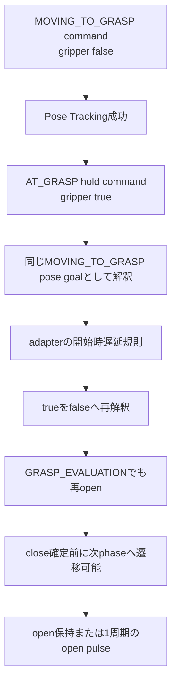
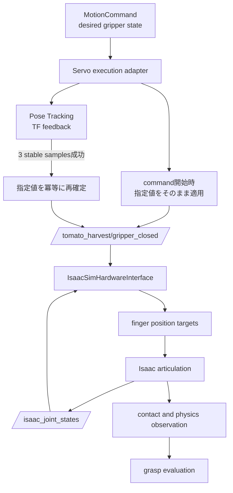

# Step 3-5 グリッパ指令確定問題の解決とE2E評価

## 目的

Step 3-4でTFによる終端Pose Trackingは成功した一方、`AT_GRASP`以降もgripperがopenのままになった問題を解決する。安全な整列中openを維持しつつ、整列成功後にcloseを確定し、physics E2Eで把持・detachまで評価する。

## 直接原因

`AT_GRASP`と`GRASP_EVALUATION`のhold commandは、arm poseを維持するため内部的に`PhaseId.MOVING_TO_GRASP`を利用する。adapterの`gripper_state_at_tracking_start()`はPose Trackingとcloseの組合せをopenへ変換していた。上流は実際の移動中を既に`false`、到達後を`true`としているため、この再解釈は責務重複である。成功時closeだけを追加した中間実装では、`GRASP_EVALUATION`開始から成功までのopen pulseでtomatoが落下することもE2Eで確認した。

## 解決案の比較

| 案 | 内容 | 長所 | 短所 | 判断 |
|---|---|---|---|---|
| A | 上流のgripper指令を開始時にそのまま適用し、成功時も冪等に確定 | phase責務が一意で、hold間のopen pulseがない | boolean topicは実機actionより情報が少ない | 採用 |
| B | hold commandをPose Tracking対象外にする | closeは即時発行される | close後のarm pose維持と再確認が弱くなる | 不採用 |
| C | PhaseIdへAT_GRASP等を追加 | phase表現が明確 | message、serialization、planner全体へ変更が広がる | 将来候補 |
| D | 直ちにFranka gripper actionへ全面移行 | width/force/resultを実機と共通化できる | sim側action adapterを含む大きな変更になる | 後続候補 |

## 変更後アーキテクチャ

実機では`Commit`以降をFranka gripper action adapterへ差し替え、width、speed、forceとaction resultを扱う。Servo adapterは整列完了と指令確定タイミングだけを所有する。

## 実装

- `gripper_state_for_tracking()`へplanner指定値をそのまま返すpure logicを集約し、adapter独自のopen変換を削除した。
- `_control_pose_tracking()`の成功時に、execution success通知より先にgripper指令を冪等に確定する。
- close holdがtracking中に再openしないことと、open指令が意図せずcloseにならないことをテストした。
- GPU E2Eで5.000 mm閾値を18〜29 µm超える定常揺らぎが2回続いたため、回帰テストを追加して位置許容を5.1 mmへ最小限緩和した。

## 受け入れ条件

- `MOVING_TO_GRASP`中は上流指定どおりgripperがopenである。
- `AT_GRASP`以降のclose hold中は再openしない。
- closeを要求したPose Tracking成功時にもcloseが維持される。
- openを要求したcommandは成功後もopenである。
- physics E2Eでfinger gapが0.0800 mから減少し、`gripper_closed=true`を観測する。
- TF Pose Trackingの成功を維持する。
- 把持、detach、place、completeの到達可否をログで評価する。

## テスト結果

### Automated tests

- `pytest -q`: **258 passed, 2 skipped**
- adapter対象test: **11 passed**
- `bash -n`、Python compile、`git diff --check`: 合格

### GPU physics E2E

条件は`CI_HEADLESS_STEPS=3600`、`CI_GRASP_MODE=physics`、debug観測有効、timeout 2400秒とした。

| 観点 | 結果 |
|---|---|
| TF Pose Tracking | PASS、位置誤差0.005025 m、姿勢誤差0.013776 rad |
| AT_GRASP hold | PASS、57.138 msで再収束 |
| close伝播 | PASS、`gripper_closed=true` |
| finger gap | 0.0800 mから約0.0196 mへ縮小 |
| 左右接触 | PASS、両finger actor contactを連続検出 |
| 接触力例 | 左2.36 N、右3.53 N |
| tomato grasp state | `ATTACHED -> HELD` |
| hold間のopen pulse | 最終実装では発生なし |
| phase | `GRASP_EVALUATION -> DETACHING`到達 |
| 収穫完走 | FAIL、pull中に`HELD -> FALLEN` |

グリッパ指令未配信とhold間の瞬断は解決した。`DETACHING`中も`grip=1`を維持しているため、残る失敗はgripper command経路ではなく、pull時の実接触保持・摩擦・軌道の問題である。

### 評価中に棄却した中間結果

- 5.000 mm閾値のままの2 runは、TF lookup failure 0にもかかわらず位置誤差5.018 mm、5.029 mmでclose前にtimeoutした。
- 成功時closeだけを追加したrunは`HELD`へ到達したが、次のhold開始時に1周期openとなり`FALLEN`した。この結果から開始時の再解釈自体を削除した。

## 一次情報

- Franka Robotics公式`franka_gripper`: https://github.com/frankarobotics/franka_ros2/blob/humble/franka_gripper/doc/index.rst
- ROS 2 `control_msgs/GripperCommand`: https://github.com/ros-controls/control_msgs/blob/master/control_msgs/action/GripperCommand.action
- Isaac Sim 6.0.1 Articulation Controller: https://docs.isaacsim.omniverse.nvidia.com/latest/robot_simulation/articulation_controller.html
