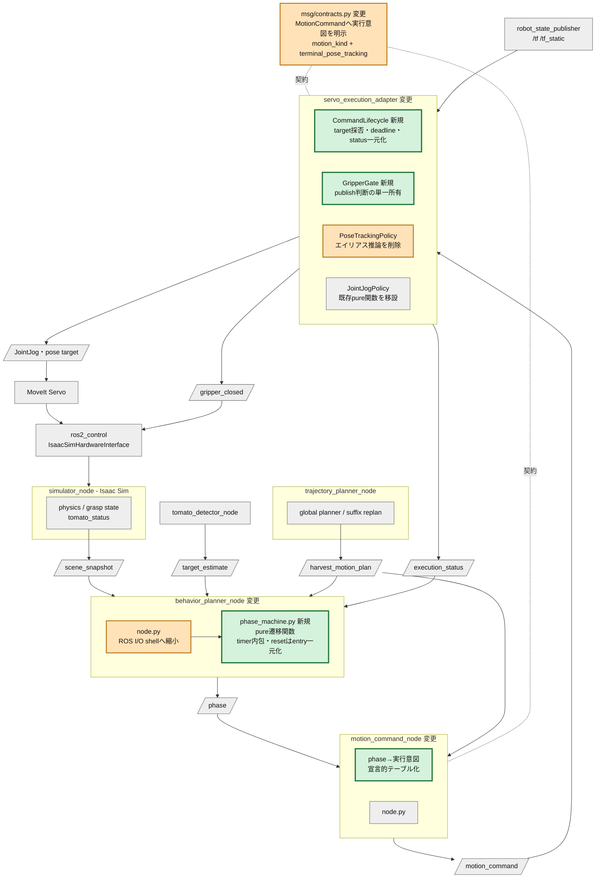
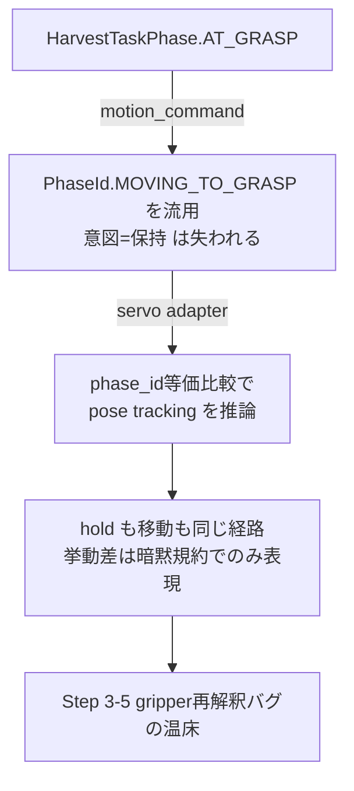
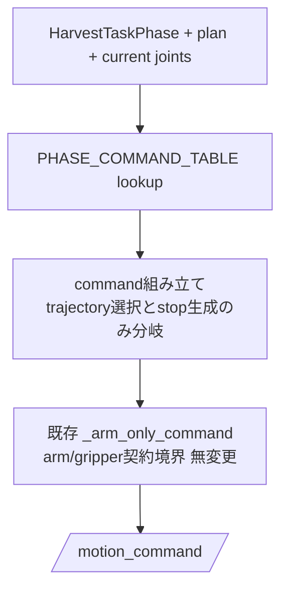
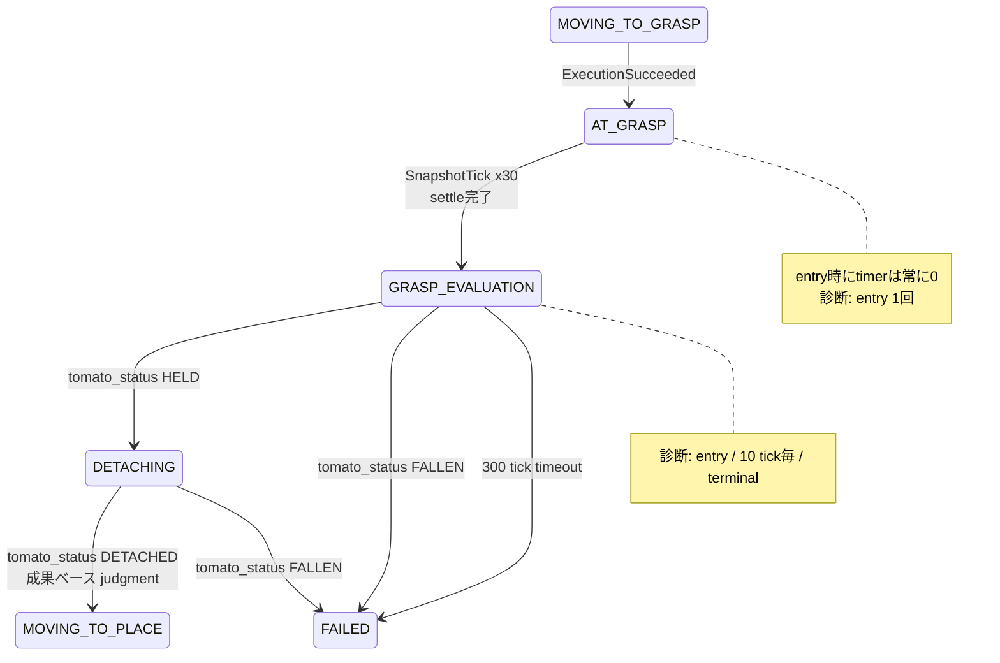
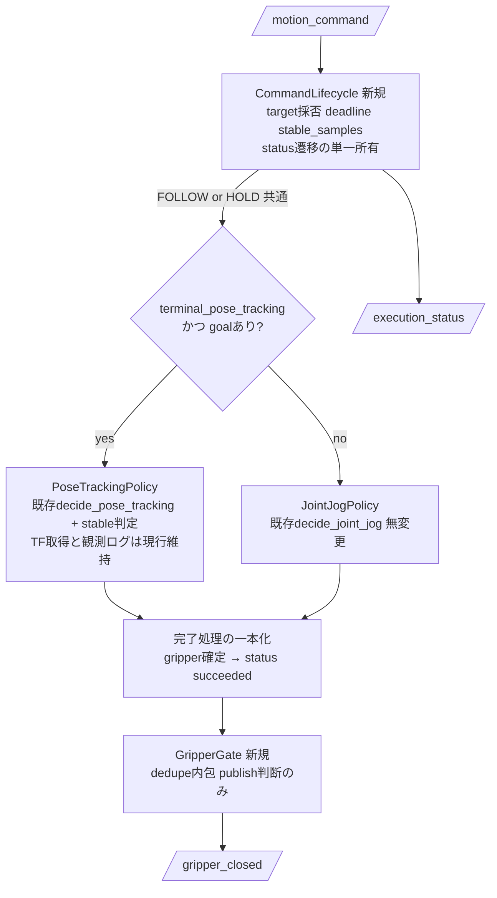

# Step 3-6 GRASP状態遷移ロジックのリファクタ計画

## 目的

Step 3-5でグリッパ指令確定問題は解決したが、その過程でGRASP周りの状態遷移ロジックが3つのモジュールに分散し、暗黙の規約（PhaseIdエイリアス、カウンターの散在リセット、gripper publishの二重経路）へ依存する構造になった。本Stepでは挙動を変えずに、この状態遷移ロジックを単一責務の純粋モジュールへ再編する。後半に2026-07-17の実装とE2E評価結果を追記した。

### 検証目的

このリファクタで検証したいのは次の2点である。

1. **挙動等価**: phase遷移列、gripper指令列、physics E2Eの結果（Step 3-5受け入れ条件）がリファクタ前後で不変であること。
2. **複雑さの低減が構造として保証されること**: カウンターリセット箇所が phase entry の1箇所に収束する、adapterのphase等価比較による挙動推論が消える、遷移ロジックがROS非依存の純粋関数としてテストできる、の3点を受け入れ条件で機械的に確認できること。

## 変更後の全体アーキテクチャ

凡例: 緑 = 新規モジュール、橙 = 変更するモジュール、灰 = 無変更。ROS nodeを大枠(subgraph)として記載し、変更は3 nodeと契約定義に閉じる。



trajectory_planner、MoveIt Servo、ros2_control、Isaac Sim、TF経路（Step 3-4で確立）はすべて無変更である。

## 現状の複雑さの棚卸し

### C1: PhaseIdエイリアスによる挙動推論

`AT_GRASP`と`GRASP_EVALUATION`のhold commandは`PhaseId.MOVING_TO_GRASP`を、`PLACED`のholdは`PhaseId.MOVING_TO_PLACE`を流用する（`motion_command.py` の `_build_phase_motion_command`）。adapter側は`phase_id is PhaseId.MOVING_TO_GRASP`という**等価比較から**pose tracking動作を推論する（`servo_execution_adapter.py` の `servo_target_from_command`）。

この「phase IDから挙動を推論する」構造がStep 3-5のgripper再解釈バグの温床だった。IDは同じでも意図（移動 vs 保持）は異なるのに、下流はそれを区別する情報を持たない。



### C2: behavior_plannerの遷移ロジック散在

`behavior_planner/node.py`では、GRASP関連の2つのカウンター（`_grasp_settle_count`、`_grasp_eval_count`）のリセットが**7箇所**に散在する（`_on_control` RESET、`_on_plan`、`_on_trajectory_succeeded`、`_step`内の3分岐）。遷移トリガーも3つのイベント源（`execution_status`、`scene_snapshot`、`harvest_motion_plan`）に分かれ、リセット漏れがそのまま遷移バグになる構造である。

さらにnode classが`main()`内に定義されており、`AT_GRASP`/`GRASP_EVALUATION`の遷移ロジック本体はROS無しの単体テストができない。純粋関数として切り出されているのは`detaching_outcome`等の一部だけである。

### C3: gripper指令経路の非対称と状態混在

adapterはgripperを (1) command開始時（`_on_command`）と (2) pose tracking成功時（`_control_pose_tracking`）の2箇所でpublishするが、joint jog成功時にはpublishしない。dedupe状態`_last_gripper_closed`はcommand境界を跨いで生存する（Step 3-5の継続性修正）。「いつ・誰が・何を根拠にgripperを確定するか」がcontrol loopの分岐に埋め込まれており、Franka gripper actionへの移行（Step 3-5 案D）のseamが存在しない。

## リファクタ方針の比較

| 案 | 内容 | 長所 | 短所 | 判断 |
|---|---|---|---|---|
| A | MotionCommandへ実行意図（motion_kind、terminal_pose_tracking）を明示し、phase machineとgripper gateを純粋モジュール化 | 挙動推論が消え、PhaseIdは経路区間IDの単一責務に戻る。契約追加のみで既存フィールドは不変 | 契約fieldが2つ増える | 採用 |
| B | PhaseIdへAT_GRASP等を追加（Step 3-5 案C） | phase語彙が明確 | PhaseIdは経路計画区間の識別子でもあり、suffix replan・plan契約・serialization全体へ波及する。「hold at graspはMOVING_TO_GRASP区間のgoalを参照する」という正しい意味も失われる | 不採用 |
| C | 現状構造のまま命名とコメントを整理 | 変更リスク最小 | エイリアス推論と状態散在という根本が残る | 不採用 |

案Aの核心は責務の再定義である: **PhaseIdは「どの計画区間のgoalか」だけを表し、「どう動くか」はmotion_kindが表す**。hold commandが`PhaseId.MOVING_TO_GRASP`を参照するのは（grasp区間の終端を保持するので）意味的に正しく、問題だったのは下流がそこから挙動を推論していたことだけである。

## 詳細アーキテクチャ

### D1: 契約変更 — MotionCommandの実行意図明示

`msg/contracts.py`へ追加する。

```python
class MotionKind(StrEnum):
    FOLLOW_TRAJECTORY = "follow_trajectory"  # trajectoryを追従する移動
    HOLD = "hold"                            # 現在位置/終端goalの保持

@dataclass(frozen=True)
class MotionCommand:
    command_name: str
    planner_name: str
    target_pose: Pose3D | None = None
    gripper_closed: bool | None = None
    phase_motion_plan: PhaseMotionPlan | None = None
    # 追加
    motion_kind: MotionKind = MotionKind.FOLLOW_TRAJECTORY
    terminal_pose_tracking: bool = False   # 終端をServo pose commandで閉ループ確認するか
```

- `terminal_pose_tracking=True`かつ`phase_goal_pose`ありのときのみadapterはpose tracking modeへ入る。**phase_idの等価比較は削除**する。moveit_link座標系への変換（`moveit_link_pose`）はServo frame知識としてadapter内に残す。
- serializationは既存方針どおりデシリアライズのみ寛容とし、fieldが無い旧JSONはデフォルト値（FOLLOW_TRAJECTORY / False）で読む。旧契約フォールバックの互換経路は作らない。
- `gripper_closed`はStep 3-5 案Aで確立した「plannerが決めた値をそのまま適用」の契約を維持し、型・意味とも変更しない。

### D2: motion_command — phase→実行意図の宣言的テーブル

if連鎖と位置引数のboolean literalを、1つの宣言的テーブルへ置き換える。全phaseの挙動仕様が1箇所で読める。

| HarvestTaskPhase | command_name | phase_id | motion_kind | terminal_pose_tracking | gripper_closed | trajectory |
|---|---|---|---|---|---|---|
| MOVING_TO_PREGRASP | move_to_pregrasp | MOVING_TO_PREGRASP | FOLLOW_TRAJECTORY | false | true | plan.pregrasp |
| MOVING_TO_GRASP | move_to_grasp | MOVING_TO_GRASP | FOLLOW_TRAJECTORY | true | false | plan.grasp |
| AT_GRASP | hold_at_grasp | MOVING_TO_GRASP | HOLD | true | true | stop（現在関節） |
| GRASP_EVALUATION | hold_grasp_eval | MOVING_TO_GRASP | HOLD | true | true | stop（現在関節） |
| DETACHING | pull_to_detach | PULL_TO_DETACH | FOLLOW_TRAJECTORY | false | true | plan.pull |
| MOVING_TO_PLACE | move_to_place | MOVING_TO_PLACE | FOLLOW_TRAJECTORY | false | true | plan.place |
| PLACED | hold_placed | MOVING_TO_PLACE | HOLD | false | false | stop（現在関節） |
| RETURNING_HOME | move_home | RETURNING_HOME | FOLLOW_TRAJECTORY | false | false | plan.home または直行 |

値はすべて現行実装の挙動を転記したものであり、このテーブル自体が挙動等価のgolden仕様になる。hold commandがtracking=trueを維持するのは、Step 3-5で採用した「close後のarm pose再確認」を仕様として明示するためである。



### D3: behavior_planner — phase machineの純粋モジュール化

`robot/behavior_planner/phase_machine.py`を新設し、状態・イベント・遷移を純粋関数へ集約する。node.pyはparse→advance→publishだけのI/O shellになる。

```python
@dataclass(frozen=True)
class PhaseMachineState:
    phase: HarvestTaskPhase = HarvestTaskPhase.IDLE
    running: bool = False
    settle_steps: int = 0     # AT_GRASP物理安定化待ち
    eval_steps: int = 0       # GRASP_EVALUATIONタイムアウト

# イベント（いずれもfrozen dataclass）
ControlReceived(command)                      # start/stop/reset
TargetEstimateReceived()
PlanAdopted()
ExecutionSucceeded() / ExecutionAborted()
SnapshotTick(tomato_status, robot_tool_pose, place_pose, robot_home)

@dataclass(frozen=True)
class Transition:
    state: PhaseMachineState
    diagnostic: str | None = None   # "entry" | "periodic" | "terminal"
    warning: str | None = None      # abort待機・eval timeout等のログ要求

def advance(state: PhaseMachineState, event: PhaseEvent) -> Transition: ...
```

設計上の不変条件:

- **phase entryでのカウンターリセットを構造で保証する**。遷移は必ず内部の`_enter(phase)`を通り、そこで`settle_steps`/`eval_steps`を0にする。現行7箇所の個別リセットは全廃され、リセット漏れが型的に起こせなくなる。
- **副作用は返り値のデータで表現する**。診断emit・warningは`Transition`のフィールドとして返し、logger・publisherを呼ぶのはnode shellだけにする。既存`grasp_diagnostics.metric_payload`は無変更で利用する。
- 既存の純粋関数`detaching_outcome`、`moving_to_place_outcome`、`execution_status_value`は`advance`内部へ吸収または委譲し、単体テストは遷移表として書ける形にする。

GRASP区間の遷移仕様（現行挙動の転記）:



### D4: servo_execution_adapter — control loopの責務分割

現行の`_control_step`はmode切替待ち・deadline・pose tracking・joint jog・status publish・観測ログを1メソッドで扱う。これを3つの構成要素へ分割し、nodeは配線だけを持つ。



- **CommandLifecycle**: `_on_command`での採否（invalid/missing_trajectory abort）、deadline管理、`stable_samples`、status遷移（idle→running→succeeded/aborted）を1クラスに集約する。pose/joint両モードで完了処理を共通の`_complete()`へ一本化し、現行の「pose成功時のみgripper再確定」という非対称を解消する（開始時publish済み＋dedupeにより出力列は不変）。
- **GripperGate**: `(gripper_closed intent, event: command_started | terminal_reached) -> publish判断`の純粋クラス。`_last_gripper_closed`のdedupe状態を内包し、adapter内のpublish呼び出し箇所を1つにする。Step 3-5 案D（Franka gripper action移行）は、このGateのpublish先をboolean topicからaction adapterへ差し替えるだけで実現できるseamになる。
- **PoseTrackingPolicy / JointJogPolicy**: 既存の純粋関数`decide_pose_tracking`/`decide_joint_jog`をそのまま使う。変更は入口条件（phase等価比較 → `terminal_pose_tracking` flag）のみ。`gripper_state_for_tracking`はGripperGateへ吸収して削除する。
- 観測ログ（`pose_tracking_observability`、`servo_pose_tracking_sample`等のmetric契約）とexecution status JSON契約（Issue #38のstatus先頭維持）は無変更とする。

### 責務境界（変更後）

| Component | 責務 | 持たない責務 |
|---|---|---|
| phase_machine.py | HarvestTaskPhase遷移とtimerの唯一の所有者 | ROS I/O、診断のemit実行 |
| behavior_planner/node.py | topic parse、advance呼び出し、phase publish、ログ | 遷移判断 |
| PHASE_COMMAND_TABLE | phase→実行意図の唯一の対応表 | 遷移判断、実行 |
| MotionCommand契約 | 移動/保持・tracking要否・gripper意図の明示的搬送 | 挙動の推論材料の提供（エイリアス廃止） |
| CommandLifecycle | command受理からstatus確定までの実行状態 | gripper判断、phase判断 |
| GripperGate | gripper publish判断とdedupeの唯一の所有者 | 実行状態、到達判定 |

## 移行ステップ

挙動等価を各段で確認できるよう4段に分割する。各段は独立にmerge可能とする。

| 段 | 内容 | 等価性の確認 |
|---|---|---|
| A | `phase_machine.py`抽出。node.pyをshell化 | 現行遷移を転記したgolden遷移表テスト。E2Eログのphase遷移列比較 |
| B | 契約へ`motion_kind`/`terminal_pose_tracking`追加。motion_commandをテーブル化 | 全phaseでcommand JSONが現行と一致（新field以外）するsnapshotテスト |
| C | adapterのエイリアス推論削除、CommandLifecycle/GripperGate分割 | 既存adapter test 11件＋Step 3-5のopen pulse回帰テスト維持 |
| D | physics E2E再実行と等価性判定 | 下記受け入れ条件 |

## 受け入れ条件

構造の条件:

- `servo_execution_adapter`に`PhaseId`の等価比較が存在しない。
- `settle_steps`/`eval_steps`の更新・リセットが`phase_machine.py`の外に存在しない。
- `/tomato_harvest/gripper_closed`のpublish呼び出しがGripperGate経由の1箇所である。
- `AT_GRASP`/`GRASP_EVALUATION`の遷移ロジックがROS非依存の単体テストで検証されている。

挙動等価の条件（Step 3-5結果の再現）:

- `pytest -q`が全緑（現行258 passed, 2 skippedから減少しない）。
- physics E2E（`CI_HEADLESS_STEPS=3600`、`CI_GRASP_MODE=physics`）で、TF Pose Tracking成功、`MOVING_TO_GRASP`中open、`AT_GRASP`以降のclose hold維持、hold間open pulseなし、`GRASP_EVALUATION -> DETACHING`到達、を再確認する。
- E2Eログのphase遷移列とgripper指令列がリファクタ前のrunと同一パターンである。
- pull中の`HELD -> FALLEN`（Step 3-5既知の残課題）は本Stepの合否に含めない。

## 次のステップへのつながり

- **Step 3本題（摩擦・保持）**: Step 3-5で残ったpull中の`HELD -> FALLEN`は摩擦・軌道の問題である。phase_machineの明示的な遷移ログとテーブル化されたcommand仕様の上で調査することで、状態遷移起因の交絡を排除して物理要因だけを追える。
- **Franka gripper action移行（Step 3-5 案D）**: GripperGateがsim topic / 実機actionの差し替えseamになり、width・force・action resultの導入がadapter本体の変更なしで計画できる。
- **PhaseId語彙の再検討（Step 3-5 案C）**: motion_kind導入後もphase語彙の不足が問題になる場合に限り、改めて契約拡張として検討する。本計画はその判断を先送りできる構造を作る。

## 実装結果（2026-07-17）

### 実装した変更

- `phase_machine.py`を新設し、frozenな`PhaseMachineState`、event、`Transition`、pureな`advance`へphase遷移とGRASP timerを集約した。phase entryは必ず`_enter`を通り、`settle_steps`/`eval_steps`を初期化する。
- `behavior_planner/node.py`はROS messageのparse、`advance`呼び出し、phase publish、diagnostic/logの副作用に縮小した。
- `MotionCommand`に`MotionKind`と`terminal_pose_tracking`を追加した。serializationとsim bridgeは新fieldを搬送し、旧JSONは`FOLLOW_TRAJECTORY`/`False`でdeserializeできる。
- `motion_command.py`に`PHASE_COMMAND_TABLE`を追加し、8 phaseのcommand name、plan区間ID、実行意図、pose tracking、gripper、trajectory選択を1か所で定義した。
- `servo_execution_adapter.py`に`CommandLifecycle`と`GripperGate`を追加した。pose trackingの入口は`PhaseId`比較から明示flagへ変更し、gripper dedupeはGateのみが所有する。pose/jointのどちらの終端でも同じGateでintentを再確定する。

### 構造受け入れ条件

| 条件 | 結果 | 根拠 |
|---|---|---|
| adapterに`PhaseId`等価比較がない | PASS | `servo_target_from_command`は`command.terminal_pose_tracking`のみを参照 |
| GRASP counterがphase machine外にない | PASS | nodeの`_grasp_settle_count`/`_grasp_eval_count`を削除 |
| gripper publish判断がGate経由 | PASS | command start / terminal reachedを`GripperGate`でdedupe |
| GRASP遷移がROS非依存でテスト可能 | PASS | `test_phase_machine.py`でsettle、HELD/FALLEN、timeout、resetを検証 |

## E2E評価結果（2026-07-17）

### 実行条件

```bash
PYTHONPATH=.:src pytest -q
CI_HEADLESS_STEPS=3600 \
CI_GRASP_MODE=physics \
TOMATO_HARVEST_DEBUG_PHYSICS_GRASP=1 \
bash scripts/ci/run_e2e.sh
```

- Unit/integration: **265 passed, 2 skipped**（Step 3-5基準の258 passed, 2 skippedから減少なし）。
- E2E artifact: `.artifacts/ci/e2e/robot_node.log`、`franka_controller.log`、`docker-e2e-console.log`。
- E2Eは743/3600 stepでterminal `failed`へ早期終了し、CI全体のexit codeは1だった。理由はStep 3-5で既知のpull中の物理保持喪失（`HELD -> FALLEN`）であり、本Stepの合否からは除外する。

### 観測結果

phase遷移列:

```text
idle -> detecting -> target_found -> moving_to_pregrasp
-> moving_to_grasp -> at_grasp -> grasp_evaluation -> detaching -> failed
```

- `moving_to_grasp` TF Pose Tracking: **PASS**。`servo_pose_target_succeeded`、position error `0.005001 m`、orientation error `0.025925 rad`、latency `3717.329 ms`。
- `hold_at_grasp` pose再確認: **PASS**。position error `0.005006 m`、orientation error `0.010873 rad`、latency `56.119 ms`。
- gripper列: seq 32でclose（pregrasp）、seq 397でopen（moving-to-grasp）、seq 675でclose（AT_GRASP）。以降seq 743までcloseを維持。
- hold間open pulse: **0回 / PASS**。
- `GRASP_EVALUATION -> DETACHING`: **PASS**。`HELD`を受けて遷移した。
- pull中保持: seq 741まで`HELD` + 両指接触 + closeを維持した後、seq 742で`FALLEN`。これは既知の次Step課題である。

### 総合判定

Step 3-6の構造条件と挙動等価条件は**PASS**。phase遷移、TF Pose Tracking、gripper open/closeのパターンはStep 3-5と同一で、リファクタ由来の新規回帰は観測されなかった。未解決は計画どおりpull中の摩擦保持のみである。

## 参照

- 直接の動機: `docs/reports/physics_levelup/step3-5_gripper_command_completion_and_e2e.md`
- TF経路の前提: `docs/reports/physics_levelup/step3-4_robot_tf_publication_architecture.md`
- 対象実装: `src/tomato_harvest_sim/robot/behavior_planner/node.py`、`src/tomato_harvest_sim/robot/execute_manager/motion_command.py`、`src/tomato_harvest_sim/robot/execute_manager/servo_execution_adapter.py`、`src/tomato_harvest_sim/msg/contracts.py`
