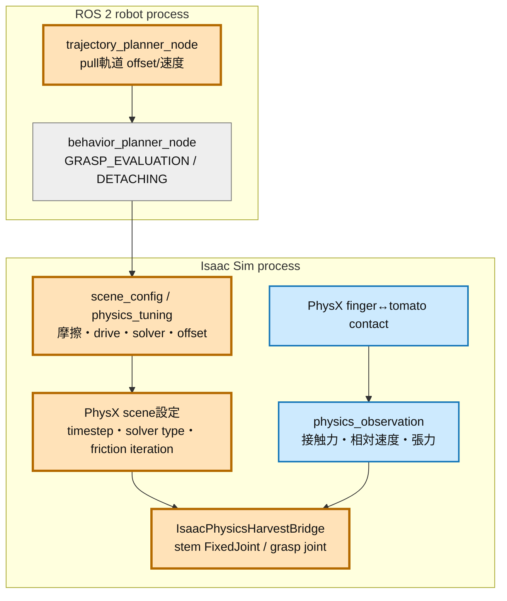
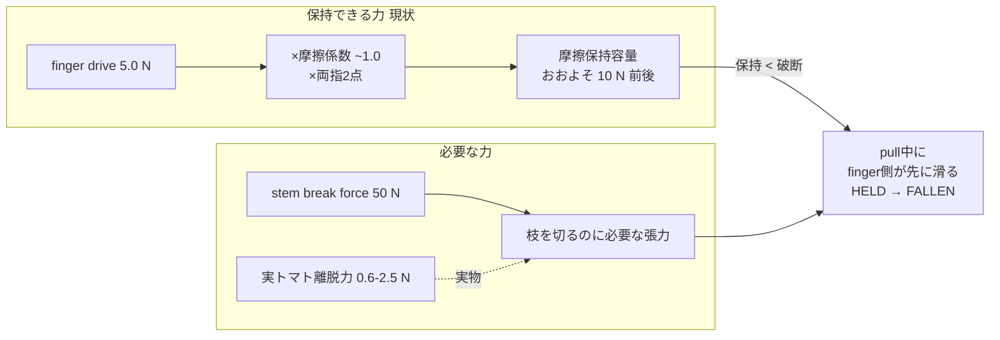

# Step 3-7 摩擦保持のベストプラクティス調査

## 検証目的

Step 3-5/3-6でグリッパ指令の確定と状態遷移は安定した。残る失敗はpull中の`HELD -> FALLEN`であり、これは指令経路ではなく**摩擦による保持の物理**の問題である（Step 3-5レポート結論）。本Stepでは実装に入る前に、Isaac Sim / PhysX / Isaac Lab の公式一次情報と農業ロボット研究から、finger摩擦だけでトマトを掴んでpull・lift・holdするための推奨構成を調査し、現状パラメータとのギャップを特定する。実装はStep 3-8以降で行う。

本文書は調査であり、確認済みの事実と推測を分離して記載する。

## 全体アーキテクチャと調査対象範囲

凡例: 橙 = 本調査が改善対象とみなすノード、青 = 観測に使うノード、灰 = 今回は無変更想定。ROS nodeとIsaac側を大枠(subgraph)で示す。

調査対象は「保持容量を決める4層」に整理できる: (1) 接触面の摩擦材質、(2) finger driveの押付け力、(3) PhysXの接触・摩擦ソルバ精度、(4) pull軌道が要求する張力。現状はこの4層が互いに整合しておらず、単一パラメータのチューニングでは解けない。

## 現状パラメータの棚卸し

コードとscene.yamlから抽出した現行値（2026-07-17時点）。

| 層 | パラメータ | 現行値 | 出典 |
|---|---|---:|---|
| 材質 | tomato static/dynamic friction | 1.2 / 1.0 | `config/scene.yaml` |
| 材質 | gripper static/dynamic friction | 1.1 / 0.9 | `config/scene.yaml` |
| 材質 | friction_combine_mode | max | `config/scene.yaml` |
| drive | finger_drive stiffness / damping | 3000 / 120 | `config/scene.yaml` |
| drive | finger_drive max_force_n | 5.0 | `config/scene.yaml` |
| solver | tomato solver pos / vel iterations | 16 / 4 | `config/scene.yaml`（tomato剛体のみ） |
| offset | tomato contact / rest offset | 0.002 / 0.0 m | `config/scene.yaml` |
| offset | torsional patch radius | 0.004 m | `config/scene.yaml` |
| 物性 | tomato mass | 0.03 kg | `physics_harvest.py:36` |
| 破断 | stem break force / torque | 50 N / 50 N·m | `physics_harvest.py:35` |
| 判定 | friction grasp 最小力 / 継続 / 最大相対速度 / 最大滑り | 1.0 N / 3 step / 0.02 m/s / 0.005 m | `config/scene.yaml` |
| 軌道 | pull offset x / z | 0.08 / 0.08 m | `pregrasp_planner.py:22-23` |
| physics | 観測dt | 1/60 s | `physics_harvest.py:53` |

## 確認できた事実（一次情報）

### F1. 実トマトの離脱力は約0.6〜2.5 N

チェリートマトの果柄（calyx/fruit joint、離層 = abscission zone）を最適な把持角で引き離す分離力は**0.58〜2.46 N**の範囲と実測されている（MDPI Agronomy 2024, ScienceDirect）。離層は「引っ張りで比較的容易に分離できる」自然な弱点部であり、pullは低コストで実装容易な収穫方式とされる。

含意: 現状の`STEM_BREAK_FORCE_N = 50 N`は実トマトより1〜2桁大きい。この値では、pullで枝を破断する前にfingerがトマトを取り落とす。

### F2. Franka Handの把持力は継続70 N / 最大140 N

Franka Hand（parallel gripper、travel 80 mm、50 mm/s/finger、約0.7 kg）の把持力仕様は**継続70 N・最大140 N**（Franka公式Product Manual、Generation Robots datasheet）。

含意: 現状の`finger_drive max_force_n = 5.0 N`は実機の継続把持力70 Nに対し大幅に小さい。5 Nは「トマトを潰さない初期値」として選ばれた（step0レポート）が、実機の把持力エンベロープの下限に寄りすぎている。

### F3. Isaac Sim公式のグリッパ把持設定

Isaac Sim公式チュートリアル（Configure a Manipulator, Robot Simulation Tips, バージョン4.5/5.0系）の推奨:

- **摩擦**: fingertip接触面のstatic / dynamic frictionをともに**1.0**に設定し、ロボット表面の摩擦係数に合わせる。
- **joint max force**: グリッパ主関節のMax Forceを**200 N**に設定。ただし「把持時に極端な力で不安定になる場合は**5.0**へ下げる」。
- **solver iterations**: position **64** / velocity **4**（複雑・mimicジョイントを持つグリッパの精度向上）。
- **timestep**: contactはtime-steppingに非常に敏感で、最低**80 steps/sec**へ上げると最大ペイロードでも把持が成功する。計算コストと引き換えに必要な分だけ上げる。
- **collision mesh**: fingertipは物体との隙間を作らないよう、Convex Hullではなく**Convex Decomposition**でfingertip輪郭に沿わせる。三角メッシュは静的物体のみ。
- **安定化しきい値**: sleep threshold **0.00005**、stabilization threshold **0.00001**。

含意: 現状は摩擦（gripper 1.1/0.9, tomato 1.2/1.0）は公式1.0近傍で妥当。しかしsolver iterations 64がtomato剛体のみ16に留まり、グリッパ・シーン側へ及んでいない。timestepは60 Hzで公式最低80 Hzを下回る。

### F4. PhysXの摩擦モデルと推奨ソルバ

PhysX 5.4系公式ドキュメント（Rigid Body Dynamics）:

- **patch friction**: 摩擦は接触パッチ単位で計算し、パッチ内から**最大2点**を friction anchor に選ぶ（anchor間距離を最大化するヒューリスティック）。法線力をanchorへ等分配し、各anchorで2軸の1D拘束として摩擦を実装する。
- **TGS vs PGS**: TGSは2軸の合成インパルスで扱い摩擦の非対称を回避する。把持の安定性にはTGSが推奨で、**velocity iteration 0でも十分なことが多い**（時間分解能が高いため）。デフォルトは position 4 / velocity 1。
- **maxDepenetrationVelocity**: 不安定な接触を扱うときに有効な設定として言及（数値推奨は本文になし）。
- **torsional friction**: 球の点接触にはねじり摩擦（torsional patch radius）でスピン抵抗を与える。

含意: 2点anchorのpatch frictionでは、小径球（トマト）と平面finger padの接触が点接触化しやすく、torsional patch radius（現状0.004 m）とcontact offset（現状0.002 m）が保持の要になる。

### F5. Isaac Labの contact-rich タスク設定

Isaac Lab Factory（peg挿入・ギア噛合等のcontact-richタスク）とギア組立ポリシー:

- **solver type**: TGSがデフォルトかつ強く推奨。sub-stepping前提で少ないiterationでも収束する。
- **position iterations**: contact-richタスクではギア組立で**4**を精度と性能の均衡値として使用。penetration低減に効く。velocity iterationは0がTGS既定。
- **physics dt**: 60 Hz(0.0167)または120 Hz(0.0083)。120 Hzは「まれな高速contact-richケース」でのみ必要で、通常は計算の無駄。Franka Panda parallel gripperの標準例は物理60 Hz・control decimation 3で制御20 Hz。

含意: Factory流の「TGS + 低position iteration + sub-stepping」路線と、Isaac Simグリッパ流の「position 64」路線は方針が異なる。前者はGPU大規模RL向け、後者は単一ロボットの把持精度向上向けであり、本プロジェクトは後者に近い。

## 現状の力学的ギャップ（最重要）

事実F1・F2と現状値を突き合わせると、**保持容量と要求張力が桁で食い違う**構造欠陥が見える。

- **摩擦保持容量の粗い上限**: クーロン摩擦の最大静止摩擦は `μ × 法線力`。法線力 = finger drive max force 5 N、摩擦係数 ≈ 1.0、両指で加算しても保持できる引き抜き方向の力は概ね**10 N前後**にとどまる（推測: PhysXの2点anchorと点接触で実効はさらに下がりうる）。
- **要求される破断張力**: pullは`STEM_BREAK_FORCE_N = 50 N`を超えるまで枝を引く必要がある。つまり**保持容量10 N < 破断要求50 N**であり、力学的に必ずfingerが先に滑る。Step 3-5でpull中に`HELD -> FALLEN`したのはこの不等式の帰結である。
- **実物との乖離**: 実トマトの離脱力は0.6〜2.5 N（F1）。破断閾値を実物へ寄せれば、保持容量10 Nでも余裕を持ってpullできる。破断閾値50 Nは初期の安全側設定だが、現実の離層物性から乖離している。

この不等式は単一ノブでは解けない。**破断閾値を下げる**か、**保持容量を上げる**か、その両方で `保持容量 > 破断張力 + 動的余裕` を成立させる必要がある。

## 現時点の推奨方針

事実に基づく推奨を、確度の高い順に示す。いずれもStep 3-8での実装候補であり、本Stepでは変更しない。

### 推奨1: 破断閾値を実トマト物性へ寄せる（最優先・最小変更）

`STEM_BREAK_FORCE_N` を実測レンジ（F1: 0.6〜2.5 N）に動的余裕を加えた**5〜10 N程度**へ下げる。根拠は実トマト離層物性であり、恣意的な緩和ではない。これだけで `保持容量10 N > 破断要求5〜10 N` が成立しうる。break torqueも同様に見直す。

- リスク: 振動時張力（`estimate_stem_tension_n`が自重0.03 kg × g ≈ 0.3 N + 加速度項）で誤破断しないこと。観測済みの張力分離余裕（Step 3レポートの「pull時張力 ≫ 振動時張力」）を回帰で確認する。

### 推奨2: finger押付け力を実機エンベロープ内で引き上げる

`finger_drive max_force_n` を現行5 Nから、Franka継続把持力70 N（F2）とトマト非破壊の上限の間で引き上げる。Isaac公式も不安定時は5 Nへ「下げる」と言う一方、通常は200 N（F3）を出発点とする。トマト30 gを潰さない範囲で**10〜20 N程度**を初期候補とし、finger gap縮小と接触力（Step 3-5実測: 左2.36 N / 右3.53 N）の増加で保持容量を稼ぐ。

- リスク: 過大な押付けでトマト剛体が跳ねる・貫通する。timestepとsolver iteration（推奨4）とセットで調整する。

### 推奨3: 接触ソルバ精度をグリッパ・シーンへ拡張

- solver iterationは現状tomato剛体のみ（16/4）。**グリッパ側の剛体/関節にもposition iterationを引き上げる**（F3: 64、F5: contact-richで4〜。まず16〜32を試し過剰計算を避ける）。TGSをscene solverに用いる（F4）。
- physics timestepを60 Hzから**80〜120 Hz**へ上げる（F3の最低80、F5の120は高速contact時）。観測dt 1/60も整合させる。
- fingertip collisionをConvex Decompositionでpad輪郭に沿わせ、トマト球との接触点を増やす（F3・F4のpatch/anchor改善）。

### 推奨4: pull軌道を離層方向へ最適化（後続）

農業研究（F1）は把持角68°・pull直線が最小分離力という。現状pull offset (0.08, 0.08) m の方向・速度が離層に最適か、破断閾値を下げた後に再評価する。twist/bendは実装コストが高くpullを維持する。

## 提案する検証順序（Step 3-8以降）

保持容量と破断要求の不等式を成立させることを一次目標とし、交絡を避けて1軸ずつ検証する。

| 段 | 変更 | 合格観測 |
|---|---|---|
| 1 | 推奨1（破断閾値5〜10 N） | pull中に`HELD`維持のまま`DETACHED`到達。誤破断なし |
| 2 | 推奨2（drive 10〜20 N） | finger gap更なる縮小、接触力増、滑り量 < 0.005 m |
| 3 | 推奨3（timestep/solver/collision） | 接触の貫通・跳ねなし、相対速度 < 0.02 m/s安定 |
| 4 | 0.1 m lift + 5秒hold（Step 3本題の合格条件） | 相対変位・左右接触力・joint速度の3系列グラフ取得 |

各段でphysics E2E（`CI_GRASP_MODE=physics`）を回し、Step 3-6で明示化したphase遷移ログの上で物理要因だけを切り分ける。

## 未解決の確認事項

- PhysXの2点friction anchorと点接触で、finger 5〜20 N押付け時の**実効摩擦保持容量**がいくつになるか（理論上限10 Nは点接触でさらに下がりうる）。E2Eの滑り量観測で実測が必要。
- 本プロジェクトのPhysX scene solverが現状TGS/PGSどちらか、iteration設定がscene全体かprim単位か（`physics_tuning.py`はtomato prim単位で適用）。scene solver設定の所在を実装前に確認する。
- トマトを「潰さない」上限押付け力の定量根拠（現状5 Nはstep0由来）。deformable/剛体どちらでモデル化するかで変わる。
- Isaac Sim稼働バージョン（過去レポートで6.0.1言及、公式tipsは4.5/5.0系）でのパラメータ名・既定値差分。

## ソース

- Isaac Sim Configure a Manipulator（friction 1.0、max force 200、solver 64/4、sleep/stabilization閾値）: https://docs.isaacsim.omniverse.nvidia.com/5.0.0/robot_setup_tutorials/tutorial_configure_manipulator.html
- Isaac Sim Robot Simulation Tips（friction増強、convex decomposition、timestep）: https://docs.isaacsim.omniverse.nvidia.com/4.5.0/robot_simulation/robot_simulation_tips.html
- PhysX 5.4.1 Rigid Body Dynamics（friction anchor / patch / TGS vs PGS / solver iteration）: https://nvidia-omniverse.github.io/PhysX/physx/5.4.1/docs/RigidBodyDynamics.html
- Isaac Lab Gear Assembly Policy（Factory、TGS、position iteration 4）: https://isaac-sim.github.io/IsaacLab/main/source/policy_deployment/02_gear_assembly/gear_assembly_policy.html
- Franka Hand Product Manual（把持力 継続70 N / 最大140 N）: https://download.franka.de/documents/220010_Product%20Manual_Franka%20Hand_1.2_EN.pdf
- Franka Emika Hand datasheet: https://www.generationrobots.com/media/panda-franka-emika-datasheet.pdf
- Tomato Pedicel Physical Characterization（離脱力 0.58〜2.46 N、離層、把持角68°）: https://www.mdpi.com/2073-4395/14/10/2274
- 果実引き抜きパターン解析（pull最小分離力）: https://www.sciencedirect.com/science/article/pii/S2772375525007695

## 次のステップへのつながり

- 本調査の中核である「保持容量 > 破断張力」の不等式成立が、Step 3本題（0.1 m lift・5秒hold）の前提条件になる。
- 破断閾値の見直し（推奨1）はStep 4（stem破断力と果実物性を現実へ近づける）と直結する。本Stepの実測レンジ0.6〜2.5 NがStep 4の設計値の一次情報になる。
- finger押付け・接触ソルバの改善（推奨2・3）は、後続のFranka gripper action移行（Step 3-5案D、Step 3-6のGripperGate seam）でwidth/force制御へ引き継ぐ。

## 段階検証結果（2026-07-17）

上記「提案する検証順序」に従い、設定を累積して physics E2E を実行した。各段は前段の変更を残した状態で評価し、`TOMATO_HARVEST_DEBUG_PHYSICS_GRASP=1` により `[PhysicsObs]` を採取した。実行条件は `CI_GRASP_MODE=physics`、headless 3,600 step である。単体回帰は関連34件が成功した。

### 実装した検証条件

| 段 | 変更内容 | 設定値 |
|---|---|---:|
| 1 | stem破断閾値 | `STEM_BREAK_FORCE_N = 7.5 N` |
| 2 | finger drive上限 | `max_force_n = 15.0 N` |
| 3 | scene timestep | `120 steps/s` |
| 3 | scene solver | `TGS` |
| 3 | tomato / 左右finger solver iteration | position `32` / velocity `4` |
| 3 | 観測の力積→力換算dt | `1/120 s` |

`timeStepsPerSecond` は Isaac Sim 6.0 の `PhysxSceneAPI` に設定した。初回は `UsdPhysics.Scene` に設定してシーン生成で停止したため、APIの所有先を修正して再実行した。finger collision形状は既存形状を維持し、今回の段階では形状変更による交絡を入れていない。

### 結果サマリ

| 段 | 状態列 | active時最小gap | 左右最大接触力 | HELD時最大相対速度 | 判定 |
|---|---|---:|---:|---:|---|
| 1 | `ATTACHED → HELD → DETACHED → FALLEN` | 0.0195 m | 3.02 / 4.91 N | 0.163 m/s | **一部合格**: 誤破断なくDETACHEDへ到達したが、直後に保持喪失 |
| 2 | `ATTACHED → HELD → FALLEN` | 0.0191 m | 8.63 / 8.69 N | 0.214 m/s | **不合格**: gap縮小・接触力増加は確認したが、滑り抑制に失敗 |
| 3 | `ATTACHED → HELD → DETACHED → FALLEN` | 0.0191 m | 15.34 / 15.91 N | 0.129 m/s | **不合格**: 貫通を示すgap崩壊はないが、速度基準0.02 m/sを超過し離脱後に発散 |
| 4 | 未実施 | — | — | — | **前提未達**: Stage 3が不合格で、0.1 m lift開始前にFALLEN |

全段でbehavior plannerは `idle → detecting → target_found → moving_to_pregrasp → moving_to_grasp → at_grasp → grasp_evaluation → detaching` まで進んだ。Stage 1と3は`DETACHED`観測後に`moving_to_place`へ遷移したが、直後に`failed`となった。Stage 2は`DETACHED`に到達せず、`detaching → failed`で終了した。いずれもcycle completion markerは得られていない。

### 段別の観測

#### Stage 1: 破断閾値 7.5 N

- `HELD`を51 sample維持した後、stem距離0.0221 mで`DETACHED`へ到達した。
- `DETACHED`は12 sample観測でき、破断前の誤離脱はなかった。
- ただし離脱後の相対速度は最大0.436 m/sへ増え、その後`FALLEN`となった。

よって「現実的な破断閾値でDETACHEDへ到達できる」は確認できたが、「HELD維持のまま次工程へ移る」は未達である。

#### Stage 2: drive上限 15 N

- active時のgapは0.0195 mから0.0191 mへ0.4 mm縮小した。
- 接触力はStage 1の左3.02 N／右4.91 Nから、左8.63 N／右8.69 Nへ増加した。
- 一方、HELD時相対速度は最大0.214 m/sで、許容0.02 m/sおよび滑り量0.005 mの前提を満たさず、`DETACHED`前に`FALLEN`となった。

押付け力の増加自体は観測へ反映されたが、摩擦保持の安定化には結びつかなかった。

#### Stage 3: 120 Hz / TGS / solver iteration 32/4

- tomatoだけでなく左右finger linkにもsolver iterationを適用した。
- active時gapは0.0191 mを維持し、急激なgap崩壊（明白な貫通）は観測しなかった。
- `HELD`時相対速度は最大0.129 m/sで基準0.02 m/sの約6.5倍だった。
- stem距離0.0246 mで`DETACHED`となった後、相対速度は0.132 → 0.298 → 0.412 → 0.535 m/sへ発散し、10 sample後に`FALLEN`となった。
- 最大トマト速度は0.589 m/s、最大推定stem張力は1.279 Nだった。

したがって、数値安定化パラメータだけでは摩擦保持を解決できず、Stage 3は不合格である。接触力が左右ほぼ対称でもトマトがfingerに追従していないため、法線方向の押付け不足よりも、接触面接線方向の拘束容量またはfinger collision形状／接触パッチが支配要因と推定する。

### Stage 4を実行しなかった理由

Stage 4の合格条件は、前段までに保持を成立させたうえで0.1 m liftし、5秒静止保持中の3系列を採取することである。しかしStage 3では`DETACHED`時のstem距離が0.0246 mに留まり、その後約0.20秒で`FALLEN`へ遷移した。0.1 m liftと5秒holdの測定区間が存在しないため、グラフを生成しても合格条件を評価できない。順序依存の検証として、ここで打ち切った。

参考としてStage 1〜3については、各E2Eログから接触力積、トマト速度／stem張力、距離、finger gap、phaseの診断グラフを `.artifacts/step3-7/plots/` に生成した。Stage 4で要求するjoint速度は現在の`PhysicsObs`に含まれないため、再試験前にjoint stateから系列取得を追加する必要がある。

## 検証後の結論と次アクション

破断閾値とdrive上限の桁違いは解消され、両指接触力も対称化したが、`HELD`中から相対速度が閾値を超えている。次はパラメータをさらに上げるのではなく、以下を先に切り分ける。

1. fingertip collisionを可視化し、pad面とトマト球の接触パッチ／法線方向を確認する。
2. tomato速度だけでなくhand–tomato相対変位・相対速度を直接記録する（現行`v`はトマト速度であり、厳密な相対速度ではない）。
3. 既存Convex HullとConvex Decompositionを同一条件で比較する。
4. 保持が成立した後にのみ、0.1 m lift＋5秒holdを再実行し、相対変位・左右接触力・joint速度の3系列を取得する。

この結果から、Stage 4の前提条件は未達であり、Step 3-7時点では摩擦保持問題は未解決と結論する。

## 追加検証: finger–tomato上下位置の中央化（2026-07-17）

### 目的と測定方法

GUI上で、finger close時にtomato中央よりやや上側を把持しているように見えたため、上下位置の不整合が摩擦保持を悪化させているかを追加検証した。

目視だけに依存しないよう、`PhysicsObs`へ以下の3値を追加した。

- `finger_z`: 左右finger primから既存のpad接触点offset（44.7 mm）を差し引いた、左右接触点中点のworld Z
- `tomato_z`: tomato中心のworld Z
- `grasp_dz`: `finger_z - tomato_z`。正値はtomato中心より上、0は中央一致

比較時は前節Stage 3の物理設定（stem 7.5 N、drive 15 N、120 Hz、TGS、solver 32/4）を固定し、grasp目標Zだけを変更した。各条件は独立したphysics E2E（headless 3,600 step）として実行した。

### 基準条件の実測

現行の`grasp_target_offset_z_m = 0.060 m`では、close中の`grasp_dz`平均が+12.2 mm、`HELD`中が+12.1 mm（範囲+12.0〜+12.1 mm）だった。したがって「fingerがtomato上側を把持している」という観察を数値でも確認した。

この条件では`ATTACHED → HELD → FALLEN`となり、`HELD`は28 sample／0.54秒、最大トマト速度は0.532 m/sだった。`DETACHED`には到達しなかった。

### 中央把持条件

基準条件の実測差分12 mmをgrasp目標から差し引き、`grasp_target_offset_z_m`を60 mmから**48 mm**へ変更した。hover 110 mm、entry 85 mmおよびpull軌道は変更していないため、比較対象は最終grasp高さだけである。

| 指標 | 上側把持 60 mm | 中央把持 48 mm | 変化 |
|---|---:|---:|---:|
| HELD中`grasp_dz`平均 | +12.1 mm | **+0.5 mm** | 11.6 mm改善 |
| HELD中`grasp_dz`範囲 | +12.0〜+12.1 mm | **+0.5 mmで安定** | 中央へ整合 |
| HELD継続 | 28 sample / 0.54 s | **50 sample / 0.99 s** | 約1.8倍 |
| 状態列 | `ATTACHED → HELD → FALLEN` | **`ATTACHED → HELD → DETACHED → FALLEN`** | DETACHED到達 |
| HELD中最大速度 | 0.532 m/s | **0.173 m/s** | 約67%低減 |
| active時最小finger gap | 0.0191 m | 0.0200 m | +0.9 mm |
| 左右最大接触力 | 15.32 / 16.17 N | 16.29 / 16.89 N | わずかに増加 |
| active時最大stem距離 | 0.0105 m | **0.0794 m** | pull追従距離が増加 |

中央把持では`DETACHED`を13 sample／0.24秒観測した。しかし離脱後の最大速度は0.621 m/sまで増加し、その後`FALLEN`となった。cycle completionおよび0.1 m lift＋5秒holdは引き続き未達である。

### 評価

**tomato中央を把持することには明確な安定化効果がある。** 上下差をほぼゼロにすると、HELD時間が約1.8倍になり、HELD中最大速度が約67%下がり、基準条件では到達できなかったDETACHEDまで進んだ。このため、48 mmのgrasp offsetは今後の既定値として残す。

ただし中央化だけでは離脱後の保持を成立させられない。接触力が左右対称かつ約16 N存在しても、DETACHED後に速度が発散している。残課題は上下位置ではなく、pull開始時の加速度・finger pad接線方向の摩擦容量・collision contact patchのいずれかにあると推定する。

再現ログ:

- 基準条件: `.artifacts/step3-7/vertical-baseline/e2e/`
- 中央把持: `.artifacts/step3-7/vertical-centered/e2e/`

次の切り分けでは中央把持48 mmを固定し、pull軌道の速度／加速度だけを下げた比較を最優先とする。これにより、中央化後も残るDETACHED直後の動的滑りが軌道起因か接触形状起因かを分離できる。
